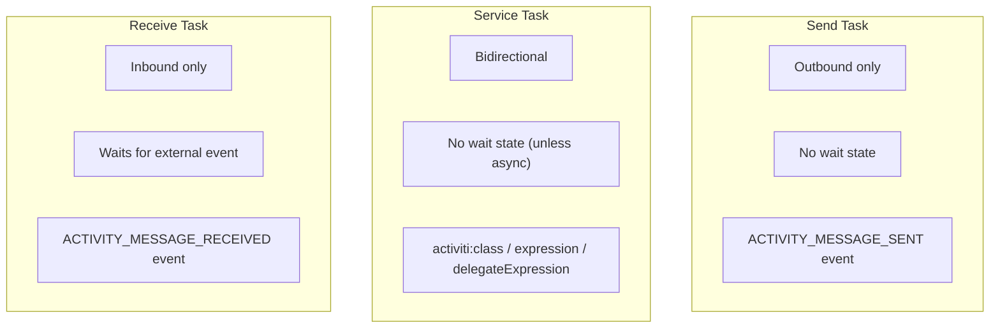

# Send Task

A Send Task (`sendTask`) represents a one-way message sent from the process to an external system. Unlike a Service Task (which can have bidirectional communication), a Send Task is specifically for **outbound-only** messaging.

## BPMN Element

```xml
<sendTask id="notifyCustomer"
           name="Notify Customer"
           type="mail">
  <extensionElements>
    <activiti:field name="to" stringExpression="${customer.email}"/>
    <activiti:field name="subject" stringValue="Order Shipped"/>
    <activiti:field name="html" stringValue="true"/>
    <activiti:field name="text" stringExpression="${notificationBody}"/>
  </extensionElements>
</sendTask>
```

**BPMN 2.0 Standard:** Yes  
**Activiti Implementation:** Supports `mail`, `mule`, `camel`, and `##WebService`

## Send Task Types

The `type` attribute or `implementation` attribute determines the behavior:

| Type | Attribute | Behavior |
|------|-----------|----------|
| `mail` | `type="mail"` | Sends email via configured mail server |
| `mule` | `type="mule"` | Routes through Mule ESB |
| `camel` | `type="camel"` | Routes through Apache Camel |
| Web service | `implementation="##WebService"` + `operationRef` | SOAP message call |

**Note:** Send Task does **not** support `activiti:class` or `activiti:expression` like Service Task does. For custom outbound operations, use a Service Task instead.

### Mail Send Task

```xml
<sendTask id="sendEmail" type="mail">
  <extensionElements>
    <activiti:field name="to" stringExpression="${recipientEmail}"/>
    <activiti:field name="subject" stringValue="Payment Reminder"/>
    <activiti:field name="text" stringExpression="${emailBody}"/>
    <activiti:field name="html" stringValue="true"/>
  </extensionElements>
</sendTask>
```

Requires mail server configuration in `ProcessEngineConfiguration`:

```java
config.setMailServerHost("smtp.example.com");
config.setMailServerPort(587);
config.setMailServerUsername("notifications");
config.setMailServerPassword("secret");
config.setMailServerUseTLS(true);
config.setMailServerDefaultFrom("noreply@example.com");
```

### Web Service Send Task

The `##WebService` implementation is specified via the `implementation` attribute (BPMN 2.0 standard):

```xml
<sendTask id="callExternalApi"
          implementation="##WebService"
          operationRef="sendOrderOperation"/>

<operation id="sendOrderOperation">
  <inboundMessage variable="orderData" messageRef="orderMessage"/>
</operation>
<message id="orderMessage" name="OrderMessage"/>
```

**Note:** For custom Java implementations, use a **Service Task** instead. Send Task does not support `activiti:class`.

## Send Task vs Service Task vs Receive Task

| Feature | Send Task | Service Task | Receive Task |
|---------|-----------|--------------|--------------|
| Direction | Outbound only | Both directions | Inbound only |
| Wait state | No | No | Yes |
| Message event | `ACTIVITY_MESSAGE_SENT` | — | `ACTIVITY_MESSAGE_RECEIVED` |
| Typical use | Notify external system | Call service, get response | Wait for external event |



## Event Dispatch

A Send Task dispatches `ACTIVITY_MESSAGE_SENT` when it completes. This can be captured via the engine event system:

```java
public class SendTaskEventListener implements ActivitiEventListener {
    public void onEvent(ActivitiEvent event) {
        if (event.getType() == ActivitiEventType.ACTIVITY_MESSAGE_SENT
            && event instanceof ActivitiMessageEvent) {
            ActivitiMessageEvent msg = (ActivitiMessageEvent) event;
            System.out.println("Message sent from activity: " + msg.getActivityId());
        }
    }
    public boolean isFailOnException() { return false; }
}
```

## Asynchronous Send Task

A Send Task can be configured as asynchronous to decouple message sending from process execution:

```xml
<sendTask id="asyncEmail" name="Send Async Notification" type="mail" activiti:async="true">
  <extensionElements>
    <activiti:field name="to" stringExpression="${recipientEmail}"/>
    <activiti:field name="subject" stringValue="Async Notification"/>
    <activiti:field name="text" stringExpression="${notificationBody}"/>
  </extensionElements>
</sendTask>
```

When `async="true"`, the send task creates a job that is executed by the async job executor, allowing the process to continue and the message to be sent in the background.

## Related Documentation

- [Service Task](./service-task.md) — Bidirectional service communication
- [Receive Task](./receive-task.md) — Inbound message handling
- [Engine Event System](../../advanced/engine-event-system.md) — Capturing message events
