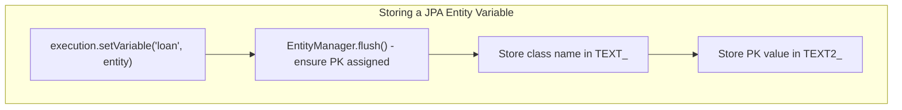
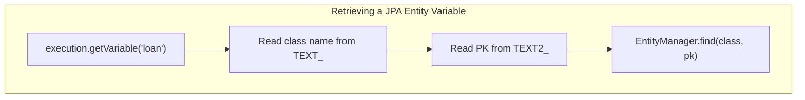

# Using JPA Entities as Process Variables

Activiti can store **references to JPA entities** directly as process variables. Instead of serializing the full entity, Activiti stores only the entity's class name and primary key, automatically fetching the latest data from the database when needed.

## How It Works

When a JPA entity is stored as a process variable:

- **Stored**: Only the fully-qualified class name (`TEXT_` column) and the primary key value (`TEXT2_` column)
- **Retrieved**: Activiti calls `EntityManager.find()` to load the entity fresh from the database
- **Lists**: A list of JPA entities stores the class name and a serialized array of primary keys

This means process variables always reflect the **current database state**, not a snapshot of the entity when it was stored.

### Supported Entity Types

JPA entities must meet these requirements:

- Annotated with `@Entity`
- Have a **single-valued** primary key annotated with `@Id`
- Use a supported ID type: `Long`, `String`, `Integer`, `Short`, `Byte`, `Float`, `Double`, `Character`, `UUID`, `java.util.Date`, `java.sql.Date`, `BigDecimal`, `BigInteger`

**Compound primary keys are not supported.**

## Configuration

### Spring Boot

There is no automatic JPA wiring in the Spring Boot starter. Configure it with a `ProcessEngineConfigurationConfigurer` bean:

```java
@Configuration
public class ActivitiJpaConfig {

    @Bean
    public ProcessEngineConfigurationConfigurer jpaConfigurer(EntityManagerFactory emf) {
        return (config) -> {
            config.setJpaEntityManagerFactory(emf);
            config.setJpaHandleTransaction(false);
            config.setJpaCloseEntityManager(false);
        };
    }
}
```

| Property | Value | Meaning |
|----------|-------|---------|
| `jpaEntityManagerFactory` | Spring's `EntityManagerFactory` | Required — provides the EntityManager |
| `jpaHandleTransaction` | `false` | Let Spring manage transactions |
| `jpaCloseEntityManager` | `false` | Let Spring manage the EntityManager lifecycle |

### Spring XML

```xml
<bean id="processEngineConfiguration" class="org.activiti.spring.SpringProcessEngineConfiguration">
    <property name="dataSource" ref="dataSource"/>
    <property name="transactionManager" ref="transactionManager"/>
    <property name="databaseSchemaUpdate" value="true"/>
    <property name="jpaEntityManagerFactory" ref="entityManagerFactory"/>
    <property name="jpaHandleTransaction" value="false"/>
    <property name="jpaCloseEntityManager" value="false"/>
</bean>
```

### Standalone (no Spring)

Use `jpaPersistenceUnitName` to reference a persistence unit from `persistence.xml`:

```xml
<bean id="processEngineConfiguration"
    class="org.activiti.engine.impl.cfg.StandaloneInMemProcessEngineConfiguration">
    <property name="jpaPersistenceUnitName" value="activiti-jpa-pu"/>
    <property name="jpaHandleTransaction" value="true"/>
    <property name="jpaCloseEntityManager" value="true"/>
</bean>
```

## Defining a JPA Entity

```java
@Entity
@Table(name = "LOAN_REQUEST")
public class LoanRequest {

    @Id
    @GeneratedValue(strategy = GenerationType.IDENTITY)
    private Long id;

    private String customerName;

    private Long amount;

    private boolean approved;

    // Getters and setters
    public Long getId() { return id; }
    public void setId(Long id) { this.id = id; }
    public String getCustomerName() { return customerName; }
    public void setCustomerName(String customerName) { this.customerName = customerName; }
    public Long getAmount() { return amount; }
    public void setAmount(Long amount) { this.amount = amount; }
    public boolean isApproved() { return approved; }
    public void setApproved(boolean approved) { this.approved = approved; }
}
```

The `@Entity` annotation is required. The `@Id` can be placed on either a field or a getter method.

## Storing JPA Entities as Variables

### From a Java Delegate

```java
public class CreateLoanRequestDelegate implements JavaDelegate {

    @PersistenceContext
    private EntityManager entityManager;

    @Override
    public void execute(DelegateExecution execution) {
        String customerName = execution.getVariable("customerName", String.class);
        Long amount = execution.getVariable("amount", Long.class);

        LoanRequest loanRequest = new LoanRequest();
        loanRequest.setCustomerName(customerName);
        loanRequest.setAmount(amount);
        loanRequest.setApproved(false);
        entityManager.persist(loanRequest);

        // Store the entity as a process variable
        execution.setVariable("loanRequest", loanRequest);
    }
}
```

When `setVariable` is called, Activiti detects the `@Entity` annotation and automatically uses the `jpa-entity` variable type, storing only the class name and primary key.

### From a BPMN Expression

```xml
<serviceTask id="createLoanRequest"
             activiti:expression="${loanRequestBean.newLoanRequest(customerName, amount)}"
             activiti:resultVariable="loanRequest"/>
```

The result of the expression is stored as a JPA entity variable when its return type is annotated with `@Entity`.

### Retrieving JPA Entity Variables

```java
// Returns a fresh entity loaded from the database
LoanRequest loanRequest = execution.getVariable("loanRequest", LoanRequest.class);

// Or via RuntimeService
LoanRequest loanRequest = runtimeService.getVariable(processInstanceId, "loanRequest", LoanRequest.class);
```

The entity is fetched via `EntityManager.find()`, so it reflects the **current state in the database**, not the state when it was originally stored.

### Modifying JPA Entity Variables

Because `getVariable` returns a managed entity, changes are automatically tracked by JPA:

```xml
<serviceTask id="approveDecision"
             activiti:expression="${loanRequest.setApproved(approvedByManager)}"/>
```

The modified entity is flushed to the database by Activiti's EntityManager session at the appropriate time.

## Storing Lists of JPA Entities

Activiti supports storing lists of JPA entities as process variables. All entities in the list must be of the **same type**.

```java
List<LoanRequest> requests = loanRequestService.findAllActive();
execution.setVariable("loanRequests", requests);

// Retrieval — elements are JPA entities, cast as needed
List<?> retrieved = execution.getVariable("loanRequests", List.class);
LoanRequest first = (LoanRequest) retrieved.get(0);
```

The list type is `jpa-entity-list`. It stores the entity class name and a serialized array of primary key values.

## Using JPA Entities in Gateway Conditions

Since `getVariable` returns a live entity from the database, you can use entity properties directly in expressions:

```xml
<exclusiveGateway id="approvalGateway"/>

<sequenceFlow id="approved" sourceRef="approvalGateway" targetRef="approvedEnd">
    <conditionExpression>${loanRequest.approved}</conditionExpression>
</sequenceFlow>

<sequenceFlow id="rejected" sourceRef="approvalGateway" targetRef="rejectionTask">
    <conditionExpression>${!loanRequest.approved}</conditionExpression>
</sequenceFlow>
```

The entity is fetched fresh from the database when the condition is evaluated, ensuring the latest value is used.

## Important Behavior

| Aspect | Detail |
|--------|--------|
| **Storage** | Only class name + primary key are persisted — not the full entity |
| **Retrieval** | `EntityManager.find()` loads a fresh entity each time |
| **Stale data** | If the entity is deleted from the database externally, `getVariable` throws `ActivitiException` |
| **Transactions** | In Spring, the JPA operations share Spring's transaction context |
| **Flush timing** | Activiti flushes the EntityManager before storing the variable to ensure the PK is assigned |
| **Type resolution** | When JPA is configured, entity types are registered before `SerializableType`, preventing blob serialization |





## Complete Example

Process definition (`LoanRequestProcess.bpmn20.xml`):

```xml
<?xml version="1.0" encoding="UTF-8"?>
<definitions xmlns="http://www.omg.org/spec/BPMN/20100524/MODEL"
             xmlns:xsi="http://www.w3.org/2001/XMLSchema-instance"
             xmlns:activiti="http://activiti.org/bpmn"
             targetNamespace="Examples">

    <process id="LoanRequestProcess" name="Loan Request Process">
        <startEvent id="theStart"/>
        <sequenceFlow sourceRef="theStart" targetRef="createLoanRequest"/>

        <serviceTask id="createLoanRequest"
                     activiti:expression="${loanRequestBean.newLoanRequest(customerName, amount)}"
                     activiti:resultVariable="loanRequest"/>
        <sequenceFlow sourceRef="createLoanRequest" targetRef="approveTask"/>

        <userTask id="approveTask" name="Approve or Reject Loan Request"/>
        <sequenceFlow sourceRef="approveTask" targetRef="storeDecision"/>

        <serviceTask id="storeDecision"
                     activiti:expression="${loanRequest.setApproved(approvedByManager)}"/>
        <sequenceFlow sourceRef="storeDecision" targetRef="approvalGateway"/>

        <exclusiveGateway id="approvalGateway"/>
        <sequenceFlow id="approvedPath" sourceRef="approvalGateway" targetRef="approvedEnd">
            <conditionExpression>${loanRequest.approved}</conditionExpression>
        </sequenceFlow>
        <sequenceFlow id="rejectedPath" sourceRef="approvalGateway" targetRef="sendRejection">
            <conditionExpression>${!loanRequest.approved}</conditionExpression>
        </sequenceFlow>

        <userTask id="sendRejection" name="Send Rejection Letter"/>
        <sequenceFlow sourceRef="sendRejection" targetRef="rejectedEnd"/>

        <endEvent id="approvedEnd"/>
        <endEvent id="rejectedEnd"/>
    </process>
</definitions>
```

Spring service bean (`LoanRequestBean.java`):

```java
import jakarta.persistence.EntityManager;
import jakarta.persistence.PersistenceContext;
import org.springframework.transaction.annotation.Transactional;

public class LoanRequestBean {

    @PersistenceContext
    private EntityManager entityManager;

    @Transactional
    public LoanRequest newLoanRequest(String customerName, Long amount) {
        LoanRequest loanRequest = new LoanRequest();
        loanRequest.setCustomerName(customerName);
        loanRequest.setAmount(amount);
        loanRequest.setApproved(false);
        entityManager.persist(loanRequest);
        return loanRequest;
    }
}
```

Starting the process:

```java
Map<String, Object> variables = Map.of(
    "customerName", "John Doe",
    "amount", 15000L
);
runtimeService.startProcessInstanceByKey("LoanRequestProcess", variables);
```

Completing the approval task:

```java
Task task = taskService.createTaskQuery()
    .processInstanceId(processInstance.getId())
    .singleResult();

taskService.complete(task.getId(), Map.of("approvedByManager", true));
```

## Troubleshooting

### "Entity does not exist" error

If a JPA entity variable is retrieved but the entity no longer exists in the database, Activiti throws an `ActivitiException`. This can happen if the entity was deleted outside the process.

**Solution:** Ensure entities referenced by process variables are not deleted while the process is still active.

### "Object is not a JPA Entity" error

The class must be annotated with `@Entity`. Subclasses of `@Entity` classes are also recognized.

**Solution:** Verify the entity annotation is present and the class is included in your persistence unit configuration.

### Compound primary keys

Activiti does not support entities with `@EmbeddedId` or `@IdClass`.

**Solution:** Use a single-column primary key.

## Related Documentation

- [Variables and Variable Scope](../advanced/variables.md) — Process variables overview
- [Service Task](../elements/service-task.md) — Java delegates and expressions
- [Exclusive Gateway](../gateways/exclusive-gateway.md) — Conditions in gateways
- [Configuration](../../configuration.md) — Engine configuration options
