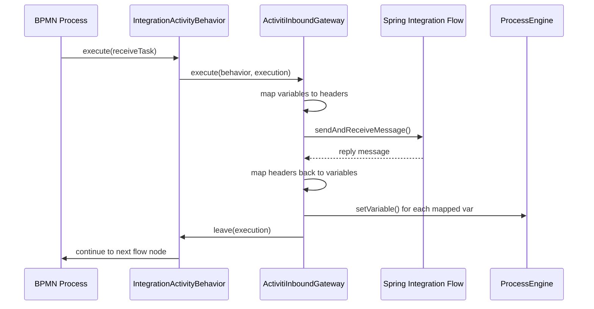
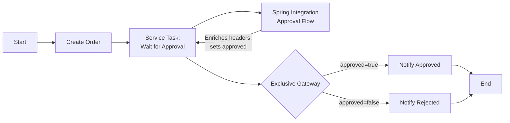

# Spring Integration

The **Spring Integration bridge** connects Activiti receive tasks with Spring Integration message channels, enabling BPMN processes to participate in Spring Integration flows as first-class messaging endpoints. When a process reaches a receive task, control is handed to a Spring Integration flow which can perform arbitrary message processing before signalling the process to continue.

## Architecture Overview



## Core Components

### `Activiti` DSL Class

The `org.activiti.spring.integration.Activiti` class provides a static DSL for building Spring Integration bridge components. It is consumed inside Spring Integration `IntegrationFlow` definitions.

```java
import static org.activiti.spring.integration.Activiti.*;
```

| DSL Method | Return Type | Purpose |
|-----------|-------------|---------|
| `inboundGateway(ProcessEngine, String...)` | `ActivitiInboundGateway` | Creates a gateway that bridges a receive task into a Spring Integration flow |
| `inboundGatewayActivityBehavior(ActivitiInboundGateway)` | `IntegrationActivityBehavior` | Wraps a gateway for reference in BPMN expressions |
| `signallingMessageHandler(ProcessEngine)` | `MessageHandler` | Sends a signal back to an Activiti execution from a message |

### `ActivitiInboundGateway`

The `ActivitiInboundGateway` extends Spring Integration's `MessagingGatewaySupport`. It is the core bridge component that:

1. **Captures** a running `DelegateExecution` when a receive task is reached
2. **Maps** process variables to Spring Integration message headers (preserving only selected keys)
3. **Forwards** the execution into a Spring Integration flow via `sendAndReceiveMessage()`
4. **Maps** reply headers back to process variables
5. **Resumes** the process by calling `leave()` on the activity behavior

```java
public class ActivitiInboundGateway extends MessagingGatewaySupport {

    // Default preserved headers (always included)
    private String executionId = "executionId";
    private String processInstanceId = "processInstanceId";
    private String processDefinitionId = "processDefinitionId";

    private final ProcessVariableHeaderMapper headerMapper;
    private ProcessEngine processEngine;
    private Set<String> sync; // keysToPreserve
}
```

The constructor accepts a `ProcessEngine` and a varargs list of process variable names to preserve across the bridge. Three identifiers — `executionId`, `processInstanceId`, and `processDefinitionId` — are **always** added to the preserved set automatically.

### `IntegrationActivityBehavior`

This class extends `ReceiveTaskActivityBehavior` and wraps an `ActivitiInboundGateway`. It is registered as a Spring bean and then referenced from a service task's `activiti:delegateExpression` attribute.

```java
public class IntegrationActivityBehavior extends ReceiveTaskActivityBehavior {

    private final ActivitiInboundGateway gateway;

    @Override
    public void execute(DelegateExecution execution) {
        gateway.execute(this, execution);
    }

    @Override
    public void trigger(DelegateExecution execution, String signalName, Object data) {
        gateway.signal(this, execution, signalName, data);
    }

    @Override
    public void leave(DelegateExecution execution) {
        super.leave(execution);
    }
}
```

Key points:
- `execute()` delegates to the gateway, which handles the full request-reply cycle synchronously
- `trigger()` delegates to the gateway's `signal()` method, which calls `leave()` to resume the process
- The gateway holds a reference back to this behavior so it can call `leave()` when the reply arrives

### `ProcessVariableHeaderMapper`

Implements Spring Integration's `HeaderMapper<Map<String, Object>>` interface. It selectively maps between process variables and message headers based on a `keysToPreserve` set.

```java
public class ProcessVariableHeaderMapper implements HeaderMapper<Map<String, Object>> {

    private final Set<String> keysToPreserve;

    // Outbound: process variables -> SI message headers
    public Map<String, Object> toHeaders(Map<String, Object> source)

    // Inbound: SI reply headers -> process variables
    public void fromHeaders(MessageHeaders headers, Map<String, Object> target)
}
```

Only keys present in `keysToPreserve` are copied in either direction. This means **process variables not explicitly listed are lost** during the bridge — they are not forwarded into the Spring Integration flow, and any headers in the reply not in the preserved set will not become process variables.

## Configuration

### Dependencies

The Spring Integration bridge classes are part of `activiti-spring-boot-starter`. To use them, add Spring Integration as a dependency:

```xml
<dependency>
    <groupId>org.activiti</groupId>
    <artifactId>activiti-spring-boot-starter</artifactId>
    <version>8.7.1</version>
</dependency>

<dependency>
    <groupId>org.springframework.boot</groupId>
    <artifactId>spring-boot-starter-integration</artifactId>
</dependency>
```

The `spring-boot-starter-integration` dependency is marked **optional** in the starter POM, so it must be declared explicitly in your project.

### Bean Configuration

No auto-configuration is provided for the Spring Integration bridge components. You must register the beans yourself:

```java
import org.activiti.engine.ProcessEngine;
import org.activiti.spring.integration.Activiti;
import org.activiti.spring.integration.ActivitiInboundGateway;
import org.activiti.spring.integration.IntegrationActivityBehavior;
import org.springframework.context.annotation.Bean;
import org.springframework.context.annotation.Configuration;
import org.springframework.integration.dsl.IntegrationFlow;

@Configuration
public class ActivitiIntegrationConfig {

    @Bean
    public ActivitiInboundGateway inboundGateway(ProcessEngine processEngine) {
        // Preserve "orderId" and "customerId" across the bridge
        return Activiti.inboundGateway(processEngine, "orderId", "customerId");
    }

    @Bean
    public IntegrationActivityBehavior integrationBehavior(ActivitiInboundGateway gateway) {
        return Activiti.inboundGatewayActivityBehavior(gateway);
    }

    @Bean
    public IntegrationFlow processingFlow(ActivitiInboundGateway gateway) {
        return IntegrationFlow.from(gateway)
            .<Object, Object>transform(p -> {
                // Process the message (payload is the DelegateExecution)
                return p;
            })
            .get();
    }
}
```

## BPMN Configuration

### Important: Receive Tasks Do Not Support Custom Behavior Attributes

The `ReceiveTaskParseHandler` unconditionally creates a `ReceiveTaskActivityBehavior` via the `ActivityBehaviorFactory`. It does **not** parse `activiti:class`, `activiti:delegateExpression`, or any custom behavior attributes on `<receiveTask>` elements. This means `IntegrationActivityBehavior` cannot be wired directly into a receive task using BPMN XML attributes.

### Correct Approach: Use a Service Task

Instead of a receive task, use a `<serviceTask>` with `activiti:delegateExpression` to reference the `IntegrationActivityBehavior` Spring bean:

```xml
<serviceTask id="waitForExternalInput"
             name="Wait for External Input"
             activiti:delegateExpression="${integrationBehavior}"/>
```

The service task parser resolves the expression at runtime and invokes the bean's `execute()` method, which triggers the full Spring Integration request-reply cycle.

## Variable Preservation

By default, only three headers are preserved across the bridge:

| Preserved Header | Description |
|-----------------|-------------|
| `executionId` | The current execution's unique ID |
| `processInstanceId` | The process instance's unique ID |
| `processDefinitionId` | The process definition's unique ID |

To preserve additional process variables, pass their names to `inboundGateway()`:

```java
@Bean
public ActivitiInboundGateway inboundGateway(ProcessEngine processEngine) {
    return Activiti.inboundGateway(processEngine,
        "orderId",
        "customerId",
        "orderTotal",
        "status"
    );
}
```

### Important Behavior

- The `ProcessVariableHeaderMapper` uses **selective copying**: only keys in the `keysToPreserve` set are transferred
- On the outbound direction (process → Spring Integration), matching process variables become message headers
- On the inbound direction (Spring Integration reply → process), matching reply headers become process variables via `RuntimeService.setVariable()`
- Variables not in the preserved set are **not accessible** inside the Spring Integration flow
- If the reply message modifies a preserved header's value, the updated value replaces the process variable

## Complete Working Example

### Scenario: Order Processing with External Approval

An order process pauses at a receive task to wait for an external approval system. The approval system is implemented as a Spring Integration flow that routes messages through validation and enrichment steps.

#### BPMN Definition

```xml
<?xml version="1.0" encoding="UTF-8"?>
<definitions xmlns="http://www.omg.org/spec/BPMN/20100524/MODEL"
             xmlns:activiti="http://activiti.org/bpmn"
             targetNamespace="Examples">

  <process id="orderProcess" name="Order Process" isExecutable="true">

    <startEvent id="start"/>
    <sequenceFlow id="flow1" sourceRef="start" targetRef="createOrder"/>

    <serviceTask id="createOrder"
                 name="Create Order"
                 activiti:class="com.example.CreateOrderService"/>
    <sequenceFlow id="flow2" sourceRef="createOrder" targetRef="waitForApproval"/>

    <serviceTask id="waitForApproval"
                  name="Wait for Approval"
                  activiti:delegateExpression="${approvalBehavior}"/>
    <sequenceFlow id="flow3" sourceRef="waitForApproval" targetRef="decision"/>

    <exclusiveGateway id="decision"/>
    <sequenceFlow id="flow4" sourceRef="decision" targetRef="notifyApproved">
      <conditionExpression xsi:type="tFormalExpression">
        ${approved == true}
      </conditionExpression>
    </sequenceFlow>
    <sequenceFlow id="flow5" sourceRef="decision" targetRef="notifyRejected">
      <conditionExpression xsi:type="tFormalExpression">
        ${approved == false}
      </conditionExpression>
    </sequenceFlow>

    <serviceTask id="notifyApproved"
                 name="Notify Approved"
                 activiti:class="com.example.ApprovalNotificationService"/>
    <serviceTask id="notifyRejected"
                 name="Notify Rejected"
                 activiti:class="com.example.RejectionNotificationService"/>

    <sequenceFlow id="flow6" sourceRef="notifyApproved" targetRef="end"/>
    <sequenceFlow id="flow7" sourceRef="notifyRejected" targetRef="end"/>
    <endEvent id="end"/>

  </process>
</definitions>
```

#### Spring Configuration

```java
import org.activiti.engine.ProcessEngine;
import org.activiti.spring.integration.Activiti;
import org.activiti.spring.integration.ActivitiInboundGateway;
import org.activiti.spring.integration.IntegrationActivityBehavior;
import org.springframework.context.annotation.Bean;
import org.springframework.context.annotation.Configuration;
import org.springframework.integration.dsl.IntegrationFlow;

@Configuration
public class OrderIntegrationConfig {

    @Bean
    public ActivitiInboundGateway approvalGateway(ProcessEngine processEngine) {
        // Preserve orderId, customerId, and approved across the bridge
        return Activiti.inboundGateway(processEngine,
            "orderId",
            "customerId",
            "approved"
        );
    }

    @Bean
    public IntegrationActivityBehavior approvalBehavior(
            ActivitiInboundGateway approvalGateway) {
        return Activiti.inboundGatewayActivityBehavior(approvalGateway);
    }

    @Bean
    public IntegrationFlow approvalFlow(ActivitiInboundGateway approvalGateway) {
        return IntegrationFlow.from(approvalGateway)
            .enrichHeaders(h -> h
                .headerFunction("approved", headers -> {
                    // Simulate approval logic based on orderId
                    String orderId = (String) headers.get("orderId");
                    return orderId != null && orderId.startsWith("VIP");
                })
            )
            .get();
    }
}
```

#### Flow Diagram



## Signalling Back to Activiti

The `Activiti.signallingMessageHandler()` creates a `MessageHandler` that triggers an Activiti execution from any Spring Integration flow. This is useful for **fire-and-forget** scenarios where you don't need a synchronous reply.

### How It Works

The handler extracts an `executionId` from the message headers and calls `RuntimeService.trigger(executionId)`:

```java
public static MessageHandler signallingMessageHandler(ProcessEngine processEngine) {
    return message -> {
        String executionId = (String) message.getHeaders().get("executionId");
        if (executionId != null) {
            processEngine.getRuntimeService().trigger(executionId);
        }
    };
}
```

### Usage Example

```java
import static org.activiti.spring.integration.Activiti.*;

@Bean
public IntegrationFlow asyncNotificationFlow(ProcessEngine processEngine) {
    return IntegrationFlow.from("notificationInputChannel")
        .handle(signallingMessageHandler(processEngine))
        .get();
}
```

Send a message with the `executionId` header to this channel to resume a waiting execution:

```java
MessagingTemplate template = new MessagingTemplate();
template.convertAndSend("notificationInputChannel", payload, m ->
    m.setHeader("executionId", executionId));
```

### Request-Reply vs. Signalling

| Pattern | Method | Use Case |
|---------|--------|----------|
| **Request-Reply** | `ActivitiInboundGateway.execute()` | Synchronous; the process waits for the flow to complete and returns variables |
| **Signalling** | `Activiti.signallingMessageHandler()` | Asynchronous; an external flow triggers a waiting execution independently |

## Error Handling

### Exception Propagation

When `ActivitiInboundGateway.execute()` is called, the Spring Integration flow executes **synchronously** (via `sendAndReceiveMessage()`). If the flow throws an exception:

1. The exception propagates back to the `IntegrationActivityBehavior.execute()` method
2. The Activiti engine's standard exception handling takes over
3. If the receive task is configured as async (`activiti:async="true"`), the exception is captured and can be retried
4. If not async, the exception fails the process execution

### Recommended Patterns

#### 1. Use Error Channels in Spring Integration

```java
@Bean
public IntegrationFlow approvalFlow(ActivitiInboundGateway approvalGateway) {
    return IntegrationFlow.from(approvalGateway)
        .enrichHeaders(h -> h
            .headerFunction("approved", headers -> {
                // Your logic here
                return true;
            })
        )
        .get();
}

// Global error handler
@Bean
public IntegrationFlow errorHandler() {
    return IntegrationFlow.from("errorChannel")
        .handle((Message<?> msg) -> {
            Throwable error = ((MessagingException) msg.getPayload()).getRootCause();
            // Log or handle the error
            return null;
        })
        .get();
}
```

#### 2. Make the Service Task Async

```xml
<serviceTask id="waitForApproval"
             name="Wait for Approval"
             activiti:delegateExpression="${approvalBehavior}"
             activiti:async="true"/>
```

This ensures exceptions are captured in the job executor and can be retried.

#### 3. Handle Errors Within the Flow

```java
@Bean
public IntegrationFlow approvalFlow(ActivitiInboundGateway approvalGateway) {
    return IntegrationFlow.from(approvalGateway)
        .enrichHeaders(h -> h
            .headerFunction("approved", headers -> {
                try {
                    return performApprovalCheck(headers);
                } catch (Exception e) {
                    return false; // Default to rejection on error
                }
            })
        )
        .get();
}
```

## Best Practices

### 1. Preserve Only Necessary Variables

The `keysToPreserve` set controls what crosses the bridge. Preserve only the variables the Spring Integration flow needs and the variables you want to capture from the reply:

```java
// GOOD: minimal set
Activiti.inboundGateway(processEngine, "orderId", "approved");

// BAD: preserving too many variables adds overhead
Activiti.inboundGateway(processEngine, "a", "b", "c", "d", "e", "f", "g", "h");
```

### 2. Keep Spring Integration Flows Fast

The `execute()` method is synchronous — the process thread blocks until the flow returns a reply. For long-running operations:

- Use `activiti:async="true"` on the service task so the call runs in a job executor thread
- Consider using `signallingMessageHandler()` for truly async patterns
- Implement timeouts in the Spring Integration flow

### 3. Name Beans Consistently

The BPMN `activiti:delegateExpression` attribute references the Spring bean name:

```java
// Bean name is "approvalBehavior"
@Bean
public IntegrationActivityBehavior approvalBehavior(...) { ... }
```

```xml
<!-- Must match exactly -->
<serviceTask activiti:delegateExpression="${approvalBehavior}"/>
```

### 4. Test the Bridge Independently

Test the Spring Integration flow separately from the Activiti process:

```java
@SpringBootTest
public class ApprovalFlowTest {

    @Autowired
    private ActivitiInboundGateway approvalGateway;

    @Autowired
    private ProcessEngine processEngine;

    @Test
    public void testApprovalFlow() {
        // Create a mock execution to drive the flow
        // Verify headers are correctly mapped
    }
}
```

### 5. Beware of Variable Type Changes

The `ProcessVariableHeaderMapper` copies raw objects. Ensure the types in the Spring Integration reply headers are compatible with what Activiti expects as process variable values (typically serializable types).

## Common Pitfalls

### 1. Variables Lost Across the Bridge

**Problem:** A process variable is not available in the Spring Integration flow.

**Cause:** The variable name was not passed to `inboundGateway()`.

**Solution:** Add the variable name to the preserved set:

```java
Activiti.inboundGateway(processEngine, "orderId", "missingVar");
```

### 2. Reply Headers Not Becoming Process Variables

**Problem:** The flow sets a header but the value doesn't appear as a process variable.

**Cause:** The header name is not in the preserved set.

**Solution:** Include the expected reply header in the preserved set:

```java
Activiti.inboundGateway(processEngine, "orderId", "approved");
// "approved" will be mapped from the reply header back to process variables
```

### 3. Null Reply Message

**Problem:** The Spring Integration flow returns `null` instead of a reply message.

**Cause:** The flow is configured for fire-and-forget (no reply channel).

**Solution:** Ensure the `IntegrationFlow` returns a message. Use `.get()` to build a flow with a reply channel, or configure a proper output:

```java
@Bean
public IntegrationFlow approvalFlow(ActivitiInboundGateway gateway) {
    return IntegrationFlow.from(gateway)
        // Must produce a reply message
        .passThrough()
        .get();
}
```

### 4. Missing ProcessEngine Dependency

**Problem:** `ActivitiInboundGateway` requires a `ProcessEngine` bean.

**Cause:** The `ProcessEngine` is not available in the Spring context.

**Solution:** Ensure `activiti-spring-boot-starter` is on the classpath, which auto-configures the `ProcessEngine`.

### 5. Bean Name Mismatch in BPMN

**Problem:** `Expression evaluation failed` at the service task.

**Cause:** The `activiti:delegateExpression` value doesn't match the Spring bean name.

**Solution:** Verify the bean name matches exactly:

```java
@Bean("myBehavior") // bean name is "myBehavior"
public IntegrationActivityBehavior myBehavior(...) { ... }
```

```xml
<serviceTask activiti:delegateExpression="${myBehavior}"/>
```

## Comparison with Other Integration Approaches

| Feature | Spring Integration Bridge | Connectors | Message Events |
|---------|--------------------------|-----------|----------------|
| **Synchronous** | Yes (request-reply) | Yes | No (async) |
| **Variable Mapping** | Selective (keysToPreserve) | Automatic (name-based) | Manual |
| **Java DSL** | Spring Integration DSL | JSON definitions | BPMN expressions |
| **Complex Flows** | Full SI flow support | Single action | N/A |
| **Async Signalling** | Via signallingMessageHandler | Via async service task | Native |
| **Setup Complexity** | Medium (manual beans) | Low (auto-configured) | Low |

## Related Documentation

- [Integration Patterns](./index.md) - Overview of integration approaches
- [Connectors](./connectors.md) - Declarative JSON-based integrations
- [Receive Task](../elements/receive-task.md) - The BPMN element used by the bridge
- [JPA Process Variables](./jpa-process-variables.md) - Entity variable handling
