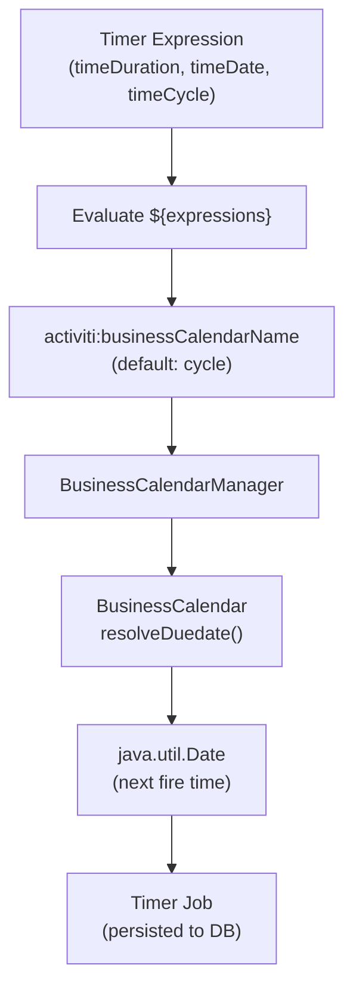
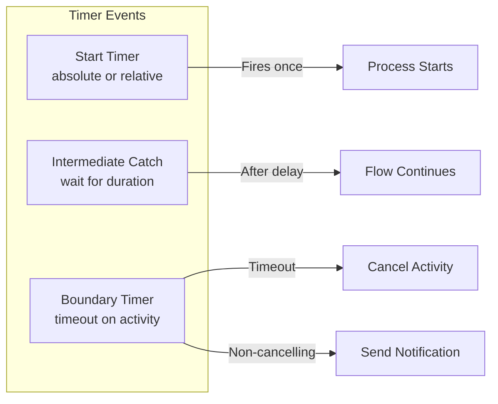
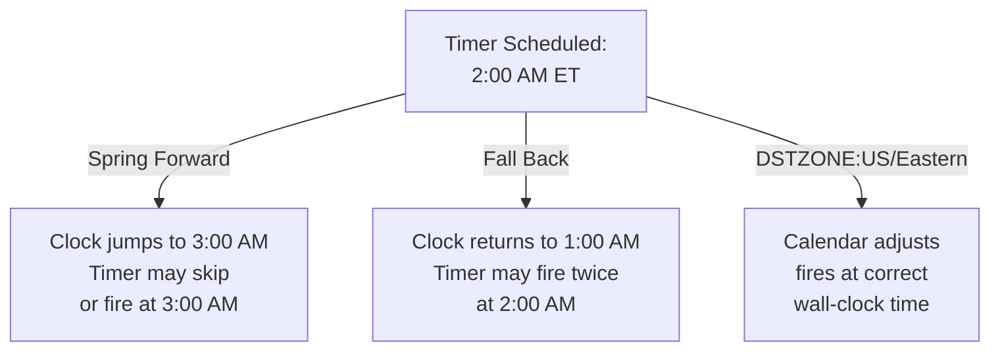

# Business Calendars

Business calendars resolve **timer expressions** to concrete `java.util.Date` values. They determine when timer events fire, when user tasks are due, and how recurring schedules are evaluated.

## Overview

Activiti uses business calendars internally to parse the string values found in timer definitions and task due dates. The engine looks up the appropriate calendar by name through a `BusinessCalendarManager` and calls its `resolveDuedate(String)` method to compute the next execution time.

```xml
<?xml version="1.0" encoding="UTF-8"?>
<bpmn:process id="timerProcess" name="Timer Process"
    xmlns:bpmn="http://www.omg.org/spec/BPMN/20100524/MODEL"
    xmlns:activiti="http://activiti.org/bpmn">

  <bpmn:startEvent id="timerStart">
    <bpmn:timerEventDefinition>
      <bpmn:timeDuration>PT5M</bpmn:timeDuration>
    </bpmn:timerEventDefinition>
  </bpmn:startEvent>

</bpmn:process>
```

**Key Concepts:**
- A **calendar type** determines how a timer string is parsed (cycle, duration, duedate, or custom)
- **ISO 8601** expressions cover absolute dates, relative durations, and repeating cycles
- **CRON** expressions support Unix-style scheduling with Quartz-compatible syntax
- **DST handling** is available via the AdvancedCycleBusinessCalendar
- Timer values can contain **process variables** via `${expression}` syntax

## Timer Expression Flow



## Built-In Calendar Types

Activiti ships with four built-in business calendars, each identified by a name:

| Calendar Name | Class | Description |
|---|---|---|
| `cycle` | `CycleBusinessCalendar` | Parses ISO 8601 repeating cycles and CRON expressions |
| `duration` | `DurationBusinessCalendar` | Parses ISO 8601 durations and cycles without CRON |
| `dueDate` | `DueDateBusinessCalendar` | Parses ISO 8601 absolute dates and period offsets |
| custom name | User-provided | Any class implementing `BusinessCalendar` |

The default calendar for timers is **`cycle`**. For user task due dates, the default is **`dueDate`**.

### Cycle Calendar

The cycle calendar is the most versatile built-in type. It accepts two formats:

1. **ISO 8601 cycle expressions** starting with `R`
2. **Quartz-style CRON expressions**

```java
// Source: CycleBusinessCalendar.resolveDuedate()
if (duedateDescription != null && duedateDescription.startsWith("R")) {
    return new DurationHelper(duedateDescription, maxIterations, clockReader).getDateAfter();
} else {
    CronExpression ce = new CronExpression(duedateDescription, clockReader);
    return ce.getTimeAfter(clockReader.getCurrentTime());
}
```

```xml
<!-- ISO 8601 cycle -->
<bpmn:timeCycle>R/PT1H</bpmn:timeCycle>

<!-- CRON expression (same calendar) -->
<bpmn:timeCycle>0 0 * * * ?</bpmn:timeCycle>
```

**Example: Recurring hourly timer**

```xml
<?xml version="1.0" encoding="UTF-8"?>
<bpmn:process id="hourlyCheck" name="Hourly Check"
    xmlns:bpmn="http://www.omg.org/spec/BPMN/20100524/MODEL"
    xmlns:activiti="http://activiti.org/bpmn">

  <bpmn:startEvent id="start">
    <bpmn:timerEventDefinition>
      <bpmn:timeCycle>R/PT1H</bpmn:timeCycle>
    </bpmn:timerEventDefinition>
  </bpmn:startEvent>

  <bpmn:sequenceFlow sourceRef="start" targetRef="task"/>

  <bpmn:serviceTask id="task" name="Run Check"
      activiti:class="com.example.HourlyCheckService"/>

  <bpmn:sequenceFlow sourceRef="task" targetRef="end"/>

  <bpmn:endEvent id="end"/>

</bpmn:process>
```

### Duration Calendar

The duration calendar parses ISO 8601 durations and cycle expressions using `DurationHelper` under the hood. It does **not** support CRON expressions.

```java
// Source: DurationBusinessCalendar.resolveDuedate()
DurationHelper dh = new DurationHelper(duedate, clockReader);
return dh.getDateAfter();
```

```xml
<!-- Simple duration: 30 minutes from now -->
<bpmn:timeDuration>PT30M</bpmn:timeDuration>

<!-- Cycle: repeat every day -->
<bpmn:timeCycle>R/PT24H</bpmn:timeCycle>
```

**Example: One-time delay with duration calendar**

```xml
<bpmn:startEvent id="delayedStart">
  <bpmn:timerEventDefinition activiti:businessCalendarName="duration">
    <bpmn:timeDuration>P1DT2H</bpmn:timeDuration>
  </bpmn:timerEventDefinition>
</bpmn:startEvent>
```

### DueDate Calendar

The dueDate calendar is the default for **user task due dates**. It accepts two formats:

1. **ISO 8601 period** (starting with `P`) — relative duration added to the current time
2. **ISO 8601 date-time** — absolute timestamp

```java
// Source: DueDateBusinessCalendar.resolveDuedate()
if (duedate.startsWith("P")) {
    return new DateTime(clockReader.getCurrentTime())
        .plus(Period.parse(duedate)).toDate();
}
return DateTime.parse(duedate).toDate();
```

```xml
<!-- Relative: due in 3 days -->
<userTask id="reviewTask"
    activiti:dueDate="P3D"/>

<!-- Absolute: due on specific date -->
<userTask id="urgentTask"
    activiti:dueDate="2026-05-01T17:00:00"/>
```

**Example: User task with due date**

```xml
<?xml version="1.0" encoding="UTF-8"?>
<bpmn:process id="reviewProcess" name="Review Process"
    xmlns:bpmn="http://www.omg.org/spec/BPMN/20100524/MODEL"
    xmlns:activiti="http://activiti.org/bpmn">

  <bpmn:startEvent id="start"/>

  <bpmn:sequenceFlow sourceRef="start" targetRef="review"/>

  <bpmn:userTask id="review"
      name="Manager Review"
      activiti:assignee="${manager}"
      activiti:dueDate="P5D"
      activiti:businessCalendarName="dueDate"/>

  <bpmn:sequenceFlow sourceRef="review" targetRef="end"/>

  <bpmn:endEvent id="end"/>

</bpmn:process>
```

### AdvancedCycleBusinessCalendar

The `CycleBusinessCalendar` is the default calendar registered under the name `cycle` in the Activiti engine. The `AdvancedCycleBusinessCalendar` extends the cycle calendar with **daylight saving time (DST) awareness** and must be explicitly registered if you need DST support.

Two schedule versions are supported:

| Version | Resolver | DST Behavior |
|---|---|---|
| `VER:1` | `AdvancedSchedulerResolverWithoutTimeZone` | Ignores DST; uses server time zone (legacy behavior) |
| `VER:2` (default) | `AdvancedSchedulerResolverWithTimeZone` | Respects DST transitions in the specified time zone |

```xml
<!-- DST-aware: runs at 8:30 PM Eastern time, handles clock changes -->
<bpmn:timeCycle>R/PT1D DSTZONE:US/Eastern</bpmn:timeCycle>

<!-- Explicit version 1: ignores DST -->
<bpmn:timeCycle>0 30 20 ? * MON-FRI * VER:1 DSTZONE:US/Arizona</bpmn:timeCycle>

<!-- Version 2 with UTC (no DST) -->
<bpmn:timeCycle>R/2026-01-01T00:00:00/P1D VER:2 DSTZONE:UTC</bpmn:timeCycle>

<!-- Omitting DSTZONE uses the server's default time zone -->
<bpmn:timeCycle>R/PT1H</bpmn:timeCycle>
```

**Resolver implementation detail:**

```java
// VER:2 resolver - timezone-aware
if (duedateDescription.startsWith("R")) {
    nextRun = new DurationHelper(duedateDescription, clockReader)
        .getCalendarAfter(clockReader.getCurrentCalendar(timeZone));
} else {
    nextRun = new CronExpression(duedateDescription, clockReader, timeZone)
        .getTimeAfter(clockReader.getCurrentCalendar(timeZone));
}
```

## ISO 8601 Timer Expressions

Activiti supports three ISO 8601 timer element types as defined in the BPMN 2.0 specification.

### timeDate — Absolute Date-Time

Fires the timer at a specific point in time.

```xml
<bpmn:timerEventDefinition>
  <bpmn:timeDate>2026-06-15T09:00:00</bpmn:timeDate>
</bpmn:timerEventDefinition>

<!-- With timezone offset -->
<bpmn:timeDate>2026-06-15T09:00:00-05:00</bpmn:timeDate>

<!-- With expression -->
<bpmn:timeDate>${reminderDate}</bpmn:timeDate>
```

| Format | Example | Description |
|---|---|---|
| Date only | `2026-06-15` | Midnight local time |
| Date + time | `2026-06-15T09:00:00` | Specific time |
| With offset | `2026-06-15T09:00:00+02:00` | Explicit timezone |
| Expression | `${myDate}` | Resolved at runtime |

### timeDuration — Relative Duration

Fires the timer after a duration has elapsed from the moment the timer was created.

```xml
<bpmn:timerEventDefinition>
  <bpmn:timeDuration>PT30M</bpmn:timeDuration>
</bpmn:timerEventDefinition>

<!-- Complex duration -->
<bpmn:timeDuration>P1DT2H30M</bpmn:timeDuration>

<!-- Expression -->
<bpmn:timeDuration>${waitDuration}</bpmn:timeDuration>
```

| Expression | Meaning |
|---|---|
| `PT5S` | 5 seconds |
| `PT30M` | 30 minutes |
| `PT2H` | 2 hours |
| `P1D` | 1 day |
| `P2W` | 2 weeks |
| `P1M` | 1 month |
| `P1Y` | 1 year |
| `P1DT2H30M` | 1 day, 2 hours, 30 minutes |

### timeCycle — Repeating Cycles

Fires the timer repeatedly according to a cycle pattern. Uses the `DurationHelper` parser for ISO cycle syntax.

```xml
<bpmn:timerEventDefinition>
  <bpmn:timeCycle>R/PT1H</bpmn:timeCycle>
</bpmn:timerEventDefinition>
```

### Cycle Repeat Patterns

Cycle expressions are parsed by splitting on `/` into segments:

| Pattern | Example | Meaning |
|---|---|---|
| `R` | `R/PT1H` | Repeat indefinitely every 1 hour |
| `Rn` | `R5/PT1H` | Repeat 5 times, every 1 hour |
| `R/Pduration` | `R/PT1D` | Infinite repeat, daily |
| `R/start/Pduration` | `R/2026-01-01T08:00:00/PT1H` | Start at given time, repeat hourly |
| `R/start/end/Pduration` | `R/2026-01-01T08:00:00/2026-01-01T18:00:00/PT30M` | Bounded range |

**DurationHelper parsing logic:**

```java
// Source: DurationHelper constructor
List<String> expression = asList(expressionS.split("/"));

if (expression.get(0).startsWith("R")) {
    isRepeat = true;
    times = expression.get(0).length() == 1
        ? Integer.MAX_VALUE - 1
        : Integer.parseInt(expression.get(0).substring(1));
    expression = expression.subList(1, expression.size());
}

if (isDuration(expression.get(0))) {
    period = parsePeriod(expression.get(0));
    end = expression.size() == 1 ? null : parseDate(expression.get(1));
} else {
    start = parseDate(expression.get(0));
    if (isDuration(expression.get(1))) {
        period = parsePeriod(expression.get(1));
    } else {
        end = parseDate(expression.get(1));
        period = datatypeFactory.newDuration(end.getTimeInMillis() - start.getTimeInMillis());
    }
}
```

**Complete cycle examples:**

```xml
<!-- Fire every 4 hours indefinitely -->
<bpmn:timeCycle>R/PT4H</bpmn:timeCycle>

<!-- Fire 10 times, every 30 minutes -->
<bpmn:timeCycle>R10/PT30M</bpmn:timeCycle>

<!-- Fire starting at noon, every day -->
<bpmn:timeCycle>R/2026-01-01T12:00:00/PT1D</bpmn:timeCycle>

<!-- Fire from Jan 1 to Mar 1, every week -->
<bpmn:timeCycle>R/2026-01-01T00:00:00/2026-03-01T00:00:00/PT1W</bpmn:timeCycle>
```

**Repeat cycle with end date attribute:**

As an alternative to encoding the end time in the cycle string, the `activiti:endDate` attribute can be used on the `timeCycle` element:

```xml
<bpmn:timerEventDefinition>
  <bpmn:timeCycle activiti:endDate="2026-12-31T23:59:59">R/PT1H</bpmn:timeCycle>
</bpmn:timerEventDefinition>
```

## CRON Expression Syntax

When the timer expression does **not** start with `R`, the cycle calendar delegates to `CronExpression`, which implements a **Quartz-compatible** CRON parser.

### Field Structure

A CRON expression has six required fields and one optional field, separated by whitespace:

| Field | Allowed Values | Special Characters |
|---|---|---|
| Seconds | `0-59` | `, - * /` |
| Minutes | `0-59` | `, - * /` |
| Hours | `0-23` | `, - * /` |
| Day-of-Month | `1-31` | `, - * ? / L W` |
| Month | `1-12` or `JAN-DEC` | `, - * /` |
| Day-of-Week | `1-7` or `SUN-SAT` | `, - * ? / L #` |
| Year (optional) | empty or `1970-2199` | `, - * /` |

### Special Characters

| Character | Name | Description | Example |
|---|---|---|---|
| `*` | All values | Matches every possible value | `*` in minutes = every minute |
| `?` | No specific value | Used in day-of-month or day-of-week when the other is specified | `0 0 12 * * ?` |
| `-` | Range | Specifies a range of values | `10-12` in hours = 10, 11, 12 |
| `,` | List | Specifies additional values | `MON,WED,FRI` |
| `/` | Increment | Specifies a step value | `0/15` in seconds = 0, 15, 30, 45 |
| `L` | Last | Last day of month, or last Nth day of week | `L` = last day; `6L` = last Friday |
| `W` | Weekday | Nearest weekday to given day | `15W` = nearest weekday to 15th |
| `#` | Nth | Nth day of week in month | `6#3` = third Friday |

**Important:** You cannot specify both day-of-month and day-of-week with concrete values. Use `?` in one of the fields:

```xml
<!-- Correct: specific day-of-month, ? for day-of-week -->
<bpmn:timeCycle>0 0 12 15 * ?</bpmn:timeCycle>

<!-- Correct: ? for day-of-month, specific day-of-week -->
<bpmn:timeCycle>0 0 12 ? * MON</bpmn:timeCycle>

<!-- Invalid: both fields specified -->
<bpmn:timeCycle>0 0 12 15 * MON</bpmn:timeCycle>
```

### Common CRON Patterns

| CRON Expression | Meaning |
|---|---|
| `0 0/5 * * * ?` | Every 5 minutes |
| `0 15 10 * * ?` | Daily at 10:15 AM |
| `0 0 9-17 * * ?` | Every hour from 9 AM to 5 PM |
| `0 0 0 1 * ?` | Monthly on the 1st at midnight |
| `0 0 12 * * MON-FRI` | Weekdays at noon |
| `0 0 0 ? * MON` | Every Monday at midnight |
| `0 30 20 ? * 6L` | Last Friday of month at 8:30 PM |
| `0 0 0 1 1 ?` | January 1st at midnight (New Year) |
| `0 0 0 1 12 ? *` | December 1st at midnight every year |
| `0 0/30 9-17 * * ?` | Every 30 minutes during business hours |

### CRON with DST

When using the AdvancedCycleBusinessCalendar, append `DSTZONE:timezone` to a CRON expression:

```xml
<!-- Runs at 9 AM Eastern time, accounts for DST -->
<bpmn:timeCycle>0 0 9 * * ? DSTZONE:US/Eastern</bpmn:timeCycle>

<!-- Runs every Monday-Friday at 8:30 PM Pacific time -->
<bpmn:timeCycle>0 30 20 ? * MON-FRI DSTZONE:US/Pacific</bpmn:timeCycle>

<!-- Arizona has no DST; schedule is stable -->
<bpmn:timeCycle>0 0 12 * * ? DSTZONE:US/Arizona</bpmn:timeCycle>

<!-- UTC has no DST transitions -->
<bpmn:timeCycle>0 0 0 * * ? DSTZONE:UTC</bpmn:timeCycle>
```

## Timer Event Attributes

The following attributes are available on timer-related elements:

| Attribute | Element | Namespace | Description | Default |
|---|---|---|---|---|
| `activiti:businessCalendarName` | `timerEventDefinition` | `http://activiti.org/bpmn` | Name of the business calendar to use | `cycle` |
| `activiti:endDate` | `timeCycle` | `http://activiti.org/bpmn` | ISO date string limiting timer repeats | No limit |

```xml
<bpmn:timerEventDefinition activiti:businessCalendarName="myCustomCalendar">
  <bpmn:timeCycle activiti:endDate="2026-12-31T23:59:59">R/PT1H</bpmn:timeCycle>
</bpmn:timerEventDefinition>
```

**How `activiti:endDate` works:**

The `endDate` is parsed by `BusinessCalendarImpl.resolveEndDate()`:

```java
// Source: BusinessCalendarImpl.resolveEndDate()
return ISODateTimeFormat.dateTimeParser()
    .withZone(DateTimeZone.forTimeZone(clockReader.getCurrentTimeZone()))
    .parseDateTime(endDateString)
    .toCalendar(null)
    .getTime();
```

The engine validates that the next timer date has not exceeded the end date via `CycleBusinessCalendar.validateDuedate()`:

```java
// Source: CycleBusinessCalendar.validateDuedate()
if (endDate != null) {
    return super.validateDuedate(duedateDescription, maxIterations, endDate, newTimer);
}
// end date could be part of the cycle expression
if (duedateDescription != null && duedateDescription.startsWith("R")) {
    return new DurationHelper(duedateDescription, maxIterations, clockReader).isValidDate(newTimer);
} else {
    return true;
}
```

## Expression Support

All timer elements support Activiti expressions using `${}` syntax. The expression is evaluated against the current execution's variables at timer creation time.

```xml
<!-- Duration from process variable -->
<bpmn:timeDuration>${timeoutDuration}</bpmn:timeDuration>

<!-- Absolute date from variable -->
<bpmn:timeDate>${scheduledDate}</bpmn:timeDate>

<!-- Cycle expression with variable -->
<bpmn:timeCycle>R/${repeatCount}/PT1H</bpmn:timeCycle>

<!-- Calendar name from variable -->
<bpmn:timerEventDefinition
    activiti:businessCalendarName="${calendarName}">
  <bpmn:timeCycle>R/PT1D</bpmn:timeCycle>
</bpmn:timerEventDefinition>
```

```java
// Source: TimerJobEntityManagerImpl.getBusinessCalendarName()
String businessCalendarName = CycleBusinessCalendar.NAME;
if (StringUtils.isNotEmpty(calendarName)) {
    businessCalendarName = (String) Context.getProcessEngineConfiguration()
        .getExpressionManager()
        .createExpression(calendarName)
        .getValue(variableScope);
}
```

## Business Calendar Usage in Timer Events

### Start Timer Event

```xml
<?xml version="1.0" encoding="UTF-8"?>
<bpmn:process id="scheduledProcess"
    xmlns:bpmn="http://www.omg.org/spec/BPMN/20100524/MODEL"
    xmlns:activiti="http://activiti.org/bpmn">

  <!-- Fires once at the specified date -->
  <bpmn:startEvent id="scheduledStart">
    <bpmn:timerEventDefinition>
      <bpmn:timeDate>2026-07-01T08:00:00</bpmn:timeDate>
    </bpmn:timerEventDefinition>
  </bpmn:startEvent>

  <!-- Fires every day at 2 AM -->
  <bpmn:startEvent id="dailyStart">
    <bpmn:timerEventDefinition>
      <bpmn:timeCycle>0 0 2 * * ?</bpmn:timeCycle>
    </bpmn:timerEventDefinition>
  </bpmn:startEvent>

  <!-- Fires 30 minutes after process is deployed -->
  <bpmn:startEvent id="delayedStart">
    <bpmn:timerEventDefinition>
      <bpmn:timeDuration>PT30M</bpmn:timeDuration>
    </bpmn:timerEventDefinition>
  </bpmn:startEvent>

</bpmn:process>
```

### Intermediate Timer Event

```xml
<bpmn:intermediateCatchEvent id="waitEvent">
  <bpmn:timerEventDefinition>
    <bpmn:timeDuration>PT1H</bpmn:timeDuration>
  </bpmn:timerEventDefinition>
</bpmn:intermediateCatchEvent>

<!-- Message with 10-minute timeout -->
<bpmn:intermediateCatchEvent id="msgWait">
  <bpmn:timerEventDefinition>
    <bpmn:timeDuration>PT10M</bpmn:timeDuration>
  </bpmn:timerEventDefinition>
</bpmn:intermediateCatchEvent>
```

### Boundary Timer Event

```xml
<bpmn:serviceTask id="longTask"
    name="Process Data"
    activiti:class="com.example.DataProcessor">

  <!-- Timeout after 15 minutes -->
  <bpmn:boundaryEvent id="timeout" cancelActivity="true">
    <bpmn:timerEventDefinition>
      <bpmn:timeDuration>PT15M</bpmn:timeDuration>
    </bpmn:timerEventDefinition>
  </bpmn:boundaryEvent>

  <!-- Retry reminder every 5 minutes for up to 1 hour -->
  <bpmn:boundaryEvent id="reminder" cancelActivity="false">
    <bpmn:timerEventDefinition>
      <bpmn:timeCycle>R12/PT5M</bpmn:timeCycle>
    </bpmn:timerEventDefinition>
  </bpmn:boundaryEvent>

</bpmn:serviceTask>
```

### Timer Event Diagram



## Business Calendar Usage in User Tasks

User tasks support `activiti:dueDate` with an optional `activiti:businessCalendarName`. The due date expression is evaluated at task creation time using the `DueDateBusinessCalendar` by default.

```xml
<!-- Due in 5 business days (using default dueDate calendar) -->
<bpmn:userTask id="reviewTask"
    name="Review Document"
    activiti:assignee="${reviewer}"
    activiti:dueDate="P5D"/>

<!-- Due at specific time -->
<bpmn:userTask id="urgentTask"
    name="Urgent Approval"
    activiti:assignee="${manager}"
    activiti:dueDate="2026-04-30T17:00:00"
    activiti:businessCalendarName="dueDate"/>

<!-- Due date from variable -->
<bpmn:userTask id="flexibleTask"
    name="Flexible Task"
    activiti:dueDate="${taskDueDate}"
    activiti:businessCalendarName="${calendarType}"/>
```

**Runtime evaluation:**

```java
// Source: UserTaskActivityBehavior - due date resolution
String businessCalendarName = null;
if (StringUtils.isNotEmpty(userTask.getBusinessCalendarName())) {
    businessCalendarName = expressionManager
        .createExpression(userTask.getBusinessCalendarName())
        .getValue(execution).toString();
} else {
    businessCalendarName = DueDateBusinessCalendar.NAME;
}

BusinessCalendar businessCalendar = Context.getProcessEngineConfiguration()
    .getBusinessCalendarManager()
    .getBusinessCalendar(businessCalendarName);
task.setDueDate(businessCalendar.resolveDuedate((String) dueDate));
```

## Custom Business Calendars

You can implement custom business calendars by implementing the `BusinessCalendar` interface:

```java
package org.activiti.engine.impl.calendar;

public interface BusinessCalendar {
    Date resolveDuedate(String duedateDescription);
    Date resolveDuedate(String duedateDescription, int maxIterations);
    Boolean validateDuedate(String duedateDescription, int maxIterations, Date endDate, Date newTimer);
    Date resolveEndDate(String endDateString);
}
```

### Example: Business Days Calendar

A calendar that skips weekends when computing durations:

```java
public class BusinessDaysCalendar implements BusinessCalendar {

    private final ClockReader clockReader;

    public BusinessDaysCalendar(ClockReader clockReader) {
        this.clockReader = clockReader;
    }

    @Override
    public Date resolveDuedate(String duedateDescription) {
        return resolveDuedate(duedateDescription, -1);
    }

    @Override
    public Date resolveDuedate(String duedateDescription, int maxIterations) {
        // Parse "P5D" as 5 business days, skipping Saturday and Sunday
        Period period = Period.parse(duedateDescription);
        Calendar calendar = (Calendar) clockReader.getCurrentCalendar().clone();

        int daysToAdd = period.getDays();
        int added = 0;
        while (added < daysToAdd) {
            calendar.add(Calendar.DAY_OF_MONTH, 1);
            int dayOfWeek = calendar.get(Calendar.DAY_OF_WEEK);
            if (dayOfWeek != Calendar.SATURDAY && dayOfWeek != Calendar.SUNDAY) {
                added++;
            }
        }
        return calendar.getTime();
    }

    @Override
    public Boolean validateDuedate(String duedateDescription, int maxIterations,
                                    Date endDate, Date newTimer) {
        return endDate == null || endDate.after(newTimer);
    }

    @Override
    public Date resolveEndDate(String endDateString) {
        return DateTime.parse(endDateString).toDate();
    }
}
```

### Registering Custom Calendars

Custom calendars are registered with the `BusinessCalendarManager` at engine configuration time:

```java
// MapBusinessCalendarManager provides the addBusinessCalendar() method
MapBusinessCalendarManager manager = new MapBusinessCalendarManager();

manager.addBusinessCalendar("cycle",
    new AdvancedCycleBusinessCalendar(clockReader, 2));
manager.addBusinessCalendar("duration",
    new DurationBusinessCalendar(clockReader));
manager.addBusinessCalendar("dueDate",
    new DueDateBusinessCalendar(clockReader));

// Add custom calendar
manager.addBusinessCalendar("businessDays",
    new BusinessDaysCalendar(clockReader));
```

**Spring Boot configuration:**

```java
@Bean
public BusinessCalendarManager businessCalendarManager(ClockReader clockReader) {
    Map<String, BusinessCalendar> calendars = new HashMap<>();
    calendars.put("cycle", new AdvancedCycleBusinessCalendar(clockReader, 2));
    calendars.put("duration", new DurationBusinessCalendar(clockReader));
    calendars.put("dueDate", new DueDateBusinessCalendar(clockReader));
    calendars.put("businessDays", new BusinessDaysCalendar(clockReader));
    return new MapBusinessCalendarManager(calendars);
}
```

**Using a custom calendar in a process:**

```xml
<bpmn:userTask id="businessTask"
    name="SLA Task"
    activiti:dueDate="P5D"
    activiti:businessCalendarName="businessDays"/>

<!-- Timer that only fires on business days -->
<bpmn:timerEventDefinition
    activiti:businessCalendarName="businessDays">
  <bpmn:timeDuration>P1D</bpmn:timeDuration>
</bpmn:timerEventDefinition>
```

## DST and Timezone Considerations

### How DST Affects Timers

Daylight saving time transitions can cause timers to fire at unexpected wall-clock times when the underlying time zone shifts by an hour.

**Without DST handling (VER:1 or no DSTZONE):**
- `R/PT1D` always adds exactly 24 hours
- A timer set for 2:00 AM will fire at 3:00 AM after the spring-forward transition

**With DST handling (VER:2 + DSTZONE):**
- The calendar uses the specified time zone for calculations
- `R/PT1D DSTZONE:US/Eastern` fires at the same wall-clock time regardless of DST

### Spring Forward vs Fall Back



### Recommended Timezones

| Timezone ID | DST Behavior | Notes |
|---|---|---|
| `UTC` | None | Recommended for server internals |
| `US/Eastern` | Yes | EDT/EST |
| `US/Central` | Yes | CDT/CST |
| `US/Pacific` | Yes | PDT/PST |
| `US/Arizona` | None | Always MST |
| `Europe/London` | Yes | GMT/BST |
| `Europe/Paris` | Yes | CET/CEST |
| `Asia/Tokyo` | None | Always JST |

### CronExpression DST Handling

The `CronExpression.setCalendarHour()` method includes explicit DST compensation:

```java
// Source: CronExpression.setCalendarHour()
protected void setCalendarHour(Calendar cal, int hour) {
    cal.set(Calendar.HOUR_OF_DAY, hour);
    if (cal.get(Calendar.HOUR_OF_DAY) != hour && hour != 24) {
        cal.set(Calendar.HOUR_OF_DAY, hour + 1);
    }
}
```

This detects when setting the hour fails due to DST (e.g., trying to set 2 AM during spring forward) and adjusts accordingly.

### DurationHelper DST Awareness

The `DurationHelper.add()` method applies duration components in reverse order (seconds first, then minutes, hours, days, months, years) to mitigate DST issues introduced by `javax.xml.datatype.Duration.addTo()`:

```java
// Source: DurationHelper.add()
// duration.addTo does not account for daylight saving time (xerces),
// reversing order of addition fixes the problem
calendar.add(Calendar.SECOND, duration.getSeconds() * duration.getSign());
calendar.add(Calendar.MINUTE, duration.getMinutes() * duration.getSign());
calendar.add(Calendar.HOUR, duration.getHours() * duration.getSign());
calendar.add(Calendar.DAY_OF_MONTH, duration.getDays() * duration.getSign());
calendar.add(Calendar.MONTH, duration.getMonths() * duration.getSign());
calendar.add(Calendar.YEAR, duration.getYears() * duration.getSign());
```

## Complete Examples

### Example 1: SLA-Based Approval Workflow

```xml
<?xml version="1.0" encoding="UTF-8"?>
<bpmn:process id="slaApproval" name="SLA Approval Process"
    xmlns:bpmn="http://www.omg.org/spec/BPMN/20100524/MODEL"
    xmlns:activiti="http://activiti.org/bpmn">

  <bpmn:startEvent id="start"/>

  <bpmn:sequenceFlow sourceRef="start" targetRef="review"/>

  <!-- Task due in 3 business days -->
  <bpmn:userTask id="review"
      name="Manager Review"
      activiti:assignee="${manager}"
      activiti:dueDate="P3D"
      activiti:businessCalendarName="businessDays"/>

  <!-- Escalation timer if task is not completed -->
  <bpmn:boundaryEvent id="escalate" attachedToRef="review" cancelActivity="false">
    <bpmn:timerEventDefinition>
      <bpmn:timeDuration>PT2H</bpmn:timeDuration>
    </bpmn:timerEventDefinition>
  </bpmn:boundaryEvent>

  <bpmn:sequenceFlow sourceRef="review" targetRef="approve"/>

  <bpmn:exclusiveGateway id="approve"/>

  <bpmn:sequenceFlow sourceRef="approve" targetRef="end">
    <bpmn:conditionExpression xsi:type="bpmn:tFormalExpression">true</bpmn:conditionExpression>
  </bpmn:sequenceFlow>

  <bpmn:endEvent id="end"/>

</bpmn:process>
```

### Example 2: Recurring Report Generation

```xml
<?xml version="1.0" encoding="UTF-8"?>
<bpmn:process id="dailyReport" name="Daily Report"
    xmlns:bpmn="http://www.omg.org/spec/BPMN/20100524/MODEL"
    xmlns:activiti="http://activiti.org/bpmn">

  <!-- Runs every weekday at 6 AM Eastern time, DST-aware -->
  <bpmn:startEvent id="reportStart">
    <bpmn:timerEventDefinition>
      <bpmn:timeCycle>0 0 6 ? * MON-FRI DSTZONE:US/Eastern</bpmn:timeCycle>
    </bpmn:timerEventDefinition>
  </bpmn:startEvent>

  <bpmn:sequenceFlow sourceRef="reportStart" targetRef="generate"/>

  <bpmn:serviceTask id="generate"
      name="Generate Report"
      activiti:class="com.example.ReportGenerator"/>

  <bpmn:sequenceFlow sourceRef="generate" targetRef="email"/>

  <bpmn:serviceTask id="email"
      name="Email Report"
      activiti:class="com.example.EmailSender"/>

  <bpmn:sequenceFlow sourceRef="email" targetRef="done"/>

  <bpmn:endEvent id="done"/>

</bpmn:process>
```

### Example 3: Bounded Retry Timer

```xml
<?xml version="1.0" encoding="UTF-8"?>
<bpmn:process id="boundedRetry" name="Bounded Retry"
    xmlns:bpmn="http://www.omg.org/spec/BPMN/20100524/MODEL"
    xmlns:activiti="http://activiti.org/bpmn">

  <bpmn:startEvent id="start"/>

  <bpmn:sequenceFlow sourceRef="start" targetRef="wait"/>

  <!-- Wait 5 minutes, then proceed -->
  <bpmn:intermediateCatchEvent id="wait">
    <bpmn:timerEventDefinition>
      <bpmn:timeDuration>PT5M</bpmn:timeDuration>
    </bpmn:timerEventDefinition>
  </bpmn:intermediateCatchEvent>

  <bpmn:sequenceFlow sourceRef="wait" targetRef="process"/>

  <bpmn:serviceTask id="process"
      name="Process"
      activiti:class="com.example.Processor">

    <!-- Retry up to 5 times, every 2 minutes, stop after 2026-12-31 -->
    <bpmn:boundaryEvent id="retry" cancelActivity="true">
      <bpmn:timerEventDefinition>
        <bpmn:timeCycle activiti:endDate="2026-12-31T23:59:59">R5/PT2M</bpmn:timeCycle>
      </bpmn:timerEventDefinition>
    </bpmn:boundaryEvent>
  </bpmn:serviceTask>

  <bpmn:sequenceFlow sourceRef="process" targetRef="end"/>

  <bpmn:endEvent id="end"/>

</bpmn:process>
```

### Example 4: Variable-Based Timer

```xml
<?xml version="1.0" encoding="UTF-8"?>
<bpmn:process id="variableTimer" name="Variable Timer"
    xmlns:bpmn="http://www.omg.org/spec/BPMN/20100524/MODEL"
    xmlns:activiti="http://activiti.org/bpmn">

  <bpmn:startEvent id="start"/>

  <bpmn:sequenceFlow sourceRef="start" targetRef="config"/>

  <bpmn:serviceTask id="config"
      name="Configure Timer"
      activiti:class="com.example.TimerConfigurator"/>

  <bpmn:sequenceFlow sourceRef="config" targetRef="timerWait"/>

  <!-- Duration and calendar determined at runtime -->
  <bpmn:intermediateCatchEvent id="timerWait">
    <bpmn:timerEventDefinition
        activiti:businessCalendarName="${timerCalendar}">
      <bpmn:timeDuration>${timerInterval}</bpmn:timeDuration>
    </bpmn:timerEventDefinition>
  </bpmn:intermediateCatchEvent>

  <bpmn:sequenceFlow sourceRef="timerWait" targetRef="end"/>

  <bpmn:endEvent id="end"/>

</bpmn:process>
```

```java
// Setting timer variables
runtimeService.startProcessInstanceByKey("variableTimer", variables);
// Where variables contains:
//   "timerCalendar" -> "cycle"
//   "timerInterval" -> "PT30M"
```

## Best Practices

1. **Use `DSTZONE` for wall-clock schedules** — When a timer must fire at a specific time of day (e.g., "9 AM Monday-Friday"), always include `DSTZONE:your/timezone` to ensure consistent behavior across DST transitions.

2. **Prefer `duration` calendar for simple delays** — If you only need relative offsets without CRON support, the `duration` calendar is sufficient and simpler.

3. **Use `dueDate` calendar for user tasks** — The `dueDate` calendar correctly handles both ISO periods and absolute timestamps, making it ideal for task deadlines.

4. **Bound repeating timers** — Use `activiti:endDate` or `Rn` syntax to prevent timers from firing indefinitely, especially in production environments.

5. **Test DST transitions** — Verify timer behavior during spring-forward and fall-back dates using the `ClockReader` for time manipulation in tests.

6. **Keep CRON expressions readable** — Use named days (`MON-FRI`) and months (`JAN-DEC`) rather than numeric values for maintainability.

7. **Use `UTC` for server-internal timers** — Timers that don't need to align with human schedules should use `UTC` to avoid DST complications.

## Common Pitfalls

### 1. Forgetting `?` in CRON expressions

```xml
<!-- Invalid: both day-of-month and day-of-week specified -->
<bpmn:timeCycle>0 0 12 15 * MON</bpmn:timeCycle>

<!-- Valid: use ? for the unused field -->
<bpmn:timeCycle>0 0 12 15 * ?</bpmn:timeCycle>
<bpmn:timeCycle>0 0 12 ? * MON</bpmn:timeCycle>
```

### 2. DST causing missed or double firings

```xml
<!-- Without DSTZONE, a 2 AM timer may misfire on DST day -->
<bpmn:timeCycle>0 0 2 * * ?</bpmn:timeCycle>

<!-- With DSTZONE, the timer adjusts correctly -->
<bpmn:timeCycle>0 0 2 * * ? DSTZONE:US/Eastern</bpmn:timeCycle>
```

### 3. Assuming `PT1D` means same wall-clock time

A duration of `PT1D` (24 hours) does **not** account for DST. Use `R/PT1D DSTZONE:timezone` or a CRON expression to maintain a consistent wall-clock time.

### 4. Unbounded repeat timers

```xml
<!-- BAD: fires forever until process is deleted -->
<bpmn:timeCycle>R/PT1H</bpmn:timeCycle>

<!-- GOOD: bounded repeat -->
<bpmn:timeCycle>R100/PT1H</bpmn:timeCycle>

<!-- GOOD: with end date -->
<bpmn:timerEventDefinition>
  <bpmn:timeCycle activiti:endDate="2026-12-31T23:59:59">R/PT1H</bpmn:timeCycle>
</bpmn:timerEventDefinition>
```

### 5. Wrong default calendar for user tasks

User tasks use the `dueDate` calendar by default, **not** `cycle`. The `dueDate` calendar does not support CRON expressions.

```xml
<!-- This CRON in dueDate will FAIL — dueDate calendar doesn't support CRON -->
<bpmn:userTask id="task" activiti:dueDate="0 0 12 * * ?"/>

<!-- Correct: use cycle calendar explicitly -->
<bpmn:userTask id="task"
    activiti:dueDate="0 0 12 * * ?"
    activiti:businessCalendarName="cycle"/>

<!-- Or use ISO format that dueDate calendar supports -->
<bpmn:userTask id="task" activiti:dueDate="P5D"/>
```

### 6. Month index confusion

In CRON expressions, months are 1-12 (or JAN-DEC), but the internal `monthMap` uses 0-based indexing for parsing. End users should always use 1-based values.

## Related Documentation

- [Async Execution](./async-execution.md) — Background job processing and timer jobs
- [Events](../events/index.md) — Timer events as BPMN event types
- [User Task](../elements/user-task.md) — Task due dates and assignments
- [Variables](./variables.md) — Process variables used in timer expressions
