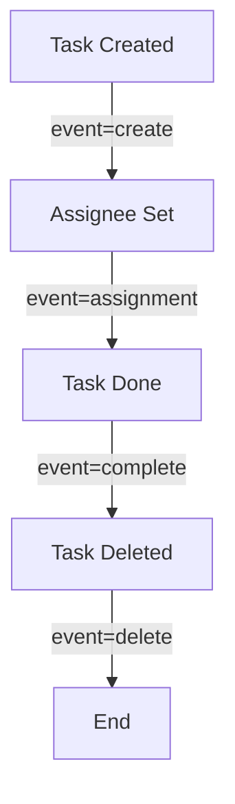

# Task Listeners

Task listeners allow you to **execute custom logic at specific points** in the lifecycle of a user task. They are essential for notifications, auditing, dynamic task configuration, and integration with external systems.

## Overview

```xml
<userTask id="approvalTask" name="Approval">
  <extensionElements>
    <activiti:taskListener
      event="create"
      class="com.example.TaskCreatedListener"
      onTransaction="before-commit"
      customPropertiesResolverClass="com.example.Resolver"/>
    <activiti:taskListener
      event="assignment"
      delegateExpression="${assignmentListener}"
      onTransaction="committed"
      customPropertiesResolverDelegateExpression="${resolverDelegate}"/>
    <activiti:taskListener
      event="complete"
      class="com.example.TaskCompletedListener"
      onTransaction="rolled-back"
      customPropertiesResolverExpression="${resolverExpression}"/>
  </extensionElements>
</userTask>
```

**Key Benefits:**
- Hook into task lifecycle events
- Send notifications
- Dynamic task configuration
- Audit logging
- Integration with external systems
- Available for User Tasks only

**Important Attributes:**
- `event` - The event type (create, assignment, complete, delete, all)
- `class` - Fully qualified class name implementing TaskListener
- `expression` - EL/SpEL expression to evaluate
- `delegateExpression` - Spring bean method call
- `onTransaction` - Transaction timing (before-commit, committed, rolled-back)
- `customPropertiesResolverClass` - Fully qualified class name of the custom properties resolver
- `customPropertiesResolverExpression` - EL/SpEL expression to evaluate for the resolver
- `customPropertiesResolverDelegateExpression` - Expression resolving to a Spring bean implementing the resolver

## Supported Events

Task listeners support **four lifecycle events**:

| Event | When It Fires | Use Cases |
|-------|---------------|-----------|
| `create` | Task is created | Notifications, initial setup, logging |
| `assignment` | Assignee/candidates change | Dynamic routing, notifications |
| `complete` | Task is completed | Audit logging, notifications, cleanup |
| `delete` | Task is deleted | Cleanup, logging |
| `all` | All events | Universal handler |

### Event Timing



## Configuration

### Using Class

Specify a fully qualified class name implementing `TaskListener`:

```xml
<userTask id="task1" name="Task">
  <extensionElements>
    <activiti:taskListener event="create" class="com.example.TaskCreatedListener"/>
  </extensionElements>
</userTask>
```

**Requirements:**
- Class must implement `org.activiti.engine.delegate.TaskListener`
- Class must be in classpath
- Class must have no-arg constructor

### Using Delegate Expression

Reference a Spring bean or expression:

```xml
<userTask id="task1" name="Task">
  <extensionElements>
    <activiti:taskListener event="complete" delegateExpression="${taskCompletionListener}"/>
  </extensionElements>
</userTask>
```

**Requirements:**
- Expression must resolve to `TaskListener` instance
- Works with Spring beans
- Supports SpEL expressions

### Using Expression

Execute a method call directly:

```xml
<userTask id="task1" name="Task">
  <extensionElements>
    <activiti:taskListener event="create" expression="${sendTaskNotification()}"/>
  </extensionElements>
</userTask>
```

**Requirements:**
- Expression must return void
- Method must be accessible
- Useful for simple operations

## Implementation

### Basic TaskListener

```java
public class MyTaskListener implements TaskListener {
    
    @Override
    public void notify(DelegateTask task) {
        // Get task information
        String taskId = task.getId();
        String taskName = task.getName();
        
        // Get task variables
        Object variable = task.getVariable("myVar");
        
        // Set task variables
        task.setVariable("processed", true);
        
        // Get execution
        DelegateExecution execution = task.getExecution();
        
        // Perform custom logic
        processTask(task);
    }
}
```

### Using DelegateTask API

```java
public class ComprehensiveTaskListener implements TaskListener {
    
    @Override
    public void notify(DelegateTask task) {
        // Task identification
        String taskId = task.getId();
        String taskName = task.getName();
        String taskDescription = task.getDescription();
        
        // Task ownership
        String assignee = task.getAssignee();
        // Get candidates (users and groups)
        Set<IdentityLink> candidates = task.getCandidates();
        List<String> candidateUsers = candidates.stream()
            .filter(link -> IdentityLinkType.CANDIDATE.equals(link.getType()) && link.getUserId() != null)
            .map(IdentityLink::getUserId)
            .collect(Collectors.toList());
        List<String> candidateGroups = candidates.stream()
            .filter(link -> IdentityLinkType.CANDIDATE.equals(link.getType()) && link.getGroupId() != null)
            .map(IdentityLink::getGroupId)
            .collect(Collectors.toList());
        
        // Task variables
        Map<String, Object> variables = task.getVariables();
        Object specificVar = task.getVariable("varName");
        
        // Set variables
        task.setVariable("newVar", "value");
        task.setVariables(Map.of("var1", "val1", "var2", "val2"));
        
        // Task execution context
        DelegateExecution execution = task.getExecution();
        
        // Process information
        String processId = execution.getProcessInstanceId();
        String processDefId = execution.getProcessDefinitionId();
        
        // Form key
        String formKey = task.getFormKey();
        
        // Due date and priority
        Date dueDate = task.getDueDate();
        int priority = task.getPriority();
    }
}
```

## Complete Examples

### Example 1: Task Creation Notification

```java
public class TaskCreatedNotificationListener implements TaskListener {
    
    @Autowired
    private NotificationService notificationService;
    
    @Override
    public void notify(DelegateTask task) {
        String assignee = task.getAssignee();
        String taskName = task.getName();
        String taskId = task.getId();
        
        // Send notification to assignee
        if (assignee != null) {
            notificationService.sendEmail(
                assignee,
                "New Task Assigned",
                String.format("You have been assigned task: %s (%s)", taskName, taskId)
            );
        }
        
        // Log task creation
        task.setVariable("createdDate", new Date());
        task.setVariable("createdBy", task.getExecution().getVariable("initiator"));
        
        // Send to candidate users if no assignee
        if (assignee == null) {
            Set<IdentityLink> candidates = task.getCandidates();
            for (IdentityLink link : candidates) {
                if (link.getUserId() != null) {
                    notificationService.sendEmail(
                        link.getUserId(),
                        "New Task Available",
                        String.format("Task available: %s (%s)", taskName, taskId)
                    );
                }
            }
        }
    }
}
```

**BPMN Configuration:**
```xml
<userTask id="approvalTask" name="Approval Task" activiti:assignee="${manager}">
  <extensionElements>
    <activiti:taskListener event="create" class="com.example.TaskCreatedNotificationListener"/>
  </extensionElements>
</userTask>
```

### Example 2: Assignment Change Tracker

```java
public class AssignmentChangeTracker implements TaskListener {
    
    @Override
    public void notify(DelegateTask task) {
        String event = task.getEventName();
        
        if ("assignment".equals(event)) {
            String newAssignee = task.getAssignee();
            String oldAssignee = (String) task.getVariable("previousAssignee");
            
            // Log assignment change
            Map<String, Object> auditLog = new HashMap<>();
            auditLog.put("timestamp", new Date());
            auditLog.put("oldAssignee", oldAssignee);
            auditLog.put("newAssignee", newAssignee);
            auditLog.put("taskId", task.getId());
            
            // Append to audit trail
            List<Map<String, Object>> auditTrail = 
                (List<Map<String, Object>>) task.getVariable("assignmentAuditTrail");
            
            if (auditTrail == null) {
                auditTrail = new ArrayList<>();
            }
            
            auditTrail.add(auditLog);
            task.setVariable("assignmentAuditTrail", auditTrail);
            
            // Update previous assignee
            task.setVariable("previousAssignee", newAssignee);
            
            // Send notification about reassignment
            if (oldAssignee != null && !oldAssignee.equals(newAssignee)) {
                sendReassignmentNotification(oldAssignee, newAssignee, task.getName());
            }
        }
    }
    
    private void sendReassignmentNotification(String oldAssignee, String newAssignee, String taskName) {
        // Implementation for sending reassignment notification
    }
}
```

**BPMN Configuration:**
```xml
<userTask id="reassignableTask" name="Reassignable Task">
  <extensionElements>
    <activiti:taskListener event="assignment" class="com.example.AssignmentChangeTracker"/>
  </extensionElements>
</userTask>
```

### Example 3: Task Completion Audit

```java
public class TaskCompletionAuditor implements TaskListener {
    
    @Autowired
    private AuditService auditService;
    
    @Override
    public void notify(DelegateTask task) {
        String taskId = task.getId();
        String taskName = task.getName();
        String assignee = task.getAssignee();
        
        // Get completion time
        Date completionTime = new Date();
        Date createTime = (Date) task.getVariable("createdDate");
        
        // Calculate duration
        long durationMillis = completionTime.getTime() - createTime.getTime();
        long durationMinutes = durationMillis / (1000 * 60);
        
        // Get task variables
        Map<String, Object> taskVariables = task.getVariables();
        
        // Create audit record
        AuditRecord auditRecord = new AuditRecord();
        auditRecord.setTaskId(taskId);
        auditRecord.setTaskName(taskName);
        auditRecord.setAssignee(assignee);
        auditRecord.setCompletionTime(completionTime);
        auditRecord.setDurationMinutes(durationMinutes);
        auditRecord.setTaskVariables(taskVariables);
        
        // Save to audit service
        auditService.saveAuditRecord(auditRecord);
        
        // Send completion notification
        sendCompletionNotification(task);
        
        // Update process variables
        task.getExecution().setVariable("lastCompletedTask", taskName);
        task.getExecution().setVariable("lastCompletionTime", completionTime);
    }
    
    private void sendCompletionNotification(DelegateTask task) {
        // Implementation for sending completion notification
    }
}
```

**BPMN Configuration:**
```xml
<userTask id="auditedTask" name="Audited Task">
  <extensionElements>
    <activiti:taskListener event="complete" class="com.example.TaskCompletionAuditor"/>
  </extensionElements>
</userTask>
```

### Example 4: Dynamic Task Configuration

```java
public class DynamicTaskConfigurer implements TaskListener {
    
    @Override
    public void notify(DelegateTask task) {
        String eventName = task.getEventName();
        
        if ("create".equals(eventName)) {
            // Set dynamic due date based on task priority
            Object priority = task.getVariable("taskPriority");
            
            if ("HIGH".equals(priority)) {
                // Due in 4 hours
                Calendar cal = Calendar.getInstance();
                cal.add(Calendar.HOUR, 4);
                task.setDueDate(cal.getTime());
                task.setPriority(1);
            } else if ("MEDIUM".equals(priority)) {
                // Due in 2 days
                Calendar cal = Calendar.getInstance();
                cal.add(Calendar.DAY_OF_MONTH, 2);
                task.setDueDate(cal.getTime());
                task.setPriority(5);
            } else {
                // Due in 5 days
                Calendar cal = Calendar.getInstance();
                cal.add(Calendar.DAY_OF_MONTH, 5);
                task.setDueDate(cal.getTime());
                task.setPriority(10);
            }
            
            // Set dynamic form key based on task type
            String taskType = (String) task.getVariable("taskType");
            if ("APPROVAL".equals(taskType)) {
                task.setFormKey("approval-form.html");
            } else if ("REVIEW".equals(taskType)) {
                task.setFormKey("review-form.html");
            }
            
            // Add candidate groups based on department
            String department = (String) task.getVariable("department");
            if (department != null) {
                task.addCandidateGroup(department + "-managers");
            }
        }
    }
}
```

**BPMN Configuration:**
```xml
<userTask id="dynamicTask" name="Dynamic Task">
  <extensionElements>
    <activiti:taskListener event="create" class="com.example.DynamicTaskConfigurer"/>
  </extensionElements>
</userTask>
```

### Example 5: Multi-Event Handler

```java
public class UniversalTaskHandler implements TaskListener {
    
    @Override
    public void notify(DelegateTask task) {
        String eventName = task.getEventName();
        
        switch (eventName) {
            case "create":
                handleTaskCreation(task);
                break;
                
            case "assignment":
                handleTaskAssignment(task);
                break;
                
            case "complete":
                handleTaskCompletion(task);
                break;
                
            case "delete":
                handleTaskDeletion(task);
                break;
                
            default:
                logger.warn("Unknown task event: " + eventName);
        }
    }
    
    private void handleTaskCreation(DelegateTask task) {
        logger.info("Task created: " + task.getName());
        task.setVariable("createdDate", new Date());
    }
    
    private void handleTaskAssignment(DelegateTask task) {
        logger.info("Task assigned to: " + task.getAssignee());
    }
    
    private void handleTaskCompletion(DelegateTask task) {
        logger.info("Task completed: " + task.getName());
        Date createdDate = (Date) task.getVariable("createdDate");
        long duration = System.currentTimeMillis() - createdDate.getTime();
        logger.info("Task duration: " + duration + "ms");
    }
    
    private void handleTaskDeletion(DelegateTask task) {
        logger.info("Task deleted: " + task.getName());
    }
}
```

**BPMN Configuration:**
```xml
<userTask id="multiEventTask" name="Multi-Event Task">
  <extensionElements>
    <activiti:taskListener event="all" class="com.example.UniversalTaskHandler"/>
  </extensionElements>
</userTask>
```

## Event-Specific Patterns

### Create Event Patterns

**1. Initial Setup**
```java
public class InitialSetupListener implements TaskListener {
    @Override
    public void notify(DelegateTask task) {
        // Set default values
        task.setVariable("status", "PENDING");
        task.setVariable("attemptCount", 0);
        task.setVariable("createdDate", new Date());
        
        // Initialize collections
        task.setVariable("comments", new ArrayList<>());
        task.setVariable("attachments", new ArrayList<>());
    }
}
```

**2. Notification**
```java
public class TaskNotificationListener implements TaskListener {
    @Override
    public void notify(DelegateTask task) {
        String assignee = task.getAssignee();
        if (assignee != null) {
            sendNotification(assignee, "New task assigned: " + task.getName());
        }
    }
}
```

### Assignment Event Patterns

**1. Reassignment Tracking**
```java
public class ReassignmentTracker implements TaskListener {
    @Override
    public void notify(DelegateTask task) {
        String newAssignee = task.getAssignee();
        String oldAssignee = (String) task.getVariable("lastAssignee");
        
        if (!newAssignee.equals(oldAssignee)) {
            logReassignment(oldAssignee, newAssignee, task.getId());
            task.setVariable("lastAssignee", newAssignee);
            task.setVariable("reassignmentCount",
                (task.getVariable("reassignmentCount") == null ? 0 : (Integer) task.getVariable("reassignmentCount")) + 1);
        }
    }
}
```

**2. SLA Reset**
```java
public class SLAResetListener implements TaskListener {
    @Override
    public void notify(DelegateTask task) {
        // Reset SLA timer on reassignment
        Calendar cal = Calendar.getInstance();
        cal.add(Calendar.HOUR, 24);
        task.setDueDate(cal.getTime());
        task.setVariable("slaResetCount",
            (task.getVariable("slaResetCount") == null ? 0 : (Integer) task.getVariable("slaResetCount")) + 1);
    }
}
```

### Complete Event Patterns

**1. Performance Tracking**
```java
public class PerformanceTracker implements TaskListener {
    @Override
    public void notify(DelegateTask task) {
        Date createdDate = (Date) task.getVariable("createdDate");
        Date completedDate = new Date();
        
        long duration = completedDate.getTime() - createdDate.getTime();
        
        task.getExecution().setVariable("taskDuration", duration);
        task.getExecution().setVariable("lastCompletedTask", task.getName());
        
        // Update user statistics
        String assignee = task.getAssignee();
        updateUserStats(assignee, duration);
    }
}
```

**2. Approval Aggregation**
```java
public class ApprovalAggregator implements TaskListener {
    @Override
    public void notify(DelegateTask task) {
        Boolean approved = (Boolean) task.getVariable("approved");
        
        List<Boolean> approvals = (List<Boolean>) 
            task.getExecution().getVariable("allApprovals");
        
        if (approvals == null) {
            approvals = new ArrayList<>();
        }
        
        approvals.add(approved);
        task.getExecution().setVariable("allApprovals", approvals);
        
        // Check if all approvals collected
        int requiredApprovals = ((Integer) task.getExecution().getVariable("requiredApprovals")).intValue();
        if (approvals.size() >= requiredApprovals) {
            boolean allApproved = approvals.stream().allMatch(a -> a == true);
            task.getExecution().setVariable("finalDecision", allApproved);
        }
    }
}
```

### Delete Event Patterns

**1. Cleanup**
```java
public class TaskCleanupListener implements TaskListener {
    @Override
    public void notify(DelegateTask task) {
        // Clean up temporary files
        String tempDir = (String) task.getVariable("tempDirectory");
        if (tempDir != null) {
            deleteDirectory(tempDir);
        }
        
        // Release resources
        releaseTaskResources(task.getId());
        
        // Log deletion
        auditService.logTaskDeletion(task.getId(), task.getName());
    }
}
```

## Best Practices

### 1. Keep Listeners Focused

```java
// GOOD: Single responsibility
public class NotificationListener implements TaskListener {
    @Override
    public void notify(DelegateTask task) {
        sendNotification(task);
    }
}

// BAD: Multiple responsibilities
public class DoEverythingListener implements TaskListener {
    @Override
    public void notify(DelegateTask task) {
        sendNotification(task);
        logAudit(task);
        updateMetrics(task);
        cleanupResources(task);
        // ... more
    }
}
```

### 2. Handle Exceptions Properly

```java
public class SafeTaskListener implements TaskListener {
    @Override
    public void notify(DelegateTask task) {
        try {
            processTask(task);
        } catch (Exception e) {
            logger.error("Task listener failed", e);
            // Don't let listener failure break task lifecycle
            // Consider setting error variable for monitoring
            task.setVariable("listenerError", e.getMessage());
        }
    }
}
```

### 3. Use Appropriate Event

```xml
<!-- GOOD: Right event for right action -->
<userTask id="task1">
  <extensionElements>
    <activiti:taskListener event="create" class="NotificationListener"/>
    <activiti:taskListener event="complete" class="AuditListener"/>
  </extensionElements>
</userTask>

<!-- BAD: Wrong event -->
<userTask id="task2">
  <extensionElements>
    <activiti:taskListener event="complete" class="NotificationListener"/>
    <!-- Notification sent too late! -->
  </extensionElements>
</userTask>
```

### 4. Minimize Variable Access

```java
// GOOD: Access only needed variables
public class EfficientListener implements TaskListener {
    @Override
    public void notify(DelegateTask task) {
        String assignee = task.getAssignee();
        // Use assignee directly
    }
}

// BAD: Load all variables unnecessarily
public class InefficientListener implements TaskListener {
    @Override
    public void notify(DelegateTask task) {
        Map<String, Object> allVars = task.getVariables(); // Expensive!
        String assignee = task.getAssignee();
    }
}
```

### 5. Document Listener Purpose

```java
/**
 * Sends email notification when task is assigned to a user.
 * Triggers on 'create' event only.
 * Requires: assignee to be set
 * Side effects: Sends email, sets 'notified' variable
 */
public class AssignmentNotificationListener implements TaskListener {
    // Implementation
}
```

## Common Pitfalls

### 1. Modifying Task During Iteration

```java
// BAD: Modifying candidates while iterating
public class BadListener implements TaskListener {
    @Override
    public void notify(DelegateTask task) {
        for (IdentityLink link : task.getCandidates()) {
            if (link.getUserId() != null) {
                task.addCandidateUser(link.getUserId() + "_backup"); // ConcurrentModificationException!
            }
        }
    }
}

// GOOD: Collect changes first, then apply
public class GoodListener implements TaskListener {
    @Override
    public void notify(DelegateTask task) {
        List<String> newCandidates = new ArrayList<>();
        for (IdentityLink link : task.getCandidates()) {
            if (link.getUserId() != null) {
                newCandidates.add(link.getUserId() + "_backup");
            }
        }
        for (String newCandidate : newCandidates) {
            task.addCandidateUser(newCandidate);
        }
    }
}
```

### 2. Assuming Event Order

```java
// BAD: Assuming create happens before assignment
public class OrderDependentListener implements TaskListener {
    @Override
    public void notify(DelegateTask task) {
        // This might fail if assignment listener runs first
        String createdDate = (String) task.getVariable("createdDate");
    }
}

// GOOD: Check variable existence
public class SafeListener implements TaskListener {
    @Override
    public void notify(DelegateTask task) {
        if (task.hasVariable("createdDate")) {
            String createdDate = (String) task.getVariable("createdDate");
        }
    }
}
```

### 3. Blocking Task Operations

```java
// BAD: Long-running operation in listener
public class BlockingListener implements TaskListener {
    @Override
    public void notify(DelegateTask task) {
        externalApi.callWithTimeout(30000); // Blocks task completion!
    }
}

// GOOD: Async operation
public class NonBlockingListener implements TaskListener {
    @Override
    public void notify(DelegateTask task) {
        executorService.submit(() -> {
            externalApi.callWithTimeout(30000);
        });
    }
}
```

### 4. Not Checking Event Type

```java
// BAD: Assuming specific event
public class AssumptionListener implements TaskListener {
    @Override
    public void notify(DelegateTask task) {
        // Only makes sense for 'complete' event
        logCompletion(task);
    }
}

// GOOD: Check event type
public class EventAwareListener implements TaskListener {
    @Override
    public void notify(DelegateTask task) {
        if ("complete".equals(task.getEventName())) {
            logCompletion(task);
        }
    }
}
```

## Troubleshooting

### Listener Not Firing

**Problem:** Task listener doesn't execute

**Solutions:**
1. Verify event name is correct
2. Check class is in classpath
3. Ensure TaskListener interface is implemented
4. Verify no exceptions in previous listeners
5. Check listener order if multiple listeners

### Exception in Listener

**Problem:** Listener throws exception

**Solutions:**
1. Add try-catch blocks
2. Log exceptions properly
3. Don't let exceptions break task lifecycle
4. Set error variables for monitoring

### Performance Issues

**Problem:** Listeners slow down task operations

**Solutions:**
1. Move heavy operations to async
2. Minimize database calls
3. Cache frequently accessed data
4. Use appropriate event (don't use 'all' if not needed)

## Related Documentation

- [User Task](../elements/user-task.md) - User task configuration
- [Execution Listeners](../common-features.md#execution-listeners) - Activity-level listeners
- [Common Features](../common-features.md) - Other BPMN extensions
- [Variables](./variables.md) - Task variables

---

