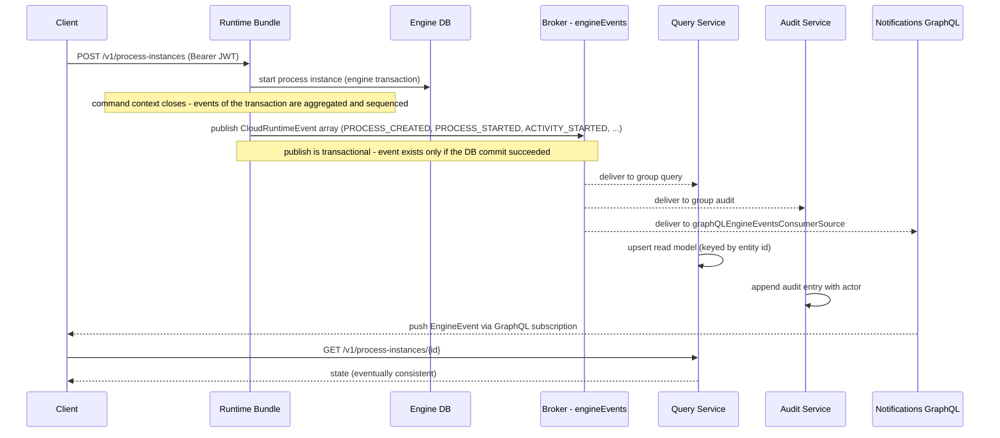

# Event-Driven Design

All communication in Activiti Cloud happens over a message broker. Messaging is built on **Spring Cloud Stream** functional bindings, configured by the `activiti-cloud-service-messaging-config` and `activiti-cloud-service-messaging-starter` modules. Every service declares `@InputBinding` / `@OutputBinding` channels; those channels are bound to broker destinations whose names follow a fixed convention.

This page documents the event model, the destination topology, broker options, ordering and delivery semantics, and error handling.

## The Event Model

The runtime bundle converts every engine audit event into a **`CloudRuntimeEvent`** (`org.activiti.cloud.api.model.shared.events.CloudRuntimeEvent`) and publishes it to the broker. An event is a JSON object with:

| Field | Meaning |
|-------|---------|
| `id` | Unique event id. |
| `timestamp` | When the event occurred (milliseconds). |
| `eventType` | One of `CloudRuntimeEventType` (below). |
| `entityId` | Id of the entity the event is about (process instance, task, variable, activity). |
| `entity` | The entity payload: `CloudProcessInstance`, `CloudBPMNActivity`, `CloudServiceTask`, `VariableInstance`, `CloudTask`, ... |
| `appName` | Value of `activiti.cloud.application.name` on the runtime bundle. |
| `appVersion` | Value of `activiti.cloud.application.version`. |
| `serviceName` | Value of `spring.application.name` on the runtime bundle. |
| `serviceFullName` | Currently the same as `serviceName`. |
| `serviceType` | `activiti.cloud.service.type` (the runtime bundle sets `runtime-bundle`). |
| `serviceVersion` | `activiti.cloud.service.version`. |
| `actor` | The user who caused the action; `service_user` for unauthenticated engine actions. See [Identity & Security](./identity.md). |
| `messageId` | Id of the message carrying the event; events produced by one engine transaction share it. |
| `sequenceNumber` | Position of the event inside that transaction's aggregation. |

Events are **aggregated per engine transaction**: when the command context closes, all events fired in that transaction are collected, ordered by `sequenceNumber`, and published as a JSON array (`application/json`) on the `auditProducer` channel. By default (`activiti.cloud.runtime-bundle.events-properties.chunk-size-in-bytes-close-listener=0`) the whole transaction is one array; when that property is set above `0`, the `EventChunker` splits the aggregation into chunks of at most that many bytes. (A separate count-based `events-properties.chunk-size`, default `100`, applies only to chunking the definition list in `PROCESS_DEPLOYED` events.)

### Message headers

Messages carry routing and filtering headers (constants in `CloudRuntimeEventMessageHeaders` and `ExecutionContextMessageHeaders`):

| Header | Content |
|--------|---------|
| `eventType` | Event type name (per event). |
| `messagePayloadType` | Payload type discriminator. |
| `processInstanceId`, `parentProcessInstanceId` | The affected process instances (per event). |
| `processDefinitionKey`, `processDefinitionVersion` | Definition coordinates (per event). |
| `businessKey` | Business key of the process instance (per event). |
| `rootProcessInstanceId` | Root instance; used as the partition key in partitioned mode (see below). |
| `rootProcessName`, `rootBusinessKey`, `rootProcessDefinitionId`, `rootProcessDefinitionKey`, `rootProcessDefinitionVersion`, `rootProcessDefinitionName` | Coordinates of the root process instance and definition (per message). |
| `deploymentId`, `deploymentName`, `deploymentVersion` | Deployment the definition came from. |
| `parentProcessInstanceId`, `parentProcessInstanceName` | The parent instance, for subprocesses. |
| `routingKey` | Event routing key, set by the partitioned producer. |

### Event types

The `CloudRuntimeEventType` enum (`org.activiti.cloud.api.events`) has 45 values:

| Group | Types |
|-------|-------|
| Process | `PROCESS_CREATED`, `PROCESS_STARTED`, `PROCESS_SUSPENDED`, `PROCESS_RESUMED`, `PROCESS_COMPLETED`, `PROCESS_CANCELLED`, `PROCESS_UPDATED`, `PROCESS_DELETED`, `PROCESS_DEPLOYED` |
| Activity | `ACTIVITY_STARTED`, `ACTIVITY_COMPLETED`, `ACTIVITY_CANCELLED`, `SEQUENCE_FLOW_TAKEN` |
| Task | `TASK_CREATED`, `TASK_ACTIVATED`, `TASK_ASSIGNED`, `TASK_COMPLETED`, `TASK_CANCELLED`, `TASK_SUSPENDED`, `TASK_UPDATED`, `TASK_CANDIDATE_USER_ADDED`, `TASK_CANDIDATE_USER_REMOVED`, `TASK_CANDIDATE_GROUP_ADDED`, `TASK_CANDIDATE_GROUP_REMOVED` |
| Timer | `TIMER_SCHEDULED`, `TIMER_FIRED`, `TIMER_EXECUTED`, `TIMER_CANCELLED`, `TIMER_FAILED`, `TIMER_RETRIES_DECREMENTED` |
| Variable | `VARIABLE_CREATED`, `VARIABLE_UPDATED`, `VARIABLE_DELETED` |
| Message | `MESSAGE_WAITING`, `MESSAGE_RECEIVED`, `MESSAGE_SENT`, `MESSAGE_SUBSCRIPTION_CANCELLED`, `START_MESSAGE_DEPLOYED` |
| Signal | `SIGNAL_RECEIVED` |
| Integration | `INTEGRATION_REQUESTED`, `INTEGRATION_RESULT_RECEIVED`, `INTEGRATION_ERROR_RECEIVED`, `ERROR_RECEIVED` |
| Application | `APPLICATION_DEPLOYED`, `APPLICATION_ROLLBACK` |

In addition to the `CloudRuntimeEventType` values above, the same `engineEvents` destination also carries these wire event types:

| Group | Types |
|-------|-------|
| Process candidate starters | `PROCESS_CANDIDATE_STARTER_USER_ADDED`, `PROCESS_CANDIDATE_STARTER_USER_REMOVED`, `PROCESS_CANDIDATE_STARTER_GROUP_ADDED`, `PROCESS_CANDIDATE_STARTER_GROUP_REMOVED` |
| Incidents | `INCIDENT_CREATED` |

The four process candidate starter types are emitted by the runtime bundle's candidate starter producers (`CloudProcessCandidateStarterUserAddedProducer`, `CloudProcessCandidateStarterGroupAddedProducer`) on the `auditProducer` channel. `INCIDENT_CREATED` is published by the runtime bundle's `IncidentService` on the `auditProducerIncidents` binding (default destination `engineEvents`) and consumed by the audit service's `IncidentCreatedEventConverter`.

Consumers filter on `eventType` plus the headers above. The notifications-graphql service exposes its own `EngineEventType` GraphQL enum with 40 of these 45 values — `PROCESS_DELETED`, `ERROR_RECEIVED`, `START_MESSAGE_DEPLOYED`, `APPLICATION_DEPLOYED`, and `APPLICATION_ROLLBACK` have no subscription counterpart.

## Destinations (Topics)

### Naming convention

Destination names on the broker are derived from Spring Cloud Stream binding names by `ActivitiMessagingDestinationTransformer`:

```text
destination = prefix + separator + name [+ separator + scope]
```

Defaults: `prefix` is empty and `separator` is `_`, so the default destination is just the base name (for example `engineEvents`). A *scope* appends an application identifier so that per-application destinations are isolated; the scoped bindings are the command, message, and job destinations, scoped by `activiti.cloud.application.name` (the runtime bundle's application name) or, for integration results, by `spring.application.name`.

Everything is overridable:

- `spring.cloud.stream.bindings.<binding>.destination` — the base destination for a binding.
- `activiti.cloud.messaging.destinations.<name>.name|prefix|separator|scope` — per-destination overrides.
- Environment variables such as `ACT_RB_AUDIT_PRODUCER_DEST`, documented in the tables below.
- `activiti.cloud.messaging.destination-prefix` / `destination-separator` — global prefix and separator.
- `activiti.cloud.messaging.destination-transformers` (enabled by `destination-transformers-enabled`) — applies registered functions such as `toLowerCase` and `escapeIllegalChars` to every destination name.

### Destination topology

Bindings are declared in code (`@OutputBinding`/`@InputBinding` channel interfaces); the table below lists each binding, its default destination (base name), the override variable, its scope, and who produces and consumes it.

| Binding | Default destination | Override | Scope | Producer | Consumer |
|---------|--------------------|----------|-------|----------|----------|
| `auditProducer` | `engineEvents` | `ACT_RB_AUDIT_PRODUCER_DEST` | — | runtime bundle (event module) | query, audit, notifications-graphql |
| `auditProducerIncidents` | `engineEvents` | `ACT_RB_AUDIT_PRODUCER_INCIDENTS_DEST` | — | runtime bundle (incident events) | query, audit, notifications-graphql |
| `queryConsumer` | `engineEvents` | `ACT_QUERY_CONSUMER_DEST` | — | — | query service |
| `auditConsumer` | `engineEvents` | `ACT_AUDIT_CONSUMER_DEST` | — | — | audit service |
| `graphQLEngineEventsConsumerSource` | `engineEvents` | — | — | — | notifications-graphql service |
| `signalProducer` / `signalConsumer` | `signalEvent` | `ACT_RB_SIG_EVT_DEST` | — | runtime bundle (subscriptions) | runtime bundle |
| `commandConsumer` | `commandConsumer` | `ACT_RB_COMMAND_CONSUMER_DEST` | `activiti.cloud.application.name` | runtime gateway, messages service, external callers | runtime bundle (group: `spring.application.name`) |
| `commandResults` | `commandResults` | `ACT_RB_CMD_RES_DEST` | `activiti.cloud.application.name` | runtime bundle | runtime gateway (`ProcessRuntimeGatewayResults`) |
| `messageEventsOutput` | `messageEvents` | `ACT_RB_MSG_EVT_DEST` | `activiti.cloud.application.name` | runtime bundle (messages-events) | messages service (group `messages`) |
| `messageConnectorInput` | `messageEvents` | — | `activiti.cloud.application.name` | — | messages service |
| `asyncExecutorJobsOutput` / `asyncExecutorJobsInput` | `asyncExecutorJobs` | `ACT_RB_ASYNC_JOB_EXEC_DEST` | `activiti.cloud.application.name` | message-based job manager | async job executor inside the runtime bundle |
| `integrationResultsConsumer` | `integrationResult` | `ACT_INT_RES_CONSUMER` | `spring.application.name` (runtime bundle) | connectors | runtime bundle (connectors module) |
| `integrationErrorsConsumer` | `integrationError` | `ACT_INT_ERR_CONSUMER` | `spring.application.name` (runtime bundle) | connectors | runtime bundle (connectors module) |
| connector inputs (e.g. `example-connector`) | per connector (e.g. `mealsConnector`, `rest.GET`) | `spring.cloud.stream.bindings.<channel>.destination` | — | runtime bundle (integration requests) | connector applications |

Notes:

- The `commandConsumer`/`commandResults` pair is a request/reply channel: the runtime gateway publishes commands to `commandConsumer_<appName>` and reads replies from `commandResults_<appName>` (reply timeout `activiti.cloud.process-runtime-gateway.reply-timeout`, default 30 seconds). The messages service uses the same `commandConsumer_<appName>` destination to deliver correlated messages to a process instance.
- For integration flows, the runtime bundle resolves the concrete result/error destinations at request time and embeds them in the `IntegrationRequest` payload (`resultDestination`, `errorDestination`), so a connector always replies exactly where the runtime bundle listens.
- `engineEvents` and `signalEvent` are shared by many consumers with no scope; each consumer joins the destination with its own consumer group (`query`, `audit`, ...).

### RabbitMQ group durability

The `auditProducer` binding is configured with `producer.required-groups` defaulting to `query,audit` (env vars `ACT_QUERY_CONSUMER_GROUP`, `ACT_AUDIT_CONSUMER_GROUP`). With the RabbitMQ binder this creates a durable queue per required consumer group, which guarantees that consumers which start *after* an event was published still receive it. This is what makes the read sides rebuildable.

## Broker Options

`activiti.cloud.messaging.broker` selects the broker (values `rabbitmq`, `kafka`, `aws`); an `EnvironmentPostProcessor` maps it to `spring.cloud.stream.default-binder` (`rabbit`, `kafka`, or `aws`) and disables the Rabbit health check when Rabbit is not in use. The Rabbit and Kafka binders are both shipped by the messaging starter, so switching brokers is a configuration change plus the broker being available.

| Property | Default | Environment variable |
|----------|---------|----------------------|
| `activiti.cloud.messaging.broker` | `rabbitmq` | `ACT_MESSAGING_BROKER` |
| `activiti.cloud.messaging.partitioned` | `false` | `ACT_MESSAGING_PARTITIONED` |
| `activiti.cloud.messaging.partition-count` | `1` | `ACT_MESSAGING_PARTITION_COUNT` |
| `activiti.cloud.messaging.instance-index` | `0` | `ACT_MESSAGING_INSTANCE_INDEX` |
| `activiti.cloud.messaging.destination-separator` | `_` | `ACT_MESSAGING_DEST_SEPARATOR` |
| `activiti.cloud.messaging.destination-prefix` | *(empty)* | `ACT_MESSAGING_DEST_PREFIX` |
| `activiti.cloud.messaging.destination-transformers-enabled` | `false` | `ACT_MESSAGING_DEST_TRANSFORMERS_ENABLED` |
| `activiti.cloud.messaging.destination-transformers` | `toLowerCase,escapeIllegalChars` | `ACT_MESSAGING_DEST_TRANSFORMERS` |
| `activiti.cloud.messaging.rabbitmq.compress` | `false` | — (mapped to `spring.cloud.stream.rabbit.default.producer.compress`) |
| `activiti.cloud.messaging.rabbitmq.compression-level` | `1` | — (mapped to `spring.cloud.stream.rabbit.binder.compression-level`) |
| `activiti.cloud.messaging.rabbitmq.prefix` | *(empty)* | — (prefix for Rabbit producer/consumer names) |
| `activiti.cloud.messaging.rabbitmq.missing-anonymous-queues-fatal` | `true` | — |
| `activiti.cloud.messaging.rabbitmq.missing-durable-queues-fatal` | `true` | — |
| `spring.cloud.stream.rabbit.bindings.auditProducer.producer.transacted` | `true` | `ACT_AUDIT_PRODUCER_TRANSACTED` |
| `spring.cloud.stream.kafka.binder.transaction.transactionIdPrefix` | `tx-` | `ACT_AUDIT_PRODUCER_TRANSACTION_ID_PREFIX` |

### Partitioning and ordering

The platform's ordering concern is **per process instance**, and the partitioned mode exists to pin events of one process instance to a partition so that ordering survives multi-partition consumers. The local development tooling calls this the `-pt` (partitioned) flag.

- When `activiti.cloud.messaging.partitioned=true`, the runtime bundle's `EnvironmentPostProcessor` enables partitioned production on the `auditProducer` binding: it sets a partition key extractor and the partition count from `activiti.cloud.messaging.partition-count`.
- The partition key is the **`rootProcessInstanceId` message header**; if a message has no root process instance, a random UUID is used. All events of one process instance therefore land on the same partition, and within a partition the broker preserves publication order.
- The query and audit consumer starters mirror this: they set `spring.cloud.stream.bindings.<binding>.consumer.partitioned` from the same flag and take `spring.cloud.stream.instanceIndex` / `spring.cloud.stream.instanceCount` from `activiti.cloud.messaging.instance-index` and `partition-count`, so N consumer instances split the N partitions.
- Consumer concurrency is controlled per consumer: `spring.cloud.stream.bindings.queryConsumer.consumer.concurrency` (env var `ACT_QUERY_CONSUMER_CONCURRENCY`, default `1`) and, on Rabbit, `spring.cloud.stream.rabbit.bindings.queryConsumer.consumer.prefetch` (env var `ACT_QUERY_CONSUMER_RABBIT_PREFETCH`, default `20`).

Consequences:

- **Non-partitioned** (default): there is no broker-enforced ordering. With RabbitMQ, each consumer group gets a single queue, so delivery to a given consumer is FIFO; with Kafka, messages without a partition key are distributed round-robin across partitions, so events of one process instance can land in different partitions and be consumed out of order.
- **Partitioned**: scale the read side by increasing `partition-count` and running that many consumer instances (each with its own `instance-index`). Ordering is guaranteed *per root process instance*; different instances are still independent.

### Delivery semantics

- **Publisher side — transactional.** On Rabbit, `auditProducer` publishes in a broker transaction tied to the engine transaction (`...producer.transacted=true`); on Kafka, the audit producer uses Kafka transactions (transaction id prefix `tx-`). An event reaches the broker **only if the engine commit succeeded**, so there are no "orphan" events with no corresponding state change.
- **Consumer side — at-least-once.** Consumers process a message and then acknowledge it. A crash between processing and acknowledging, or a broker redelivery, means the consumer can receive the same event twice, so consumers must tolerate duplicates. The two built-in consumers handle this differently: the query service's event handlers update state keyed by entity id (a repeated event that is already reflected changes nothing), while the audit service stores events as-is and its schema does not enforce uniqueness on `event_id`, so a redelivered event appears as a duplicate row.
- **Late consumers.** Because `engineEvents` is published to durable per-group queues (Rabbit `required-groups`), a query or audit service that is down while processes run still receives the missed events on restart. The same rebuild-from-stream property applies on Kafka via topic retention.

## Error Handling

**Consumer failures.** Messaging error handling is delegated to Spring Cloud Stream error handlers. The platform exposes `spring.cloud.stream.default.error-handler-definition` and, for the function router, `activiti.cloud.messaging.function-router.error-handler-definition` (which defaults to whatever the former resolves to, usually unset). There is no built-in dead-letter queue in the platform: what happens to a poison message (an event that keeps failing) depends on the error handler you configure — log-and-continue, retry, or rethrow (which blocks the partition and surfaces as a consumer outage). Plan for idempotent consumers plus a handler that logs and moves on, and alert on consumer lag.

**Function router.** The runtime bundle can route consumer bindings through a function router (`activiti.cloud.messaging.function-router.enabled`, default `false` in the runtime bundle starter). It retries failed function invocations with `activiti.cloud.messaging.function-router.max-retries` (default `3`) at `retry-interval` (default `10ms`), under consumer group `activiti.cloud.messaging.function-router.group` — the runtime bundle starter sets this to `${spring.application.name}`; the Java-level fallback is `function-router`.

**Connector failures.** The connector starter configures `spring.cloud.stream.default.error-handler-definition=integrationRequestErrorChannelListener`. A failed `IntegrationRequest` is converted into an `IntegrationError` and published to the runtime bundle's `integrationError` destination. The runtime bundle then emits an `INTEGRATION_ERROR_RECEIVED` event and drives BPMN error handling (error boundary events, error end events). Connectors can also retry at the binding level: `@ConnectorBinding(retry = n, retryDelay = s)` on the connector class, with platform defaults `activiti.connector.retry.default.max` (default `-1`, no retry) and `activiti.connector.retry.default.delay` (default `0` seconds).

**REST failures.** The `CommonExceptionHandler` advice in the error-handlers module maps engine exceptions to REST responses: not found to `404`, illegal state to `400`, forbidden to `403`, as JSON `ActivitiErrorMessage` payloads.

## Event Flow: Process Instance Start



## What This Means for Your Architecture

- **Eventual consistency, by design.** After a successful write to the runtime bundle, the query and audit services converge shortly after. Do not read state from the query service immediately after a write in the same request; if you need the write result, use the response returned by the runtime bundle call.
- **Query the right service.** Use the runtime bundle for commands and the authoritative "just happened" state; the query service for searching and listing (the standard read API); the audit service for the immutable, actor-attributed history; the notifications-graphql service for push; the messages service is transparent — you send messages to processes and it does the correlation.
- **Replay is possible.** Because the audit service is append-only and the broker retains events for consumer groups, a read model can be rebuilt by re-consuming the stream. Treat `engineEvents` as a durable log, not a fire-and-forget topic.
- **Scaling.** Scale the runtime bundle for throughput of process execution; scale query/audit independently by raising `partition-count` and running matching consumer instances. Cross-instance ordering is never guaranteed — design clients that do not depend on a global event order.
- **Resilience.** A dead read-side service degrades visibility, not execution: processes keep running and events accumulate in their groups. Monitor consumer lag per group as your primary health signal.

## Related

- [Architecture Overview](./overview.md)
- [Identity & Security](./identity.md)
- [Connectors](../connectors/overview.md)
