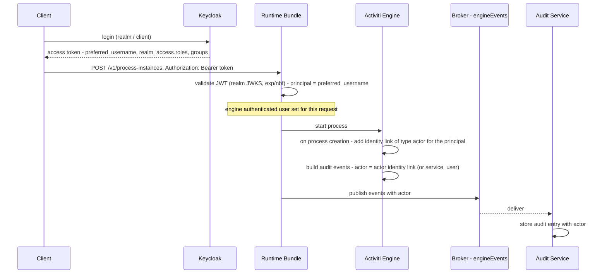

# Identity & Security

Activiti Cloud has no built-in user store. Every service is an **OAuth2 resource server**: it validates the bearer token sent by clients and trusts the identity claims in it. The default identity provider is **Keycloak** (selected by `activiti.cloud.services.oauth2.iam-name=keycloak`, the built-in default), and the platform ships two common modules for it:

- `activiti-cloud-services-common-security` — the generic security auto-configuration: Spring Security filter chain, JWT validation, the `SecurityManager` that the engine uses to ask "who am I", Feign token relay.
- `activiti-cloud-services-common-security-keycloak` + `activiti-cloud-services-common-identity-keycloak` — the Keycloak adapters: claim parsing, OAuth2 client registration, and a Keycloak admin API client for user/group management.

## How a REST Call Carries Identity

A client authenticates against Keycloak (any flow — confidential or public client) and calls the service with the access token:

```bash
curl -H "Authorization: Bearer <access-token>" \
     http://runtime-bundle:8080/v1/process-instances
```

The service then:

1. Validates the token with the Spring Security OAuth2 resource server. The issuer and JWK set are derived from the Keycloak location:
   - `spring.security.oauth2.resourceserver.jwt.issuer-uri` = `{keycloak.auth-server-url}/realms/{keycloak.realm}`
   - `spring.security.oauth2.resourceserver.jwt.jwk-set-uri` = `{keycloak.auth-server-url}/realms/{keycloak.realm}/protocol/openid-connect/certs`
   - Token expiry and "not before" checks allow a clock-skew offset from `authorization.validation.offset` (default `0`).
2. Converts the `Jwt` to a principal. The **principal name is the `preferred_username` claim** (read by `KeycloakJwtAdapter`; the `keycloak.principal-attribute` property, default `preferred-username`, is a legacy compatibility property that does not drive name resolution).
3. Extracts roles and groups with a `JwtAdapter`:
   - `KeycloakJwtAdapter` (default): roles from the `realm_access.roles` claim, groups from the `groups` claim, scopes from `scope`.
   - `KeycloakResourceJwtAdapter` (when `keycloak.use-resource-role-mappings=true`): roles and permissions from the `resource_access.{keycloak.resource}` claim — i.e. client (resource) role mappings in Keycloak instead of realm roles.

<Note>
A missing token does not fail by itself: with the default configuration and no URL authorization constraints, requests pass through as anonymous (see [Authorization](#authorization)). An *invalid* token is rejected with `401`. The runtime bundle also ships `activiti-cloud-services-identity-basic` with a `BasicAuthenticationProvider` for environments that run without full security.
</Note>

## How Identity Reaches Process Instances and the Audit Trail

The runtime bundle bridges the authenticated user into the engine in three steps:

1. **Request scope.** The runtime bundle's JWT authentication converter (`RuntimeBundleJwtUserInfoUriAuthenticationConverter`, registered by `RuntimeBundleSecurityAutoConfiguration`) performs the standard conversion and additionally calls the engine's `Authentication.setAuthenticatedUserId(principal)`, making the caller the engine's current user for the duration of the request.
2. **Process creation.** When a process instance is created, `ProcessStartedActorProviderEventListener` reads the current principal from the Spring `SecurityContext` (via the `SecurityManager` providers) and stores an identity link of type **`actor`** on the process instance, carrying the principal's user id.
3. **Event publication.** When audit events for that process instance are built, the event appenders copy the `actor` identity link into `CloudRuntimeEvent.actor`. Consumers (audit service, query service, notifications-graphql) then persist or forward the actor. Actions performed by the engine without an authenticated caller (for example async continuations or connector callbacks) carry the default actor **`service_user`**.



## Authorization

URL-level authorization is configured with the `authorizations.security-constraints` properties (parsed by `AuthorizationConfigurer`), using a schema similar to Keycloak security constraints:

```properties
authorizations.security-constraints[0].authRoles[0]=ACTIVITI_USER
authorizations.security-constraints[0].securityCollections[0].patterns[0]=/v1/*
authorizations.security-constraints[1].authRoles[0]=ACTIVITI_ADMIN
authorizations.security-constraints[1].securityCollections[0].patterns[0]=/admin/*
```

Each constraint lists `authRoles` and/or `authPermissions` and one or more `securityCollections` with URL `patterns` and optional `omittedMethods`. Roles and permissions are matched against the JWT claims described above: the JWT adapter's roles become `ROLE_<role>` authorities, and its permissions (returned only by the resource-role-mappings adapter) become `PERMISSION_<permission>` authorities; the constraint values are prefixed the same way, so you write the plain role/permission names (as in the example). Constraints without any role/permission make the URL **public** and disable CSRF protection for it.

Other always-on security behaviors from the common auto-configuration:

- Actuator endpoints under `/actuator/**` require authentication, except `/actuator/health/**` and `/actuator/info/**`.
- CORS is enabled with `cors.allowedOrigins` (default `*`) and the methods `GET, HEAD, OPTION, POST, PUT, DELETE`.
- Service-to-service Feign calls relay the caller's token via a `TokenRelayRequestInterceptor` registered as a `RequestInterceptor` bean, so the original user identity flows through the platform. Machine-to-machine calls (for example the Keycloak admin client) use client-credentials grants with `activiti.keycloak.client-id` / `client-secret`.

## Security Properties

### Keycloak location and client

| Property | Default | Environment variable |
|----------|---------|----------------------|
| `keycloak.auth-server-url` | `http://activiti-keycloak:8180/auth` | `ACT_KEYCLOAK_URL` |
| `keycloak.realm` | `activiti` | `ACT_KEYCLOAK_REALM` |
| `keycloak.resource` | `activiti` | `ACT_KEYCLOAK_RESOURCE` |
| `keycloak.ssl-required` | `none` | `ACT_KEYCLOAK_SSL_REQUIRED` |
| `keycloak.public-client` | `true` | `ACT_KEYCLOAK_CLIENT` |
| `keycloak.cors` | `true` | — |
| `keycloak.principal-attribute` | `preferred-username` | `ACT_KEYCLOAK_PRINCIPAL_ATTRIBUTE` |
| `keycloak.use-resource-role-mappings` | `false` | — |
| `activiti.keycloak.client-id` | `activiti-keycloak` | `ACTIVITI_KEYCLOAK_CLIENT_ID` |
| `activiti.keycloak.client-secret` | *(built-in default)* | `ACTIVITI_KEYCLOAK_CLIENT_SECRET` |
| `activiti.keycloak.grant-type` | `client_credentials` | — |
| `activiti.cloud.services.oauth2.iam-name` | `keycloak` | — |
| `authorization.validation.offset` | `0` | — |
| `cors.allowedOrigins` | `*` | — |
| `jwt.userinfo.cache.cacheExpireAfterWrite` | `PT10m` | — |
| `jwt.userinfo.cache.cacheMaxSize` | `1000` | — |
| `identity.client.cache.cacheExpireAfterWrite` | `PT5m` | — |
| `identity.client.cache.cacheMaxSize` | `1000` | — |

The `spring.security.oauth2.client` registration for the `keycloak` registration (client id/secret, `openid` scope, authorize and token URIs under `{keycloak.auth-server-url}/realms/{keycloak.realm}/protocol/openid-connect/...`) is derived from the properties above. The `jwt.userinfo.cache.*` caches the userinfo API call; the `identity.client.cache.*` caches user/group lookups.

### Which services need identity

- **All REST services** (runtime bundle, query, audit, messages, notifications-graphql) validate bearer tokens and extract the principal. The runtime bundle additionally uses it for the engine's acting user.
- **The runtime bundle** is where the actor is attached to process instances and events.
- **Identity-adapter** (example application) is the service that exposes user/group lookup to the platform; see [Bridging an External Identity Provider](#bridging-an-external-identity-provider).
- **Consumers of the event stream** (query, audit, notifications-graphql) do not authenticate the *producer* — they trust the `actor` field carried by each event.

## Realm and Client Expectations

For a Keycloak deployment, the platform expects:

- A **realm** (default `activiti`) that issues the tokens, with its OpenID Connect endpoints reachable at `{keycloak.auth-server-url}/realms/{keycloak.realm}`.
- A **client** representing the platform (default resource name `activiti`). Users get either **realm roles** (default) or **client role mappings** on that client (`keycloak.use-resource-role-mappings=true`) — the roles your `authorizations.security-constraints` match against.
- **Groups** exposed in the token via the `groups` claim, when you use group-based candidate assignment.
- A **confidential client with client credentials** (`activiti.keycloak.client-id` / `activiti.keycloak.client-secret`) for the Keycloak admin API calls made by the identity adapter and the management service.

## Bridging an External Identity Provider

The platform's code paths (user/group lookup for candidate users, the identity REST API) talk to an abstraction — `IdentityService` / `IdentityManagementService` — not to Keycloak directly. The example application **`activiti-cloud-identity-adapter`** (`activiti-cloud-examples/activiti-cloud-identity-adapter`) shows how to bridge an external identity provider:

- It is a small Spring Boot application annotated with `@EnableIdentityManagementRestAPI`, which enables `IdentityManagementController` — a REST API for user and group search:
  - `GET /v1/users` (parameters `search`, `role`, `group`, `type`, `application`, `hideDeactivatedUser`)
  - `GET /v1/users/{id}`
  - `GET /v1/groups` (parameters `search`, `role`, `application`)
  - `GET /v1/permissions/{application}` (parameter `role`)
  - `POST /v1/permissions/{application}` (body: a list of security request entries)
  (base path configurable via `activiti.cloud.services.identity.url`, default `/v1`).
- Backed by the Keycloak common modules, it authenticates to the Keycloak **admin API** (`{keycloak.auth-server-url}/admin/realms/{keycloak.realm}/`) with client credentials and translates Keycloak users, groups, and role mappings into the platform's `User`/`Group` models (`KeycloakUserGroupManager`).
- It is configured with the same properties as every service:
  ```bash
  ACT_KEYCLOAK_URL=https://your-keycloak-instance
  ACT_KEYCLOAK_REALM=activiti
  ```

To bridge a *different* identity provider, deploy your own adapter that implements the same REST contract (or replaces the `IdentityService`/`IdentityManagementService` beans with your provider's implementation); the rest of the platform only consumes that API and the JWT claims.

## Related

- [Architecture Overview](./overview.md)
- [Event-Driven Design](./event-driven.md)
