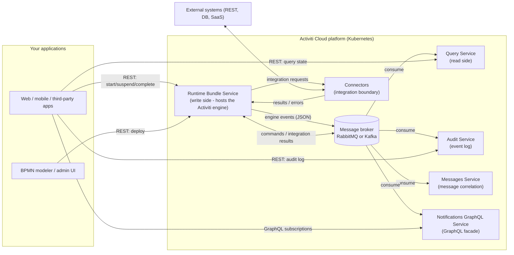

# Architecture Overview

Activiti Cloud is a microservices, event-driven workflow platform built on the Activiti engine. Version 9.0.0 targets Java 25 and Spring Boot 3.5.7. Every service is an independent Spring Boot application that talks to the others exclusively through a message broker (RabbitMQ or Kafka — `activiti.cloud.messaging.broker` also accepts `aws`) via Spring Cloud Stream. There are no synchronous service-to-service calls in the data path: commands go to the write side, and the read side rebuilds its state by consuming the event stream.

## System Context



## Why Event-Driven

The single most important architectural decision in Activiti Cloud is that the service that executes the process (the runtime bundle) and the services that observe it (query, audit, messages, notifications) do not share a database. Instead:

- **Loose coupling** — The runtime bundle never knows who is watching. Adding a new consumer (a report service, a data lake, your own consumer) only requires subscribing to the `engineEvents` destination; nothing in the runtime bundle changes.
- **Independent scaling** — Each consumer scales on its own. Read-heavy workloads scale the query service without touching process execution, and a burst of deployments does not slow down task completion.
- **CQRS-style separation** — The runtime bundle owns the write model (the engine database). The query service and the audit service own independent read models that they project from the same event stream. Each model is shaped for its own queries rather than forcing one schema to serve execution, search, and compliance.
- **Resilience** — A slow or failing read-side service cannot block process execution. Events are published inside the engine transaction (transactional RabbitMQ producer or Kafka transactions) and become visible in the broker only once the commit succeeds, so a consumer can restart and catch up.

The trade-off is **eventual consistency** between what the runtime bundle did and what the query service reports. See [Event-Driven Design](./event-driven.md) for the delivery guarantees and practical consequences.

## Services

| Service | Responsibility | Primary API | Documentation |
|---------|----------------|-------------|---------------|
| **runtime-bundle-service** | Hosts the Activiti engine. The write side: deploys process definitions, starts and executes process instances, completes tasks, publishes every engine event. | REST `/v1/...` and `/admin/v1/...` | [Runtime Bundle](../services/runtime-bundle.md) |
| **query-service** | The read side. Consumes engine events and maintains a query-optimized model of process instances, tasks, and variables for search and reporting. | REST `/v1/...` and `/admin/v1/...` | [Query Service](../services/query.md) |
| **audit-service** | Append-only, queryable log of every event the engine produced (including the `actor` who performed each action). | REST `/v1/events` | [Audit Service](../services/audit.md) |
| **messages-service** | Correlates BPMN messages: aggregates `MESSAGE_WAITING` / `MESSAGE_RECEIVED` events and routes incoming messages to the right process instance. Backed by JDBC, Redis, or Hazelcast. | Consumes the `messageEvents` destination; commands the runtime bundle | [Messages Service](../services/messages.md) |
| **notifications-graphql-service** | GraphQL facade for push notifications. Subscribes to engine events and streams them to clients over GraphQL subscriptions (WebSocket). | GraphQL `/graphql`, WebSocket `/v2/ws/graphql` | [Notifications GraphQL](../services/notifications-graphql.md) |
| **connectors** | The integration boundary. A connector is a Spring Boot app that receives `IntegrationRequest` payloads for service tasks, calls external systems, and returns `IntegrationResult` / `IntegrationError` payloads. | Consumes per-connector destinations | [Connectors](../connectors/overview.md) |
| **activiti-cloud-api** | Shared, versioned Java models for the payloads flowing over the broker: event payloads (`CloudRuntimeEvent`, `CloudRuntimeEventType`), process model (`CloudProcessInstance`, `IntegrationRequest`, `IntegrationResult`), task model (`CloudTask`). Consumed by every other service. | — | [Event-Driven Design](./event-driven.md) |

The runtime bundle is also where the engine's internal plumbing lives: the message-based async job executor, signal handling (subscription events), the messaging gateway API, and the event producer that converts engine audit events into cloud event payloads.

## Data Flows

Two flows dominate the architecture:

**Command flow (write path).** A client calls the runtime bundle REST API (for example, `POST /v1/process-instances`). The engine executes the command inside a database transaction. On commit, every event produced by that transaction is aggregated and published to the `engineEvents` destination. Publishing participates in the transaction (transactional RabbitMQ producer or Kafka transactions), so an event exists in the broker only if the engine state change was committed.

**Integration flow (service tasks).** When a process reaches a service task configured for a cloud connector, the runtime bundle publishes an `IntegrationRequest` to the connector's input destination after the transaction commits. The connector processes it and publishes an `IntegrationResult` (or `IntegrationError`) back. The runtime bundle consumes these and continues the process, emitting `INTEGRATION_RESULT_RECEIVED` / `INTEGRATION_ERROR_RECEIVED` events.

Every destination, payload, and the ordering/delivery semantics are detailed in [Event-Driven Design](./event-driven.md).

## Application and Service Naming

Several configuration properties identify the running application, and they matter architecturally because they appear in broker destination names and in every event payload:

| Property | Meaning | Used for |
|----------|---------|----------|
| `spring.application.name` | The Spring application (per service: `runtime-bundle`, `query`, `audit`, a connector, ...). | Event `serviceName`, consumer groups, the `integrationResult`/`integrationError` destination scopes. |
| `activiti.cloud.application.name` | The *application* a runtime bundle belongs to (several runtime bundles can serve one application). | Event `appName`, and the scope of the `commandConsumer`, `commandResults`, `messageEvents`, and `asyncExecutorJobs` destinations (for example `commandConsumer_default-app`). |
| `activiti.cloud.service.type` | The service role: `runtime-bundle`, `query`, `audit`, `connector`, `notifications-graphql`. | Event `serviceType`. |
| `activiti.cloud.service.version` | Free-form service version. | Event `serviceVersion`. |

These values travel with every event, so consumers can filter the stream by application or service without touching the broker topology.

## Deployment Topology

The reference deployment is Kubernetes with Helm:

- Each service runs as its own Deployment with its own replica count and can be scaled independently.
- A namespace isolates one environment (the local development tooling generates namespaces of the form `pr-{environment}-{broker}-{partitioned}-{destinations}`, for example `pr-my-env-rabbit-n-d` or `pr-my-env-kafka-p-o`).
- The message broker (RabbitMQ or Kafka) runs in the same cluster; all services point at it. Broker selection is done per service with `activiti.cloud.messaging.broker` (see [Event-Driven Design](./event-driven.md#broker-options)).
- Identity is provided by a Keycloak realm; every service is an OAuth2 resource server validating tokens from it (see [Identity & Security](./identity.md)).
- The deployment includes an **identity-adapter** service that bridges the platform to the identity provider (see [Identity & Security](./identity.md#bridging-an-external-identity-provider)).

### Choosing a Deployment Size

**Minimal (single application)** — If you embed the engine in your own application or just need process execution plus basic visibility, deploy the runtime bundle and the query service (plus the broker and Keycloak). You get execution plus queryable state. You skip the audit log, message correlation, and push notifications.

**Full platform** — Deploy everything:

| Service | Needed when |
|---------|-------------|
| runtime-bundle-service | Always. The engine lives here. |
| query-service | Always in a platform deployment — it is the standard read API. |
| audit-service | You need an immutable, queryable compliance log of every engine action and who performed it. |
| messages-service | Your processes use BPMN message events (intermediate message catch/send, message-based start) and you need correlation across process instances. |
| notifications-graphql-service | Your front ends want push updates (task created, process completed) instead of polling. |
| connectors | Your processes call external systems from service tasks and you want those calls to be separate, independently scalable applications. |
| identity-adapter | You use the platform's identity REST API (user/group lookup) against a Keycloak realm. |

The acceptance tests assume a full deployment (the audit service is reachable through the gateway after a local install). The local development scripts in the `activiti-cloud` repository build local images for the four example apps — runtime-bundle, query, connector, and identity-adapter — and patch those deployments.

### Example Service Configuration

Each service is a standard Spring Boot application, so configuration is plain Spring properties (shown as YAML; the platform also exposes most of them as environment variables, e.g. `ACT_MESSAGING_BROKER`):

```yaml
spring:
  application:
    name: runtime-bundle
  datasource:
    url: jdbc:postgresql://runtime-bundle-db:5432/activiti
  cloud:
    stream:
      rabbit:
        bindings:
          auditProducer:
            producer:
              transacted: true

activiti:
  cloud:
    application:
      name: default-app
    messaging:
      broker: rabbitmq
      partitioned: false
      destination-separator: _
    runtime-bundle:
      events-properties:
        chunk-size: 100
```

The `spring.cloud.stream` entries shown here are the effective defaults for the runtime bundle's `auditProducer` binding (see [Event-Driven Design](./event-driven.md#broker-options) for the full table).

## Next Steps

- [Event-Driven Design](./event-driven.md) — the event model, destinations, broker configuration, ordering, and delivery semantics.
- [Identity & Security](./identity.md) — Keycloak integration, how the authenticated user is propagated into process events, and bridging external identity providers.
