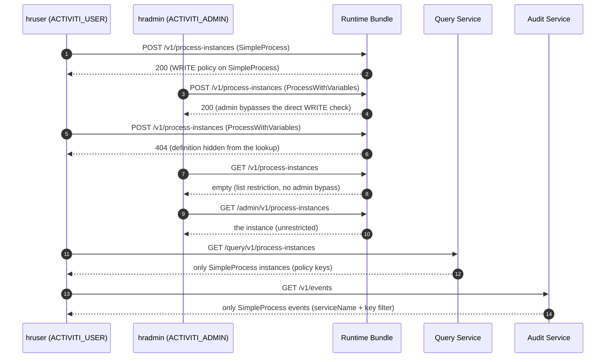

# Security Policies

Security policies are the platform's declarative, configuration-based answer to "which users and groups may see and start which processes". A policy grants a set of **users** and **groups** a level of access (**READ** or **WRITE**) to a list of **process definition keys**, scoped to one service. The runtime bundle, the query service, and the audit service each apply policies to their own data: the bundle to engine queries, the query service to the read model, and the audit service to the event log.

URL-level authorization (`ACTIVITI_USER` on `/v1/*`, `ACTIVITI_ADMIN` on `/admin/*`) is a separate layer covered by [Identity and Security](./identity.md); security policies are the **data-scoping** layer that runs inside each service once the role check has passed. The engine-level mechanics — `SecurityManager`, `SecurityPoliciesManager`, and how to customize them — are documented on the engine page [Security Policies and Authorization](../../activiti/advanced/security-policies.md).

## What security policies gate

Two orthogonal mechanisms control what a user sees:

- **Security policies** — restrict **process definitions, process instances, and events** to the definition keys a user's policies allow. A user with no matching policy (while any policy is defined) sees an empty result, not an error.
- **BPMN candidate users and groups** — restrict **tasks** to their assignee, owner, candidate users, and candidate groups (plus the instance initiator on the read side). Task visibility is candidate-based in both the runtime bundle and the query service; it is not driven by policy keys.

If `activiti.security.policies` is empty or absent, no policy filtering happens at all: every authenticated user with the required role can see everything the candidate rules allow.

## Defining policies: the shape

Policies are declared with the `activiti.security.policies` property, bound (in the engine's `activiti-spring-security-policies` module) to a list of `SecurityPolicy` objects. Each policy has exactly these fields:

| Field | Type | Meaning |
|-------|------|---------|
| `name` | `String` | Human-readable identifier; not used in matching |
| `users` | `List<String>` | User ids (the JWT `preferred_username`) granted by this policy |
| `groups` | `List<String>` | Groups (the JWT `groups` claim) granted by this policy |
| `serviceName` | `String` | The service the policy applies to — matched against the runtime bundle's `spring.application.name`, the same value stamped as `serviceName` on every event |
| `access` | `NONE` / `READ` / `WRITE` | Access level granted for the keys |
| `keys` | `List<String>` | Process definition keys the policy applies to; `*` is a wildcard (configurable via `activiti.security.wildcard`, default `*`) |

As a JSON object, one policy looks like this:

```json
{
  "name": "HR users manage leave processes",
  "users": ["hruser"],
  "groups": [],
  "serviceName": "rb",
  "access": "WRITE",
  "keys": ["SimpleProcess", "ProcessWithVariables"]
}
```

In Spring Boot configuration the same policies are written per service, either as indexed properties (the form used by the platform's own test configurations):

```properties
activiti.security.policies[0].name=MyPolicy for HR User
activiti.security.policies[0].users=hruser
activiti.security.policies[0].access=WRITE
activiti.security.policies[0].serviceName=rb
activiti.security.policies[0].keys=SimpleProcess,ProcessWithVariables

activiti.security.policies[1].name=HR group read-only
activiti.security.policies[1].groups=hrgroup
activiti.security.policies[1].access=READ
activiti.security.policies[1].serviceName=rb
activiti.security.policies[1].keys=*
```

or as YAML:

```yaml
activiti:
  security:
    policies:
      - name: "HR users manage leave processes"
        users: [hruser]
        serviceName: rb
        access: WRITE
        keys: [SimpleProcess, ProcessWithVariables]
      - name: "HR group read-only"
        groups: [hrgroup]
        serviceName: rb
        access: READ
        keys: ["*"]
```

Matching semantics, verified in the engine's `BaseSecurityPoliciesManagerImpl`:

- A policy applies when the caller appears in `users` **or** any of the caller's groups appears in `groups`.
- `WRITE` implies `READ`; `NONE` grants nothing.
- If policies are defined and the caller matches none, the user-facing list endpoints return empty results (an unsatisfiable filter), while single-entity lookups fail as "not found".
- The runtime bundle and query service match definition keys **exactly** (case-insensitive); the audit service matches by **prefix** on the event's `processDefinitionId` (which is `key:version:uuid`, so a key like `SimpleProcess` matches its ids).
- A `*` in `keys` grants access to every definition of that service.

:::note
The policy's `serviceName` is matched against the runtime bundle's `spring.application.name` (case-insensitive, hyphens ignored) — **not** against `activiti.cloud.application.name`. The platform's own runtime-bundle test configuration sets `spring.application.name=test-app` alongside `serviceName=test-app` policies while `activiti.cloud.application.name=activiti-app`.
:::

## There is no policy-management REST API

The platform ships **no REST endpoint to create, update, or delete security policies at runtime** — verified across the runtime bundle, query, and audit services, and consistent with the acceptance tests, which never send a policy payload. Policies are static configuration: you set `activiti.security.policies` in each service's Spring configuration and redeploy (or restart) that service.

Because each service binds the property from its **own** configuration, enforcing a policy across the whole platform means configuring it in every service that should filter on it: the runtime bundle (engine queries), the query service (read model), and the audit service (events). A policy missing from one service simply does not filter there.

The REST endpoints that matter are therefore the ones the policies **enforce**, which the acceptance scenario exercises directly:

| Endpoint | Policy effect |
|----------|---------------|
| `POST /rb/v1/process-instances` | Requires `WRITE` on the definition key. A definition the caller cannot read fails the lookup with `404` ("Unable to find process definition..."); a readable but not writable one fails with `403` ("...due security policy violation") |
| `GET /rb/v1/process-definitions` | Limited to the keys the caller may `READ` |
| `GET /rb/v1/process-instances` | Limited to readable keys **and** to instances the caller is involved in (initiator, or assignee/candidate of one of its tasks) |
| `GET /rb/v1/process-instances/{id}` | Requires `READ` on the key plus involvement (initiator or task assignee/candidate) |
| suspend / resume / delete / update on `/rb/v1` | Requires `WRITE` on the key **and** being the initiator |
| Read process variables on `/rb/v1` | Requires `READ` on the key plus involvement, as for the instance itself |
| Set or remove variables on `/rb/v1` | Requires `WRITE` on the key **and** being the initiator |
| `GET /rb/v1/tasks` | Candidate-based: the caller's assigned/owned tasks plus unassigned tasks whose candidate users or groups include the caller — not policy-key-based |
| `/rb/admin/v1/...` | **Unrestricted** by security policies — the admin runtime performs no policy filtering at all; only the role gate applies (the default `/admin/*` URL constraint is `ACTIVITI_ADMIN`, and the admin runtime methods additionally accept `APPLICATION_MANAGER`) |
| `GET /query/v1/process-instances`, `/query/v1/process-definitions`, variables | Restricted to the caller's allowed keys, matched against the entities' `serviceName`/`serviceFullName`; tasks restricted as above |
| `GET /query/admin/v1/...` | Unrestricted |
| `GET /audit/v1/events` | Events limited to those whose `serviceName` matches a policy the caller satisfies, and (unless the policy is a wildcard) whose `processDefinitionId` starts with one of the policy's keys; no matching policy means zero events |
| `GET /audit/admin/v1/events` | Unrestricted (plus delete and export) |

## `ACTIVITI_USER` vs `ACTIVITI_ADMIN` visibility

Roles come from the JWT claims exactly as described in [Identity and Security](./identity.md), and the default security constraints map `/v1/*` to `ACTIVITI_USER` and `/admin/*` to `ACTIVITI_ADMIN`. On top of that role gate:

| | `ACTIVITI_USER` | `ACTIVITI_ADMIN` |
|---|-----------------|------------------|
| `/v1/*` endpoints | Allowed | Allowed — the acceptance scenario's `hradmin` starts processes through `/v1` |
| `/admin/v1/*` endpoints | `403` | Allowed, and unfiltered by policies |
| Policy checks on a definition key (starting an instance, looking up a definition) | Bounded by the user's `READ`/`WRITE` policies for the key | **Bypassed** — the admin passes the direct `canRead`/`canWrite` checks regardless of policy matching |
| List endpoints on `/v1/*` (runtime bundle and query service) | Restricted to the policy keys the user matches | **Still restricted** — list restriction goes through policy matching with no admin bypass, so an admin who matches no policy sees empty lists on `/v1` and must use `/admin/v1` |
| Audit events on `/v1/events` | Restricted by `serviceName` plus key | Unrestricted via `/admin/v1/events` |

The list-endpoint row is the subtle one, and it is exactly what the acceptance scenario asserts: an admin can **start** a policy-restricted process through the normal `/v1` endpoint (direct write check bypassed), yet cannot **list** its instances on `/v1` (list restriction not bypassed) — the instance shows up only through `/admin/v1`.

## The hradmin / hruser acceptance scenario

The platform ships a full acceptance scenario for this feature:

- **`activiti-cloud-acceptance-scenarios/security-policies-acceptance-tests`** — Serenity/j-behave stories (`hradmin-actions.story`, `hruser-actions.story`) driven by `SecurityPoliciesActions` against a deployed cluster, using two processes registered in `ProcessDefinitionRegistry`: `SimpleProcess` and `ProcessWithVariables`.
- **`activiti-cloud-acceptance-tests-playwright`** — `tests/hradmin-security-policies.spec.ts` and `tests/hruser-security-policies.spec.ts`, speaking through `services/security-policies.service.ts` as the Keycloak users `hradmin` and `hruser` (the service wraps the standard `/rb/v1`, `/rb/admin/v1`, `/query/v1`, `/query/admin/v1`, `/audit/v1`, and `/audit/admin/v1` endpoints — no policy-management calls).

The scenario's access split (as configured for the test environment): `hruser` holds `WRITE` for `SimpleProcess` and nothing for `ProcessWithVariables`; `hradmin` holds the `ACTIVITI_ADMIN` role.

**hruser story:**

1. Starts `SimpleProcess` via `POST /rb/v1/process-instances` — allowed (WRITE).
2. Gets the instance from `/rb/v1/process-instances` and the query service — allowed (involved + readable key).
3. Gets its audit events from `/audit/v1/events` — allowed.
4. Tries to start `ProcessWithVariables` — rejected with `404` "Unable to find process definition for the given id:'ProcessWithVariables'": the definition is hidden from the lookup.
5. Gets/queries `ProcessWithVariables` instances and events — all empty.
6. Still lists and queries **tasks** — allowed, because task visibility is candidate-based, not policy-key-based.

**hradmin story:**

1. Starts `ProcessWithVariables` via the **user** endpoint — allowed, because the direct write check is bypassed for `ACTIVITI_ADMIN`.
2. Sees the instance via `/rb/admin/v1/process-instances`, the query admin endpoints, and `/audit/admin/v1/events` — the unrestricted admin paths.
3. Gets the **same** instance via the `/rb/v1` user endpoints, the query `/v1` endpoints, and `/audit/v1/events` — empty: list restriction has no admin bypass.



## Related

- [Identity and Security](./identity.md) — roles, JWT claims, and URL-level authorization
- [Architecture Overview](./overview.md)
- [Runtime Bundle Service](../services/runtime-bundle.md) — the `/v1` and `/admin/v1` endpoints and the `activiti.security.policies` property
- [Query Service](../services/query.md) — read-model restriction
- [Audit Service](../services/audit.md) — event restriction
- [Security Policies and Authorization](../../activiti/advanced/security-policies.md) — engine-level mechanics and customization
