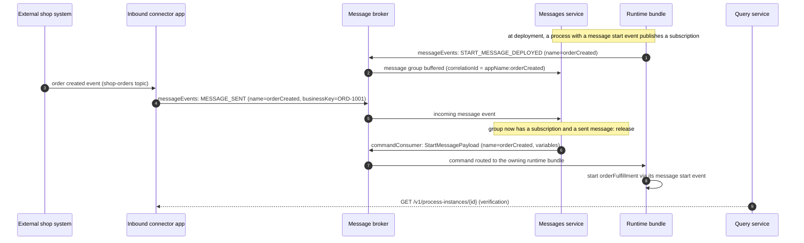

# Inbound Connectors

**Module:** `activiti-cloud-connectors` (Activiti Cloud 9.0.0, Spring Boot 3.5.7)

An **inbound connector** is a connector application that consumes an event from an external system and makes the platform react to it: it starts a process, or it resumes a process instance that is waiting for the event. Unlike [outbound connectors](outbound.md), which are driven by a service task, an inbound connector is driven by the external world.

The platform gives the process two BPMN constructs to listen on:

- a **message start event**, whose process starts when a message with a matching name arrives,
- an **intermediate message catch event**, whose waiting process instance resumes when a message with a matching name and correlation key arrives.

The engine details of these elements live in the [BPMN events reference](../../activiti/bpmn/events/index.md). This page covers what the *platform* adds around them: the messaging path through the messages service, the direct REST path, and how to configure the connector application itself.

## How an inbound connector works end to end

The event-driven path routes through the [messages service](../services/messages.md), which correlates what external systems send with what processes are subscribed to:



Step by step:

1. **Subscription.** When a runtime bundle deploys a process definition with a message start event, it publishes a `MessageEventPayload` with `messageEventType=START_MESSAGE_DEPLOYED` to the `messageEvents` destination (binding `messageEventsOutput`). When an instance reaches a message catch event, it publishes `MESSAGE_WAITING` with the message name and correlation key. Both carry an `appName` header and, via the `messageEventOutputDestination` header, the destination of the bundle's own `commandConsumer` binding.
2. **External event.** The external system publishes its event (e.g. to a `shop-orders` topic). The inbound connector application consumes it.
3. **Message event.** The connector publishes a `MessageEventPayload` to the same `messageEvents` destination with `messageEventType=MESSAGE_SENT`, the BPMN message name, the business key, and the payload variables.
4. **Correlation.** The messages service groups events by correlation id `appName:messageEventName[:messageEventCorrelationKey]`. When a group contains a subscription side (`START_MESSAGE_DEPLOYED` or `MESSAGE_WAITING`) and a `MESSAGE_SENT`, it releases the group and emits a `StartMessagePayload` (start) or `ReceiveMessagePayload` (catch) command, routed to the `messageEventOutputDestination`.
5. **Execution.** The owning runtime bundle consumes the command on its `commandConsumer` binding and starts the process or delivers the message to the waiting execution.

The full correlation model, aggregation rules, and backends: [Messages Service](../services/messages.md).

### What the platform supports from the connector side

| BPMN construct | Command the runtime executes | Payload | Event-driven path | Direct REST path |
|----------------|------------------------------|---------|-------------------|------------------|
| Message start event | `StartMessageCmdExecutor` | `StartMessagePayload`: `name`, `businessKey`, `variables` | `MESSAGE_SENT` correlated with `START_MESSAGE_DEPLOYED` on `messageEvents` | `POST /v1/process-instances/message` |
| Intermediate message catch event | `ReceiveMessageCmdExecutor` | `ReceiveMessagePayload`: `name`, `correlationKey`, `variables` | `MESSAGE_SENT` correlated with `MESSAGE_WAITING` on `messageEvents` | `PUT /v1/process-instances/message` |
| Plain start event | process start | `StartProcessPayload`: `processDefinitionId` or `processDefinitionKey`, `businessKey`, `variables` | not applicable (no message subscription) | `POST /v1/process-instances` |
| Signal start / catch | signal | `SignalPayload`: `name`, `variables` | not applicable | `POST /v1/process-instances/signal` |

The REST paths are relative to the runtime bundle service; the payloads are the `org.activiti.api.process.model.payloads` classes listed in the third column.

## Process-side wiring

BPMN declares the message and the event. A message start example (fragments are shown without the root `<definitions>` wrapper):

```xml
<message id="orderCreatedMessage" name="orderCreated" />

<process id="orderFulfillment" name="Order Fulfillment" isExecutable="true">
  <startEvent id="OrderCreated" name="Order created">
    <outgoing>flowToReview</outgoing>
    <messageEventDefinition messageRef="orderCreatedMessage" />
  </startEvent>
  <sequenceFlow id="flowToReview" sourceRef="OrderCreated" targetRef="ReviewTask" />
  <userTask id="ReviewTask" name="Review order">
    <outgoing>flowToDone</outgoing>
  </userTask>
  <sequenceFlow id="flowToDone" sourceRef="ReviewTask" targetRef="Done" />
  <endEvent id="Done">
    <incoming>flowToDone</incoming>
  </endEvent>
</process>
```

`<message>` is a child of the root `<definitions>` element and a sibling of `<process>`; the fragment above shows it before the process for readability.

A message catch example (resuming a waiting instance), with the correlation key taken from the instance business key. `flowIn` and `flowOut` are the surrounding flows of the full process:

```xml
<!-- xmlns:activiti="http://activiti.org/bpmn" required -->
<message id="paymentConfirmedMessage" name="paymentConfirmed" />

<intermediateCatchEvent id="PaymentConfirmed" name="Payment confirmed">
  <incoming>flowIn</incoming>
  <outgoing>flowOut</outgoing>
  <messageEventDefinition messageRef="paymentConfirmedMessage" activiti:correlationKey="${execution.processInstanceBusinessKey}" />
</intermediateCatchEvent>
```

Matching is by message **name**; for catch events the **correlation key** (`activiti:correlationKey` on the `messageEventDefinition`, usually the process instance's business key) must match the waiting instance, so several instances can wait on the same message name safely.

## Configuring an inbound connector

An inbound connector is a plain Spring Boot application. It needs:

1. a binding that consumes the external event source,
2. an output binding that publishes to the platform's `messageEvents` destination (for the event-driven path), or an HTTP client (for the direct REST path),
3. the application name it belongs to, so its correlation ids match the runtime bundle's.

```properties
spring.application.name=order-events-connector
server.port=8080

activiti.cloud.application.name=default-app

# consume order events from the shop system
spring.cloud.stream.bindings.shopOrders.destination=shop-orders
spring.cloud.stream.bindings.shopOrders.contentType=application/json
spring.cloud.stream.bindings.shopOrders.group=${spring.application.name}

# publish message events to the platform
spring.cloud.stream.bindings.messageEventsOutput.destination=messageEvents
spring.cloud.stream.bindings.messageEventsOutput.contentType=application/json
```

The `messageEvents` destination and consumer group `messages` on the messages service side are the platform defaults; the connector publishes to the same destination the runtime bundles publish to.

### Publishing a message event

The outbound message is a `MessageEventPayload` (`id`, `name`, `correlationKey`, `businessKey`, `variables`) with the `MessageEventHeaders` headers. The headers that matter for correlation and routing:

| Header | Value |
|--------|-------|
| `appName` | the `activiti.cloud.application.name` of the runtime bundle that owns the process (part of the correlation id) |
| `messageEventName` | the BPMN message name (part of the correlation id) |
| `messageEventCorrelationKey` | correlation key, for message catch events (appended to the correlation id when present) |
| `messageEventBusinessKey` | business key of the event |
| `messageEventType` | `MESSAGE_SENT` (required; events without it are discarded by the messages service) |
| `messageEventId` | unique event id; used by the messages service for idempotent dedup |

A Spring Cloud Stream consumer function that bridges the shop topic to the platform. The function bean name (`shopOrders`) matches the binding name from the properties above; it publishes to the `messageEventsOutput` binding:

```java
package org.example.order;

import com.fasterxml.jackson.core.JsonProcessingException;
import com.fasterxml.jackson.core.type.TypeReference;
import com.fasterxml.jackson.databind.ObjectMapper;
import java.io.UncheckedIOException;
import java.util.Map;
import java.util.function.Consumer;
import org.activiti.api.process.model.payloads.MessageEventPayload;
import org.springframework.beans.factory.annotation.Value;
import org.springframework.cloud.stream.function.StreamBridge;
import org.springframework.context.annotation.Bean;
import org.springframework.context.annotation.Configuration;
import org.springframework.messaging.Message;
import org.springframework.messaging.support.MessageBuilder;

@Configuration
public class OrderEventsConnector {

    @Bean
    public Consumer<String> shopOrders(
        StreamBridge streamBridge,
        ObjectMapper objectMapper,
        @Value("${activiti.cloud.application.name}") String appName
    ) {
        return shopOrderJson -> {
            Map<String, Object> order;
            try {
                order = objectMapper.readValue(
                    shopOrderJson,
                    new TypeReference<Map<String, Object>>() {}
                );
            } catch (JsonProcessingException e) {
                throw new UncheckedIOException(e);
            }
            String orderId = (String) order.get("orderId");

            MessageEventPayload payload = new MessageEventPayload(
                "orderCreated", null, orderId, Map.copyOf(order)
            );

            Message<MessageEventPayload> message = MessageBuilder
                .withPayload(payload)
                .setHeader("appName", appName)
                .setHeader("messageEventName", payload.getName())
                .setHeader("messageEventBusinessKey", payload.getBusinessKey())
                .setHeader("messageEventType", "MESSAGE_SENT")
                .setHeader("messageEventId", payload.getId())
                .build();

            streamBridge.send("messageEventsOutput", message);
        };
    }
}
```

`MessageEventPayload` is `org.activiti.api.process.model.payloads.MessageEventPayload`; the constructor is `(name, correlationKey, businessKey, variables)`. The header names match the `MessageEventHeaders` constants of the runtime bundle's messages-events module (`appName` is `RuntimeBundleInfoMessageHeaders.APP_NAME`, which the runtime bundles add automatically — an external connector must set it itself).

For the direct REST path, the same connector can call the runtime bundle instead:

```http
POST /v1/process-instances/message
Content-Type: application/json

{
  "name": "orderCreated",
  "businessKey": "ORD-1001",
  "variables": {
    "orderId": "ORD-1001",
    "customerId": "CUST-42",
    "totalAmount": 149.99,
    "currency": "EUR"
  }
}
```

## Worked example: an external shop starts order fulfillment

Scenario: a shop system publishes created orders to a `shop-orders` topic. Each order starts the `orderFulfillment` process, which begins with a message start event named `orderCreated`.

### 1. External payload

```json
{
  "orderId": "ORD-1001",
  "customerId": "CUST-42",
  "items": [
    { "sku": "SKU-7", "quantity": 2 }
  ],
  "totalAmount": 149.99,
  "currency": "EUR"
}
```

### 2. BPMN snippet

The process starts on the `orderCreated` message (see the [process-side wiring](#process-side-wiring) snippet). The message name `orderCreated` and the variables that follow the event are what the connector passes.

### 3. Connector configuration

The connector application is configured as shown in [Configuring an inbound connector](#configuring-an-inbound-connector): binding `shopOrders` on `shop-orders` (consumer), binding `messageEventsOutput` on `messageEvents` (producer), `activiti.cloud.application.name=default-app`. The consumer is the `shopOrders` function above. There is no separate REST registration step: the application joins the platform by binding to the shared destinations at startup.

### 4. Start the process

The event-driven start is the `MESSAGE_SENT` publish in step 3. The equivalent direct REST call against the runtime bundle is:

```http
POST /v1/process-instances/message
Content-Type: application/json

{
  "name": "orderCreated",
  "businessKey": "ORD-1001",
  "variables": {
    "orderId": "ORD-1001",
    "customerId": "CUST-42",
    "totalAmount": 149.99,
    "currency": "EUR"
  }
}
```

`StartMessagePayload` fields: `name` (message name), `businessKey`, `variables`.

### 5. Verify via the query service

```http
GET /v1/process-instances?processDefinitionKey=orderFulfillment
```

The new instance appears with status `RUNNING` and the start variables (`orderId`, `customerId`, ...). Fetching the instance by id:

```http
GET /v1/process-instances/{processInstanceId}
```

Both endpoints are served by the [query service](../services/query.md); they reflect the state the runtime bundle published after the message command was executed.

## Error handling and retries

The inbound path has no retry loop of its own; delivery is at-least-once and the platform components are defensive. What the source actually does:

| Failure | Behavior |
|---------|----------|
| Message without a `messageEventType` header | The messages service filter diverts it to the `discardChannel` (logged at DEBUG); nothing is processed |
| Duplicate message event | The idempotent receiver interceptor (keyed on `messageEventId`) discards the duplicate; the event is processed once |
| No matching subscription yet | The message is buffered in the message group store under its correlation id until the subscription event arrives; groups can be expired by the messages service `group-timeout` setting |
| Correlated but no waiting/deployed target at execution time | The runtime bundle logs a warning (no instance waiting for that message) and the command is not applied |
| Transient failure | Broker redelivery plus the messages service dedup means the event is retried by the transport, not by an application-level retry policy |

Design inbound connectors for **idempotency**: the same order event can legitimately arrive twice. Derive the `messageEventId` from the external event identity where possible so duplicates are deduplicated, and make the effect of starting the process safe to repeat (for example, a unique `businessKey` check in the process itself).

For the messages service side — filtering, dedup, grouping, backends, and configuration — see [Messages Service](../services/messages.md).

## Next steps

- [Outbound Connectors](outbound.md) — the opposite direction: service tasks calling external systems
- [Messages Service](../services/messages.md) — correlation, aggregation, and backends
- [BPMN events reference](../../activiti/bpmn/events/index.md) — message start and catch events in the engine
