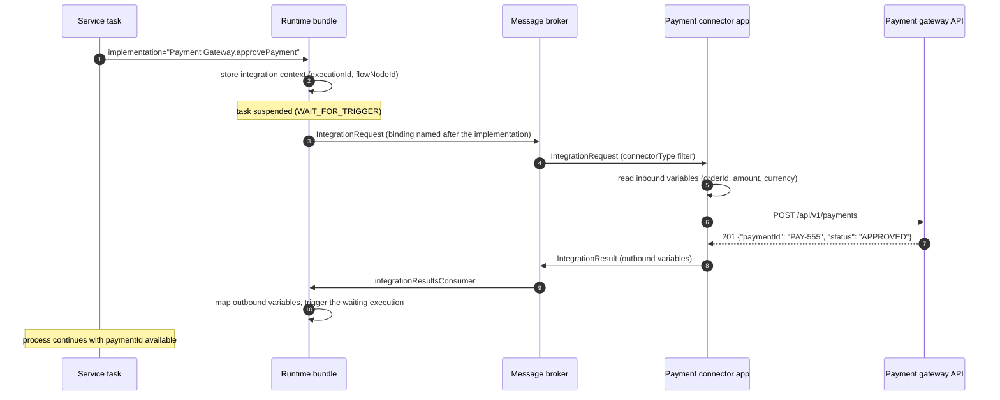

# Outbound Connectors

**Module:** `activiti-cloud-connectors` (Activiti Cloud 9.0.0, Spring Boot 3.5.7)

An **outbound connector** is a connector application that executes an external call on behalf of a BPMN service task. The service task carries a reference like `implementation="Payment Gateway.approvePayment"`; the runtime bundle publishes an `IntegrationRequest` to the broker when it reaches the task and suspends the execution; the connector consumes the request, calls the external system, and publishes an `IntegrationResult` (or `IntegrationError`) back; the runtime bundle resumes the execution with the connector's output variables.

## How an outbound connector works



What the source does, step by step:

1. **Service task.** The engine reaches a service task whose `implementation` is `connectorName.actionName`. `MQServiceTaskBehavior` first checks whether the runtime bundle itself contains a Spring bean named exactly `implementation` implementing `org.activiti.api.process.runtime.connector.Connector`; if so, the bean is called in-process and no message is published. Otherwise the cloud path below applies.
2. **Integration context.** The runtime bundle persists an integration context (`executionId`, `processInstanceId`, `processDefinitionId`, flow node id) and builds an `IntegrationContext` carrying the correlation data and the **inbound variables** selected by the process-extensions mapping (see [Payload mapping](#requestresponse-payload-mapping)).
3. **Request out.** The runtime bundle builds an `IntegrationRequest` — including `resultDestination` and `errorDestination` taken from its own `integrationResultsConsumer` / `integrationErrorsConsumer` bindings (default destinations `integrationResult` and `integrationError`, consumer group = the bundle's application name) — and publishes it **after the engine transaction commits**, on the Spring Cloud Stream binding named after the `implementation` string, with a `FUNCTION_DESTINATION` header carrying the resolved destination. The task then waits.
4. **Connector in.** The connector application declares a Spring Cloud Stream input binding whose destination includes the connector type, and a consumer function annotated with `@ConnectorBinding(connectorType = "...")`. The framework filters each message: first the `condition` SpEL (default: the request's `appVersion` must be within `application.min.version`..`application.max.version`; an empty condition accepts everything), then an exact match of the message's `connectorType` header against the annotation's `connectorType`.
5. **Call out.** The connector's `accept(IntegrationRequest)` reads `integrationRequest.getIntegrationContext().getInBoundVariables()`, performs the external call, and replies.
6. **Result back.** A reply is an `IntegrationResult` sent through `IntegrationResultSender` to the request's `resultDestination` (or, if the request carries none, `integrationResult<separator><serviceFullName>`; `ACT_INT_RES_CONSUMER` overrides both). On failure the connector sends an `IntegrationError` through `IntegrationErrorSender` to the request's `errorDestination` (fallback `integrationError<separator><serviceFullName>`; `ACT_INT_ERR_CONSUMER` overrides). The separator is `activiti.cloud.messaging.destination-separator`. The runtime bundle's `ServiceTaskIntegrationResultEventHandler` deletes the integration context and triggers the waiting execution with the outbound variables, mapped back to process variables by the extensions mapping.

## Configuring an outbound connector

Three parts: the connector definition (packaged with the runtime bundle), the service task (BPMN), and the connector application.

### Connector definition

The definition is the JSON contract documented in [Connector definition anatomy](overview.md#connector-definition-anatomy). For the payment example, `payment-gateway.json` on the runtime bundle's classpath:

```json
{
  "id": "paymentGatewayConnectorId",
  "name": "Payment Gateway",
  "description": "APS Connector that calls the payment gateway REST API",
  "actions": {
    "approvePaymentActionId": {
      "id": "approvePaymentActionId",
      "name": "approvePayment",
      "description": "Approve a payment via the payment gateway API",
      "inputs": [
        { "id": "orderIdId", "name": "orderId", "description": "Order identifier", "type": "string", "required": true },
        { "id": "amountId", "name": "amount", "description": "Amount in minor units", "type": "integer", "required": true },
        { "id": "currencyId", "name": "currency", "description": "ISO 4217 currency code", "type": "string", "required": true }
      ],
      "outputs": [
        { "id": "paymentIdId", "name": "paymentId", "description": "Payment identifier returned by the gateway", "type": "string" },
        { "id": "approvedId", "name": "approved", "description": "Whether the payment was approved", "type": "boolean" }
      ]
    }
  }
}
```

| Field | Type | Meaning |
|-------|------|---------|
| `id` | `String` | Definition id; addressed by `GET /v1/connector-definitions/{id}` |
| `name` | `String` | Connector name; first half of the service task `implementation`. Must be non-empty, contain no `.`, be unique across definitions |
| `description` | `String` | Free text |
| `actions` | `Map<String, ActionDefinition>` | Actions; each has `id`, `name` (second half of `implementation`), `description`, `inputs`, `outputs` |
| `actions.*.inputs/outputs` | `List<VariableDefinition>` | Each variable: `id`, `name`, `description`, `type`, `required`, `display`, `displayName`, `analytics` |

### Registration

Definitions are loaded at startup by `ConnectorDefinitionService` from `activiti.connectors.dir` (default `classpath:/connectors/`, one single directory — it is not comma-split). There is no REST write endpoint; the runtime bundle serves the loaded definitions read-only:

```http
GET /v1/connector-definitions
Accept: application/hal+json
```

```json
{
  "_embedded": {
    "connectorDefinitions": [
      {
        "id": "paymentGatewayConnectorId",
        "name": "Payment Gateway",
        "description": "APS Connector that calls the payment gateway REST API",
        "actions": { "approvePaymentActionId": { "name": "approvePayment" } }
      }
    ]
  }
}
```

This endpoint returns a Spring HATEOAS `CollectionModel`, so the `_embedded` shape above is for `Accept: application/hal+json`. A 200 response after deploying the runtime bundle confirms the definition is registered.

### Connector application

The connector app is a Spring Boot application with the connector starter. Reference wiring (pattern from `example-cloud-connector`):

```properties
spring.application.name=payment-connector
server.port=8080

activiti.cloud.application.name=default-app

# one input binding; the destination lists the connector types it serves
spring.cloud.stream.bindings.payment-connector.destination=Payment Gateway.approvePayment
spring.cloud.stream.bindings.payment-connector.group=${spring.application.name}
spring.cloud.stream.bindings.payment-connector.contentType=application/json

activiti.cloud.messaging.function-router.routes.payment-connector.enabled=true
activiti.cloud.messaging.function-router.group=${spring.application.name}
```

A channels interface declares the input channel:

```java
package org.example.payment;

import org.activiti.cloud.common.messaging.functional.InputBinding;
import org.springframework.integration.dsl.MessageChannels;
import org.springframework.messaging.SubscribableChannel;

public interface PaymentConnectorChannels {
    String PAYMENT_CONNECTOR = "payment-connector";

    @InputBinding(PAYMENT_CONNECTOR)
    default SubscribableChannel paymentConnector() {
        return MessageChannels.publishSubscribe(PAYMENT_CONNECTOR).getObject();
    }
}
```

The connector itself implements `ConsumerConnector<IntegrationRequest>`:

```java
package org.example.payment;

import org.activiti.cloud.api.process.model.IntegrationRequest;
import org.activiti.cloud.common.messaging.functional.ConnectorBinding;
import org.activiti.cloud.common.messaging.functional.ConsumerConnector;
import org.springframework.stereotype.Component;

@ConnectorBinding(
    input = PaymentConnectorChannels.PAYMENT_CONNECTOR,
    condition = "",
    connectorType = "Payment Gateway.approvePayment"
)
@Component
public class PaymentGatewayConnector implements ConsumerConnector<IntegrationRequest> {
    // constructor-injected: IntegrationResultSender, IntegrationErrorSender,
    // ConnectorProperties, RestClient — see the worked example below

    @Override
    public void accept(IntegrationRequest request) {
        throw new UnsupportedOperationException("see the worked example below");
    }
}
```

`@ConnectorBinding` attributes:

| Attribute | Default | Meaning |
|-----------|---------|---------|
| `input` | `""` | Input channel the binding consumes from |
| `condition` | SpEL checking the `appVersion` header against `application.min.version` / `application.max.version` | Message filter; `""` accepts everything |
| `outputHeader` | `resultDestination` | Header read from the message to find the reply destination for returning functions |
| `connectorType` | `""` | Must equal the service task `implementation` for this function to receive the message |
| `retry` | `0` (falls back to `activiti.connector.retry.default.max`, default `-1` = no retry) | Requeue a rejected message up to this many times |
| `retryDelay` | `0` (falls back to `activiti.connector.retry.default.delay`, default `0` seconds) | Seconds to wait between retries |

`ConnectorProperties` (prefix `activiti.cloud.connector`) identifies the connector service on outgoing payloads: `service-name` (default `spring.application.name`), `service-type`, `service-version`, `app-name` (default `activiti.cloud.application.name`), `app-version`, `mq-destination-separator` (default `_`, from `activiti.cloud.messaging.destination-separator`), and `result-destination-override` / `error-destination-override` (empty by default; the starter binds them to the `ACT_INT_RES_CONSUMER` / `ACT_INT_ERR_CONSUMER` environment variables).

## Request/response payload mapping

### What the connector receives

`IntegrationContext` exposes the correlation data and the variables:

| Member | Value |
|--------|-------|
| `getProcessInstanceId()`, `getRootProcessInstanceId()`, `getParentProcessInstanceId()` | Instance coordinates |
| `getExecutionId()` | Execution the service task runs on |
| `getProcessDefinitionId()`, `getProcessDefinitionKey()`, `getProcessDefinitionVersion()` | Definition coordinates |
| `getBusinessKey()` | Instance business key |
| `getConnectorType()` | The service task `implementation` string |
| `getAppVersion()` | Application version of the runtime bundle |
| `getClientId()`, `getClientName()`, `getClientType()` | Flow node id, resolved task name, `ServiceTask` |
| `getInBoundVariables()` | `Map<String, Object>` selected by the process-extensions mapping |

Which process variables become inbound variables is decided by the extensions file of the process (a `*-extensions.json` sidecar):

| Mapping for the service task | Inbound variables |
|------------------------------|-------------------|
| No mapping entry | Constants only (from `constants` in the extensions file) — no process variables |
| `"mappingType": "MAP_ALL"` or `"MAP_ALL_INPUTS"` | All process variables plus constants |
| Explicit `inputs` | Only the mapped variables plus constants |

Explicit input mappings map a process variable (or a literal, or a JSON Patch) to each connector input name; keys are connector input names, `type` is `variable`, `value`, or `jsonPatch`:

```json
{
  "id": "orderFulfillment",
  "name": "orderFulfillment.bpmn20.xml",
  "extensions": {
    "orderFulfillment": {
      "properties": {},
      "mappings": {
        "approvePaymentTask": {
          "inputs": {
            "orderId": { "type": "variable", "value": "orderId" },
            "amount": { "type": "variable", "value": "totalAmount" },
            "currency": { "type": "value", "value": "EUR" }
          }
        }
      },
      "constants": {}
    }
  }
}
```

### What the process receives back

The connector adds outputs with `IntegrationResultBuilder.resultFor(request, connectorProperties).withOutboundVariables(map).buildMessage()`. When the runtime bundle receives the result, outbound variables are written back to the process:

| Mapping for the service task | Effect |
|------------------------------|--------|
| `"mappingType": "MAP_ALL"` or `"MAP_ALL_OUTPUTS"` | Every output variable is set as a process variable |
| Explicit `outputs` | Only the mapped variables are set; keys are process variable names, `value` names the connector output (or a literal / JSON Patch) |
| No mapping entry | Output variables are not written to the process |

The full sidecar schema: [Process extensions](../../activiti/examples/order-management-workflow/process-extensions.md).

## Worked example: approve a payment via a payment gateway

The `orderFulfillment` process approves a payment with a service task, and handles a rejected payment through a BPMN boundary error event.

### 1. BPMN snippet

The fragment shows the service task and the error path; `flowIn` and `flowOut` are the surrounding flows of the full process:

```xml
<process id="orderFulfillment" name="Order Fulfillment" isExecutable="true">
  <serviceTask id="approvePaymentTask" name="Approve payment" implementation="Payment Gateway.approvePayment">
    <incoming>flowIn</incoming>
    <outgoing>flowOut</outgoing>
  </serviceTask>
  <boundaryEvent id="PaymentRejected" attachedToRef="approvePaymentTask">
    <outgoing>flowRejected</outgoing>
    <errorEventDefinition errorRef="paymentRejectedError" />
  </boundaryEvent>
  <sequenceFlow id="flowRejected" sourceRef="PaymentRejected" targetRef="RejectedEnd" />
  <endEvent id="RejectedEnd">
    <incoming>flowRejected</incoming>
    <terminateEventDefinition />
  </endEvent>
</process>

<error id="paymentRejectedError" name="Payment rejected" errorCode="PAYMENT_REJECTED" />
```

Like `<message>`, `<error>` is a child of the root `<definitions>` element and a sibling of `<process>`.

### 2. Connector application

The connector definition and registration are as shown above. The consumer, which calls the gateway and replies:

```java
package org.example.payment;

import java.time.Duration;
import java.util.Map;
import org.activiti.cloud.api.process.model.CloudBpmnError;
import org.activiti.cloud.api.process.model.IntegrationRequest;
import org.activiti.cloud.common.messaging.functional.ConnectorBinding;
import org.activiti.cloud.common.messaging.functional.ConsumerConnector;
import org.activiti.cloud.connectors.starter.channels.IntegrationErrorSender;
import org.activiti.cloud.connectors.starter.channels.IntegrationResultSender;
import org.activiti.cloud.connectors.starter.configuration.ConnectorProperties;
import org.activiti.cloud.connectors.starter.model.IntegrationErrorBuilder;
import org.activiti.cloud.connectors.starter.model.IntegrationResultBuilder;
import org.springframework.http.client.SimpleClientHttpRequestFactory;
import org.springframework.stereotype.Component;
import org.springframework.web.client.RestClient;
import org.springframework.web.client.RestClientResponseException;

@ConnectorBinding(
    input = PaymentConnectorChannels.PAYMENT_CONNECTOR,
    condition = "",
    connectorType = "Payment Gateway.approvePayment"
)
@Component
public class PaymentGatewayConnector implements ConsumerConnector<IntegrationRequest> {

    private final IntegrationResultSender integrationResultSender;
    private final IntegrationErrorSender integrationErrorSender;
    private final ConnectorProperties connectorProperties;
    private final RestClient restClient;

    public PaymentGatewayConnector(
        IntegrationResultSender integrationResultSender,
        IntegrationErrorSender integrationErrorSender,
        ConnectorProperties connectorProperties
    ) {
        this.integrationResultSender = integrationResultSender;
        this.integrationErrorSender = integrationErrorSender;
        this.connectorProperties = connectorProperties;
        SimpleClientHttpRequestFactory factory = new SimpleClientHttpRequestFactory();
        factory.setConnectTimeout(Duration.ofSeconds(5));
        factory.setReadTimeout(Duration.ofSeconds(10));
        this.restClient = RestClient.builder().requestFactory(factory).build();
    }

    @Override
    public void accept(IntegrationRequest request) {
        Map<String, Object> in = request.getIntegrationContext().getInBoundVariables();

        try {
            @SuppressWarnings("unchecked")
            Map<String, Object> response = restClient
                .post()
                .uri("http://payment-gateway/api/v1/payments")
                .body(Map.of(
                    "orderId", in.get("orderId"),
                    "amount", in.get("amount"),
                    "currency", in.get("currency")
                ))
                .retrieve()
                .body(Map.class);

            Map<String, Object> results = Map.of(
                "paymentId", response.get("paymentId"),
                "approved", "APPROVED".equals(response.get("status"))
            );

            integrationResultSender.send(
                IntegrationResultBuilder
                    .resultFor(request, connectorProperties)
                    .withOutboundVariables(results)
                    .buildMessage()
            );
        } catch (RestClientResponseException rejected) {
            integrationErrorSender.send(
                IntegrationErrorBuilder
                    .errorFor(request, connectorProperties,
                        new CloudBpmnError("PAYMENT_REJECTED", "Gateway rejected the payment"))
                    .buildMessage()
            );
        }
    }
}
```

The external call and its reply:

```http
POST /api/v1/payments
Content-Type: application/json

{ "orderId": "ORD-1001", "amount": 14999, "currency": "EUR" }
```

```json
{ "paymentId": "PAY-555", "status": "APPROVED" }
```

### 3. What happens on success

The `IntegrationResult` carries the outbound variables `paymentId` and `approved`. The runtime bundle triggers the waiting execution; with a `MAP_ALL` mapping for `approvePaymentTask` both become process variables, and the process continues after the service task.

### 4. What happens on failure

A `CloudBpmnError` published as an `IntegrationError` (error class `org.activiti.cloud.api.process.model.CloudBpmnError`, error code `PAYMENT_REJECTED`) makes the runtime bundle propagate a BPMN error on the execution: the boundary error event `PaymentRejected` fires, and the process ends at `RejectedEnd`. The audit service records an `ERROR_RECEIVED` event with the code `PAYMENT_REJECTED` plus an `INTEGRATION_ERROR_RECEIVED` event.

## Error handling

What the source actually implements, per failure mode:

| Failure | Behavior |
|---------|----------|
| Connector function throws | The starter's default error handler (`spring.cloud.stream.default.error-handler-definition=integrationRequestErrorChannelListener`) converts the failed message into an `IntegrationError` carrying the original exception, and publishes it to the error destination |
| `IntegrationError` whose error class is `CloudBpmnError` | The runtime bundle propagates the BPMN error to the matching boundary error event (matched by `errorCode`) or error end event; `ERROR_RECEIVED` audit event |
| `IntegrationError` with any other error class | The runtime bundle logs a warning, deletes the integration context, and emits `INTEGRATION_ERROR_RECEIVED`; the execution stays waiting at the service task |
| `IntegrationResult` arrives but no execution is waiting (or the activity id does not match) | The result is ignored with a warning; the integration context is deleted |
| Optimistic locking conflict when applying a result or error | Retried in place: `activiti.cloud.integration.result.retry.max-attempts` (default `3`) with backoff `activiti.cloud.integration.result.retry.backoff.delay` (default `0` ms); the same pattern exists for errors under `activiti.cloud.integration.error.retry.*` |
| Rejected message at the connector binding | Requeued when `retry` / `retryDelay` are configured on `@ConnectorBinding` (defaults: `activiti.connector.retry.default.max` = `-1`, no retry; `activiti.connector.retry.default.delay` = `0`); retries carry an `x-retry-count` header |

There is no automatic retry for an external HTTP failure and no built-in circuit breaker: timeout, non-2xx handling, and retries are the connector's responsibility (the example above sets explicit connect/read timeouts and maps 4xx/5xx to `CloudBpmnError`). The platform-level retries above only re-apply the result/error to the engine or requeue a rejected message at the binding.

A stuck service task (an `IntegrationRequest` published, no result or error back, for example because the connector app was down) can be replayed against the connector through the runtime bundle admin API:

```http
POST /admin/v1/executions/{executionId}/replay/service-task
Content-Type: application/json

{ "flowNodeId": "approvePaymentTask" }
```

`flowNodeId` is the id of the service task element. The runtime bundle re-runs the service task behavior, which publishes a new `IntegrationRequest`.

## Next steps

- [Inbound Connectors](inbound.md) — the opposite direction
- [Runtime Bundle Service](../services/runtime-bundle.md) — the service task endpoints, integration audit events, and configuration
- [Connectors Overview](overview.md) — definitions, request/result model, and decision guidance
