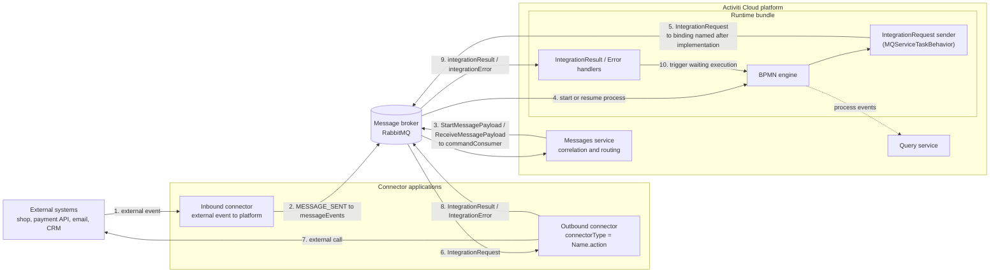

# Connectors Overview

**Module:** `activiti-cloud-connectors` (Activiti Cloud 9.0.0, Spring Boot 3.5.7)

A **connector** is a standalone Spring Boot application that sits between Activiti Cloud processes and the outside world. It is the platform's integration boundary: processes reference integrations declaratively in BPMN, while the actual protocol details (HTTP clients, topic consumers, payload transformations, authentication) live in the connector application. The runtime bundle never embeds third-party client code or credentials; it exchanges standard payloads with the connector over the message broker.

This decoupling is deliberate. Process definitions stay portable and testable, connector logic can be deployed, scaled, and versioned independently of processes, several runtime bundles can share one connector deployment, and an integration with a flaky external system fails and recovers inside the connector without taking down the engine.

## The two directions

Connectors operate in two directions. Both cross the broker as messages; neither is a synchronous service call.

| | Inbound | Outbound |
|---|---|---|
| Direction | External system to platform | Process to external system |
| Trigger | An external event (order placed, sensor reading, web hook) | A service task whose `implementation` references a connector action |
| What crosses the broker | Message events (`MESSAGE_SENT`) or engine commands; the process start/signal is executed by the runtime bundle | `IntegrationRequest` (out) and `IntegrationResult` or `IntegrationError` (back) |
| Typical use cases | An external shop starts an order-fulfillment process; a shipment tracking event resumes a waiting process | A service task calls a payment gateway, an email API, or a CRM |
| Platform mechanism | BPMN message events routed by the [messages service](../services/messages.md), or the process REST API | `@ConnectorBinding` consumer functions in a connector app, started from `MQServiceTaskBehavior` in the runtime bundle |

### Inbound: external event, process reaction

An inbound connector consumes an event from an external system (a topic, a queue, an HTTP callback) and makes the platform react: it either publishes a **message event** to the `messageEvents` destination so the [messages service](../services/messages.md) correlates it and starts or resumes the matching process, or it calls the runtime bundle's process REST API directly. The BPMN side is a **message start event** or an **intermediate message catch event**. Full details and a worked example: [Inbound Connectors](inbound.md).

### Outbound: service task, external call

An outbound connector is referenced by a service task's `implementation` attribute, e.g. `implementation="paymentGateway.approvePayment"`. When the engine reaches the task, the runtime bundle publishes an `IntegrationRequest` to a broker destination named after the connector action; the connector application consumes it, performs the external call, and publishes an `IntegrationResult` (or `IntegrationError` on failure) back to the runtime bundle, which resumes the waiting execution with the connector's output variables. Full details and a worked example: [Outbound Connectors](outbound.md).

## Where connectors fit the platform



| Participant | Role in the connector flow |
|-------------|----------------------------|
| Runtime bundle | Publishes `IntegrationRequest` when a connector service task is reached; consumes `IntegrationResult` / `IntegrationError` on its `integrationResultsConsumer` / `integrationErrorsConsumer` bindings (destinations `integrationResult` / `integrationError`); serves connector definitions at `GET /v1/connector-definitions`. See [Runtime Bundle Service](../services/runtime-bundle.md). |
| Connector application | Runs the integration logic. Consumes integration requests through `@ConnectorBinding` consumer functions and publishes results and errors. Inbound connectors publish message events or call the process REST API. |
| Message broker | The only transport between the three; RabbitMQ in the reference deployment (any Spring Cloud Stream binder works). |
| Messages service | Correlates message events (subscriptions vs. sent messages) and routes the resulting commands to the owning runtime bundle. See [Messages Service](../services/messages.md). |
| Query service | Read-side verification: process instances, variables, and events after the connector round-trip. See [Query Service](../services/query.md). |

### Connector definitions: registration

Connector definitions are **JSON files packaged with the runtime bundle**, not a database and not a REST write target. At startup, `ConnectorDefinitionService` (auto-configured by `ConnectorAutoConfiguration`) scans the directory given by `activiti.connectors.dir` (default `classpath:/connectors/`) for `**/*.json` files and loads them as `ConnectorDefinition` beans. The runtime bundle exposes them read-only:

| Method | Path | Result |
|--------|------|--------|
| `GET` | `/v1/connector-definitions` | All definitions packaged with the runtime bundle (HAL or JSON) |
| `GET` | `/v1/connector-definitions/{id}` | One definition by `id`; 404 if not found |

The definition describes the contract (actions, input/output variables). The runtime wiring is separate: a service task selects an action through its `implementation` attribute, and the connector application subscribes to the matching destination through Spring Cloud Stream bindings.

## Connector definition anatomy

The model classes are `org.activiti.core.common.model.connector.ConnectorDefinition`, `ActionDefinition`, and `VariableDefinition`.

```json
{
  "id": "paymentGatewayConnectorId",
  "name": "paymentGateway",
  "description": "APS Connector that calls the payment gateway REST API",
  "actions": {
    "approvePaymentActionId": {
      "id": "approvePaymentActionId",
      "name": "approvePayment",
      "description": "Approve a payment via the payment gateway API",
      "inputs": [
        {
          "id": "orderIdId",
          "name": "orderId",
          "description": "Order identifier",
          "type": "string",
          "required": true
        }
      ],
      "outputs": [
        {
          "id": "paymentIdId",
          "name": "paymentId",
          "description": "Payment identifier returned by the gateway",
          "type": "string"
        }
      ]
    }
  }
}
```

### `ConnectorDefinition`

| Field | Type | Meaning |
|-------|------|---------|
| `id` | `String` | Unique identifier of the definition; used by `GET /v1/connector-definitions/{id}` |
| `name` | `String` | Connector name; referenced from BPMN as `name.actionName`. Must be non-empty, must not contain `.`, and must be unique across all definitions (validated at startup) |
| `description` | `String` | Free-text description |
| `actions` | `Map<String, ActionDefinition>` | Actions exposed by the connector; the map key is arbitrary, the `name` field is what matters |

### `ActionDefinition`

| Field | Type | Meaning |
|-------|------|---------|
| `id` | `String` | Unique identifier of the action |
| `name` | `String` | Action name; referenced from BPMN as `connectorName.actionName` |
| `description` | `String` | Free-text description |
| `inputs` | `List<VariableDefinition>` | Variables the action expects (defaults to an empty list) |
| `outputs` | `List<VariableDefinition>` | Variables the action produces (defaults to an empty list) |

### `VariableDefinition`

| Field | Type | Meaning |
|-------|------|---------|
| `id` | `String` | Unique identifier of the variable |
| `name` | `String` | Variable name (the key used in payloads and process variables) |
| `description` | `String` | Free-text description |
| `type` | `String` | Variable type, e.g. `string`, `integer`, `boolean`, `json` |
| `required` | `boolean` | Whether the variable is mandatory |
| `display` | `Boolean` | Whether to display the variable in UIs (nullable) |
| `displayName` | `String` | Label for UIs |
| `analytics` | `boolean` | Whether the variable is exposed to analytics |

## The request/result model

The payloads exchanged over the broker are defined in `org.activiti.cloud.api.process.model`:

| Type | Key members | Purpose |
|------|-------------|---------|
| `IntegrationRequest` | `getIntegrationContext()`, `getResultDestination()`, `getErrorDestination()` | Sent by the runtime bundle to the connector |
| `IntegrationContext` | `getProcessInstanceId()`, `getRootProcessInstanceId()`, `getParentProcessInstanceId()`, `getExecutionId()`, `getProcessDefinitionId()`, `getProcessDefinitionKey()`, `getProcessDefinitionVersion()`, `getBusinessKey()`, `getConnectorType()`, `getAppVersion()`, `getClientId()`, `getClientName()`, `getClientType()`, `getInBoundVariables()`, `getOutBoundVariables()`, `addOutBoundVariable(name, value)` | Correlation and variable context shared by request, result, and error |
| `IntegrationResult` | `getIntegrationContext()`, `getIntegrationRequest()` | Published by the connector on success |
| `IntegrationError` | `getIntegrationContext()`, `getIntegrationRequest()`, `getErrorCode()`, `getErrorMessage()`, `getErrorClassName()`, `getStackTraceElements()` | Published by the connector on failure |

All four extend `CloudRuntimeEntity`, which carries `appName`, `appVersion`, `serviceName`, `serviceFullName`, `serviceType`, and `serviceVersion` — the identity of the service that produced the payload.

## Connectors vs. calling a service directly

A runtime bundle can also call external logic in-process: a service delegate (`activiti:delegateExpression` / `activiti:class`) or a local `Connector` bean whose name matches the service task `implementation`. Both are supported; the decision is architectural.

| Criterion | In-bundle delegate or local `Connector` bean | Cloud connector application |
|-----------|-----------------------------------------------|------------------------------|
| Where the code runs | Inside the runtime bundle JVM | Separate Spring Boot application |
| External dependencies | On the runtime bundle's classpath and deployment | Isolated in the connector image |
| Scaling | Scales with the runtime bundle | Scales independently of processes |
| Shared across bundles | Each bundle ships its own copy | One deployment serves any number of runtime bundles |
| Failure blast radius | An external outage slows the engine thread pool | Failure is contained; the process waits on a message |
| Versioning | Re-deploy the runtime bundle | Re-deploy the connector only |
| When to use | Simple, stable, low-latency local logic | Integration with external systems, anything with credentials, anything that needs independent release cycles |

Use a cloud connector when the work crosses a system boundary. Keep in-bundle delegates for logic that belongs to your own application and does not need isolation.

## Next steps

- [Inbound Connectors](inbound.md) — receive external events into the platform
- [Outbound Connectors](outbound.md) — make external calls from service tasks
- [Messages Service](../services/messages.md) — the correlation backbone for inbound message events
- [Runtime Bundle Service](../services/runtime-bundle.md) — the write-side service that hosts the engine
