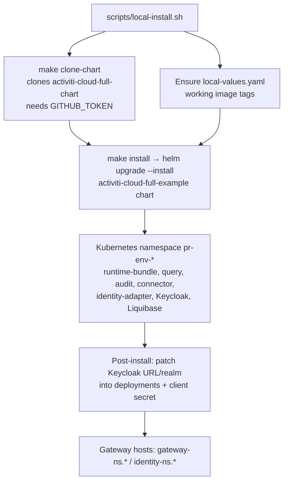

# Deployment Reference

Activiti Cloud is deployed to Kubernetes with Helm. The `activiti-cloud` repository ships the services and their Spring Boot starters; the deployment chart itself lives in a companion repository, [`Activiti/activiti-cloud-full-chart`](https://github.com/Activiti/activiti-cloud-full-chart), which the build tooling clones and versions automatically.

This page is the reference for what a deployment contains and how its pieces are named and configured. For the step-by-step local setup, see [Local Development Setup](../getting-started/local-setup.md).

## How a Deployment Happens



Key facts about the Helm step (from the `Makefile`):

- Chart: `activiti-cloud-full-example` inside the cloned full-chart repository (checked out to `.git/activiti-cloud-full-chart`).
- Broker and topology are selected with Helm `--values` files: `rabbitmq-values.yaml` or `kafka-values.yaml`, plus `partitioned-values.yaml` / `non-partitioned-values.yaml` (partitioning) and `default-destinations-values.yaml` / `override-destinations-values.yaml` (destinations). The install script picks the partitioned/destinations variants from the `MESSAGING_PARTITIONED` and `MESSAGING_DESTINATIONS` choices.
- Fixed `--set` flags: `global.application.name=default-app`, `global.keycloak.clientSecret=<uuid>`, `global.gateway.http=false`, `global.gateway.domain=${GLOBAL_GATEWAY_DOMAIN}`.
- Safety flags: `--atomic --wait --timeout 8m --create-namespace`.
- `make clone-chart` requires a `GITHUB_TOKEN` environment variable.

## Deployed Components

| Component | Deployment name | Image | Role |
|-----------|-----------------|-------|------|
| Runtime Bundle | `{ns}-runtime-bundle` | `docker.io/activiti/example-runtime-bundle:{version}` | Write side; hosts the engine and the primary REST API |
| Query Service | `{ns}-activiti-cloud-query` | `docker.io/activiti/activiti-cloud-query:{version}` | Read-side query model and REST API |
| Audit Service | (chart-managed) | (chart-managed; `local-values.yaml` does not pin it) | Append-only, immutable event log and REST API (`/audit/v1`, `/audit/admin/v1`) |
| Connector | `{ns}-activiti-cloud-connector` | `docker.io/activiti/example-cloud-connector:{version}` | Reference connector application |
| Identity Adapter | `{ns}-activiti-cloud-identity-adapter` | `docker.io/activiti/activiti-cloud-identity-adapter:{version}` | Bridges external identity providers to Keycloak |
| Keycloak | (chart-managed) | chart-managed | Realm, clients, and token issuing |
| Liquibase | (chart-managed) | chart-managed | Database schema management |

`{ns}` is the generated namespace (below). The example services are the default deployment target; production deployments replace them with your own runtime bundle, query, and connector applications built from the Spring Boot starters. See the per-service documentation under [Services](../index.md#the-platform-at-a-glance).

## Namespace Naming

The namespace (`PREVIEW_NAME`) is derived from the installation parameters:

```text
pr-{environment-name}-{broker:0:6}-{p|n}-{d|o}
```

| Segment | Values | Example |
|---------|--------|---------|
| `environment-name` | the `-n` argument | `my-env` |
| `broker:0:6` | first 6 chars of the broker: `rabbit` (RabbitMQ) or `kafka` | `rabbit` |
| `p\|n` | partitioned messaging: `p` or `n` | `n` |
| `d\|o` | destination mode: `d` = default, `o` = override | `d` |

Examples: `pr-my-env-rabbit-n-d`, `pr-feature-x-kafka-p-o`.

Gateway and identity hosts follow the same namespace:

| Host | Pattern |
|------|---------|
| API gateway | `gateway-{ns}.{GLOBAL_GATEWAY_DOMAIN}` |
| Identity (Keycloak) | `identity-{ns}.{GLOBAL_GATEWAY_DOMAIN}` |

`GLOBAL_GATEWAY_DOMAIN` is `{CLUSTER_NAME}.{CLUSTER_DOMAIN}` for Rancher-managed clusters.

## Environment Variables

The install tooling reads these variables:

| Variable | Values / meaning |
|----------|------------------|
| `PREVIEW_NAME` | Generated namespace (see above); also accepted as direct input |
| `CLUSTER_NAME` | Target cluster (Rancher) |
| `MESSAGING_BROKER` | `rabbitmq` or `kafka` |
| `MESSAGING_PARTITIONED` | `true` or `false` |
| `MESSAGING_DESTINATIONS` | `default` or `override` |
| `GLOBAL_GATEWAY_DOMAIN` | Base domain for gateway/identity hosts |
| `GITHUB_TOKEN` | Required by `make clone-chart` |
| `KUBECTL` | Optional path override for the kubectl binary |

Runtime configuration of the services themselves uses Spring Boot properties with `ACT_` environment variable prefixes — for example `ACT_MESSAGING_BROKER`, `ACT_QUERY_CONSUMER_DEST`, `ACT_KEYCLOAK_URL`, `ACT_KEYCLOAK_REALM`. See the configuration tables in [Runtime Bundle Service](../services/runtime-bundle.md), [Query Service](../services/query.md), and [Identity & Security](../architecture/identity.md).

## Image Versioning

Service images are published to Docker Hub as `docker.io/activiti/{module}:{version}`. `make docker/{module}` builds and pushes an image for a module.

For local and preview deployments, `local-values.yaml` (repository root) pins known-good image tags per component and avoids pulling unreleased PR images:

```yaml
runtime-bundle:
  image:
    tag: "8.8.0-alpha.108"
    pullPolicy: IfNotPresent

activiti-cloud-query:
  image:
    tag: "8.8.0-alpha.108"
    pullPolicy: IfNotPresent

activiti-cloud-connector:
  image:
    tag: "8.8.0-alpha.108"
    pullPolicy: IfNotPresent

activiti-cloud-identity-adapter:
  image:
    tag: "8.8.0-alpha.108"
    pullPolicy: IfNotPresent
```

The install script creates this file automatically when missing (via `resolve-docker-images.sh`), and `--no-local-images` opts out of it in favor of the version generated for the build.

## Post-Install Identity Configuration

After the Helm release is ready, `local-install.sh` configures identity:

1. Patches the `activiti-keycloak-client` secret with the Keycloak client secret you supplied (the `KEYCLOAK_CLIENT_SECRET` environment variable or the interactive prompt) — for the existing `activiti-keycloak` client in the `alfresco` realm. This is distinct from the `global.keycloak.clientSecret` UUID the Helm install generates.
2. Patches each of the four service deployments with `ACT_KEYCLOAK_URL` and `ACT_KEYCLOAK_REALM` environment variables.
3. Rolls out the identity adapter to pick up the new configuration.

If you deploy without the script, set these variables (and the Keycloak client secret) yourself — see [Identity & Security](../architecture/identity.md).

## API Routes

Services expose `/v1/...` (user) and `/admin/v1/...` (admin) APIs. When reached through the deployed gateway, the routes are prefixed per service (gateway routing is defined in the full-chart repository):

| Service | Gateway route | Service-level path |
|---------|---------------|--------------------|
| Runtime Bundle | `/rb` | `/v1`, `/admin/v1` |
| Query | `/query` | `/v1`, `/admin/v1` |
| Audit | `/audit` | `/v1`, `/admin/v1` |

For example, listing process instances through the gateway is `GET http://gateway-{ns}.{domain}/query/v1/process-instances`. Endpoint details are documented in [Runtime Bundle Service](../services/runtime-bundle.md) and [Query Service](../services/query.md).

Accessing locally:

```bash
kubectl port-forward svc/ingress-nginx-controller 8080:80 -n default
```

then call `http://localhost:8080/` with the gateway `Host` header. See [Local Development Setup](../getting-started/local-setup.md#local-access) for the full `/etc/hosts` + port-forward procedure.

## Removing a Deployment

```bash
make delete PREVIEW_NAME=pr-my-env-rabbit-n-d
```

This runs `helm uninstall {ns} --namespace {ns}` and then `kubectl delete ns {ns}`. To clean up fully, also remove any `/etc/hosts` entries and stop the port-forward.

## Troubleshooting Pointers

| Symptom | First things to check |
|---------|-----------------------|
| Pods not ready | `kubectl get pods -n {ns}`; logs of `runtime-bundle` and `activiti-cloud-query` |
| Gateway not reachable | Port-forward active? Correct `Host` header? Ingress in namespace `default` |
| 401/403 on API calls | Keycloak URL/realm env vars on the service; client role (`ACTIVITI_USER` vs `ACTIVITI_ADMIN`) |
| No data in query service | Consumer connected to the broker (`engineEvents` destination); consumer group lag |
| Wrong image pulled | `local-values.yaml` tags; `pullPolicy` |

Full diagnostics commands are in [Local Development Setup](../getting-started/local-setup.md#troubleshooting).
