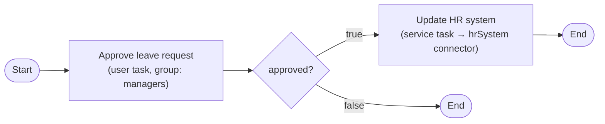
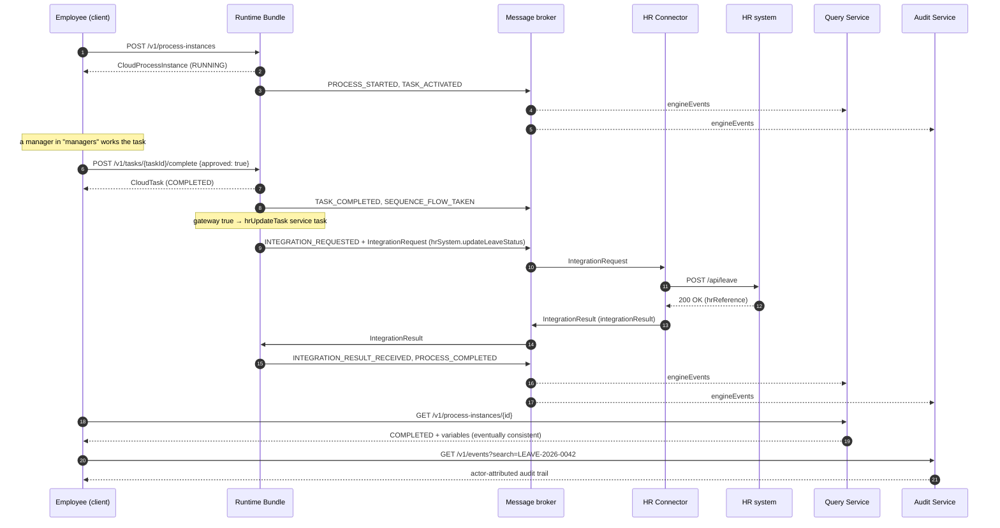

# End-to-End Example

This walkthrough follows a single business process through every layer of Activiti Cloud. It is a realistic, self-contained example you can adapt: an **employee leave request** that a manager approves, and that — once approved — updates an external HR system through an outbound connector.

Along the way you will see:

- how a process is **deployed** to the [runtime bundle service](../services/runtime-bundle.md)
- how a user task is **started, listed, and completed** through the REST API
- how a **service task** hands work to a connector over the message broker and continues when the result comes back
- how you read the **result back from the query service** (the read side)
- how you inspect the **audit trail** in the audit service

The full request/response reference for every endpoint used here lives on the [Runtime Bundle Service](../services/runtime-bundle.md) page.

## The business requirement and why the cloud architecture fits

**Requirement.** When an employee requests leave, a manager must approve or reject it. Approved leave has to be recorded in the HR system of record; rejected requests simply end. The HR system is an external REST service that cannot be embedded in the workflow engine.

**Why this fits Activiti Cloud:**

| Requirement | Activiti Cloud answer |
|-------------|----------------------|
| Human approval step | A BPMN **user task** with candidate groups; completed via `POST /v1/tasks/{taskId}/complete`. |
| Call an external system | A BPMN **service task** wired to an **outbound connector**. The runtime bundle publishes an `IntegrationRequest` over the broker; the connector service calls the HR REST API and publishes the result back. The process waits and resumes — no synchronous coupling, and the engine survives an HR outage. |
| Branch on the decision | An **exclusive gateway** on the `approved` variable set at task completion. |
| Audit who did what | Every action is an event with the acting user, appended to the **audit service**. |
| Search and report on requests | The **query service** projects a read-optimized model of instances, tasks, and variables from the event stream. |
| Independent scaling | The write side (runtime bundle) and the read side (query, audit) scale separately; a spike in HR calls never blocks task completion. |

The two read-side services (query and audit) never touch the engine database. They rebuild their state from the `engineEvents` stream, so they are **eventually consistent** with the runtime bundle. See [Event-Driven Design](../architecture/event-driven.md) for the delivery guarantees.

## The process

The process `leaveRequestProcess` has one user task, one exclusive gateway, and one service task backed by the `hrSystem` connector:



### BPMN 2.0 model

```xml
<?xml version="1.0" encoding="UTF-8"?>
<bpmn2:definitions xmlns:xsi="http://www.w3.org/2001/XMLSchema-instance"
                   xmlns:bpmn2="http://www.omg.org/spec/BPMN/20100524/MODEL"
                   xmlns:activiti="http://activiti.org/bpmn"
                   id="LeaveRequestDefinitions"
                   targetNamespace="http://activiti.org/bpmn"
                   xsi:schemaLocation="http://www.omg.org/spec/BPMN/20100524/MODEL BPMN20.xsd">
  <bpmn2:process id="leaveRequestProcess" name="Employee Leave Request" isExecutable="true">
    <bpmn2:documentation>Approves a leave request and, if approved, records it in the HR system.</bpmn2:documentation>
    <bpmn2:startEvent id="startEvent" name="Leave requested">
      <bpmn2:outgoing>flow1</bpmn2:outgoing>
    </bpmn2:startEvent>
    <bpmn2:sequenceFlow id="flow1" sourceRef="startEvent" targetRef="approvalTask"/>
    <bpmn2:userTask id="approvalTask" name="Approve leave request" activiti:candidateGroups="managers">
      <bpmn2:incoming>flow1</bpmn2:incoming>
      <bpmn2:outgoing>flow2</bpmn2:outgoing>
    </bpmn2:userTask>
    <bpmn2:sequenceFlow id="flow2" sourceRef="approvalTask" targetRef="approvalGateway"/>
    <bpmn2:exclusiveGateway id="approvalGateway" name="Approved?">
      <bpmn2:incoming>flow2</bpmn2:incoming>
      <bpmn2:outgoing>flow3</bpmn2:outgoing>
      <bpmn2:outgoing>flow4</bpmn2:outgoing>
    </bpmn2:exclusiveGateway>
    <bpmn2:sequenceFlow id="flow3" sourceRef="approvalGateway" targetRef="hrUpdateTask">
      <bpmn2:conditionExpression xsi:type="bpmn2:tFormalExpression">${approved == true}</bpmn2:conditionExpression>
    </bpmn2:sequenceFlow>
    <bpmn2:sequenceFlow id="flow4" sourceRef="approvalGateway" targetRef="rejectedEnd">
      <bpmn2:conditionExpression xsi:type="bpmn2:tFormalExpression">${approved == false}</bpmn2:conditionExpression>
    </bpmn2:sequenceFlow>
    <bpmn2:serviceTask id="hrUpdateTask" name="Update HR system" implementation="hrSystem.updateLeaveStatus">
      <bpmn2:incoming>flow3</bpmn2:incoming>
      <bpmn2:outgoing>flow5</bpmn2:outgoing>
    </bpmn2:serviceTask>
    <bpmn2:sequenceFlow id="flow5" sourceRef="hrUpdateTask" targetRef="approvedEnd"/>
    <bpmn2:endEvent id="approvedEnd" name="Leave recorded">
      <bpmn2:incoming>flow5</bpmn2:incoming>
    </bpmn2:endEvent>
    <bpmn2:endEvent id="rejectedEnd" name="Leave rejected">
      <bpmn2:incoming>flow4</bpmn2:incoming>
    </bpmn2:endEvent>
  </bpmn2:process>
</bpmn2:definitions>
```

Two things to notice:

- The user task uses the `activiti:` extension `candidateGroups` (hence the `xmlns:activiti="http://activiti.org/bpmn"` namespace). Only users in the `managers` group can claim and complete it.
- The service task's `implementation` attribute is the **connector reference**: `<connectorName>.<actionName>`. Here it is `hrSystem.updateLeaveStatus`, which matches the connector definition below. This is what routes the task to the connector over the broker instead of calling an in-process bean.

### Process extensions (connector variable mapping)

A sidecar JSON file, named after the process definition key and placed next to the BPMN file, declares the start-form variables and maps the process variables into the connector's inputs and outputs. This example follows the format used by the runtime bundle examples:

```json
{
  "id": "leaveRequestProcess",
  "type": "PROCESS",
  "extensions": {
    "leaveRequestProcess": {
      "properties": {
        "employeeIdId": { "id": "employeeIdId", "name": "employeeId", "type": "string", "value": "", "required": true },
        "leaveStartId": { "id": "leaveStartId", "name": "leaveStart", "type": "string", "value": "", "required": true },
        "leaveDaysId":  { "id": "leaveDaysId",  "name": "leaveDays",  "type": "integer", "value": 0,  "required": true }
      },
      "mappings": {
        "hrUpdateTask": {
          "inputs": {
            "employeeId": { "type": "variable", "value": "employeeId" },
            "leaveStart": { "type": "variable", "value": "leaveStart" },
            "leaveDays":  { "type": "variable", "value": "leaveDays" }
          },
          "outputs": {
            "hrReference": { "type": "variable", "value": "hrReference" }
          }
        }
      }
    }
  }
}
```

In `mappings.hrUpdateTask.inputs`, each key is a **connector input name** and the `value` is the **process variable** that supplies it (`type: variable`). `outputs` does the reverse: the connector output `hrReference` is written back to the process variable `hrReference`. The `approved` variable is set by the task completion call, not declared here, because it is a decision input rather than a start-form field.

## Connector configuration

A connector is a separate Spring Boot service that subscribes to the broker destination matching the service task reference, calls the external system, and publishes the result back. The runtime bundle discovers and serves the connector's shape (its `ConnectorDefinition`) from JSON files under `connectors/` (default `activiti.connectors.dir`, `classpath:/connectors/`).

### Connector definition

```json
{
  "id": "hrSystemId",
  "name": "hrSystem",
  "description": "HR system integration connector",
  "actions": {
    "updateLeaveStatusId": {
      "id": "updateLeaveStatusId",
      "name": "updateLeaveStatus",
      "inputs": [
        { "id": "employeeIdInput",   "name": "employeeId",   "type": "string",  "required": true },
        { "id": "leaveStartInput",   "name": "leaveStart",   "type": "string",  "required": true },
        { "id": "leaveDaysInput",    "name": "leaveDays",    "type": "integer", "required": true }
      ],
      "outputs": [
        { "id": "hrReferenceOutput", "name": "hrReference",  "type": "string" }
      ]
    }
  }
}
```

The service task references the action by **name** as `hrSystem.updateLeaveStatus`. The connector `name` must not contain a `.` and must be unique.

### Connector service binding and implementation

The connector service binds a Spring Cloud Stream input to the destination matching the service task reference and implements a `ConsumerConnector`. The binding name and destination are configured in `application.properties`:

```properties
spring.application.name=hr-connector
spring.cloud.stream.bindings.hr-connector.destination=hrSystem.updateLeaveStatus
spring.cloud.stream.bindings.hr-connector.group=${spring.application.name}
spring.cloud.stream.bindings.hr-connector.contentType=application/json
spring.rabbitmq.host=${ACT_RABBITMQ_HOST:localhost}
activiti.cloud.application.name=default-app
```

The handler reads the inbound variables, calls the HR REST API, and returns an `IntegrationResult` with the outbound variables (see `IntegrationResultBuilder`):

```java
@ConnectorBinding(input = HrConnectorChannels.HR_CONNECTOR, connectorType = "hrSystem.updateLeaveStatus")
@Component
public class HrConnector implements ConsumerConnector<IntegrationRequest> {

    private final RestTemplate restTemplate = new RestTemplate();
    private final ConnectorProperties connectorProperties;
    private final IntegrationResultSender integrationResultSender;

    public HrConnector(ConnectorProperties connectorProperties, IntegrationResultSender integrationResultSender) {
        this.connectorProperties = connectorProperties;
        this.integrationResultSender = integrationResultSender;
    }

    @Override
    public void accept(IntegrationRequest request) {
        IntegrationContext context = request.getIntegrationContext();
        Map<String, Object> in = context.getInBoundVariables();

        Map<String, Object> body = Map.of(
            "employeeId", in.get("employeeId"),
            "leaveStart", in.get("leaveStart"),
            "leaveDays", in.get("leaveDays")
        );

        ResponseEntity<Map> response = restTemplate.postForEntity(
            "https://hr.example.com/api/leave", body, Map.class);

        Map<String, Object> results = new HashMap<>(response.getBody());
        results.put("hrReference", "HR-" + in.get("employeeId"));

        Message<IntegrationResult> message = IntegrationResultBuilder
            .resultFor(request, connectorProperties)
            .withOutboundVariables(results)
            .buildMessage();
        integrationResultSender.send(message);
    }
}
```

The `IntegrationRequest` the connector receives contains the integration context (process and definition coordinates, `connectorType`, and `inBoundVariables`) plus the `resultDestination` and `errorDestination` where to reply. The runtime bundle continues the process when it consumes the `IntegrationResult`. For the full connector programming model and error handling, see [Outbound Connectors](../connectors/outbound.md).

## Step by step

Assume the runtime bundle, the HR connector, the query service, the audit service, and the broker are running (see [Local Development Setup](../getting-started/local-setup.md)). In the request examples below, `RB`, `QUERY`, and `AUDIT` are the base URLs of the runtime bundle, the query service, and the audit service. Each service exposes its API at its own root with no extra context path, so the base paths are `/v1` (and `/admin/v1` for admin operations). Locally, all services are usually reached through the same port-forwarded ingress with a different `Host` header per service; in other environments each service has its own host. Replace `<token>` with an OAuth2 bearer token.

### Step 1: Deploy the process definition

Package the BPMN model, the process extensions file, and the connector definition into the runtime bundle application and start it; the engine validates and auto-deploys the process at startup:

```text
src/main/resources/
  processes/
    leaveRequestProcess.bpmn20.xml          # the BPMN model above
    leaveRequestProcess-extensions.json     # the process extensions above
  connectors/
    hrSystem.json                           # the connector definition above
```

There is no deploy REST endpoint — confirm the deployment by listing definitions:

```http
GET RB/v1/process-definitions HTTP/1.1
Authorization: Bearer <token>
```

```json
{
  "_embedded": {
    "process-definitions": [
      {
        "id": "leaveRequestProcess_1",
        "name": "Employee Leave Request",
        "key": "leaveRequestProcess",
        "version": 1,
        "formKey": null,
        "category": "http://activiti.org/process",
        "appName": "default-app",
        "serviceName": "rb",
        "_links": {
          "self": { "href": "http://localhost:8080/v1/process-definitions/leaveRequestProcess_1" }
        }
      }
    ]
  },
  "page": { "size": 10, "totalElements": 1, "totalPages": 1, "number": 0 }
}
```

You can confirm the connector definition is registered with `GET RB/v1/connector-definitions/hrSystemId`.

### Step 2: Start the process instance

```http
POST RB/v1/process-instances HTTP/1.1
Authorization: Bearer <token>
Content-Type: application/json

{
  "processDefinitionKey": "leaveRequestProcess",
  "name": "Leave request for jdoe",
  "businessKey": "LEAVE-2026-0042",
  "variables": {
    "employeeId": "jdoe",
    "leaveStart": "2026-08-24",
    "leaveDays": 5
  }
}
```

```json
{
  "id": "a1b2c3d4-0000-4000-8000-000000000001",
  "name": "Leave request for jdoe",
  "initiator": "jdoe",
  "businessKey": "LEAVE-2026-0042",
  "status": "RUNNING",
  "processDefinitionKey": "leaveRequestProcess",
  "processDefinitionVersion": 1,
  "_links": {
    "self": { "href": "http://localhost:8080/v1/process-instances/a1b2c3d4-0000-4000-8000-000000000001" },
    "variables": { "href": "http://localhost:8080/v1/process-instances/a1b2c3d4-0000-4000-8000-000000000001/variables" }
  }
}
```

The engine creates the instance, sets the three variables, and activates the `approvalTask` user task. The instance is now waiting on a human.

### Step 3: Find and complete the approval task

The task is visible to users in the `managers` group. List the instance's tasks:

```http
GET RB/v1/process-instances/a1b2c3d4-0000-4000-8000-000000000001/tasks HTTP/1.1
Authorization: Bearer <token>
```

```json
{
  "_embedded": {
    "tasks": [
      {
        "id": "d4e5f6a7-0000-4000-8000-000000000002",
        "name": "Approve leave request",
        "status": "CREATED",
        "processInstanceId": "a1b2c3d4-0000-4000-8000-000000000001",
        "taskDefinitionKey": "approvalTask",
        "candidateGroups": [ "managers" ],
        "_links": {
          "self": { "href": "http://localhost:8080/v1/tasks/d4e5f6a7-0000-4000-8000-000000000002" },
          "claim": { "href": "http://localhost:8080/v1/tasks/d4e5f6a7-0000-4000-8000-000000000002/claim" },
          "complete": { "href": "http://localhost:8080/v1/tasks/d4e5f6a7-0000-4000-8000-000000000002/complete" }
        }
      }
    ]
  },
  "page": { "size": 10, "totalElements": 1, "totalPages": 1, "number": 0 }
}
```

A manager claims it, then completes it with the decision variable:

```http
POST RB/v1/tasks/d4e5f6a7-0000-4000-8000-000000000002/complete HTTP/1.1
Authorization: Bearer <manager-token>
Content-Type: application/json

{
  "variables": { "approved": true }
}
```

```json
{
  "id": "d4e5f6a7-0000-4000-8000-000000000002",
  "name": "Approve leave request",
  "status": "COMPLETED",
  "completedBy": "manager1",
  "processInstanceId": "a1b2c3d4-0000-4000-8000-000000000001",
  "_links": {
    "self": { "href": "http://localhost:8080/v1/tasks/d4e5f6a7-0000-4000-8000-000000000002" }
  }
}
```

Completing the task evaluates the gateway condition `${approved == true}`, takes the `true` branch, and activates the `hrUpdateTask` service task.

### Step 4: The outbound connector runs

When the execution reaches the `hrUpdateTask` service task, the runtime bundle:

1. Stores the integration context and, **after the engine transaction commits**, publishes an `IntegrationRequest` to the `hrSystem.updateLeaveStatus` destination.
2. Emits an `INTEGRATION_REQUESTED` event.
3. Puts the execution in a waiting state.

The `IntegrationRequest` payload:

```json
{
  "integrationContext": {
    "processInstanceId": "a1b2c3d4-0000-4000-8000-000000000001",
    "rootProcessInstanceId": "a1b2c3d4-0000-4000-8000-000000000001",
    "executionId": "e9f8a7b6-0000-4000-8000-000000000003",
    "processDefinitionId": "leaveRequestProcess_1",
    "processDefinitionKey": "leaveRequestProcess",
    "processDefinitionVersion": 1,
    "businessKey": "LEAVE-2026-0042",
    "connectorType": "hrSystem.updateLeaveStatus",
    "inBoundVariables": {
      "employeeId": "jdoe",
      "leaveStart": "2026-08-24",
      "leaveDays": 5
    },
    "outBoundVariables": {}
  },
  "resultDestination": "integrationResult",
  "errorDestination": "integrationError"
}
```

The HR connector consumes it, calls `POST https://hr.example.com/api/leave`, and publishes an `IntegrationResult` with the outbound variables mapped back (the `hrReference` output). The runtime bundle consumes the result, sets `hrReference` on the process, marks the service task complete, and the instance reaches `approvedEnd`.

> **Note:** If the HR system is down, the connector publishes an `IntegrationError` to `integrationError`, the runtime bundle emits `INTEGRATION_ERROR_RECEIVED`, and BPMN error handling (an error boundary or error end event) takes over. The process does not silently lose data. See [Event-Driven Design](../architecture/event-driven.md#error-handling).

### Step 5: Read the result back from the query service

The query service has projected the instance and its variables from the event stream. Read the completed instance:

```http
GET QUERY/v1/process-instances/a1b2c3d4-0000-4000-8000-000000000001 HTTP/1.1
Authorization: Bearer <token>
```

```json
{
  "id": "a1b2c3d4-0000-4000-8000-000000000001",
  "name": "Leave request for jdoe",
  "processDefinitionKey": "leaveRequestProcess",
  "businessKey": "LEAVE-2026-0042",
  "status": "COMPLETED",
  "initiator": "jdoe",
  "startDate": "2026-08-15T10:15:30.000+00:00",
  "completedDate": "2026-08-15T11:04:02.000+00:00",
  "_links": {
    "self": { "href": "/v1/process-instances/a1b2c3d4-0000-4000-8000-000000000001" }
  }
}
```

Read the final variables, including the connector's `hrReference` output:

```http
GET QUERY/v1/process-instances/a1b2c3d4-0000-4000-8000-000000000001/variables HTTP/1.1
Authorization: Bearer <token>
```

```json
{
  "_embedded": {
    "variables": [
      { "name": "employeeId",  "type": "java.lang.String",       "value": "jdoe" },
      { "name": "leaveStart",  "type": "java.lang.String",       "value": "2026-08-24" },
      { "name": "leaveDays",   "type": "java.math.BigDecimal",   "value": 5 },
      { "name": "approved",    "type": "java.lang.Boolean",      "value": true },
      { "name": "hrReference", "type": "java.lang.String",       "value": "HR-jdoe" }
    ]
  },
  "page": { "size": 10, "totalElements": 5, "totalPages": 1, "number": 0 }
}
```

(`type` is the engine's variable type name; the `integer`-typed `leaveDays` is stored as `java.math.BigDecimal`.)

The query endpoints also accept QueryDSL-style predicate parameters (for example `?status=COMPLETED&processDefinitionKey=leaveRequestProcess`) for search and reporting. See the [Query Service](../services/query.md) page for the full read API.

### Step 6: Check the audit trail

The audit service keeps an immutable, actor-attributed log of every event. Search it (the `search` parameter is free text over the event, and the time window is optional):

```http
GET AUDIT/v1/events?search=LEAVE-2026-0042 HTTP/1.1
Authorization: Bearer <token>
```

```json
{
  "_embedded": {
    "events": [
      {
        "id": "evt-0001",
        "timestamp": 1786788930000,
        "eventType": "PROCESS_STARTED",
        "entityId": "a1b2c3d4-0000-4000-8000-000000000001",
        "actor": "jdoe",
        "appName": "default-app",
        "serviceName": "rb"
      },
      {
        "id": "evt-0002",
        "timestamp": 1786791732000,
        "eventType": "TASK_COMPLETED",
        "entityId": "d4e5f6a7-0000-4000-8000-000000000002",
        "actor": "manager1",
        "appName": "default-app",
        "serviceName": "rb"
      },
      {
        "id": "evt-0003",
        "timestamp": 1786791842000,
        "eventType": "INTEGRATION_RESULT_RECEIVED",
        "entityId": "e9f8a7b6-0000-4000-8000-000000000003",
        "actor": "service_user",
        "appName": "default-app",
        "serviceName": "rb"
      }
    ]
  },
  "page": { "size": 10, "totalElements": 3, "totalPages": 1, "number": 0 }
}
```

Each entry carries the `eventType`, the affected entity, and the `actor` (the user who caused it, or `service_user` for engine-driven actions). Fetch a single event by id with `GET /v1/events/{eventId}`.

## The whole flow



## Making it yours

This example is deliberately small. The same patterns scale up with the standard BPMN and Activiti features:

- **Variables.** Add more start-form fields in the `properties` section of the process extensions file and pass them in the start payload. Use `${...}` expressions in gateway conditions and task assignments. See [BPMN elements in Activiti](../../activiti/bpmn/index.md).
- **Multiple approvers.** Replace the single user task with a **multi-instance** user task (one instance per candidate from a variable) so every listed manager must approve. See [Multi-Instance](../../activiti/bpmn/reference/multi-instance.md).
- **Sub-processes.** Break the flow into a call-activity or embedded sub-process — for example, a reusable "record in HR system" sub-process — and query child instances with `GET /v1/process-instances/{id}/subprocesses`. See [BPMN elements in Activiti](../../activiti/bpmn/index.md).
- **Error and compensation.** Add an error boundary event on the service task to compensate the HR update if it fails mid-flow. See [Event-Driven Design](../architecture/event-driven.md).
- **More integrations.** Add additional connector actions to the same connector service (comma-separate destinations in the binding) or add more connector services. Each is an independent Spring Boot app.
- **Push to the UI.** Subscribe to engine events over the notifications-graphql service to drive a live dashboard instead of polling the query service.

## Related

- [Runtime Bundle Service](../services/runtime-bundle.md)
- [Architecture Overview](../architecture/overview.md)
- [Event-Driven Design](../architecture/event-driven.md)
- [Local Development Setup](../getting-started/local-setup.md)
- [BPMN Elements in Activiti](../../activiti/bpmn/index.md)
