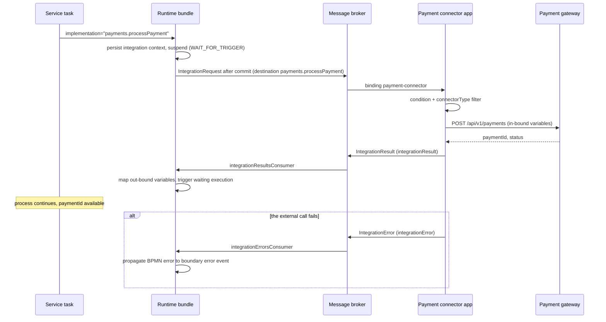

# Building a Custom Connector App

**Module:** `activiti-cloud-connectors` (Activiti Cloud 9.0.0, Spring Boot 3.5.7, Java 25)

The [Connectors Overview](../connectors/overview.md) and [Outbound Connectors](../connectors/outbound.md) pages describe *what* a connector is and *how* the platform exchanges messages with it. This page is the hands-on guide: building a connector application of your own, from the Maven coordinates to the consumer function, the broker bindings, error handling, tests, and deployment. A connector application is a standalone Spring Boot app that declares **connector functions** — beans annotated with `@ConnectorBinding` that consume `IntegrationRequest` messages from the runtime bundle — performs the external call with its own clients and credentials, replies with an `IntegrationResult` (success) or `IntegrationError` (failure), and runs as its own container, scaled independently of the processes. Everything here is for **outbound** connectors (service task driven); an **inbound** connector is also a plain Spring Boot app but is driven by external events and does not need the connector starter — see [Inbound Connectors](../connectors/inbound.md).

## Anatomy of a connector application

### 1. Maven coordinates

Two dependencies: the connector starter (the `@ConnectorBinding` machinery, result/error senders, error handler) and the messaging starter (the Spring Cloud Stream binder — RabbitMQ and Kafka both come in at runtime scope, matching the platform):

```xml
<dependencies>
    <dependency>
        <groupId>org.activiti.cloud</groupId>
        <artifactId>activiti-cloud-starter-connector</artifactId>
        <version>9.0.0</version>
    </dependency>
    <dependency>
        <groupId>org.activiti.cloud</groupId>
        <artifactId>activiti-cloud-service-messaging-starter</artifactId>
        <version>9.0.0</version>
    </dependency>
</dependencies>
```

In a full application, import the platform BOMs (`activiti-cloud-connectors-dependencies` and `activiti-cloud-service-common-dependencies`, version `9.0.0`) in `dependencyManagement` instead of pinning versions. The starter transitively brings the payload models (`org.activiti.cloud.api.process.model.*`), the engine API models, Spring Cloud Stream, a web layer, and the actuator.

### 2. Application class

```java
package org.example.payment;

import org.activiti.cloud.connectors.starter.configuration.EnableActivitiCloudConnector;
import org.springframework.boot.SpringApplication;
import org.springframework.boot.autoconfigure.SpringBootApplication;

@SpringBootApplication
@EnableActivitiCloudConnector
public class PaymentConnectorApp {

    public static void main(String[] args) {
        SpringApplication.run(PaymentConnectorApp.class, args);
    }
}
```

`@EnableActivitiCloudConnector` is a meta-annotation composed of `@EnableDiscoveryClient` and `@EnableAutoConfiguration`; the auto-configuration the starter registers (`ActivitiCloudConnectorAutoConfiguration`) wires the beans below.

### 3. What the starter wires

All `@ConditionalOnMissingBean`, so you can replace any of them:

| Bean | Type | Role |
|------|------|------|
| `connectorProperties` | `ConnectorProperties` | Identity stamped onto outgoing payloads; prefix `activiti.cloud.connector` |
| `integrationResultDestinationBuilder` | `IntegrationResultDestinationBuilder` | Computes the destination an `IntegrationResult` goes to |
| `integrationResultChannelResolver` | `IntegrationResultChannelResolver` | Delegates to the destination builder |
| `integrationResultSender` | `IntegrationResultSender` | Publishes `IntegrationResult` through `StreamBridge` |
| `integrationErrorDestinationBuilder` | `IntegrationErrorDestinationBuilder` | Computes the destination an `IntegrationError` goes to |
| `integrationErrorChannelResolver` | `IntegrationErrorChannelResolver` | Delegates to the destination builder |
| `integrationErrorSender` | `IntegrationErrorSender` | Publishes `IntegrationError` through `StreamBridge` |
| `integrationErrorHandler` | `IntegrationErrorHandler` | Converts a failed request message into an `IntegrationError` carrying the original exception |
| `integrationRequestErrorChannelListener` | `IntegrationRequestErrorChannelListener` | The default error handler itself (`Consumer<ErrorMessage>`) |

The starter also loads `activiti-cloud-connector.properties` from its classpath:

| Property | Value | Meaning |
|----------|-------|---------|
| `activiti.cloud.connector.service-name` | `${spring.application.name}` | `serviceName` / `serviceFullName` on outgoing payloads |
| `activiti.cloud.connector.service-type` | `${activiti.cloud.service.type:}` | Starter `metadata.properties` sets `activiti.cloud.service.type=connector` |
| `activiti.cloud.connector.service-version` | `${activiti.cloud.service.version:}` | Service version on payloads |
| `activiti.cloud.connector.app-name` | `${activiti.cloud.application.name:}` | `appName` on payloads — must match the application name of the runtime bundle that sends the request |
| `activiti.cloud.connector.app-version` | `${activiti.cloud.application.version:}` | `appVersion` on payloads |
| `activiti.cloud.connector.mq-destination-separator` | `${activiti.cloud.messaging.destination-separator}` | Separator used to build destinations; default `_` |
| `activiti.cloud.connector.result-destination-override` | `${ACT_INT_RES_CONSUMER:}` | Empty by default; when set, **overrides the result destination for every request** the connector replies to |
| `activiti.cloud.connector.error-destination-override` | `${ACT_INT_ERR_CONSUMER:}` | Empty by default; same override for errors |
| `spring.cloud.stream.default.error-handler-definition` | `integrationRequestErrorChannelListener` | Wires the starter's error handler as the default Spring Cloud Stream error handler |

Destination resolution order, as implemented in `IntegrationResultDestinationBuilderImpl` / `IntegrationErrorDestinationBuilderImpl`: (1) the `result-destination-override` (or `error-destination-override`), when non-empty — wins over everything; (2) the `resultDestination` (or `errorDestination`) carried in the `IntegrationRequest` — the runtime bundle sets these from its own `integrationResultsConsumer` / `integrationErrorsConsumer` bindings (default destinations `integrationResult` / `integrationError`); (3) fallback `integrationResult` + separator + the request's `serviceFullName` (or `integrationError...`). In the default configuration a reply therefore lands on `integrationResult`, which the requesting bundle consumes with its `integrationResultsConsumer` binding.

### 4. The connector function

Two functional interfaces from `org.activiti.cloud.common.messaging.functional` mark a bean as a connector: `ConsumerConnector<T>` extends `Consumer<T>` — your code sends the reply itself, through `IntegrationResultSender` / `IntegrationErrorSender` (the pattern in this page); `Connector<T, R>` extends `Function<T, R>` — a non-null return value is published by the framework to the destination named in the message header given by `outputHeader` (default `resultDestination`).

Both are annotated with `@ConnectorBinding`:

| Attribute | Default | Meaning |
|-----------|---------|---------|
| `input` | `""` | Input channel the function consumes from — must match a binding channel (below) |
| `output` | `""` | Output channel for the returned message of a `Connector<T, R>` function |
| `condition` | SpEL: the message's `appVersion` header must be within `application.min.version`..`application.max.version` (`max` of `-1` = no upper bound) | Message filter applied before the function runs; `""` accepts everything |
| `outputHeader` | `resultDestination` | Header read from the message to find the reply destination of a returning function |
| `connectorType` | `""` | When non-empty, the message's `connectorType` header must equal it exactly; must equal the service task `implementation` value |
| `retry` | `0` | Max retries for a message rejected by the `condition` filter; `0` falls back to `activiti.connector.retry.default.max` (default `-1`, no retry) |
| `retryDelay` | `0` | Seconds to wait between retries; `0` falls back to `activiti.connector.retry.default.delay` (default `0`) |

The framework builds a filter pipeline around each function: first the `condition` filter (a rejected message is requeued up to `retry` times, sleeping `retryDelay` seconds between attempts and incrementing an `x-retry-count` header), then an exact match on the `connectorType` header (a mismatch is discarded silently — this is how one binding can serve many connector types). The `input` channel is declared with `@InputBinding` on a channel interface method; Spring Cloud Stream binds it to the broker using `spring.cloud.stream.bindings.<channel>.*` properties.

## The message flow



The request is published by the bundle **after the engine transaction commits**, on the destination named after the `implementation` string, and carries the **in-bound variables** selected by the process-extensions mapping (see [Outbound Connectors, payload mapping](../connectors/outbound.md#requestresponse-payload-mapping)). When the `IntegrationResult` arrives, the bundle deletes the stored integration context and triggers the waiting execution; out-bound variables become process variables according to the same extensions mapping (no mapping entry means nothing is written back).

## Step by step: a payment connector

Goal: a service task `implementation="payments.processPayment"` calls a payment gateway from a separate connector application and makes `paymentId` available to the process afterwards.

### 1. The BPMN side

The service task references the connector action through its standard BPMN `implementation` attribute (no `activiti:` prefix):

```xml
<serviceTask id="processPaymentTask" name="Process payment" implementation="payments.processPayment">
  <incoming>flowIn</incoming>
  <outgoing>flowOut</outgoing>
</serviceTask>
```

(`flowIn` and `flowOut` are the surrounding sequence flows of the full process.)

`implementation` is the connector type: the broker destination the bundle publishes to, the `connectorType` header value, and the value your binding must list. The connector definition JSON (contract of actions and variables) is packaged with the runtime bundle, not with the connector app — its schema is documented in [Outbound Connectors](../connectors/outbound.md#connector-definition).

### 2. The input channel

```java
package org.example.payment;

import org.activiti.cloud.common.messaging.functional.InputBinding;
import org.springframework.context.annotation.Configuration;
import org.springframework.integration.dsl.MessageChannels;
import org.springframework.messaging.SubscribableChannel;

public interface PaymentConnectorChannels {
    String PAYMENT_CONNECTOR = "payment-connector";

    @InputBinding(PAYMENT_CONNECTOR)
    default SubscribableChannel paymentConnector() {
        return MessageChannels.publishSubscribe(PAYMENT_CONNECTOR).getObject();
    }
}

@Configuration
public class PaymentConnectorConfiguration implements PaymentConnectorChannels {}
```

The binding name is `payment-connector` (the `@InputBinding` value); the channel constant is what `@ConnectorBinding(input = ...)` points at.

### 3. The connector

```java
package org.example.payment;

import com.fasterxml.jackson.databind.ObjectMapper;
import java.math.BigDecimal;
import java.time.Duration;
import java.util.HashMap;
import java.util.Map;
import org.activiti.cloud.api.process.model.CloudBpmnError;
import org.activiti.cloud.api.process.model.IntegrationRequest;
import org.activiti.cloud.common.messaging.functional.ConnectorBinding;
import org.activiti.cloud.common.messaging.functional.ConsumerConnector;
import org.activiti.cloud.connectors.starter.channels.IntegrationErrorSender;
import org.activiti.cloud.connectors.starter.channels.IntegrationResultSender;
import org.activiti.cloud.connectors.starter.configuration.ConnectorProperties;
import org.activiti.cloud.connectors.starter.model.IntegrationErrorBuilder;
import org.activiti.cloud.connectors.starter.model.IntegrationResultBuilder;
import org.springframework.http.client.SimpleClientHttpRequestFactory;
import org.springframework.stereotype.Component;
import org.springframework.web.client.RestClient;
import org.springframework.web.client.RestClientResponseException;

@ConnectorBinding(
    input = PaymentConnectorChannels.PAYMENT_CONNECTOR,
    condition = "",
    connectorType = "payments.processPayment"
)
@Component
public class PaymentProcessor implements ConsumerConnector<IntegrationRequest> {

    private final IntegrationResultSender integrationResultSender;
    private final IntegrationErrorSender integrationErrorSender;
    private final ConnectorProperties connectorProperties;
    private final ObjectMapper objectMapper;
    private final RestClient restClient;

    public PaymentProcessor(
        IntegrationResultSender integrationResultSender,
        IntegrationErrorSender integrationErrorSender,
        ConnectorProperties connectorProperties,
        ObjectMapper objectMapper
    ) {
        this.integrationResultSender = integrationResultSender;
        this.integrationErrorSender = integrationErrorSender;
        this.connectorProperties = connectorProperties;
        this.objectMapper = objectMapper;
        SimpleClientHttpRequestFactory factory = new SimpleClientHttpRequestFactory();
        factory.setConnectTimeout(Duration.ofSeconds(5));
        factory.setReadTimeout(Duration.ofSeconds(10));
        this.restClient = RestClient.builder().requestFactory(factory).build();
    }

    @Override
    public void accept(IntegrationRequest request) {
        Map<String, Object> in = request.getIntegrationContext().getInBoundVariables();
        BigDecimal amount = new BigDecimal(in.get("amount").toString());

        try {
            Map<String, Object> response = restClient
                .post()
                .uri("http://payment-gateway/api/v1/payments")
                .body(Map.of(
                    "orderId", in.get("orderId"),
                    "amount", amount,
                    "currency", in.get("currency")
                ))
                .retrieve()
                .body(Map.class);

            Map<String, Object> results = new HashMap<>();
            results.put("paymentId", response.get("paymentId"));
            results.put("status", response.get("status"));

            integrationResultSender.send(
                IntegrationResultBuilder
                    .resultFor(request, connectorProperties)
                    .withOutboundVariables(results)
                    .buildMessage()
            );
        } catch (RestClientResponseException rejected) {
            integrationErrorSender.send(
                IntegrationErrorBuilder
                    .errorFor(request, connectorProperties,
                        new CloudBpmnError("PAYMENT_DECLINED", "Gateway rejected the payment"))
                    .buildMessage()
            );
        }
    }
}
```

Notes: `connectorType` must equal the service task `implementation` exactly; `condition = ""` skips the default `appVersion` range check (the reference connector does the same). `IntegrationResultBuilder.resultFor(request, connectorProperties)` reuses the request's `IntegrationContext`, stamps the connector identity from `ConnectorProperties`, and `buildMessage()` adds the `targetAppName` / `targetService` headers; `IntegrationResultSender` resolves the destination (see [destination resolution](#3-what-the-starter-wires)) and publishes. `IntegrationErrorBuilder.errorFor(request, connectorProperties, throwable)` wraps any `Throwable`; `CloudBpmnError(errorCode[, message | cause])` is the class the runtime bundle turns into a BPMN error. JSON-typed variables arrive as a deserialized tree and are converted with Jackson, the pattern the reference implementation uses:

```java
public record PaymentDetails(BigDecimal amount, String currency) {}

// inside accept(...):
PaymentDetails details = objectMapper.convertValue(
    request.getIntegrationContext().getInBoundVariable("paymentDetails"),
    PaymentDetails.class
);
```

The generic `getInBoundVariable(name)` returns `<T> T`, so scalars can be read with an expected type where the runtime type matches.

### 4. `application.properties`

```properties
spring.application.name=payment-connector

# the platform application this connector belongs to
activiti.cloud.application.name=default-app

# one input binding; destination lists the connector types it serves
spring.cloud.stream.bindings.payment-connector.destination=payments.processPayment
spring.cloud.stream.bindings.payment-connector.group=${spring.application.name}
spring.cloud.stream.bindings.payment-connector.contentType=application/json
spring.cloud.stream.rabbit.bindings.payment-connector.consumer.queue-name-group-only=true

# opt this binding into the function router route
activiti.cloud.messaging.function-router.routes.payment-connector.enabled=true
activiti.cloud.messaging.function-router.group=${spring.application.name}
```

| Key | Effect |
|-----|--------|
| `spring.application.name` | Consumer group and the connector's `service-name`; one group per application |
| `activiti.cloud.application.name` | Set to the application name of the runtime bundle(s) you serve, so the connector and the bundle agree on the application. The bundle stamps the request's `appName`; the reply's `appName` is stamped from the connector's own value of this property |
| `bindings.payment-connector.destination` | Comma-separated connector types the binding subscribes to; add more actions here (the reference connector lists eight in one binding) |
| `bindings.payment-connector.group` | Consumer group; `${spring.application.name}` gives one queue per app |
| `rabbit.bindings...queue-name-group-only` | All listed destinations share a single queue named after the group (RabbitMQ) |

**Function router.** `activiti.cloud.messaging.function-router.enabled` defaults to `false`, and the runtime bundle keeps it off in its own `metadata.properties` while declaring its consumer bindings as enabled routes (`routes.integrationResultsConsumer.enabled=true`, ...). Without the router — the default for a standalone connector — each `@InputBinding` channel gets its own consumer binding from the `bindings.<channel>.*` properties above. With the router enabled (for example through the environment in a full cluster), only the routes you have enabled with `routes.<channel>.enabled=true` are routed: their destinations are consumed through a single `functionRouterInput` binding (group = `activiti.cloud.messaging.function-router.group`) and each message is dispatched to the function whose `connectorType` matches the destination it was published to. The reply destinations (`integrationResult` / `integrationError`) are consumed by the **bundle**, not the connector — you do not configure them here.

## In-bundle connectors

You do not need a separate application when the logic is simple, stable, and can live on the runtime bundle's classpath. If the bundle contains a Spring bean whose **name** is exactly the service task `implementation` string and which implements the engine API interface `org.activiti.api.process.runtime.connector.Connector` (a `Function<IntegrationContext, IntegrationContext>` over the engine's `org.activiti.api.process.model.IntegrationContext`), then `MQServiceTaskBehavior` delegates to it in-process instead of publishing a message:

```java
package org.example.bundle;

import org.activiti.api.process.model.IntegrationContext;
import org.activiti.api.process.runtime.connector.Connector;
import org.springframework.stereotype.Component;

@Component("payments.processPayment")
public class LocalPaymentConnector implements Connector {

    @Override
    public IntegrationContext apply(IntegrationContext integrationContext) {
        String orderId = integrationContext.getInBoundVariable("orderId");
        // ... local call to the gateway ...
        integrationContext.addOutBoundVariable("paymentId", "PAY-555");
        return integrationContext;
    }
}
```

Differences from the cloud path: the call is synchronous on the engine thread (no broker round-trip, no waiting execution, no integration context row), and failures are engine exceptions rather than `IntegrationError` messages; in-bound and out-bound variables are computed and mapped with the same process-extensions logic. The trade-off table (isolation, scaling, blast radius, versioning) is in [Connectors Overview](../connectors/overview.md#connectors-vs-calling-a-service-directly); use an external connector application when the call crosses a system boundary or carries credentials you do not want in the runtime bundle image.

## Error handling and retries

| Failure | Behavior |
|---------|----------|
| Your function throws (any `RuntimeException`) | The starter's default error handler (`spring.cloud.stream.default.error-handler-definition=integrationRequestErrorChannelListener`) catches the failed message, rebuilds the original `IntegrationRequest`, and publishes an `IntegrationError` carrying the original exception class and stack trace through `IntegrationErrorSender` |
| You publish a `CloudBpmnError` as the error cause | The runtime bundle propagates a BPMN error on the waiting execution — a boundary error event with a matching `errorCode` fires; the [error handling section of Outbound Connectors](../connectors/outbound.md#error-handling) shows the BPMN side and the audit events |
| The error class is anything else | The bundle logs a warning, deletes the integration context, records an `INTEGRATION_ERROR_RECEIVED` event, and the execution stays waiting at the service task |
| A message fails the `condition` filter | Requeued up to `retry` times with `retryDelay` seconds between attempts (defaults: `activiti.connector.retry.default.max=-1`, no retry; `activiti.connector.retry.default.delay=0`); a mismatched `connectorType` is discarded without retry |

There is no automatic retry for an external HTTP failure and no built-in circuit breaker: timeouts, non-2xx handling, and retries are the connector's responsibility (the example above maps a gateway rejection to `CloudBpmnError` and lets the default handler cover the rest). To catch a propagated BPMN error in the process, declare an error and a boundary error event on the task:

```xml
<error id="paymentDeclinedError" name="Payment declined" errorCode="PAYMENT_DECLINED" />

<boundaryEvent id="PaymentDeclined" attachedToRef="processPaymentTask">
  <outgoing>flowDeclined</outgoing>
  <errorEventDefinition errorRef="paymentDeclinedError" />
</boundaryEvent>
```

The boundary event attaches to the `processPaymentTask` service task from Step 1, and `flowDeclined` continues to the rejected branch of the full process. `<error>` is a child of the root `<definitions>` element and a sibling of `<process>`, like `<message>`.

## Testing a connector

The reference application tests its connectors two ways: unit-style tests against Spring Cloud Stream's **test binder** (in-memory channels, no broker), and integration tests against a real RabbitMQ via Testcontainers (`testcontainers-rabbitmq` plus `spring-boot-testcontainers` in test scope). The test-binder pattern:

```java
package org.example.payment;

import static org.assertj.core.api.Assertions.assertThat;

import com.fasterxml.jackson.databind.ObjectMapper;
import java.util.Map;
import org.activiti.api.runtime.model.impl.IntegrationContextImpl;
import org.activiti.cloud.api.process.model.impl.IntegrationErrorImpl;
import org.activiti.cloud.api.process.model.impl.IntegrationRequestImpl;
import org.junit.jupiter.api.Test;
import org.springframework.beans.factory.annotation.Autowired;
import org.springframework.boot.test.context.SpringBootTest;
import org.springframework.cloud.stream.binder.test.InputDestination;
import org.springframework.cloud.stream.binder.test.OutputDestination;
import org.springframework.cloud.stream.binder.test.TestChannelBinderConfiguration;
import org.springframework.context.annotation.Import;
import org.springframework.messaging.Message;
import org.springframework.messaging.support.MessageBuilder;

@SpringBootTest
@Import(TestChannelBinderConfiguration.class)
class PaymentProcessorTest {

    @Autowired
    private InputDestination input;

    @Autowired
    private OutputDestination output;

    @Autowired
    private ObjectMapper objectMapper;

    @Test
    void shouldPublishIntegrationErrorWhenGatewayIsUnreachable() throws Exception {
        IntegrationContextImpl context = new IntegrationContextImpl();
        context.setProcessInstanceId("10");
        context.addInBoundVariables(Map.of("orderId", "ORD-1", "amount", "100", "currency", "EUR"));

        IntegrationRequestImpl request = new IntegrationRequestImpl(context);
        request.setServiceFullName("my-bundle");
        request.setAppName("default-app");

        Message<?> message = MessageBuilder
            .withPayload(objectMapper.writeValueAsBytes(request))
            .setHeader("connectorType", "payments.processPayment")
            .build();

        input.send(message, "payments.processPayment");

        // No payment gateway is running in the test, so accept() throws a
        // ResourceAccessException (not caught by the RestClientResponseException
        // handler); the starter's default error handler turns it into an
        // IntegrationError on the resolved error destination.
        Message<?> error = output.receive(10_000, "integrationError_my-bundle");
        assertThat(error).isNotNull();
        IntegrationErrorImpl integrationError = objectMapper.readValue(
            (byte[]) error.getPayload(),
            IntegrationErrorImpl.class
        );
        assertThat(integrationError.getErrorClassName()).contains("Exception");
    }
}
```

The test builds an `IntegrationRequest` the way the bundle does and publishes it to the destination the binding subscribes to — `payments.processPayment`, here; the test binder routes it to the app's `payment-connector` consumer binding, exactly as the broker queue would. The `connectorType` header is the one the `@ConnectorBinding` filter matches, and the reply is read from the output destination named after the resolved result destination (`integrationResult` + `_` + `serviceFullName`) or error destination (`integrationError` + `_` + `serviceFullName`).

Note the offline test asserts the **error** path: the `PaymentProcessor` happy path makes a real HTTP call to the gateway, which is not reachable in a test-binder test, so the starter's default error handler converts the resulting exception into an `IntegrationError` (this is exactly the pattern the reference `TestBpmnErrorConnectorIT` uses). To assert the happy `IntegrationResult` path in isolation you must stub the HTTP layer (a test `RestClient` bean or WireMock returning a canned body); the platform's own example tests cover the full happy path with the bundle, broker, and connector running together. For local acceptance tests of your own processes, see [Local Development Setup](../getting-started/local-setup.md).

## Deploying the connector

The connector is an ordinary Spring Boot application in the cluster: build the fat jar (the reference app packages `starter/target/*.jar` into an Alpine image with Corretto 25), expose no API that the platform calls, and give it network access to the broker. In the reference deployment it runs as the `{ns}-activiti-cloud-connector` component — see [Deployment Reference](../deployment/reference.md) for naming, environment variables, and the gateway topology. Scaling notes:

- Replicas share the consumer group (`spring.application.name`, or the function-router group), so scaling the deployment adds consumers to the same queue — throughput scales without changing the bundle.
- While the connector is down, requests pile up in the broker queue and the processes wait at the service task; no bundle restart or process re-deployment is needed when the connector comes back.
- A stuck task (request published, no reply) can be replayed through the runtime bundle admin API: `POST /admin/v1/executions/{executionId}/replay/service-task` with the flow node id, which publishes a fresh `IntegrationRequest`. See [Outbound Connectors, error handling](../connectors/outbound.md#error-handling).
- The connector only needs `activiti.cloud.application.name` to match the bundles it serves; it never calls the bundle's REST API on the integration path.

## Where to go next

- [Inbound Connectors](../connectors/inbound.md) — the opposite direction: connector apps that turn external events into process starts or signals
- [Outbound Connectors](../connectors/outbound.md) — payload mapping, connector definitions, and the full error-handling reference
- [Custom runtime bundle](custom-runtime-bundle.md) — the other side of the integration: building the bundle that hosts the processes
- [Deployment Reference](../deployment/reference.md) — deploying all of this to Kubernetes
