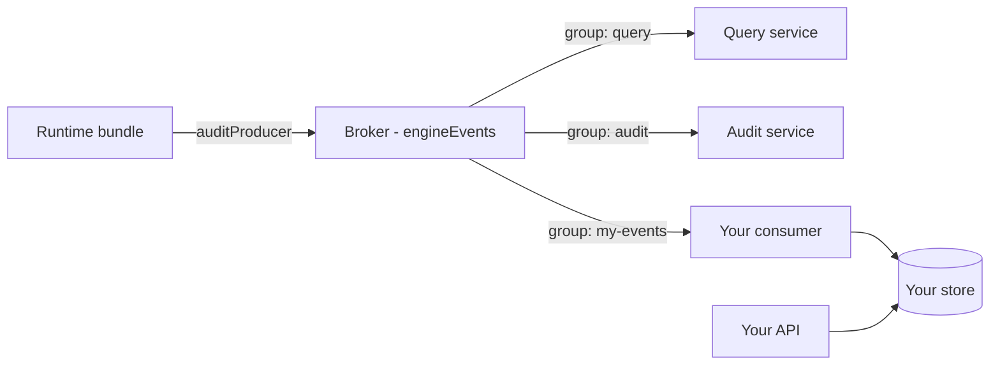

# Custom event consumers & read models

Activiti Cloud is built around a single durable event stream: the runtime bundle publishes every engine event to the `engineEvents` destination, and the platform's own services (query, audit, notifications-graphql) are just consumers of that stream. The same stream can feed any service you build — a dashboard backend, an SLA monitor, an external search index, or a system that reacts to process state.

This page covers how to build such a consumer: the modules you depend on, a minimal working example, reusing the [query service](../services/query.md) modules as libraries, and the delivery semantics you must design around. The event model, destination naming, and broker options are documented in [Event-Driven Design](../architecture/event-driven.md).

## Why build a custom consumer

The [query service](../services/query.md) is the reference read model: it projects the event stream into normalized, indexed relational tables and serves a general-purpose REST API. The example query application's README states the intent explicitly — it is a reference implementation, and you are encouraged to modify and adapt it to suit your domain-specific needs.

Build your own consumer when you need:

- **Different fields or shapes** — your domain model is not the query entity (for example, you only need `businessKey`, `initiator`, and the current activity, or you want one denormalized document per process instance).
- **Different storage or indexes** — Elasticsearch/OpenSearch for full-text search, a time-series store for metrics, Redis for hot state, or a separate schema for a BI warehouse.
- **Lower latency for a narrow slice** — consuming only the event types you care about into a fast store, without the cost of the full query projection.
- **Side effects instead of storage** — an SLA monitor that alerts when a task passes its due date, or an integration that pushes process state to an external system.

Each consumer runs as its own Spring Boot application (or inside your existing service), joins the stream under its own **consumer group**, and scales independently of the runtime bundle and of the built-in readers.

## The ingredients

A consumer needs three things:

| Ingredient | Artifact (groupId `org.activiti.cloud`) | What it provides |
|------------|----------------------------------------|------------------|
| Event payload POJOs | `activiti-cloud-api-*` | The `CloudRuntimeEvent` interface, the per-domain event interfaces (`CloudProcessStartedEvent`, `CloudTaskCreatedEvent`, ...) and the entity payloads (`CloudProcessInstance`, `CloudTask`, `CloudVariableInstance`). The `-impl` artifacts auto-configure JSON deserialization (below). |
| Messaging | `activiti-cloud-service-messaging-starter` | Spring Cloud Stream with the RabbitMQ **and** Kafka binders, plus the platform's functional-binding machinery: the `@FunctionBinding` / `@InputBinding` / `@OutputBinding` annotations, the `FunctionBindingConfiguration` that wires consumer functions to channels, destination auto-configuration, and the `ActivitiMessagingDestinationTransformer`. |
| Broker | RabbitMQ (default), Kafka, or AWS | The `engineEvents` exchange/topic the runtime bundle publishes to. `activiti.cloud.messaging.broker` selects the binder (`rabbitmq`, `kafka`, or `aws`); the starter ships the Rabbit and Kafka binders, the AWS binder is not included. |

JSON deserialization is the part that usually surprises newcomers. A message is a JSON array of events, yet the consumer binds to `Consumer<List<CloudRuntimeEvent<?, ?>>>` — an interface type. It works because:

- `activiti-cloud-api-model-shared-impl` applies a Jackson Mix-In to `CloudRuntimeEvent` with `@JsonTypeInfo(use = NAME, property = "eventType")`, so the `eventType` field in the JSON picks the concrete event class;
- the model `-impl` auto-configurations (`CloudProcessModelAutoConfiguration` in `activiti-cloud-api-process-model-impl`, plus the task and common equivalents) register each concrete event class under its event-type name and map the entity interfaces to their `*Impl` classes;
- event types your API version does not know are deserialized as `IgnoredRuntimeEvent` instead of failing, so a consumer built against an older `activiti-cloud-api` survives a newer runtime bundle emitting new event types.



## Minimal consumer example

A complete example that consumes `engineEvents` and handles `PROCESS_STARTED` and `TASK_CREATED`. It mirrors the wiring of the reference [query consumer](../services/query.md) (`QueryConsumerAutoConfiguration` + `QueryConsumerChannels`), and the dispatch follows the query service's `QueryEventHandlerContext`.

### Maven build

```xml
<project xmlns="http://maven.apache.org/POM/4.0.0"
         xmlns:xsi="http://www.w3.org/2001/XMLSchema-instance"
         xsi:schemaLocation="http://maven.apache.org/POM/4.0.0 http://maven.apache.org/xsd/maven-4.0.0.xsd">
  <modelVersion>4.0.0</modelVersion>

  <groupId>com.example</groupId>
  <artifactId>my-events-consumer</artifactId>
  <version>1.0.0</version>

  <properties>
    <java.version>25</java.version>
    <activiti-cloud.version>9.0.0</activiti-cloud.version>
    <spring-boot.version>3.5.7</spring-boot.version>
  </properties>

  <dependencyManagement>
    <dependencies>
      <dependency>
        <groupId>org.springframework.boot</groupId>
        <artifactId>spring-boot-dependencies</artifactId>
        <version>${spring-boot.version}</version>
        <type>pom</type>
        <scope>import</scope>
      </dependency>
      <dependency>
        <groupId>org.activiti.cloud</groupId>
        <artifactId>activiti-cloud-api-dependencies</artifactId>
        <version>${activiti-cloud.version}</version>
        <type>pom</type>
        <scope>import</scope>
      </dependency>
      <dependency>
        <groupId>org.activiti.cloud</groupId>
        <artifactId>activiti-cloud-service-common-dependencies</artifactId>
        <version>${activiti-cloud.version}</version>
        <type>pom</type>
        <scope>import</scope>
      </dependency>
    </dependencies>
  </dependencyManagement>

  <dependencies>
    <!-- Spring Cloud Stream + Rabbit/Kafka binders + functional bindings -->
    <dependency>
      <groupId>org.activiti.cloud</groupId>
      <artifactId>activiti-cloud-service-messaging-starter</artifactId>
    </dependency>
    <!-- Event payload POJOs + Jackson deserialization for process and task events -->
    <dependency>
      <groupId>org.activiti.cloud</groupId>
      <artifactId>activiti-cloud-api-process-model-impl</artifactId>
    </dependency>
    <dependency>
      <groupId>org.activiti.cloud</groupId>
      <artifactId>activiti-cloud-api-task-model-impl</artifactId>
    </dependency>
    <!-- Health endpoints (and a home for a REST API later) -->
    <dependency>
      <groupId>org.springframework.boot</groupId>
      <artifactId>spring-boot-starter-web</artifactId>
    </dependency>
  </dependencies>

  <build>
    <plugins>
      <plugin>
        <groupId>org.springframework.boot</groupId>
        <artifactId>spring-boot-maven-plugin</artifactId>
        <version>${spring-boot.version}</version>
      </plugin>
    </plugins>
  </build>
</project>
```

The two `org.activiti.cloud` BOMs manage the versions of the API and messaging artifacts; `spring-boot-dependencies` manages everything else (the platform itself builds against Spring Boot 3.5.7 and Spring Cloud 2025.0.0).

### The application and the channel

```java
package com.example.events;

import org.springframework.boot.SpringApplication;
import org.springframework.boot.autoconfigure.SpringBootApplication;

@SpringBootApplication
public class EventsConsumerApplication {
    public static void main(String[] args) {
        SpringApplication.run(EventsConsumerApplication.class, args);
    }
}
```

```java
package com.example.events;

import org.activiti.cloud.common.messaging.functional.InputBinding;
import org.springframework.context.annotation.Configuration;
import org.springframework.integration.dsl.MessageChannels;
import org.springframework.messaging.SubscribableChannel;

public interface MyEventsChannels {
    String MY_EVENTS = "myEventsConsumer";

    @InputBinding(MY_EVENTS)
    default SubscribableChannel myEventsConsumer() {
        return MessageChannels.publishSubscribe(MY_EVENTS).getObject();
    }
}

@Configuration
public class MyEventsChannelsConfiguration implements MyEventsChannels {}
```

`@InputBinding` is meta-annotated with `@Bean`, so the annotated default method becomes a bean definition of a `MessageChannel` named after the binding; the (empty) `@Configuration` class implementing the interface is what registers those channel beans. This is exactly what `QueryConsumerChannelsConfiguration` does for the `queryConsumer` channel.

### The consumer function

```java
package com.example.events;

import java.util.List;
import java.util.function.Consumer;
import org.activiti.cloud.api.model.shared.events.CloudRuntimeEvent;
import org.activiti.cloud.common.messaging.functional.FunctionBinding;
import org.springframework.context.annotation.Bean;
import org.springframework.context.annotation.Configuration;

@Configuration
public class MyEventsConsumerConfiguration {

    @FunctionBinding(input = MyEventsChannels.MY_EVENTS)
    @Bean
    public Consumer<List<CloudRuntimeEvent<?, ?>>> myEventsConsumerFunction(
        MyEventsChannelHandler myEventsChannelHandler
    ) {
        return myEventsChannelHandler::receive;
    }
}
```

`@FunctionBinding(input = ...)` marks the consumer bean and wires it into the channel named by `input` — the same pattern as `QueryConsumerAutoConfiguration`'s `queryConsumerFunction`. From that point on the binding behaves like any Spring Cloud Stream input binding and is configured under `spring.cloud.stream.bindings.myEventsConsumer.*`.

### The dispatching handler

```java
package com.example.events;

import java.util.List;
import org.activiti.api.process.model.ProcessInstance;
import org.activiti.api.task.model.Task;
import org.activiti.cloud.api.model.shared.events.CloudRuntimeEvent;
import org.activiti.cloud.api.process.model.events.CloudProcessStartedEvent;
import org.activiti.cloud.api.task.model.events.CloudTaskCreatedEvent;
import org.slf4j.Logger;
import org.slf4j.LoggerFactory;
import org.springframework.stereotype.Component;

@Component
public class MyEventsChannelHandler {

    private static final Logger log = LoggerFactory.getLogger(MyEventsChannelHandler.class);

    public synchronized void receive(List<CloudRuntimeEvent<?, ?>> events) {
        for (CloudRuntimeEvent<?, ?> event : events) {
            switch (event.getEventType().name()) {
                case "PROCESS_STARTED" -> handleProcessStarted(event);
                case "TASK_CREATED" -> handleTaskCreated(event);
                default -> log.debug("Ignoring event type {}", event.getEventType().name());
            }
        }
    }

    private void handleProcessStarted(CloudRuntimeEvent<?, ?> event) {
        CloudProcessStartedEvent started = (CloudProcessStartedEvent) event;
        ProcessInstance instance = started.getEntity();
        log.info("Process instance {} (definition {}, business key {}) started by {}",
            instance.getId(), instance.getProcessDefinitionId(), instance.getBusinessKey(), event.getActor());
        // persist to your store here
    }

    private void handleTaskCreated(CloudRuntimeEvent<?, ?> event) {
        CloudTaskCreatedEvent created = (CloudTaskCreatedEvent) event;
        Task task = created.getEntity();
        log.info("Task '{}' (id {}) created in process instance {}",
            task.getName(), task.getId(), task.getProcessInstanceId());
        // persist to your store here
    }
}
```

Notes on the pattern:

- `event.getEventType().name()` is exactly what the query service uses to dispatch to its per-type handlers. The names match the `CloudRuntimeEventType` values documented in [Event-Driven Design](../architecture/event-driven.md#event-types): a started process emits `PROCESS_STARTED` (there is no `PROCESS_INSTANCE_STARTED` value; use `PROCESS_CREATED` plus `PROCESS_STARTED` to observe the full lifecycle).
- The casts are safe: the `eventType` field selects the concrete implementation during deserialization, so an event named `PROCESS_STARTED` is always a `CloudProcessStartedEvent`.
- `getEntity()` returns the core engine model interfaces (`ProcessInstance`, `Task`), not `Cloud*` payload classes.
- `synchronized` mirrors `QueryConsumerChannelHandler`: one batch is processed at a time per instance.

### Configuration

```properties
spring.application.name=my-events-consumer

spring.cloud.stream.bindings.myEventsConsumer.destination=engineEvents
spring.cloud.stream.bindings.myEventsConsumer.group=my-events
spring.cloud.stream.bindings.myEventsConsumer.contentType=application/json

spring.rabbitmq.host=${RABBITMQ_HOST:rabbitmq}
```

Consumer-group semantics (RabbitMQ): each group gets its own durable queue named `<destination>.<group>` — `engineEvents.query` for the query consumer, `engineEvents.my-events` for yours. A new group is fully independent of the built-in consumers: it receives a complete copy of the stream and never competes with `query` or `audit` for messages. Two caveats:

- If you omit `destination`, the binding name itself (`myEventsConsumer`) becomes the destination — always set it to `engineEvents` (or whatever `ACT_RB_AUDIT_PRODUCER_DEST` renames it to).
- The runtime bundle producer declares `required-groups=query,audit` on the `auditProducer` binding so those queues exist from producer startup. Your group's queue is created when *your* consumer starts; events published in between are not retained for your group on RabbitMQ (on Kafka, the topic retention policy applies and a late group can replay retained messages). If your group must be a guaranteed late joiner, add it to the producer's required groups by overriding `activiti.cloud.runtime-bundle.messaging.required-audit-producer-groups` on the runtime bundle.

## Reusing the query modules

Instead of starting from scratch you can consume the query service's own modules as Maven dependencies. They are split so you can pick exactly the part you need:

| Module | Contains |
|--------|----------|
| `activiti-cloud-services-query-model` | The JPA entity model (`ProcessInstanceEntity`, `TaskEntity`, ...) and its QueryDSL queries |
| `activiti-cloud-services-query-repo` | Repositories over the model |
| `activiti-cloud-services-query-events` | The per-event-type handlers, the batch optimizer, and `QueryConsumerChannelHandler` (one `REQUIRES_NEW` transaction per batch) |
| `activiti-cloud-services-query-consumer` | The `queryConsumer` channel and the `@FunctionBinding` consumer function (auto-configuration) |
| `activiti-cloud-services-query-liquibase` | The Liquibase changelog for the query schema |
| `activiti-cloud-services-query-rest` | The REST controllers, assemblers, and security restrictions |

The starters package these with the surrounding infrastructure: `activiti-cloud-starter-query-consumer` (consumer + Liquibase + JPA batching + web), `activiti-cloud-starter-query-rest`, and `activiti-cloud-starter-query` (all of the above). The REST part is opt-in by construction: it is only present if you depend on the `-rest` module or a starter that includes it. The example query consumer application in the platform repo (`activiti-cloud-examples/activiti-cloud-query/consumer`) depends only on `activiti-cloud-starter-query-consumer` (and the audit equivalent) and even enforces the absence of the REST modules with a Maven enforcer rule.

Practical combinations:

- **"Query minus the API"** — depend on `activiti-cloud-starter-query-consumer` only; you run the event consumer and the schema, with your own API on top.
- **Your own API over the query store** — add `activiti-cloud-starter-query-rest`, which brings the model, repositories, and controllers.
- **Consumer wiring without the starter's packaging** — depend on the individual modules:

```xml
<dependency>
  <groupId>org.activiti.cloud</groupId>
  <artifactId>activiti-cloud-services-query-consumer</artifactId>
</dependency>
<dependency>
  <groupId>org.activiti.cloud</groupId>
  <artifactId>activiti-cloud-services-query-events</artifactId>
</dependency>
```

plus `spring-boot-starter-data-jpa`, `spring-boot-starter-web`, and `activiti-cloud-services-query-liquibase` (which the consumer starter bundles for you).

Versions are managed by the query BOM:

```xml
<dependencyManagement>
  <dependencies>
    <dependency>
      <groupId>org.activiti.cloud</groupId>
      <artifactId>activiti-cloud-query-dependencies</artifactId>
      <version>9.0.0</version>
      <type>pom</type>
      <scope>import</scope>
    </dependency>
  </dependencies>
</dependencyManagement>
```

The query README's alternative to adapting the modules is to **fork the service and split it**: the query (and audit) service can be split into separate consumer / REST / Liquibase applications, which is exactly the layout of the example `activiti-cloud-query/consumer` app. The audit service (`activiti-cloud-services-audit-*`, `activiti-cloud-starter-audit*`) and the notifications-graphql service follow the same consumer/REST split.

## Delivery & correctness

Design your consumer around these verified behaviors:

- **At-least-once delivery.** Consumers process a message and then acknowledge it; a crash between the two, or a broker redelivery, means the same event can arrive twice. Make handlers idempotent: the query service applies updates keyed by entity id (find-or-create the entity, then update only if the state actually changes), so a repeated event changes nothing. The [audit service](../services/audit.md) takes the opposite approach — it appends as-is and does **not** deduplicate, which is acceptable for an append-only log but not for a mutable read model.
- **Ordering within a batch.** Events of one engine transaction are aggregated and carry a `sequenceNumber`, but do not rely on batch order across transactions. The query service copes with out-of-order batches by sorting them into a deterministic lifecycle order before handling (a `TASK_CREATED` is applied after the `PROCESS_CREATED` it belongs to, even if it arrived first). If your handlers have such dependencies, order the batch yourself (e.g., by `sequenceNumber`, then by entity type).
- **Partitioned mode for per-instance ordering.** With `activiti.cloud.messaging.partitioned=true`, events are pinned to partitions by the `rootProcessInstanceId` header, so ordering survives multi-partition consumers; scale by running one consumer instance per partition (`activiti.cloud.messaging.instance-index`). See [partitioning and ordering](../architecture/event-driven.md#partitioning-and-ordering).
- **Failure behavior.** The reference handler processes each batch in a single `REQUIRES_NEW` transaction, and there is no per-event try/catch: if any handler in a batch throws, the whole batch is rolled back and the exception propagates to the messaging layer. What happens to the message after that (log-and-continue, retry, rethrow) is governed by the error handler configured with `spring.cloud.stream.default.error-handler-definition` — the query service sets none by default, and the platform ships **no dead-letter queue**. Plan for idempotent handlers plus an error handler that logs and moves on, and alert on consumer lag.
- **Unknown event types are ignored, not fatal.** Events whose type is not registered in your `activiti-cloud-api` version deserialize as `IgnoredRuntimeEvent`, so a new runtime bundle emitting a new event type does not break an older consumer.

## Other streams worth consuming

Besides `engineEvents`, these destinations are available to custom consumers (defaults and overrides from `activiti-cloud-messaging.properties`):

| Destination | Default name | Producer | Typical custom-consumer use |
|-------------|--------------|----------|-----------------------------|
| `engineEvents` | `engineEvents` (`ACT_RB_ENG_EVT_DEST`) | runtime bundle | Process/task/variable state — the main stream (this page) |
| `signalEvent` | `signalEvent` (`ACT_RB_SIG_EVT_DEST`) | runtime bundle (subscriptions) | Reacting to signals across services |
| `commandResults` | `commandResults_<appName>` (`ACT_RB_CMD_RES_DEST`) | runtime bundle | Observing command outcomes (the runtime gateway consumes this) |
| `integrationResult` / `integrationError` | `integrationResult_<name>` / `integrationError_<name>` | connectors | Auditing connector results outside the platform |
| `messageEvents` | `messageEvents_<appName>` (`ACT_RB_MSG_EVT_DEST`) | runtime bundle (messages-events) | Observing message correlation to process instances |

The app-scoped destinations are suffixed with `activiti.cloud.application.name` (the integration ones with `spring.application.name`) using the `_` separator, and every name can be overridden or transformed — see [destination topology](../architecture/event-driven.md#destination-topology) for the full table, the naming convention, and the optional destination transformers (`ACT_MESSAGING_DEST_TRANSFORMERS_ENABLED`).

## Frontend live updates

If the goal is live updates in a browser, consider not building a consumer at all: the [notifications-graphql service](../services/notifications-graphql.md) already consumes `engineEvents` and exposes it as a GraphQL subscription over WebSocket (`engineEvents`), filterable by application, service, event type, process instance, and actor. Write your own WebSocket/SSE bridge only when you need push semantics the GraphQL service does not provide — aggregated metrics, multi-tenant fan-out, or delivery to non-browser clients.

## Production notes

- **Consumer group naming.** Pick a stable, unique group name; it is embedded in the queue name `<destination>.<group>`. Groups are the unit of scale and durability: consumers in the same group share the queue's messages, consumers in different groups each receive a complete copy.
- **Scaling consumers.** For a custom binding, raise `spring.cloud.stream.bindings.myEventsConsumer.consumer.concurrency` (the query consumer's equivalent defaults to `1`, overridable via `ACT_QUERY_CONSUMER_CONCURRENCY`) and, on Rabbit, `spring.cloud.stream.rabbit.bindings.myEventsConsumer.consumer.prefetch` (query default `20`, `ACT_QUERY_CONSUMER_RABBIT_PREFETCH`). In partitioned mode, increase `activiti.cloud.messaging.partition-count` and run one consumer instance per partition index.
- **Monitoring.** The platform's consumer starters pull in Spring Boot Actuator through the `activiti-cloud-services-monitoring` module, so expose the standard health and metrics endpoints. Watch queue depth per group on the broker: consumer lag is the primary health signal of any read side, because a stalled reader degrades visibility, not process execution — processes keep running while events accumulate in their groups. The [Query Service](../services/query.md#consistency-and-troubleshooting) page lists the read-side troubleshooting flow.

## Related

- [Query Service](../services/query.md)
- [Audit Service](../services/audit.md)
- [Notifications GraphQL Service](../services/notifications-graphql.md)
- [Event-Driven Design](../architecture/event-driven.md)
