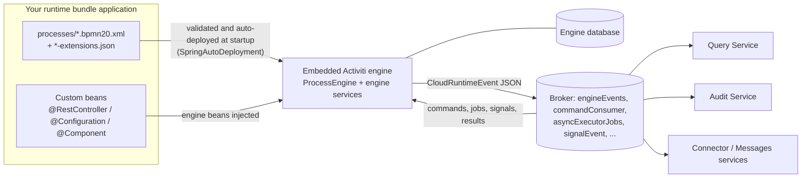

# Custom Runtime Bundle

The runtime bundle is the only write-side service in Activiti Cloud, and all of its behavior lives in a single Spring Boot application that embeds the Activiti engine. The reference stack deploys an *example* runtime bundle, but a production deployment runs **your own application** built on the `activiti-cloud-starter-runtime-bundle` starter. This page is the foundation for the rest of this section: [Deploying process definitions](deploying-processes.md), [Custom connectors](custom-connectors.md), and [Multiple runtime bundles](multiple-bundles.md) all start from the application described here.

## What you get: the starter

Maven coordinates:

```xml
<dependency>
  <groupId>org.activiti.cloud</groupId>
  <artifactId>activiti-cloud-starter-runtime-bundle</artifactId>
</dependency>
```

The version is managed by the `org.activiti.cloud:activiti-cloud-dependencies` BOM (9.0.0) — import it once and leave versions off the dependencies:

```xml
<dependencyManagement>
  <dependencies>
    <dependency>
      <groupId>org.activiti.cloud</groupId>
      <artifactId>activiti-cloud-dependencies</artifactId>
      <version>9.0.0</version>
      <type>pom</type>
      <scope>import</scope>
    </dependency>
  </dependencies>
</dependencyManagement>
```

The starter pulls in the engine (`activiti-spring-boot-starter`) plus every cloud module a runtime bundle needs, and registers three of its own auto-configurations (from `META-INF/spring/org.springframework.boot.autoconfigure.AutoConfiguration.imports`):

| Auto-configuration | Role |
|--------------------|------|
| `ActivitiCloudEngineAutoConfiguration` | Runs **before** the engine's `ProcessEngineAutoConfiguration`. Replaces the default engine signal behavior configurer with a cloud-aware one (`SignalBehaviourConfigurer`) and registers the connector destination mapping strategy. |
| `ActivitiRuntimeBundleAutoConfiguration` | Registers the audit producer partition key extractor when messaging is partitioned. |
| `RuntimeBundleSecurityAutoConfiguration` | Registers the primary `Jwt → AuthenticationToken` converter used by the runtime bundle's security chain. |

### Engine beans

The engine starter contributes a full process engine. From `ProcessEngineAutoConfiguration` / `AbstractProcessEngineAutoConfiguration`:

- `ProcessEngine` (built from `SpringProcessEngineConfiguration`), and the engine services `RuntimeService`, `RepositoryService`, `TaskService`, `HistoryService`, `ManagementService` — each declared `@ConditionalOnMissingBean`.
- Integration plumbing: `IntegrationContextService` and `IntegrationContextManager` (used by connectors to carry execution context in and out of the broker).
- `SpringAsyncExecutor` and the job handler.
- Event producers: `ProcessDeployedEventProducer`, `ApplicationDeployedEventProducer`, `StartMessageDeployedEventProducer`, and `ProcessCandidateStartersEventProducer` publish deployment events as Spring application events (the cloud events module turns them into broker events — see [Processes](#processes)).
- The modern API runtimes (`ProcessRuntime`, `TaskRuntime`, and their admin variants) and an actuator `ProcessEngineEndpoint` are also auto-configured.

### Cloud modules

| Module (artifact) | What it auto-configures |
|-------------------|--------------------------|
| `activiti-cloud-services-core` | The command executors (`StartProcessInstanceCmdExecutor`, `CompleteTaskCmdExecutor`, `ClaimTaskCmdExecutor`, ...) behind the `CommandEndpoint`, which consumes the `commandConsumer` channel and publishes results to `commandResults`; `ProcessDefinitionsSyncService`; `ProcessDefinitionService` / `ProcessDefinitionAdminService` with their decorators and the diagram generator. |
| `activiti-cloud-services-events` | Converts every engine audit event into a `CloudRuntimeEvent` and publishes it (aggregated per engine transaction) to the `engineEvents` destination — the `auditProducer` binding, default destination `engineEvents`, content type `application/json`. Also binds `RuntimeBundleProperties` (`activiti.cloud.runtime-bundle.*`). See [Event-Driven Design](../architecture/event-driven.md). |
| `activiti-cloud-services-connectors` | `MQServiceTaskBehavior` — registered under the engine's default service-task behavior name, so service tasks with a connector `implementation` publish an `IntegrationRequest` to the broker and wait; `IntegrationRequestSender`, `IntegrationRequestBuilder`; consumers for `integrationResult` / `integrationError`. |
| `activiti-cloud-services-rest-impl` | The HATEOAS REST controllers for `/v1` and `/admin/v1` (process definitions, instances, tasks, variables, candidates, connector definitions, service-task replay). Full API: [Runtime Bundle Service](../services/runtime-bundle.md). |
| `activiti-cloud-services-job-executor` | The message-based async executor: when `spring.activiti.async-executor-activate` is `true` (the default), async jobs and timers are published as messages to the `asyncExecutorJobs` destination (`asyncExecutorJobsInput` channel) and executed there, so jobs survive restarts and can be processed by any instance of the bundle. |
| `activiti-cloud-services-subscriptions` | Signal broadcast: `BroadcastSignalEventActivityBehavior` publishes a signal to the `signalEvent` destination when a signal throw event fires, and `BroadcastSignalEventHandler` consumes that destination and fires the signal through the engine — this is what makes signals visible across multiple bundles. |
| `activiti-cloud-services-messages-events` | BPMN message event support (the `messageEvents` destination). |
| `activiti-cloud-services-metadata` | Service metadata (the starter sets `activiti.cloud.service.type=runtime-bundle`). |
| Security (Keycloak by default) | `activiti-cloud-services-common-security-keycloak` + `activiti-cloud-services-common-identity-keycloak` are on the starter's classpath as the default identity provider (excluded if you override them). Keycloak properties are documented in [Identity & Security](../architecture/identity.md). |
| Monitoring | `activiti-cloud-services-monitoring` exposes the actuator `health` and `info` endpoints; health details are restricted to the `ACTIVITI_ADMIN` role. |
| Swagger | `activiti-cloud-services-swagger` plus the starter's `RuntimeBundleSwaggerConfig` expose a springdoc `GroupedOpenApi` ("Runtime Bundle") scanning `org.activiti.cloud.services.rest`. The application supplies the `baseOpenApi` bean (see [Adding your own code](#adding-your-own-code)). |

The messaging layer itself (Spring Cloud Stream) comes with the starter; the concrete binder (Rabbit or Kafka) is added by the `activiti-cloud-service-messaging-starter` dependency, as the example applications do.

## Anatomy of a minimal app

The layout below mirrors the `example-runtime-bundle` from the Activiti Cloud repository:

```text
my-runtime-bundle/
  pom.xml
  src/main/java/com/example/runtime/
    MyRuntimeBundleApplication.java
  src/main/resources/
    application.properties
    processes/
      leaveRequest.bpmn20.xml
      leaveRequest-extensions.json    optional
    connectors/
      hrSystem.json                   optional
```

### pom.xml

A minimal standalone build (Spring Boot 3.5.7, Java 25, matching the 9.0.0 BOM):

```xml
<?xml version="1.0" encoding="UTF-8"?>
<project xmlns="http://maven.apache.org/POM/4.0.0"
         xmlns:xsi="http://www.w3.org/2001/XMLSchema-instance"
         xsi:schemaLocation="http://maven.apache.org/POM/4.0.0 http://maven.apache.org/xsd/maven-4.0.0.xsd">
  <modelVersion>4.0.0</modelVersion>
  <parent>
    <groupId>org.springframework.boot</groupId>
    <artifactId>spring-boot-starter-parent</artifactId>
    <version>3.5.7</version>
    <relativePath/>
  </parent>
  <groupId>com.example</groupId>
  <artifactId>my-runtime-bundle</artifactId>
  <version>1.0.0</version>

  <properties>
    <java.version>25</java.version>
    <activiti-cloud.version>9.0.0</activiti-cloud.version>
  </properties>

  <dependencyManagement>
    <dependencies>
      <dependency>
        <groupId>org.activiti.cloud</groupId>
        <artifactId>activiti-cloud-dependencies</artifactId>
        <version>${activiti-cloud.version}</version>
        <type>pom</type>
        <scope>import</scope>
      </dependency>
    </dependencies>
  </dependencyManagement>

  <dependencies>
    <dependency>
      <groupId>org.activiti.cloud</groupId>
      <artifactId>activiti-cloud-starter-runtime-bundle</artifactId>
    </dependency>
    <dependency>
      <groupId>org.activiti.cloud</groupId>
      <artifactId>activiti-cloud-service-messaging-starter</artifactId>
    </dependency>
    <dependency>
      <groupId>org.postgresql</groupId>
      <artifactId>postgresql</artifactId>
      <scope>runtime</scope>
    </dependency>
    <dependency>
      <groupId>org.springframework.boot</groupId>
      <artifactId>spring-boot-starter-test</artifactId>
      <scope>test</scope>
    </dependency>
  </dependencies>

  <build>
    <plugins>
      <plugin>
        <groupId>org.springframework.boot</groupId>
        <artifactId>spring-boot-maven-plugin</artifactId>
      </plugin>
    </plugins>
  </build>
</project>
```

The example additionally adds `activiti-cloud-services-tracing`, which is an optional extra.

### Main class

```java
package com.example.runtime;

import org.activiti.cloud.starter.rb.configuration.ActivitiRuntimeBundle;
import org.springframework.boot.SpringApplication;
import org.springframework.boot.autoconfigure.SpringBootApplication;

@SpringBootApplication
@ActivitiRuntimeBundle
public class MyRuntimeBundleApplication {

    public static void main(String[] args) {
        SpringApplication.run(MyRuntimeBundleApplication.class, args);
    }
}
```

`@ActivitiRuntimeBundle` (in `org.activiti.cloud.starter.rb.configuration`) is meta-annotated with `@EnableWebSecurity`, `@EnableDiscoveryClient`, and `@EnableAutoConfiguration` excluding the default `TaskExecutionAutoConfiguration` and `TaskSchedulingAutoConfiguration`. The example and the starter's own test application use exactly this two-annotation combination.

### application.properties

A working minimum, modeled on the example's `application.properties`:

```properties
spring.application.name=my-rb
activiti.cloud.application.name=default-app

spring.datasource.url=jdbc:postgresql://localhost:5432/rb
spring.datasource.username=activiti
spring.datasource.password=activiti

spring.rabbitmq.host=localhost

authorizations.security-constraints[0].authRoles[0]=ACTIVITI_USER
authorizations.security-constraints[0].securityCollections[0].patterns[0]=/v1/*
authorizations.security-constraints[1].authRoles[0]=ACTIVITI_ADMIN
authorizations.security-constraints[1].securityCollections[0].patterns[0]=/admin/*
```

### Properties

Values in parentheses are defaults verified against the source.

| Property | Default | Meaning |
|----------|---------|---------|
| `spring.application.name` | — (**required**, no default) | Service name. It is read without a fallback by the starter's `RuntimeBundleProperties` and used as the consumer group for the `commandConsumer`, `integrationResult`, and `integrationError` bindings. The example uses `${ACT_RB_APP_NAME:rb}`. |
| `activiti.cloud.application.name` | *(empty)* | Logical application name. Scopes the `commandConsumer`, `commandResults`, `messageEvents`, and `asyncExecutorJobs` destinations and appears as `appName` in every event payload. The example uses `default-app`. |
| `spring.datasource.url`, `username`, `password` | — | Engine database; the engine uses Spring Boot's datasource auto-configuration and creates/updates its schema at startup (`spring.activiti.database-schema-update`, default `true`). The example runs against PostgreSQL (driver added at `runtime` scope). |
| `spring.rabbitmq.host` (plus standard Spring AMQP properties) | `localhost` | Broker connection for the Rabbit binder. The broker itself is selected by `activiti.cloud.messaging.broker` (env `ACT_MESSAGING_BROKER`, default `rabbitmq`; also `kafka`, `aws`). |
| `authorizations.security-constraints[N].authRoles[M]` | — | Role(s) required by constraint `N`. |
| `authorizations.security-constraints[N].securityCollections[0].patterns[0]` | — | URL pattern(s) constraint `N` applies to. The example config: `ACTIVITI_USER` on `/v1/*`, `ACTIVITI_ADMIN` on `/admin/*`. Custom endpoints you add under `/v1/...` are covered by the same constraints. |
| `spring.activiti.process-definition-location-prefix` | `classpath*:**/processes/` | Where BPMN models are looked up; can point at the filesystem, e.g. `file:/processes/`. |
| `spring.activiti.process-definition-location-suffixes` | `**.bpmn20.xml`, `**.bpmn` | File suffixes accepted as process definitions. |
| `spring.activiti.deployment-mode` | `never-fail` (set by the starter; the engine's own default is `default`) | Auto-deployment strategy. With `never-fail`, a model that fails validation is skipped with a warning instead of failing startup. Other supported modes: `default`, `fail-on-no-process`, `single-resource`, `resource-parent-folder`. |
| `spring.activiti.deployment-name` | `SpringAutoDeployment` | Name of the auto-deployment that groups the packaged processes. |
| `spring.activiti.check-process-definitions` | `true` | Validate BPMN models at deployment. |
| `spring.activiti.async-executor-activate` | `true` | Activate the message-based async executor. In the cloud, async jobs and timers are published to the `asyncExecutorJobs` destination and executed from there rather than on in-JVM threads. The starter also tightens `spring.activiti.async-executor.default-async-job-acquire-wait-time-in-millis` (and the timer equivalent) to 5000 ms. |
| `spring.activiti.process.extensions.dir` | *(not set)* | Where `*-extensions.json` sidecars are scanned; when not set it falls back to `spring.activiti.process-definition-location-prefix` (the suffix is `** -extensions.json`). Format: [Process Extensions](../../activiti/bpmn/reference/process-extensions.md). |
| `keycloak.auth-server-url` / `keycloak.realm` | `http://activiti-keycloak:8180/auth` / `activiti` (env `ACT_KEYCLOAK_URL`, `ACT_KEYCLOAK_REALM`) | Keycloak location; the JWT issuer and JWK set URIs are derived from these. Full identity setup: [Identity & Security](../architecture/identity.md). |

## Processes

BPMN files are deployed **with** the application — there is no REST deployment endpoint. At startup the engine discovers every resource matching `spring.activiti.process-definition-location-prefix` (default `classpath*:**/processes/`) with one of the configured suffixes and deploys them all in a single auto-deployment named `SpringAutoDeployment`. Because the starter sets `spring.activiti.deployment-mode=never-fail`, a model that fails validation is logged and skipped rather than aborting the whole startup, so the remaining processes still deploy.

A few consequences:

- **Packaging several processes** is just adding more files under `processes/` (or any `processes/` directory on the classpath, since the default prefix is the recursive `classpath*:` one). Each file becomes one process definition.
- **Versions** increment automatically: on restart, a definition is re-versioned only when the resource content actually changed.
- **Deployment is announced as events.** After the auto-deployment, the engine's `ProcessDeployedEventProducer` publishes a `ProcessDeployedEvent` for the **latest version** of each definition; the events module converts them into `PROCESS_DEPLOYED` `CloudRuntimeEvent`s on the `engineEvents` destination, so query, audit, and notifications learn about the new definitions from the event stream. See [Event-Driven Design](../architecture/event-driven.md).
- **Sidecars** (`<name>-extensions.json` next to the BPMN file) carry variable definitions, connector mappings, and form data: [Process Extensions](../../activiti/bpmn/reference/process-extensions.md).
- **Connector definitions** (`ConnectorDefinition` JSON) live under `connectors/` by default (`activiti.connectors.dir`, default `classpath:/connectors/`) and are served by `/v1/connector-definitions`.
- For fast local iteration you can point the prefix at a directory on disk (`file:/processes/`, exactly what the example's test configuration does) so BPMN edits do not require a rebuild.

## Adding your own code

Your application's packages are component-scanned by `@SpringBootApplication`, so ordinary `@RestController`, `@Configuration`, `@Component`, and `@Service` classes run alongside everything the starter provides. Both example applications prove this pattern:

- `example-cloud-connector` ships a `ConnectorController` — a plain `@RestController` serving a custom `/v1/home` endpoint next to the connector logic.
- `example-runtime-bundle` ships a `RuntimeBundleConfiguration` that defines the `baseOpenApi` `OpenAPI` bean (`BaseOpenApiBuilder.build("Runtime Bundle ReST API", basePath)`) consumed by the starter's Swagger configuration.

A minimal custom endpoint using an engine bean — `RepositoryService` is injected straight from the engine auto-configuration:

```java
package com.example.runtime;

import java.util.List;
import org.activiti.engine.RepositoryService;
import org.activiti.engine.repository.ProcessDefinition;
import org.springframework.web.bind.annotation.GetMapping;
import org.springframework.web.bind.annotation.RestController;

@RestController
public class ProcessDefinitionsController {

    private final RepositoryService repositoryService;

    public ProcessDefinitionsController(RepositoryService repositoryService) {
        this.repositoryService = repositoryService;
    }

    @GetMapping("/v1/my-app/process-definitions")
    public List<ProcessDefinition> latestDefinitions() {
        return repositoryService.createProcessDefinitionQuery().latestVersion().list();
    }
}
```

Notes on coexistence and overriding:

- **User components win over defaults.** The starter's and engine's beans are declared `@ConditionalOnMissingBean` where applicable — for example the engine services (`RuntimeService`, `RepositoryService`, `TaskService`, `HistoryService`, `ManagementService`) in `AbstractProcessEngineAutoConfiguration`, the command executors, `ProcessDefinitionsSyncService`, and `ProcessDefinitionService` in `ServicesCoreAutoConfiguration`, and `MQServiceTaskBehavior` / `IntegrationRequestSender` in `CloudConnectorsAutoConfiguration`. Define a bean of the same type and the default backs off.
- **Do not define a second `ProcessEngine`** — it is not conditional. Tune the engine through properties or `ProcessEngineConfigurationConfigurer` / `ProcessEngineConfigurator` beans instead.
- Endpoints under `/v1/...` inherit the `ACTIVITI_USER` constraint from the `authorizations.security-constraints` patterns, so your custom endpoints require a bearer token exactly like the standard API.

## How it fits together



## Building and running

**Locally.** `mvn spring-boot:run` starts the bundle with your `application.properties`. It needs a reachable broker (the starter binds its producer/consumer channels at startup, and with the Rabbit binder's default `missing-durable-queues-fatal=true` a missing broker fails the application) and a database; the engine schema is created on first start. A local stack (broker, Keycloak, database) is available from the [Local Development Setup](../getting-started/local-setup.md).

**Jar.** `mvn package` produces an executable Spring Boot jar (the example builds one with the `spring-boot-maven-plugin` repackage goal).

**Docker image.** The example's `Dockerfile` is a good template: Alpine with Amazon Corretto 25 (the stack targets Java 25), `fontconfig` and `ttf-dejavu` installed for SVG diagram generation, the jar copied in, and `java $JAVA_OPTS -jar app.jar` as the entrypoint.

**Cluster.** Deploy your image as the runtime bundle service of your namespace — the Helm deployment runs the example image (`docker.io/activiti/example-runtime-bundle:{version}`) for the `{ns}-runtime-bundle` deployment by default, and a production deployment swaps in your image. See [Deployment Reference](../deployment/reference.md).

**Testing.** The starter's own integration suite is the reference for what "works in a test":

- H2 for the engine database (`spring.datasource.url=jdbc:h2:mem:test`) — no external database needed.
- `@Import(TestChannelBinderConfiguration.class)` (from `spring-cloud-stream-test-binder`) replaces the real broker with in-memory test channels, so event producers and consumers are testable without RabbitMQ/Kafka.
- `KeycloakContainerApplicationInitializer` (from `activiti-cloud-services-test-containers`) plus `IdentityTokenProducer` (from `activiti-cloud-services-test`) provide a Keycloak test container and valid bearer tokens for the secured endpoints.
- The test properties set `spring.activiti.asyncExecutorActivate=false` to keep common tests deterministic; enable it to exercise the message-based job executor.

Useful test-scope dependencies for your app: `spring-cloud-stream-test-binder`, `h2`, `activiti-cloud-services-test`, `activiti-cloud-services-test-security`, `activiti-cloud-services-test-containers`, and `activiti-cloud-services-test-binder` (`@EnableBinderFactoryListenerTestContext` when you do want a real broker). The example application's ITs go one step further and use `@ServiceConnection` with Testcontainers (PostgreSQL 15, RabbitMQ) for full-stack tests.

## Where to go next

- [Deploying process definitions](deploying-processes.md) — versioning, upgrades, and the never-fail behavior in detail.
- [Custom connectors](custom-connectors.md) — building your own connector application and wiring it into a runtime bundle.
- [Multiple runtime bundles](multiple-bundles.md) — running several bundles against one stack and how signals and commands are routed between them.
