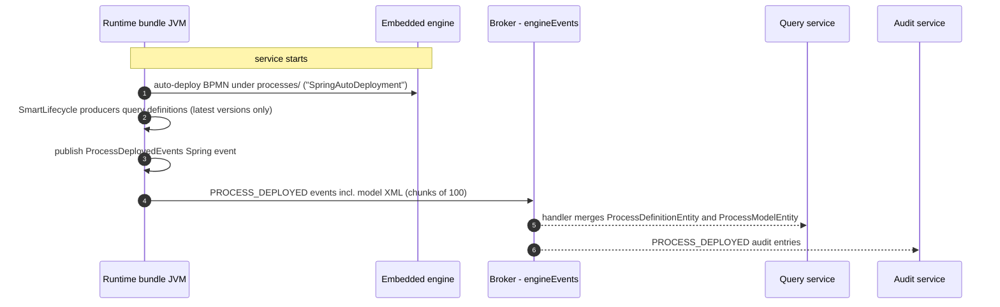
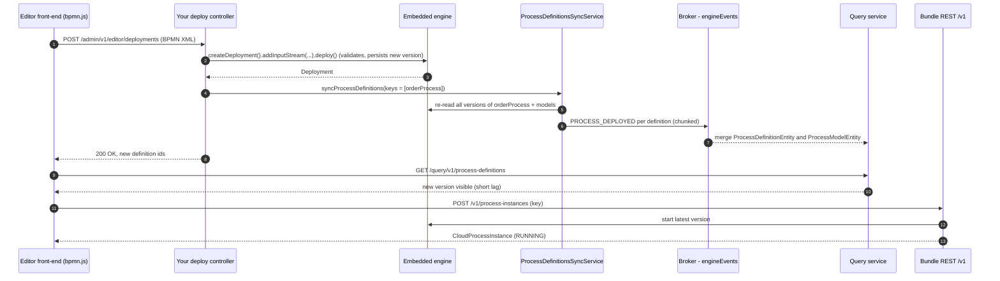

# Deploying Processes at Runtime

Out of the box, the runtime bundle has **no REST endpoint for deployment**: the only processes it deploys are the BPMN files packaged on the classpath, deployed once at startup. If users should model and deploy processes from a BPMN editor (bpmn.js, the Activiti modeler, or any front-end that produces BPMN 2.0 XML), you build a small backend inside a [custom runtime bundle](./custom-runtime-bundle.md) that receives the model, deploys it through the standard `RepositoryService` API, and tells the event pipeline about it so the query and audit read models converge.

## How process deployment works in Activiti Cloud

### Startup auto-deployment

The embedded engine auto-deploys whatever it finds under the configured location prefix. In a standard runtime bundle the relevant properties are:

| Property | Default | Meaning |
|----------|---------|---------|
| `spring.activiti.process-definition-location-prefix` | `classpath*:**/processes/` | Where packaged BPMN models are looked up. |
| `spring.activiti.process-definition-location-suffixes` | `**.bpmn20.xml`, `**.bpmn` | File suffixes accepted as process definitions. |
| `spring.activiti.deployment-name` | `SpringAutoDeployment` | Name of the deployment created for the packaged processes. |
| `spring.activiti.deployment-mode` | `default` | Auto-deployment strategy. The bundle starter overrides this to `never-fail`, so a packaged model that fails validation is logged but does not prevent the service from starting. |

### The deployment-to-read-model pipeline

Read-side services (query, audit) never read the engine database; they rebuild their state from the event stream, so a deployment "exists" for them only once a `PROCESS_DEPLOYED` cloud event has been published:



1. The starter's `SmartLifecycle` producers run: `ProcessDeployedEventProducer` queries definitions **with `.latestVersion()`** (latest version per key), loads each model via `repositoryService.getProcessModel(...)`, and publishes a `ProcessDeployedEvents` Spring application event; `ApplicationDeployedEventProducer` and `StartMessageDeployedEventProducer` publish their analogues.
2. The bundle's `CloudProcessDeployedProducer` (a `@EventListener`) wraps each event in a `CloudProcessDeployedEventImpl` (`eventType` = `PROCESS_DEPLOYED`, the model XML as `processModelContent`), appends the bundle coordinates, chunks the list by `activiti.cloud.runtime-bundle.events-properties.chunk-size` (default `100`), and sends the chunks through the `auditProducer` binding to the **`engineEvents`** destination.
3. The query service's `ProcessDeployedEventHandler` `merge`s a `ProcessDefinitionEntity` and a `ProcessModelEntity` keyed by the definition id (idempotent, rebuildable); the audit service appends the events.

Every `PROCESS_DEPLOYED` event travels this same pipeline, whether it originates from a startup producer or from the runtime sync below.

## Why a runtime deployment needs an explicit sync

The gap, plainly: **the engine's `DeployCmd` does not publish the Spring event the pipeline listens for.** When you call `repositoryService.createDeployment()...deploy()` at runtime, the engine persists the deployment, validates the BPMN, and fires only its *internal* engine events (`ENTITY_CREATED`, `ENTITY_INITIALIZED`). It does **not** publish a `ProcessDeployedEvents` application event — that only happens in the startup producers or through the sync service. Since `CloudProcessDeployedProducer` reacts exclusively to that Spring event, a bare runtime deployment produces no `PROCESS_DEPLOYED` cloud event:

| State | Updated by a bare `createDeployment()...deploy()`? |
|-------|----------------------------------------------------|
| Engine database: deployment row, definition rows, resources | Yes |
| Engine-internal events (`ENTITY_CREATED`, `ENTITY_INITIALIZED`) | Yes |
| `PROCESS_DEPLOYED` cloud event on `engineEvents` | **No** |
| Query service definition and model read model | **No** (until a sync runs) |
| Audit service `PROCESS_DEPLOYED` entries | **No** (until a sync runs) |

After a bare deployment, `GET /v1/process-definitions` and the query service keep showing the old state. The fix is to re-emit the deployment events explicitly — which is what the next section's service does.

## The sync mechanism

### `ProcessDefinitionsSyncService`

The bundle ships `org.activiti.cloud.services.core.ProcessDefinitionsSyncService` as a ready-to-inject bean (auto-configured by `ServicesCoreAutoConfiguration`). Its public method:

```java
List<String> syncProcessDefinitions(SyncCloudProcessDefinitionsPayload payload);
```

queries process definitions from the engine, republishes a `PROCESS_DEPLOYED` event for each selected definition (in batches of 10 events per Spring event, which the producer then chunks by 100 for the broker), and returns the ids of the definitions it re-emitted. Everything after that is the startup pipeline above.

The payload, `org.activiti.cloud.api.process.model.impl.SyncCloudProcessDefinitionsPayload`, is a plain DTO with a no-arg constructor, getters/setters, and a static builder:

| Field | Type | Notes |
|-------|------|-------|
| `id` | `String` | Auto-generated UUID, final; set when the payload is constructed. |
| `processDefinitionKeys` | `List<String>` | Restricts the sync to these process keys. `null` or empty means *all* definitions in this bundle. |
| `excludedProcessDefinitionIds` | `List<String>` | Definition ids removed from the selection before events are emitted. |

```java
SyncCloudProcessDefinitionsPayload payload = SyncCloudProcessDefinitionsPayload.builder()
    .processDefinitionKeys(List.of("orderProcess"))
    .excludedProcessDefinitionIds(List.of())
    .build();
```

**Query semantics — read this carefully.** The service builds `repositoryService.createProcessDefinitionQuery()` and applies `processDefinitionKeys(...)` only when the payload carries a non-empty key list. The engine query's `latestVersion` flag defaults to `false`, so `list()` returns **every deployed version of each requested key** — not just the latest (the startup producer, by contrast, calls `.latestVersion()`). Consequences:

- A sync for key `orderProcess` re-emits `PROCESS_DEPLOYED` for version 1, 2, 3, ... of that key (minus exclusions), so the query read model ends up holding the whole version history.
- A payload with no keys re-emits **every** definition in the bundle — a full resync. Use it deliberately.
- The returned `List<String>` lists *all* re-emitted definition ids for the keys, not only the ones created by your most recent deployment.

### The external command path

If your editor backend is not embedded in the bundle — or you want to trigger a sync from another service — the same operation is reachable through the bundle's command channel. `ProcessRuntimeGateway` (a Spring Integration proxy bean, `syncProcessDefinitions(SyncCloudProcessDefinitionsPayload)`) sends the payload to the `commandConsumer` destination and awaits the result on `commandResults`:

| Property | Default | Meaning |
|----------|---------|---------|
| `activiti.cloud.process-runtime-gateway.enabled` | `true` | Enables the gateway proxy bean. |
| `activiti.cloud.process-runtime-gateway.group` | `${spring.application.name}` | Consumer group for `commandResults`. |
| `activiti.cloud.process-runtime-gateway.reply-timeout` | `30s` | How long the proxy waits for the reply. |
| `spring.cloud.stream.bindings.ProcessRuntimeGatewayProducer.destination` | `commandConsumer` | Where gateway commands are published (scoped by `activiti.cloud.application.name` when set). |
| `spring.cloud.stream.bindings.ProcessRuntimeGatewayResults.destination` | `commandResults` | Where the reply comes back. |

On the receiving side, the bundle's `commandConsumer` binding deserializes the payload (the cloud Jackson configuration registers `SyncCloudProcessDefinitionsPayload` by simple name) and `SyncProcessDefinitionsCmdExecutor` executes it **with admin-level authority**, returning a `SyncCloudProcessDefinitionsResult` — a `Result` whose entity is the list of re-emitted definition ids. So an external caller publishes the JSON payload to `commandConsumer` and reads the result from `commandResults` — no bundle code changes required.

## Building the BPMN editor backend

Prerequisite: a [custom runtime bundle](./custom-runtime-bundle.md) built on `activiti-cloud-starter-runtime-bundle`, so the engine, `ProcessDefinitionsSyncService`, and the event pipeline all run in one application.

### Step 1 — What the editor front-end sends

| Option | Payload | When to use |
|--------|---------|-------------|
| **(a) XML in** | BPMN 2.0 XML exported by bpmn.js (or any BPMN editor) | Simplest path. The engine does schema and process validation during `deploy()`. |
| **(b) Model-based** | Activiti modeler JSON (the interchange format returned by `GET /v1/process-definitions/{id}/model` with `Accept: application/json`) | When you also want to persist the editor's graphical state so the modeler can reopen the draft later. Uses the engine's Model API. |

Both paths end with the same two calls: `createDeployment()...deploy()` and `syncProcessDefinitions(...)`.

### Step 2 — The deploy endpoint

A complete controller for option (a): it extracts the process key from the `<process id="...">` element, deploys the XML, syncs the read models, and reports both the definitions created by *this* deployment and the ids the sync re-emitted:

```java
package com.example.editor;

import java.io.ByteArrayInputStream;
import java.io.IOException;
import java.util.List;
import java.util.Map;
import javax.xml.parsers.DocumentBuilderFactory;
import org.activiti.cloud.api.process.model.impl.SyncCloudProcessDefinitionsPayload;
import org.activiti.cloud.services.core.ProcessDefinitionsSyncService;
import org.activiti.engine.RepositoryService;
import org.activiti.engine.repository.Deployment;
import org.w3c.dom.Document;
import org.w3c.dom.Element;
import org.w3c.dom.NodeList;
import org.xml.sax.SAXException;
import org.springframework.http.MediaType;
import org.springframework.http.ResponseEntity;
import org.springframework.web.bind.annotation.PostMapping;
import org.springframework.web.bind.annotation.RequestBody;
import org.springframework.web.bind.annotation.RequestMapping;
import org.springframework.web.bind.annotation.RestController;

/** Backend for a BPMN editor, embedded in a custom runtime bundle. */
@RestController
@RequestMapping("/admin/v1/editor")
public class ProcessDeployController {

    private static final String BPMN_MODEL_NAMESPACE = "http://www.omg.org/spec/BPMN/20100524/MODEL";

    private final RepositoryService repositoryService;
    private final ProcessDefinitionsSyncService processDefinitionsSyncService;

    public ProcessDeployController(
            RepositoryService repositoryService,
            ProcessDefinitionsSyncService processDefinitionsSyncService) {
        this.repositoryService = repositoryService;
        this.processDefinitionsSyncService = processDefinitionsSyncService;
    }

    /** Deploys the BPMN 2.0 XML produced by the editor and syncs the read models. */
    @PostMapping(value = "/deployments", consumes = MediaType.TEXT_XML_VALUE)
    public ResponseEntity<Map<String, Object>> deploy(@RequestBody byte[] bpmnXml) {
        String key = extractProcessKey(bpmnXml);

        // Deploy into the engine; XSD and process validation run here and an invalid
        // model throws, leaving nothing persisted.
        Deployment deployment = repositoryService.createDeployment()
                .name("editor-" + key)
                .addInputStream(key + ".bpmn20.xml", new ByteArrayInputStream(bpmnXml))
                .deploy();

        // Republish PROCESS_DEPLOYED events so query and audit converge (this re-emits
        // every version of the key, not only the new one).
        List<String> syncedDefinitionIds = processDefinitionsSyncService.syncProcessDefinitions(
                SyncCloudProcessDefinitionsPayload.builder()
                        .processDefinitionKeys(List.of(key))
                        .build());

        // A Deployment does not expose its definitions, so resolve the new ones with a
        // deployment-scoped query.
        List<Map<String, Object>> created = repositoryService.createProcessDefinitionQuery()
                .deploymentId(deployment.getId())
                .list()
                .stream()
                .map(d -> Map.of(
                        "id", d.getId(),
                        "key", d.getKey(),
                        "name", d.getName() == null ? "" : d.getName(),
                        "version", d.getVersion()))
                .toList();

        return ResponseEntity.ok(Map.of(
                "deploymentId", deployment.getId(),
                "deploymentTime", deployment.getDeploymentTime().toInstant().toString(),
                "processDefinitions", created,
                "syncedProcessDefinitionIds", syncedDefinitionIds));
    }

    /** Reads the id attribute of the first <process> element of the BPMN document. */
    private static String extractProcessKey(byte[] bpmnXml) {
        Document document;
        try {
            DocumentBuilderFactory factory = DocumentBuilderFactory.newInstance();
            factory.setNamespaceAware(true); // BPMN elements are namespace-qualified (bpmn:definitions, ...)
            document = factory.newDocumentBuilder().parse(bpmnXml);
        } catch (IOException | SAXException e) {
            throw new IllegalArgumentException("Could not parse BPMN document: " + e.getMessage(), e);
        }
        if (!"definitions".equals(document.getDocumentElement().getLocalName())) {
            throw new IllegalArgumentException("Body is not a BPMN 2.0 <definitions> document");
        }
        NodeList processes = document.getElementsByTagNameNS(BPMN_MODEL_NAMESPACE, "process");
        if (processes.getLength() == 0) {
            throw new IllegalArgumentException("BPMN document has no <process> element");
        }
        String key = ((Element) processes.item(0)).getAttribute("id");
        if (key.isBlank()) {
            throw new IllegalArgumentException("<process> element has no id attribute");
        }
        return key;
    }
}
```

Two API notes: `Deployment` exposes `getId()`, `getName()`, `getDeploymentTime()` (the `java.util.Date` the engine stamped), `getVersion()`, and so on — but **not** the definitions it contains, which is why the deployment-scoped query resolves them. And `DeploymentBuilder` also offers `addString(...)`, `addBytes(...)`, and `addBpmnModel(String resourceName, BpmnModel)`, which converts a `BpmnModel` to XML via `BpmnXMLConverter` and adds it as a resource — useful for option (b).

### Step 3 — Calling the endpoint from the editor

The editor posts the exported XML (the `id` of `<process>` is the key the engine will use):

```http
POST /admin/v1/editor/deployments HTTP/1.1
Authorization: Bearer <token>
Content-Type: application/xml

<?xml version="1.0" encoding="UTF-8"?>
<bpmn:definitions xmlns:bpmn="http://www.omg.org/spec/BPMN/20100524/MODEL"
                  id="defs_orderProcess" targetNamespace="http://example.com/order">
  <bpmn:process id="orderProcess" name="Order fulfillment" isExecutable="true">
    <bpmn:startEvent id="start" name="Order received"/>
    <bpmn:sequenceFlow id="flow1" sourceRef="start" targetRef="approveOrder"/>
    <bpmn:userTask id="approveOrder" name="Approve order"/>
    <bpmn:sequenceFlow id="flow2" sourceRef="approveOrder" targetRef="end"/>
    <bpmn:endEvent id="end" name="Order fulfilled"/>
  </bpmn:process>
</bpmn:definitions>
```

```json
{
  "deploymentId": "3f2b7c1e-9d4a-4c5b-8e6f-1a2b3c4d5e6f",
  "deploymentTime": "2026-08-16T09:41:03.120Z",
  "processDefinitions": [
    {
      "id": "orderProcess:2:6a1b2c3d-4e5f-4a6b-8c7d-9e0f1a2b3c4d",
      "key": "orderProcess",
      "name": "Order fulfillment",
      "version": 2
    }
  ],
  "syncedProcessDefinitionIds": [
    "orderProcess:1:1b2c3d4e-5f6a-4b7c-8d9e-0f1a2b3c4d5e",
    "orderProcess:2:6a1b2c3d-4e5f-4a6b-8c7d-9e0f1a2b3c4d"
  ]
}
```

The engine assigns the new definition the id `key:version:uuid` (here version 2, because version 1 exists); the sync's list contains both versions, per the all-versions semantics above. A moment later the read side converges: the standard endpoint shows the new latest version of the key (the query service's `GET /query/v1/process-definitions` reflects the same state once its consumer group has processed the events):

```http
GET /v1/process-definitions HTTP/1.1
Authorization: Bearer <token>
Accept: application/json
```

```json
{
  "list": {
    "entries": [
      {
        "entry": {
          "id": "orderProcess:2:6a1b2c3d-4e5f-4a6b-8c7d-9e0f1a2b3c4d",
          "name": "Order fulfillment",
          "key": "orderProcess",
          "version": 2,
          "appVersion": null
        }
      }
    ],
    "pagination": {
      "skipCount": 0,
      "maxItems": 100,
      "count": 1,
      "hasMoreItems": false,
      "totalItems": 1
    }
  }
}
```

The editor can then start an instance through the standard runtime API — starting by key always targets the latest version:

```http
POST /v1/process-instances HTTP/1.1
Authorization: Bearer <token>
Content-Type: application/json

{
  "processDefinitionKey": "orderProcess",
  "name": "Order for customer 42",
  "businessKey": "ORDER-2026-0007",
  "variables": { "customerId": "42", "amount": 199.9 }
}
```

### Step 4 — Persisting modeler state (the Model API)

The engine has a model repository — `newModel()`, `saveModel(...)`, `addModelEditorSource(...)`, `getModel(...)`, `getModelEditorSource(...)` on `RepositoryService` — designed to store an editor's model metadata and its raw editor JSON independently of deployments. The Activiti Cloud product does not use this API anywhere; it is there for your bundle code. Expressed as a service your controller delegates to:

```java
package com.example.editor;

import com.fasterxml.jackson.databind.ObjectMapper;
import com.fasterxml.jackson.databind.node.ObjectNode;
import java.nio.charset.StandardCharsets;
import java.util.List;
import org.activiti.bpmn.model.BpmnModel;
import org.activiti.cloud.api.process.model.impl.SyncCloudProcessDefinitionsPayload;
import org.activiti.cloud.services.core.ProcessDefinitionsSyncService;
import org.activiti.editor.language.json.converter.BpmnJsonConverter;
import org.activiti.engine.RepositoryService;
import org.activiti.engine.repository.Deployment;
import org.activiti.engine.repository.Model;
import org.activiti.validation.ValidationError;

/** Editor-state and deployment service for option (b), in a custom runtime bundle. */
public class ModelEditorService {

    private final RepositoryService repositoryService;
    private final ProcessDefinitionsSyncService processDefinitionsSyncService;
    private final ObjectMapper objectMapper;

    public ModelEditorService(
            RepositoryService repositoryService,
            ProcessDefinitionsSyncService processDefinitionsSyncService,
            ObjectMapper objectMapper) {
        this.repositoryService = repositoryService;
        this.processDefinitionsSyncService = processDefinitionsSyncService;
        this.objectMapper = objectMapper;
    }

    /** Validates the modeler JSON, stores it as editor state, deploys, and syncs. */
    public String saveAndDeploy(String editorJson) throws Exception {
        // Modeler JSON -> BpmnModel; validate before persisting anything.
        BpmnModel bpmnModel = new BpmnJsonConverter().convertToBpmnModel(objectMapper.readTree(editorJson));
        List<ValidationError> errors = repositoryService.validateProcess(bpmnModel);
        if (errors.stream().anyMatch(error -> !error.isWarning())) {
            throw new IllegalArgumentException("Invalid process: " + errors.get(0).getProblem());
        }

        // Persist the editor state: model metadata plus the raw editor JSON.
        Model model = repositoryService.newModel();
        model.setKey(bpmnModel.getMainProcess().getId());
        model.setName(bpmnModel.getMainProcess().getName());
        repositoryService.saveModel(model);
        repositoryService.addModelEditorSource(model.getId(), editorJson.getBytes(StandardCharsets.UTF_8));

        // Deploy the validated model (converted to XML and added as a resource) and
        // sync the read models.
        Deployment deployment = repositoryService.createDeployment()
                .name("editor-model-" + model.getKey())
                .addBpmnModel(model.getKey() + ".bpmn20.xml", bpmnModel)
                .deploy();
        processDefinitionsSyncService.syncProcessDefinitions(
                SyncCloudProcessDefinitionsPayload.builder()
                        .processDefinitionKeys(List.of(model.getKey()))
                        .build());
        return deployment.getId();
    }

    /** Reopen a draft: the stored editor JSON, or the deployed definition as modeler JSON. */
    public String editorSource(String modelId) {
        byte[] source = repositoryService.getModelEditorSource(modelId);
        return new String(source, StandardCharsets.UTF_8);
    }

    /** Same converter pair the bundle's JSON model endpoint uses for the round-trip. */
    public ObjectNode deployedAsModelerJson(String processDefinitionId) {
        BpmnModel deployed = repositoryService.getBpmnModel(processDefinitionId);
        return new BpmnJsonConverter().convertToJson(deployed);
    }
}
```

`Model` carries `id`, `name`, `key`, `category`, `version`, `metaInfo`, `deploymentId`, and `tenantId`, plus `hasEditorSource()`; `createModelQuery()` lists models. If you prefer to validate the XML of option (a) before deploying, convert it first with `BpmnXMLConverter.convertToBpmnModel(...)` and run the same `validateProcess(BpmnModel)` check.

Fetching the diagram for the editor's preview pane uses the existing read endpoints — no new code:

```http
GET /v1/process-definitions/orderProcess:2:6a1b2c3d-4e5f-4a6b-8c7d-9e0f1a2b3c4d/model HTTP/1.1
Authorization: Bearer <token>
Accept: image/svg+xml
```

The bundle's model endpoint is a single path negotiated by `Accept`: `application/xml` returns the BPMN 2.0 XML, `application/json` the modeler interchange format, `image/svg+xml` the rendered diagram — no extra query parameters. The query service exposes `GET /query/v1/process-definitions/{id}/model` with `Accept: application/xml`, returning the stored model content from its read model (an `/admin/v1/...` variant exists without the user-visibility check); it does not serve diagrams.

## Versioning and lifecycle

- **New version per deploy.** Every `deploy()` creates a new deployment; for an existing key the engine assigns the next version number, so redeploying the same key yields `orderProcess:3:uuid` and so on. Deployment and definition versions are independent.
- **Running instances are unaffected.** An instance stores the exact `processDefinitionId` it started with and keeps executing that version for its whole lifetime.
- **Latest-version semantics at the API layer.** The standard `GET /v1/process-definitions` resolves each key to its **latest** version (the engine API applies `latestVersion()` scoped to the latest deployments) — also the version `POST /v1/process-instances` starts for a given key or id. The admin endpoint `GET /admin/v1/process-definitions` returns all versions by default (`latestVersion` parameter, default `false`). The query service's read model stores every version a `PROCESS_DEPLOYED` event has described — after a sync, the full history of the synced keys.
- **Pinning a start to a specific version.** The public runtime REST API always resolves to the latest version of the latest deployment, so it cannot start an older version by id. If your product needs that (roll back new starts while old instances keep running v2), do it in bundle code: `runtimeService.startProcessInstanceById("orderProcess:2:uuid", businessKey, variables)` — `org.activiti.engine.RuntimeService` exposes `startProcessInstanceById` in four overloads.
- **No built-in rollback or undeploy.** No platform endpoint deletes a deployment or "restores" a previous version; old versions simply remain deployed and addressable. Your options: keep starting old versions by id, or redeploy the previous XML, which creates a *new* higher version whose content matches the old one.

## The full editor-to-cluster flow



## Production notes

- **Who may deploy.** Your controller sits under `/admin/v1/editor`, protected by default with the `ACTIVITI_ADMIN` role (`/admin/*` → `ACTIVITI_ADMIN`, `/v1/*` → `ACTIVITI_USER`; see [Identity and Security](../architecture/identity.md)). For a dedicated deployer role, add a constraint for your path:

  ```properties
  authorizations.security-constraints[2].authRoles[0]=PROCESS_DEPLOYER
  authorizations.security-constraints[2].securityCollections[0].patterns[0]=/admin/v1/editor/*
  ```

  The command path (`commandConsumer`) executes with admin authority and is broker-scoped, not user-scoped — treat it as an operator channel and prefer the embedded controller for user-driven deploys.
- **Validation failures.** `deploy()` runs BPMN 2.0 XSD validation and the engine's process validator (both enabled by default). Any non-warning error aborts the command — `XMLException` for XML/XSD problems, `ActivitiException` for process validation errors — and the transaction rolls back, leaving nothing to clean up. Warnings are logged and do not block; pre-validate with `validateProcess(BpmnModel)` the same way if you want the errors before the deploy attempt.
- **Deploy and sync are two steps.** The engine commit happens first; the sync publishes the events afterwards. If the sync fails after a successful deploy, the engine has the definition but the read side does not. Re-running the sync is safe: the query handler `merge`s by definition id (idempotent), while the audit service appends another `PROCESS_DEPLOYED` entry per event — treat repeated syncs as a repair mechanism and use the audit trail to see when each definition was (re-)announced.
- **Convergence lag.** The read models update only after the broker delivers the events, so treat `200 OK` as "deployed in the engine" and poll the read endpoints (or subscribe to events) before showing the new version as live.

## Limits and caveats

- **No multi-tenancy at the cloud API layer.** The engine's `DeploymentBuilder` accepts a `tenantId`, but no cloud payload or REST endpoint exposes tenant scoping; everything deployed here lands in this bundle's single unscoped space.
- **Sync is all-versions, not latest-only.** A key-scoped sync re-emits the whole history of that key, and a keyless sync re-emits every definition. Size your expectations (and your `excludedProcessDefinitionIds` list) accordingly.
- **Model rows live only in the engine database.** Model API data is not replicated to the query or audit services and is invisible outside the bundle.
- **The modeler JSON namespace.** `BpmnJsonConverter.convertToBpmnModel` applies the JSON's `process_namespace` property when present and defaults the target namespace to `http://activiti.org/test` otherwise — set it in your modeler configuration so deployed XML carries a stable namespace.
- **Read models are eventually consistent.** The query side is a projection of `engineEvents`; for the state at commit time, trust the runtime bundle's own responses.

## Related

- [Custom Runtime Bundle](./custom-runtime-bundle.md)
- [Runtime Bundle Service](../services/runtime-bundle.md)
- [Query Service](../services/query.md)
- [Audit Service](../services/audit.md)
- [Event-Driven Design](../architecture/event-driven.md)
- [Identity and Security](../architecture/identity.md)
- [Activiti Engine Documentation](../../activiti/index.md)
