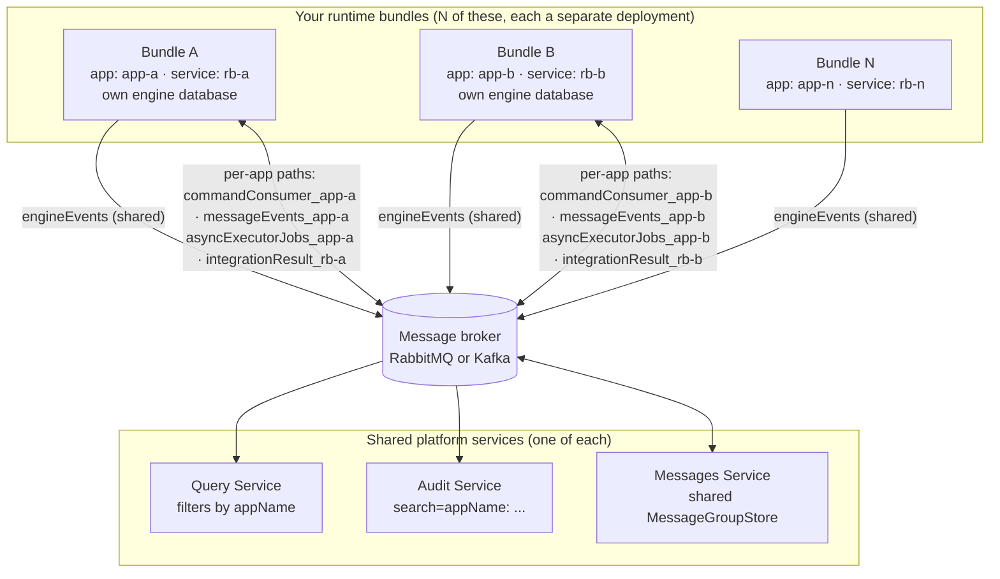
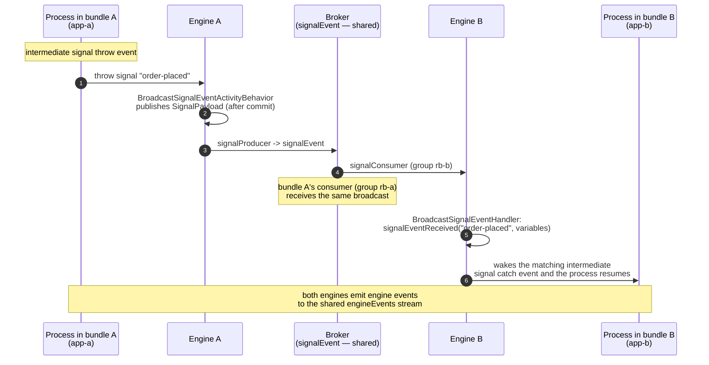

# Multiple Runtime Bundles

A single Activiti Cloud deployment does not have to serve a single business application. You can run any number of **runtime bundles** — each an independent Spring Boot application with its own processes, its own engine database, and its own deployment cycle — against **one shared set of read-side services** (query, audit, notifications) and one broker. The platform's multi-application model is built into the messaging and identity layers: events from all bundles flow into the same `engineEvents` stream, and the read side keeps them together, distinguished by the `appName` field.



Every bundle publishes to the **shared** `engineEvents` destination, so one query and one audit service see the combined stream of all applications. The destinations a bundle uses for its own command flow, async jobs, and message events are **scoped per application**, so bundle A's commands and jobs can never be consumed by bundle B.

## Identity model

Two names identify a bundle, and they answer different questions:

| Property | Default | Carried as | Answers |
|----------|---------|------------|---------|
| `activiti.cloud.application.name` | *(empty)* | `appName` on every event payload and entity | Which **business application** this is — the logical unit that query/audit group by and that scopes the per-app destinations. |
| `spring.application.name` | — (required, no default) | `serviceName` and `serviceFullName` on every event payload and entity | Which **service deployment** this is — the unit that owns consumer groups and the connector-result destinations. |
| `activiti.cloud.service.type` | `runtime-bundle` — set by the starter's `metadata.properties` (the `RuntimeBundleProperties` fallback is empty) | `serviceType` | The kind of service reported in payloads and events. |
| `activiti.cloud.service.version` | *(empty)* | `serviceVersion` | The version of the service. |

Semantics from the source:

- `RuntimeBundleProperties` (`org.activiti.cloud.services.events.configuration`, in `activiti-cloud-services-events`) binds `activiti.cloud.application.name` (empty default), `activiti.cloud.service.type` and `activiti.cloud.service.version` (empty fallback — the starter's `metadata.properties` supplies `activiti.cloud.service.type=runtime-bundle`), and `spring.application.name` **without a default — the bundle does not start without it**. Its `getServiceName()` and `getServiceFullName()` both return `spring.application.name`.
- `CloudRuntimeEntity` (`org.activiti.cloud.api.model.shared`, in `activiti-cloud-api-model-shared`) documents the contract every payload and entity implements: `getAppName()` is "the value of the `activiti.cloud.application.name` spring property", `getServiceName()` the value of `spring.application.name`, `getServiceFullName()` "at the moment it is the same as serviceName".

The practical consequences:

- `activiti.cloud.application.name` **can be shared by several bundles** (several deployments of the same application, e.g. a scaled-out bundle) **or distinct per bundle** (different business applications).
- `spring.application.name` **should be distinct per bundle deployment** — it is the default consumer group for `commandConsumer`, `signalEvent`, `asyncExecutorJobs`, `integrationResult`, and `integrationError` (see below). Two bundles with the same `spring.application.name` join the same consumer groups and the broker load-balances their messages between them.
- The example runtime bundle ships with `spring.application.name=rb` and `activiti.cloud.application.name=default-app`, so a default deployment is one application named `default-app`.

## What is shared vs. scoped

### How scoping is applied

Every Spring Cloud Stream binding in a cloud service is rewritten at startup. `ActivitiMessagingDestinationsBeanPostProcessor` (in `activiti-cloud-service-messaging-config`) walks the `BindingServiceProperties` and applies `ActivitiMessagingDestinationTransformer` to each binding's destination, producing:

```text
destination = [prefix + separator +] name [+ separator + scope]
```

with the default separator `_` and an empty prefix. The `scope` for each destination comes from `activiti-cloud-messaging.properties` (`src/main/resources/config/` in `activiti-cloud-service-messaging-config`), which declares:

| Destination | Scope property |
|-------------|----------------|
| `commandConsumer` | `${activiti.cloud.application.name}` |
| `commandResults` | `${activiti.cloud.application.name}` |
| `asyncExecutorJobs` | `${activiti.cloud.application.name}` |
| `messageEvents` | `${activiti.cloud.application.name}` |
| `integrationResult` | `${spring.application.name}` |
| `integrationError` | `${spring.application.name}` |
| `engineEvents` | — (no scope) |
| `signalEvent` | — (no scope) |

So the command, command-result, async-job, and message-event destinations are scoped by the **application name**, while the connector-result destinations are scoped by the **service name**. `engineEvents` and `signalEvent` have no scope at all.

### Exact destination names for two bundles

For two bundles configured with `activiti.cloud.application.name=app-a` / `app-b` and `spring.application.name=rb-a` / `rb-b` (default separator `_`, no global prefix):

| Destination | Bundle A (`app-a` / `rb-a`) | Bundle B (`app-b` / `rb-b`) | Shared? |
|-------------|------------------------------|------------------------------|---------|
| `engineEvents` | `engineEvents` | `engineEvents` | Yes — query, audit, notifications, and custom consumers all read the one stream and filter by the `appName` field |
| `signalEvent` | `signalEvent` | `signalEvent` | Yes — broadcast to all bundles; each consumes under its own group (see [Signals](#how-signals-cross-bundles)) |
| `commandConsumer` | `commandConsumer_app-a` | `commandConsumer_app-b` | No — commands (from the messages service and the runtime gateway) reach exactly the owning application |
| `commandResults` | `commandResults_app-a` | `commandResults_app-b` | No — command replies |
| `asyncExecutorJobs` | `asyncExecutorJobs_app-a` | `asyncExecutorJobs_app-b` | No — async jobs of the engine's message-based executor stay within the application |
| `messageEvents` | `messageEvents_app-a` | `messageEvents_app-b` | No — BPMN message events of the application |
| `integrationResult` | `integrationResult_rb-a` | `integrationResult_rb-b` | No — connector results, scoped by the **service** name (group = `spring.application.name`) |
| `integrationError` | `integrationError_rb-a` | `integrationError_rb-b` | No — connector errors |

If you set `activiti.cloud.messaging.destination-prefix` or the RabbitMQ binder prefix (`activiti.cloud.messaging.rabbitmq.prefix`), it is prepended to every destination in the table. This is exactly what the runtime bundle's `RuntimeBundleRabbitmqPrefixIT` asserts for an application named `default-app` with service name `my-runtime-bundle` and RabbitMQ prefix `default-app.`: the declared exchanges are `default-app.commandConsumer_default-app`, `default-app.asyncExecutorJobs_default-app`, `default-app.messageEvents_default-app`, `default-app.commandResults_default-app`, `default-app.engineEvents`, `default-app.signalEvent`, `default-app.integrationResult_my-runtime-bundle`, and `default-app.integrationError_my-runtime-bundle`.

The scoping is what makes multiple bundles safe to run side by side: a `ReceiveMessagePayload` published to `commandConsumer_app-a` cannot be picked up by bundle B, and bundle A's async jobs are invisible to bundle B's executor.

## How signals cross bundles

Signals are the one cross-application mechanism that is **global**: the `signalEvent` destination has no scope, so a signal thrown by a process in bundle A is broadcast to **every** runtime bundle, including A itself, regardless of application name.

The mechanism, verified in `activiti-cloud-services-subscriptions`:

1. An **intermediate signal throw event** (not process-instance-scoped) is executed by `BroadcastSignalEventActivityBehavior`, which registers a `SignalPayload` (signal name plus the execution's variables) as a Spring application event instead of resolving it in-process.
2. `SignalSender` sends the payload to the `signalProducer` binding **after the engine transaction commits** (`@TransactionalEventListener(AFTER_COMMIT)`), so a rolled-back throw never broadcasts.
3. Every bundle's `signalConsumer` binding (destination `signalEvent`, consumer group defaulting to `spring.application.name`, overridable via `ACT_RB_SIGNAL_CONSUMER_GROUP`) delivers the payload to `BroadcastSignalEventHandler`, which calls `runtimeService.signalEventReceived(name)` (or with variables) against **its own** engine.
4. Each engine wakes only the event subscriptions it actually has for that signal name — a bundle with no waiting signal catch for it simply no-ops.



Because the consumer group defaults to `spring.application.name`, two bundles that share a `spring.application.name` would share the `signalEvent` consumer group — the broker would deliver each broadcast to only one of them. Give each bundle a distinct `spring.application.name` (or set `ACT_RB_SIGNAL_CONSUMER_GROUP` explicitly) for cross-bundle signal delivery to work.

## How BPMN messages cross bundles

BPMN message events (throw message / catch message, message start events) take a different path, and their scope is different:

- Each bundle publishes its message events (`MESSAGE_WAITING`, `MESSAGE_SENT`, `MESSAGE_RECEIVED`, `START_MESSAGE_DEPLOYED`, `MESSAGE_SUBSCRIPTION_CANCELLED`) from its `messageEventsOutput` binding to its own scoped `messageEvents_<appName>` destination.
- The [messages service](../services/messages.md) groups events into message groups by correlation id `appName:messageName[:correlationKey]` (computed by `Correlations` in `activiti-cloud-services-messages-core`) — so correlation is **per application name**.
- Each message event is stamped with a `messageEventOutputDestination` header carrying the producer's own (scoped) `commandConsumer` destination (`MessageEventsDispatcher` reads the transformed `commandConsumer` binding destination). When a group becomes actionable, the aggregated `StartMessagePayload` / `ReceiveMessagePayload` is routed back to exactly that destination.

The consequence: **two bundles coordinate BPMN messages when they share the same `activiti.cloud.application.name`** — the same logical application spread over several deployments, with one messages service (and a shared `MessageGroupStore` backend) correlating their events. A message thrown under application `app-a` never correlates with one thrown under `app-b`. If processes in different application names need to coordinate, use **signals** (global broadcast) or call each other's REST APIs.

## Evidence it works

The source tree ships two tests that run more than one runtime bundle against shared infrastructure:

- **`activiti-cloud-acceptance-scenarios/multiple-runtime-acceptance-tests`** — configured in `config-env.properties` with two bundle URLs, `runtime.bundle.url=${gateway.url}/rb` and `runtime.bundle.another.url=${gateway.url}/rb-other-app`, and a **single** `query.url=${gateway.url}/query`. The story starts `SignalCatchEventProcess` on the primary bundle and `SignalThrowEventProcess` on the secondary bundle, then asserts through the **shared query service** that both instances reached `COMPLETED` — proving the cross-bundle signal broadcast and the combined read model.
- **`MultipleRbMessagesIT`** (in `activiti-cloud-messages-service/integration-tests`) — boots two runtime bundle Spring contexts against one RabbitMQ (Testcontainers) and one H2 database server started by the test. Both bundles run with `spring.application.name=rb` and differ only in `activiti.cloud.application.name` (`messages-app1` / `messages-app2`); each bundle runs an `IntermediateThrowMessageProcess` and an `IntermediateCatchMessageProcess`. The test asserts, per bundle, that the `MESSAGE_SENT` / `MESSAGE_WAITING` / `MESSAGE_RECEIVED` producers each fired once and that the `ReceiveMessageCmdExecutor` executed exactly once — two applications running concurrent message coordination on one broker, isolated by `activiti.cloud.application.name`.

## Configuring a deployment

For each bundle in a multi-bundle deployment:

| Setting | Guidance |
|---------|----------|
| `spring.application.name` | **Distinct per bundle.** Consumer groups for `commandConsumer`, `signalEvent`, `asyncExecutorJobs`, `integrationResult`, `integrationError` default to it; duplicate values make bundles compete for each other's messages. |
| `activiti.cloud.application.name` | **Distinct per business application.** Decide whether two bundles are one application (shared name: shared message correlation, shared query/audit grouping) or two applications (distinct names: fully separate command paths and message scopes). |
| Gateway route | One route per bundle (the acceptance tests use `/rb` and `/rb-other-app`), so clients and editors can address each bundle individually. |
| Engine database | Each bundle owns its own database (H2 in-memory or PostgreSQL); there is no shared engine schema between bundles. |
| Messages service | One shared deployment for all bundles, with a **shared** `MessageGroupStore` backend (JDBC, Redis, or Hazelcast — see [Messages Service — Backends](../services/messages.md#backends)) whenever bundles coordinate BPMN messages. |
| Query, audit, notifications | One shared set for all bundles; no per-bundle instances needed. |

## Querying per application

The read side keeps all applications' data together and lets you slice it with the identity fields:

- **Query service** — `appName` is a field on every query entity (inherited from `ActivitiEntityMetadata`), and the list endpoints accept it as a predicate parameter alongside any other entity field:

  ```http
  GET /v1/process-instances?appName=app-a&status=RUNNING&sort=startDate,DESC HTTP/1.1
  Authorization: Bearer <token>
  ```

  The same parameter works on `/v1/tasks`, `/v1/process-definitions`, and the admin variants. `GET /v1/applications?name=app-a` lists the deployments of one application (the application entity's `name` is the `appName` from the `APPLICATION_DEPLOYED` event).
- **Audit service** — the `search` filter expression supports the `appName` field:

  ```http
  GET /v1/events?search=appName: app-a&eventTimeFrom=2026-08-01T00:00:00Z HTTP/1.1
  ```

  See [Audit Service](../services/audit.md#the-search-filter-expression) for the full syntax.
- **Notifications GraphQL** — events are published with the `appName` field, so subscriptions can filter on it. See [Notifications GraphQL Service](../services/notifications-graphql.md).

## When to split bundles

Split a workload into separate runtime bundles when:

- **Failure and deployment isolation** — a bug, a dependency outage, or a release of one application must not stop, restart, or slow another. Each bundle has its own process catalog, its own connector set, and its own release cadence.
- **Team boundaries** — each team owns one bundle (models, delegates, configuration, database) and deploys it without coordinating with other teams.
- **Independent scaling** — a hot application (high instance throughput, heavy async jobs) scales its own bundle and its own async-job destinations without inflating the rest.
- **Isolation of integration blast radius** — flaky external systems are absorbed by that application's connectors and scoped destinations rather than by a shared engine thread pool.

Keep one bundle when the processes belong to one application: a single `appName` keeps BPMN message correlation in scope, reduces the number of engine databases to operate, and there is no reason to pay the coordination cost (signals, cross-app REST calls, shared message store) for no benefit.

## Related

- [Extending Overview](overview.md) — the full extension map
- [Runtime Bundle Service](../services/runtime-bundle.md) — the service each bundle instantiates
- [Event-Driven Design](../architecture/event-driven.md) — destination naming, scoping, and delivery semantics
- [Messages Service](../services/messages.md) — message correlation and backends
- [Query Service](../services/query.md) — the combined read model
- [Audit Service](../services/audit.md) — the combined audit trail
