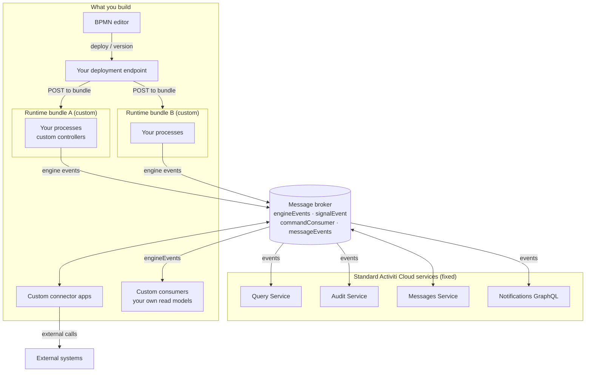

# Extending Activiti Cloud

Activiti Cloud is a platform with a fixed core and open edges. The core — the standard services, the event backbone that moves data between them, and the REST API surface those services expose — is provided by the platform and you operate it rather than modify it. The edges — where your business processes run, how you integrate external systems, how you author and deploy models, and how you project process data into your own applications — are deliberately left for you to build.

This section is the map for that work. It tells you, for a given architectural need, which extension point to use and where the guidance lives.

## What is fixed

These are the parts of the platform you consume and operate. You deploy them as-is (typically through the reference chart) and integrate against their stable contracts.

| Fixed element | What it is |
|---------------|------------|
| The standard services | Runtime bundle (write side), query, audit, messages, and notifications-GraphQL services. Each is an independently deployable Spring Boot application. See [Services](../index.md#the-platform-at-a-glance). |
| The event backbone | The message-broker destinations that carry data between services (`engineEvents`, `signalEvent`, `commandConsumer`, `messageEvents`, and friends), their naming and scoping rules, and their delivery semantics. See [Event-Driven Design](../architecture/event-driven.md). |
| The standard REST API surface | The `/v1` and `/admin/v1` endpoints the REST services expose — runtime bundle, query, and audit (process instances, tasks, variables, definitions, applications, audit events) — plus the GraphQL API of the notifications service. Clients and editors call these; they are stable contracts. See [Runtime Bundle Service](../services/runtime-bundle.md) and [Query Service](../services/query.md). |
| The identity model | The `appName` / `serviceName` / `serviceType` / `serviceVersion` fields that every event and entity carries, which let several applications coexist in one deployment. See [Multiple Runtime Bundles](multiple-bundles.md#identity-model). |

## What you build

These are the parts of the platform that are yours. Each is a Spring Boot application (or a configuration surface) that you own, version, and deploy.

- **Your runtime bundles** — applications that embed the engine and host your BPMN models, delegates, and any custom controllers. This is where business process logic lives.
- **Your connectors** — standalone applications that cross the broker to talk to external systems in the inbound and outbound directions. See [Connectors Overview](../connectors/overview.md).
- **Your authoring and deployment tooling** — a BPMN editor and a deployment endpoint that deploy and version process definitions at runtime.
- **Your event consumers and read models** — your own services that subscribe to `engineEvents` and project process data into your own databases, dashboards, and APIs.

The two runtime bundles are independent applications (different process catalogs, different databases), yet they publish to the **same shared** `engineEvents` and `signalEvent` destinations and are read by the **same shared** query and audit services. The broker is the seam that lets your many applications coexist with one set of read-side services.

The patterns compose. A typical multi-application deployment combines all of them: one or more bundles per business application (1), an editor or CI pipeline that deploys to them at runtime (2), one connector app per external system shared across all bundles (3), one bundle per application against the shared read side (4), and one or more consumer services powering dashboards and reporting (5). The standard services themselves need no changes in any of this — the extension work happens entirely in your applications and their configuration.

## Extension patterns

| Pattern | What you build | Key artifact | Guide |
|---------|----------------|--------------|-------|
| Custom runtime bundle | A Spring Boot app that hosts the engine: your BPMN models, service delegates, and any custom REST controllers your application needs. | Your bundle application and its `processes/` resources. | [Custom Runtime Bundle](custom-runtime-bundle.md) |
| Runtime deployment / BPMN editor | Tooling that deploys and versions process definitions at runtime — an editor plus a deployment endpoint your editor calls. | A deployment endpoint and the editor that drives it. | [Deploying Processes](deploying-processes.md) |
| Custom connector app | A standalone app that integrates with an external system, consuming `IntegrationRequest` and replying with `IntegrationResult`/`IntegrationError` (outbound) or publishing message events (inbound). | A connector application with `@ConnectorBinding` consumers. | [Custom Connectors](custom-connectors.md) |
| Multiple runtime bundles | Two or more bundles, each its own application, sharing the read-side services and the broker. | One deployment per application, with distinct identity and per-app scoped destinations. | [Multiple Runtime Bundles](multiple-bundles.md) |
| Custom event consumers / read models | Your own services that subscribe to `engineEvents` and build a projection (a dashboard, a BI store, a domain-specific read model) that the standard query service does not provide. | A consumer application and its own read model. | [Custom Read Models](custom-read-models.md) |

## No-code extension surfaces

Not every extension requires custom code. Three surfaces let you extend behavior by configuration or by data that the platform reads at startup:

- **Process extensions JSON sidecars** — a `.json` file next to a BPMN model that declares variable definitions, constant values, and connector mappings for that process. No code; loaded when the bundle starts. See [Process Extensions](../../activiti/bpmn/reference/process-extensions.md).
- **Engine configuration via `spring.activiti.*`** — the standard engine properties (deployment mode, history level, async executor sizing, and so on) plus the `activiti.cloud.*` properties that configure a cloud deployment. No code; set in the bundle's configuration. See [Runtime Bundle Service — Configuration](../services/runtime-bundle.md#configuration).
- **Connector definition JSON** — files under the `connectors/` directory that declare a connector's actions and input/output variables, served read-only by the bundle. No code for the definition itself; the integration logic still lives in a connector app. See [Connectors Overview](../connectors/overview.md#connector-definitions-registration).

## Decision guide

| If you need to... | Use this pattern |
|-------------------|------------------|
| Run a business process on the platform, with logic in BPMN and Java inside the bundle | Custom runtime bundle |
| Deploy or version a process from a UI at runtime (no redeploy of the whole service) | Runtime deployment / BPMN editor |
| Call an external API from a service task, or react to an external event | Custom connector app |
| Isolate, scale, or independently deploy several business applications that share read services | Multiple runtime bundles |
| Build a dashboard, report, or domain read model that the standard query service does not serve | Custom event consumers / read models |
| Declare variables, constants, or connector bindings for a process without writing code | Process extensions sidecar |
| Tune engine or cloud behavior (history, async executor, deployment mode) without code | `spring.activiti.*` / `activiti.cloud.*` properties |

## Boundaries

Two limits are worth stating up front, because they shape every decision above.

- **Multi-tenancy is not part of the cloud API layer.** The shared identity model (`CloudRuntimeEntity` and the query/audit entities) carries `appName`, `serviceName`, `serviceType`, and `serviceVersion` — it does not carry a `tenantId`. If your organization needs tenant isolation, the supported mechanism is to run a **separate application** (a separate `activiti.cloud.application.name`) per tenant, not to filter a shared service by tenant. See [Multiple Runtime Bundles](multiple-bundles.md#identity-model).
- **The write side is the runtime bundle.** The standard services have no deployment or write API for process definitions; only a runtime bundle embeds the engine. Everything that mutates process state goes through a bundle, and the read-side services observe the result through events.

## Where to go next

- [Custom Runtime Bundle](custom-runtime-bundle.md) — the primary extension point, in detail
- [Deploying Processes](deploying-processes.md) — authoring and versioning models at runtime
- [Custom Connectors](custom-connectors.md) — integrating external systems
- [Multiple Runtime Bundles](multiple-bundles.md) — running many applications against shared read services
- [Custom Read Models](custom-read-models.md) — building your own consumers
