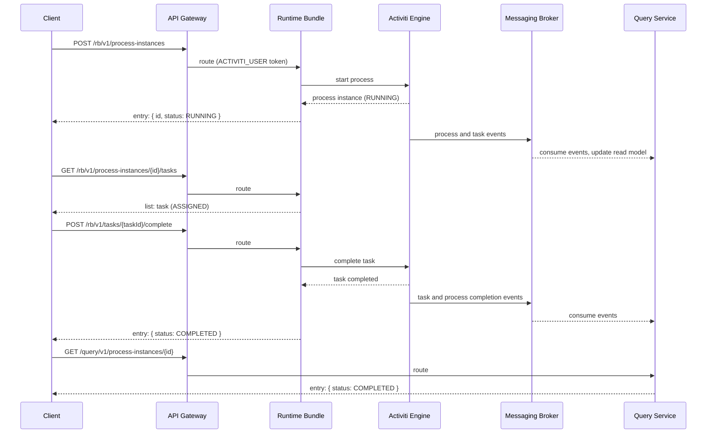

# Your First Workflow

This quick start walks through the shortest path to a running workflow on a locally deployed stack: authenticate, make sure a process definition is deployed, start a process instance, complete its user task, and verify the outcome on both the write side (runtime bundle) and the read side (query service) using only `curl`.

If you do not have a stack yet, follow the [Local Development Setup](local-setup.md) first.

## How requests are routed

All calls go through the API gateway, which routes them to a service by path prefix. All requests require a `Bearer` token from the `alfresco` Keycloak realm; the `/v1/*` endpoints require the `ACTIVITI_USER` role and the `/admin/*` endpoints the `ACTIVITI_ADMIN` role.

| Service | Gateway prefix | Role |
|---------|----------------|------|
| Runtime bundle (write side) | `/rb` | `ACTIVITI_USER` |
| Runtime bundle (admin) | `/rb/admin` | `ACTIVITI_ADMIN` |
| Query service (read side) | `/query` | `ACTIVITI_USER` |
| Audit service | `/audit` | `ACTIVITI_USER` |
| Identity adapter | `/identity-adapter-service` | `ACTIVITI_USER` |

For the examples below, define the gateway base URL (adjust the namespace and cluster to match your install):

```bash
export GATEWAY="http://gateway-pr-my-env-rabbit-n-d.activiti.envalfresco.com:8080"
```

## Step 1: Get a token

Request a token from the Keycloak token endpoint with the password grant. The realm is `alfresco` and the client is `alfresco`:

```bash
export TOKEN=$(curl -s -X POST \
  "https://activiti.envalfresco.com/auth/realms/alfresco/protocol/openid-connect/token" \
  --data-urlencode "username=testuser" \
  --data-urlencode "password=<password>" \
  --data-urlencode "grant_type=password" \
  --data-urlencode "client_id=alfresco" \
  | jq -r .access_token)
```

Use a user that has the `ACTIVITI_USER` role. The acceptance test realm contains users such as `testuser` and `hruser`; their credentials are configured per environment (see the `.env` file generated by the install script).

## Step 2: Deploy a process definition

Activiti Cloud has no REST endpoint for uploading process definitions: a process is deployed **with the runtime bundle**. BPMN 2.0 files placed under `src/main/resources/processes/` in the runtime bundle application are deployed into the engine at startup. The example runtime bundle that ships with the stack already includes several processes, among them `SingleTaskProcess`, a start event to a user task (assigned to `testuser`) to an end event, so you can skip straight to Step 3.

To deploy your own process, add a file like this to your runtime bundle's `processes` folder, rebuild the bundle image, and redeploy it:

```xml
<?xml version="1.0" encoding="UTF-8"?>
<bpmn2:definitions xmlns:xsi="http://www.w3.org/2001/XMLSchema-instance"
                   xmlns:bpmn2="http://www.omg.org/spec/BPMN/20100524/MODEL"
                   xmlns:activiti="http://activiti.org/bpmn"
                   id="sample-diagram"
                   targetNamespace="http://bpmn.io/schema/bpmn">
  <bpmn2:process id="FirstWorkflowProcess" name="First Workflow" isExecutable="true">
    <bpmn2:startEvent id="StartEvent_1">
      <bpmn2:outgoing>Flow_1</bpmn2:outgoing>
    </bpmn2:startEvent>
    <bpmn2:sequenceFlow id="Flow_1" sourceRef="StartEvent_1" targetRef="ApproveTask" />
    <bpmn2:userTask id="ApproveTask" name="Approve" activiti:assignee="testuser">
      <bpmn2:incoming>Flow_1</bpmn2:incoming>
      <bpmn2:outgoing>Flow_2</bpmn2:outgoing>
    </bpmn2:userTask>
    <bpmn2:sequenceFlow id="Flow_2" sourceRef="ApproveTask" targetRef="EndEvent_1" />
    <bpmn2:endEvent id="EndEvent_1">
      <bpmn2:incoming>Flow_2</bpmn2:incoming>
    </bpmn2:endEvent>
  </bpmn2:process>
</bpmn2:definitions>
```

After the bundle restarts, verify the definition is registered:

```bash
curl -s "$GATEWAY/rb/v1/process-definitions" \
  -H "Authorization: Bearer $TOKEN"
```

The response lists the deployed definitions; each entry carries `key`, `name`, and `version`, for example:

```json
{
  "list": {
    "entries": [
      {
        "entry": {
          "id": "SingleTaskProcess:1:3f1c1a2e-8d4b-4f6a-9c2d-1b2e3f4a5b6c",
          "key": "SingleTaskProcess",
          "name": "single-task",
          "version": 1,
          "appName": "default-app",
          "serviceName": "rb"
        }
      }
    ],
    "pagination": {
      "skipCount": 0,
      "maxItems": 100,
      "count": 1,
      "hasMoreItems": false,
      "totalItems": 1
    }
  }
}
```

## Step 3: Start a process instance

Start the process by its definition key. The body is the `StartProcessPayload`:

```http
POST /rb/v1/process-instances
Authorization: Bearer <token>
Content-Type: application/json

{
  "processDefinitionKey": "SingleTaskProcess",
  "businessKey": "order-1001",
  "variables": { "amount": 500 }
}
```

```bash
curl -s -X POST "$GATEWAY/rb/v1/process-instances" \
  -H "Authorization: Bearer $TOKEN" \
  -H "Content-Type: application/json" \
  -d '{
    "processDefinitionKey": "SingleTaskProcess",
    "businessKey": "order-1001",
    "variables": { "amount": 500 }
  }'
```

The single-entity response wraps the payload in an `entry` field:

```json
{
  "entry": {
    "id": "c99034e3-9d7c-4b78-9a1d-0a291f0e5f21",
    "status": "RUNNING",
    "businessKey": "order-1001",
    "initiator": "testuser",
    "startDate": "2026-08-15T12:00:00.000+00:00",
    "processDefinitionId": "SingleTaskProcess:1:3f1c1a2e-8d4b-4f6a-9c2d-1b2e3f4a5b6c",
    "processDefinitionKey": "SingleTaskProcess",
    "processDefinitionName": "single-task",
    "processDefinitionVersion": 1,
    "appName": "default-app",
    "serviceName": "rb"
  }
}
```

Keep the `id`; it is the process instance id:

```bash
export PROCESS_INSTANCE_ID=<id from the response>
```

## Step 4: Find the user task

The engine created a task for `testuser`. Fetch the tasks of the process instance:

```bash
curl -s "$GATEWAY/rb/v1/process-instances/$PROCESS_INSTANCE_ID/tasks" \
  -H "Authorization: Bearer $TOKEN"
```

```json
{
  "list": {
    "entries": [
      {
        "entry": {
          "id": "f2b6a8c4-7c1d-4e5f-8a9b-0c1d2e3f4a5b",
          "name": "my-task",
          "status": "ASSIGNED",
          "assignee": "testuser",
          "processInstanceId": "c99034e3-9d7c-4b78-9a1d-0a291f0e5f21",
          "processDefinitionKey": "SingleTaskProcess",
          "taskDefinitionKey": "Task_03l0zc2",
          "createdDate": "2026-08-15T12:00:01.000+00:00"
        }
      }
    ],
    "pagination": {
      "skipCount": 0,
      "maxItems": 100,
      "count": 1,
      "hasMoreItems": false,
      "totalItems": 1
    }
  }
}
```

```bash
export TASK_ID=<id from the response>
```

A task created with `activiti:assignee` already has an assignee and needs no claim step. For tasks with candidate users or groups, claim it first with `POST /rb/v1/tasks/{taskId}/claim`.

## Step 5: Complete the task

Complete the task with optional variables. The body is the `CompleteTaskPayload` (`taskId` and `variables`):

```bash
curl -s -X POST "$GATEWAY/rb/v1/tasks/$TASK_ID/complete" \
  -H "Authorization: Bearer $TOKEN" \
  -H "Content-Type: application/json" \
  -d '{ "variables": { "approved": true } }'
```

The response is the task with `status` `COMPLETED`, plus `completedDate` and `completedBy`:

```json
{
  "entry": {
    "id": "f2b6a8c4-7c1d-4e5f-8a9b-0c1d2e3f4a5b",
    "name": "my-task",
    "status": "COMPLETED",
    "assignee": "testuser",
    "completedBy": "testuser",
    "completedDate": "2026-08-15T12:05:00.000+00:00",
    "processInstanceId": "c99034e3-9d7c-4b78-9a1d-0a291f0e5f21"
  }
}
```

Completing the last task of this process ends the process instance.

## Step 6: Verify the result

Write side, on the runtime bundle:

```bash
curl -s "$GATEWAY/rb/v1/process-instances/$PROCESS_INSTANCE_ID" \
  -H "Authorization: Bearer $TOKEN"
```

The `entry` now has `status` `COMPLETED` and a `completedDate`.

Read side, on the query service. The query service rebuilds its data from broker events, so give it a moment after completion:

```bash
curl -s "$GATEWAY/query/v1/process-instances/$PROCESS_INSTANCE_ID" \
  -H "Authorization: Bearer $TOKEN"

curl -s "$GATEWAY/query/v1/tasks/$TASK_ID" \
  -H "Authorization: Bearer $TOKEN"
```

Both return the same `entry` envelope as the runtime bundle, served from the query service's own store. To inspect the raw event trail, use the audit service:

```bash
curl -s "$GATEWAY/audit/v1/events?processInstanceId=$PROCESS_INSTANCE_ID" \
  -H "Authorization: Bearer $TOKEN"
```

## How the flow works



## Response envelope reference

All JSON responses from the services use the same envelope (for `Accept: application/json`; `Accept: application/hal+json` returns HATEOAS-style responses with `_links` instead):

- Single entity:

  ```json
  { "entry": { "id": "..." } }
  ```

- List with pagination:

  ```json
  {
    "list": {
      "entries": [ { "entry": { "id": "..." } } ],
      "pagination": {
        "skipCount": 0,
        "maxItems": 100,
        "count": 1,
        "hasMoreItems": false,
        "totalItems": 1
      }
    }
  }
  ```

  Paginate with `skipCount` and `maxItems` query parameters (the Spring `page` and `size` parameters are also accepted).

- Errors:

  ```json
  { "entry": { "code": 403, "message": "Not permitted" } }
  ```

### Process instance fields

| Field | Description |
|-------|-------------|
| `id` | Process instance id |
| `name` | Process instance name |
| `status` | `CREATED`, `RUNNING`, `SUSPENDED`, `CANCELLED`, or `COMPLETED` |
| `businessKey` | Business key supplied at start |
| `initiator` | User who started the instance |
| `startDate` / `completedDate` | Instance start and completion times |
| `processDefinitionId` | Versioned definition id |
| `processDefinitionKey` | Definition key |
| `processDefinitionName` | Definition name |
| `processDefinitionVersion` | Definition version |
| `parentId` | Parent instance id for subprocesses |
| `appName`, `serviceName`, `serviceVersion` | Service that hosts the instance |

### Task fields

| Field | Description |
|-------|-------------|
| `id` | Task id |
| `name` | Task name from the BPMN model |
| `status` | `CREATED`, `ASSIGNED`, `SUSPENDED`, `COMPLETED`, `CANCELLED`, or `DELETED` |
| `assignee` / `owner` | Current assignee and task owner |
| `createdDate` / `dueDate` / `completedDate` | Task timestamps |
| `priority` | Task priority |
| `processInstanceId` / `processDefinitionId` | Owning instance and definition |
| `taskDefinitionKey` | Id of the user task element in the model |
| `candidateUsers` / `candidateGroups` | Candidates for the task |
| `completedBy` | User who completed the task |

## Where to go next

- [Runtime Bundle Service](../services/runtime-bundle.md) - The full write-side API, configuration, and how to extend the bundle with your own services
- [Query Service](../services/query.md) - Read-side queries, filtering, and pagination in depth
- [End-to-End Example](../examples/end-to-end.md) - A complete worked example, including a connector to an external system
