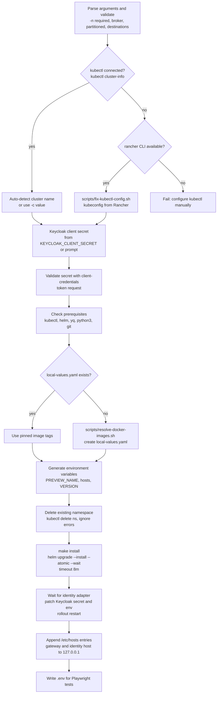

# Local Development Setup

This page shows how to deploy a complete Activiti Cloud stack to a Kubernetes cluster for local development and testing. The stack includes the runtime bundle, query, audit, and messages services, the connector service, the identity adapter, the API gateway, and the messaging broker. Everything is deployed with Helm into its own namespace.

The entry point is a single script:

```bash
./scripts/local-install.sh -n my-env
```

It configures the cluster connection, validates the Keycloak client secret, ensures reliable Docker image tags, runs the Helm deployment, points the identity adapter at your Keycloak instance, writes `/etc/hosts` entries, and generates a `.env` file for the Playwright acceptance tests.

## Prerequisites

| Tool | Required | Purpose |
|------|----------|---------|
| `kubectl` | Yes | Cluster access and verification |
| `helm` (v3+) | Yes | Chart deployment |
| `yq` | Yes | YAML processing of image overrides |
| `python3` | Yes | Version parsing in the Makefile |
| `git` | Yes | Cloning the full Helm chart |
| `rancher` CLI | Optional | Generating the kubectl config from a Rancher-managed cluster |
| Node.js and npm | Optional | Running the Playwright acceptance tests |

Install missing tools with Homebrew on macOS:

```bash
brew install kubectl
brew install helm
brew install yq
brew install rancher-cli
```

The Makefile clones the Helm chart repository `Activiti/activiti-cloud-full-chart` into `.git/activiti-cloud-full-chart`, authenticated with the `GITHUB_TOKEN` environment variable:

```bash
export GITHUB_TOKEN=<your GitHub token>
```

You also need cluster access. The script accepts either a working `kubectl` connection or the Rancher CLI (see [Cluster configuration](#cluster-configuration)). No Kubernetes cluster? The script suggests creating one with kind or minikube:

```bash
brew install kind
kind create cluster --name activiti-local
```

## Cluster configuration

The script has three ways to end up with a working kubectl connection.

### Option 1: Automatic (recommended)

If `kubectl cluster-info` succeeds, the script uses your current context and auto-detects the cluster name:

```bash
./scripts/local-install.sh -n my-test
```

Contexts named `activiti-hackathon` or `activiti-community` map to a cluster of the same name, contexts matching `*rancher*` map to `activiti`, and any other context name is used as the cluster name directly.

### Option 2: Specify the cluster

```bash
./scripts/local-install.sh -n my-test -c activiti-hackathon
```

### Option 3: Generate the kubectl config from Rancher

```bash
./scripts/fix-kubectl-config.sh activiti-hackathon
./scripts/local-install.sh -n my-test
```

`fix-kubectl-config.sh` requires the Rancher CLI, checks that your current Rancher context targets the given cluster (run `rancher context switch` first if not), backs up `~/.kube/config` to a timestamped copy, and writes a fresh kubeconfig with `rancher clusters kubeconfig`. The default cluster name is `activiti`.

If you prefer plain kubectl, configure the context yourself and then run the install:

```bash
kubectl config get-contexts
kubectl config use-context your-context
./scripts/local-install.sh -n my-test
```

## The install script, step by step



### Script options

| Option | Description | Default |
|--------|-------------|---------|
| `-n, --name <name>` | Environment name, used in the namespace and hostnames. Required. | - |
| `-c, --cluster <name>` | Cluster name; used to build gateway domains. | Auto-detected from the kubectl context |
| `-b, --broker <broker>` | Messaging broker: `rabbitmq` or `kafka`. | `rabbitmq` |
| `-pt, --partitioned <bool>` | Partitioned messaging variant: `true` or `false`. | `false` |
| `-d, --destinations <type>` | Messaging destinations variant: `default` or `override`. | `default` |
| `-v, --version <version>` | Version to deploy. | Tag from `local-values.yaml`, or `0.0.1-<name>-SNAPSHOT` without local images |
| `--no-local-images` | Skip `local-values.yaml` and use the generated image versions. | Off |
| `--dry-run` | Print the commands without executing them. | Off |
| `-h, --help` | Show help. | - |

Examples:

```bash
# Basic deployment with RabbitMQ
./scripts/local-install.sh -n michal-test

# Kafka, partitioned messaging, override destinations
./scripts/local-install.sh -n feature-xyz -b kafka -pt true -d override

# Custom cluster and version
./scripts/local-install.sh -n my-env -c activiti-community -v 1.2.3-SNAPSHOT

# Preview what would happen
./scripts/local-install.sh -n test-env --dry-run
```

## Generated namespace

The namespace follows this pattern:

```text
pr-{environment-name}-{broker}-{partitioned}-{destinations}
```

where the broker contributes `rabbit` for `rabbitmq` or `kafka`, the partitioned flag contributes `p` (true) or `n` (false), and the destinations choice contributes `o` (override) or `d` (default). Examples:

- `pr-michal-test-rabbit-n-d` (RabbitMQ, non-partitioned, default destinations)
- `pr-feature-xyz-kafka-p-o` (Kafka, partitioned, override destinations)

The script deletes any existing namespace with that name before deploying, so re-running the command for the same environment name is idempotent.

## Keycloak configuration

The platform authenticates against a Keycloak instance at `https://<cluster>.envalfresco.com/auth` using the `alfresco` realm and the `activiti-keycloak` client. Before deploying, the script:

1. Takes the client secret from the `KEYCLOAK_CLIENT_SECRET` environment variable, or prompts for it interactively. You can copy the secret from the Keycloak admin console at `https://<cluster>.envalfresco.com/auth/admin/master/console/#/alfresco/clients` (client `activiti-keycloak`, Credentials tab).
2. Validates it with a client-credentials token request and aborts if the secret is rejected.

After the Helm install completes, the script patches the `activiti-keycloak-client` secret with the provided secret, sets the `ACT_KEYCLOAK_URL` and `ACT_KEYCLOAK_REALM` environment variables on the runtime bundle, query, connector, and identity adapter deployments, and restarts the identity adapter.

## Image tags: local-values.yaml

By default the deployment uses the image tags pinned in `local-values.yaml` at the repository root, so local deployments do not depend on PR-specific images that may not exist. The file overrides the tag for each service image:

```yaml
runtime-bundle:
  image:
    tag: "8.8.0-alpha.108"
    pullPolicy: IfNotPresent

activiti-cloud-query:
  image:
    tag: "8.8.0-alpha.108"
    pullPolicy: IfNotPresent

activiti-cloud-connector:
  image:
    tag: "8.8.0-alpha.108"
    pullPolicy: IfNotPresent

activiti-cloud-identity-adapter:
  image:
    tag: "8.8.0-alpha.108"
    pullPolicy: IfNotPresent
```

If the file is missing, the script creates it by running `scripts/resolve-docker-images.sh`. Pass `--no-local-images` to skip this file entirely and let the chart use its generated image versions; in that case the script generates a version of the form `0.0.1-<name>-SNAPSHOT` unless you pass `-v`.

## What the Makefile does

`make install` (invoked by the script) resolves the release version from the `VERSION` file, clones the `activiti-cloud-full-chart` repository, and then runs, inside `charts/activiti-cloud-full-example`:

```bash
helm upgrade ${PREVIEW_NAME} . \
  --install \
  --set global.application.name=default-app \
  --set global.keycloak.clientSecret=$(uuidgen) \
  --set global.gateway.http=false \
  --set global.gateway.domain=${GLOBAL_GATEWAY_DOMAIN} \
  --values ${MESSAGING_BROKER}-values.yaml \
  --values ${MESSAGING_PARTITIONED}-values.yaml \
  --values ${MESSAGING_DESTINATIONS}-values.yaml \
  --values local-values.yaml \
  --namespace ${PREVIEW_NAME} \
  --create-namespace \
  --atomic \
  --wait \
  --timeout 8m
```

The three messaging values files select the broker type, the partitioned variant, and the destinations variant; `--atomic` rolls back automatically if the install fails.

## Local access

Once the deployment is ready, reach the stack over `localhost:8080` through the ingress controller.

### 1. Add `/etc/hosts` entries

The script appends these entries (or prints them if it cannot write to `/etc/hosts`):

```bash
echo "127.0.0.1 gateway-pr-my-env-rabbit-n-d.activiti.envalfresco.com" | sudo tee -a /etc/hosts
echo "127.0.0.1 identity-pr-my-env-rabbit-n-d.activiti.envalfresco.com" | sudo tee -a /etc/hosts
```

Replace `pr-my-env-rabbit-n-d` with your `PREVIEW_NAME` and `activiti` with your cluster name.

### 2. Start port forwarding

```bash
kubectl port-forward svc/ingress-nginx-controller 8080:80 -n default
```

### 3. Call the API

The API is then available at `http://gateway-pr-my-env-rabbit-n-d.activiti.envalfresco.com:8080`. See [Your First Workflow](first-workflow.md) for the first API calls.

## Generated files

### local-values.yaml

- Created at the repository root if missing.
- Pins working image tags so local deployments are reliable.

### .env for Playwright tests

Written to `activiti-cloud-acceptance-tests-playwright/.env`:

| Variable | Value |
|----------|-------|
| `PREVIEW_NAME` | Generated namespace |
| `CLUSTER_NAME` | Target cluster |
| `CLUSTER_DOMAIN` | `envalfresco.com` |
| `LOCAL_PORT` | `8080` |
| `CI` / `GITHUB_ACTIONS` | `false` |
| `GATEWAY_PROTOCOL` | `http` (local port forwarding) |
| `GATEWAY_HOST` | `gateway-<PREVIEW_NAME>.<GLOBAL_GATEWAY_DOMAIN>:8080` |
| `GATEWAY_URL` | `http://gateway-<PREVIEW_NAME>.<GLOBAL_GATEWAY_DOMAIN>:8080` |
| `SSO_PROTOCOL` | `http` |
| `IDENTITY_HOST` | `identity-<PREVIEW_NAME>.<GLOBAL_GATEWAY_DOMAIN>:8080` |
| `SSO_HOST` | Keycloak token endpoint URL |
| `REALM` / `KEYCLOAK_REALM` | `alfresco` |
| `KEYCLOAK_CLIENT_ID` | `activiti-keycloak` |
| `KEYCLOAK_CLIENT_SECRET` | The secret you provided |
| `ACTIVITI_CLOUD_APPLICATION_NAME` | `default-app` |

User credentials are not written into the generated file. Configure them in a separate `.env.local` file using variables such as `TESTUSER_USERNAME`, `TESTUSER_PASSWORD`, `HRUSER_USERNAME`, and `HRUSER_PASSWORD`.

## Running acceptance tests

With the `/etc/hosts` entries and port forwarding in place:

```bash
cd activiti-cloud-acceptance-tests-playwright
npm test
```

## Environment variables

Variables you set:

| Variable | Purpose |
|----------|---------|
| `KEYCLOAK_CLIENT_SECRET` | Skip the interactive prompt for the Keycloak client secret |
| `GITHUB_TOKEN` | Used by the Makefile to clone `activiti-cloud-full-chart` |

Variables generated by the script and passed to `make install`:

| Variable | Value |
|----------|-------|
| `PREVIEW_NAME` | `pr-{name}-{broker}-{partitioned}-{destinations}` |
| `CLUSTER_NAME` | Resolved cluster name |
| `GLOBAL_GATEWAY_DOMAIN` | `<CLUSTER_NAME>.envalfresco.com` |
| `GATEWAY_HOST` | `gateway-<PREVIEW_NAME>.<GLOBAL_GATEWAY_DOMAIN>` |
| `SSO_HOST` | `identity-<PREVIEW_NAME>.<GLOBAL_GATEWAY_DOMAIN>` |
| `VERSION` | Image tag from `local-values.yaml`, or `-v` value, or `0.0.1-<name>-SNAPSHOT` |
| `MESSAGING_BROKER` | `rabbitmq` or `kafka` |
| `MESSAGING_PARTITIONED` | `partitioned` or `non-partitioned` |
| `MESSAGING_DESTINATIONS` | `default-destinations` or `override-destinations` |
| `GATEWAY_PROTOCOL` / `SSO_PROTOCOL` | `https` (in-cluster domains) |
| `LOCAL_VALUES_FILE` | Absolute path to `local-values.yaml`, when used |
| `KUBECTL` | kubectl command used by the Makefile |

## Troubleshooting

### kubectl connection issues

```bash
kubectl config current-context
kubectl config get-contexts
./scripts/fix-kubectl-config.sh activiti
kubectl cluster-info
```

### Deployment issues

The deployment names follow the pattern `<namespace>-<service>`: `<ns>-runtime-bundle`, `<ns>-activiti-cloud-query`, `<ns>-activiti-cloud-connector`, and `<ns>-activiti-cloud-identity-adapter`.

```bash
kubectl get pods -n pr-my-env-rabbit-n-d
kubectl get services -n pr-my-env-rabbit-n-d
kubectl get ingress -n pr-my-env-rabbit-n-d
kubectl logs -n pr-my-env-rabbit-n-d deployment/pr-my-env-rabbit-n-d-runtime-bundle
```

### Keycloak secret rejected

Re-check the secret in the Keycloak admin console and test it directly:

```bash
curl -s -X POST "https://<cluster>.envalfresco.com/auth/realms/alfresco/protocol/openid-connect/token" \
  -H "Content-Type: application/x-www-form-urlencoded" \
  -d "grant_type=client_credentials&client_id=activiti-keycloak&client_secret=<secret>"
```

The response must contain an `access_token`.

### Port forwarding issues

```bash
lsof -i :8080
pkill -f "kubectl port-forward"
curl -H "Host: gateway-pr-my-env-rabbit-n-d.activiti.envalfresco.com" http://localhost:8080/
```

## Cleanup

Remove the deployment and its namespace:

```bash
make delete PREVIEW_NAME=pr-my-env-rabbit-n-d
```

This runs `helm uninstall` followed by `kubectl delete namespace`. If you need to clean up more thoroughly:

```bash
kubectl delete namespace pr-my-env-rabbit-n-d
pkill -f "kubectl port-forward"
sudo nano /etc/hosts
```

Remove the two `127.0.0.1` entries for your gateway and identity hosts from `/etc/hosts`.
