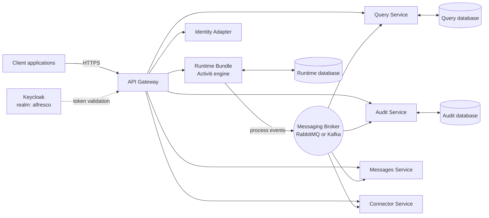

# Activiti Cloud Overview

Activiti Cloud is a microservices, event-driven workflow platform built on the Activiti engine. Version 9.0.0 runs on Spring Boot 3.5 with Java 25 and is deployed to Kubernetes through a Helm chart. Instead of embedding the engine in a single application, Activiti Cloud splits the platform into independently deployable services that communicate through a messaging broker (RabbitMQ or Kafka).

This module assumes you are a developer or architect building workflow-intensive applications, and it covers the platform from first principles: how the services fit together, how to run a stack locally, and how to drive workflows over HTTP.

## How it differs from the standalone Activiti engine

The standalone Activiti engine (covered in the [Activiti module](/docs/getting-started/overview)) is a library you embed in one JVM: process execution, task handling, and queries all run in-process. Activiti Cloud takes the same engine and surrounds it with a service architecture:

| Aspect | Standalone Activiti engine | Activiti Cloud |
|--------|----------------------------|----------------|
| Deployment | Embedded library in one Spring Boot application | Separate microservices on Kubernetes, deployed with a Helm chart |
| Process execution | In-process engine | Runtime bundle service, which you extend with your processes and services |
| Reading state | In-process queries against the engine database | Separate query and audit services that rebuild read models from events |
| Integration | Direct Java calls or in-process listeners | Connectors and messaging-broker events between services and external systems |
| API access | In-process Java API, optional local REST API | REST APIs exposed through an API gateway, secured with Keycloak tokens |
| Scaling | Scale the whole application | Scale each service independently |
| Consistency of reads | Strongly consistent (same JVM and database) | Eventually consistent read side (events flow through the broker) |

The split between writing and reading process state is the central architectural idea. The runtime bundle is the only service that mutates process state. Every time the engine does something (a process starts, a task is created or completed, a variable changes), it publishes an event to the broker. The query service and the audit service consume that event stream and maintain their own stores, while the messages service consumes message events to correlate them with waiting processes. This CQRS-style write/read separation keeps the write side fast and lets the read side scale and be optimized for reporting.

## Key concepts

| Concept | Description |
|---------|-------------|
| Runtime bundle | The service that hosts the Activiti engine. It executes your BPMN processes, exposes the write-side REST API (gateway prefix `/rb`), and is the service you extend with your own process definitions, Java service tasks, and connectors. |
| Query service | Read-side service for process instances, tasks, process definitions, and variables. It consumes runtime events and exposes the query REST API (gateway prefix `/query`). Results are eventually consistent. |
| Audit service | Stores the full, immutable event history of the platform and exposes it through a REST API (gateway prefix `/audit`). Use it to answer "what happened and when" questions. |
| Messages service | The messaging backbone for BPMN message events. It correlates `messageEvents` between runtime bundles and connectors (consuming `messageEvents` and routing on `commandConsumer`), so a process can wait for and be resumed by an externally sent message. |
| Connectors | Components that bridge processes and external systems (for example, calling a REST API from a service task). Connector definitions ship with the runtime bundle; the connector service executes the integrations. |
| Identity adapter | Synchronizes users and groups from Keycloak into the platform and exposes identity management endpoints (gateway prefix `/identity-adapter-service`). |
| Messaging broker | The event backbone. Every inter-service communication goes through RabbitMQ or Kafka topics/exchanges. The Helm chart deploys the broker for you; you choose which one at install time. |
| API gateway | The single entry point for all clients. It routes requests to services by path prefix (`/rb`, `/query`, `/audit`, and so on) and enforces Keycloak-based security. |

## Architecture

The runtime bundle owns the engine database. The query, audit, and messages services own their own databases, populated from broker events rather than by reading the engine directly.

## Services behind the gateway

Clients do not call services directly. Every HTTP request goes to the API gateway, which forwards it to the right service based on the path prefix and enforces authentication. The runtime bundle additionally splits its API into a user-facing part and an admin part:

| Gateway prefix | Service | Notes |
|----------------|---------|-------|
| `/rb/v1/...` | Runtime bundle | Process and task operations; requires the `ACTIVITI_USER` role |
| `/rb/admin/v1/...` | Runtime bundle (admin) | Cross-user administrative operations; requires the `ACTIVITI_ADMIN` role |
| `/query/v1/...` | Query service | Read-side queries for process instances, tasks, definitions, and variables |
| `/audit/v1/...` | Audit service | Event history queries |
| `/identity-adapter-service/v1/...` | Identity adapter | User and group search and management |

Authentication uses Keycloak bearer tokens from the `alfresco` realm. Role-based access control is applied per path: the `ACTIVITI_USER` role covers the `/v1/*` endpoints and `ACTIVITI_ADMIN` covers the `/admin/*` endpoints.

Three flows illustrate how the pieces interact. Starting a process instance: the client POSTs to `/rb/v1/process-instances`, the runtime bundle hands the payload to the engine, and the engine publishes process and task events to the broker. Completing a user task: the client POSTs to `/rb/v1/tasks/{taskId}/complete`, the engine completes the task and, if that was the last pending activity, the process instance, and the corresponding completion events flow through the broker. Reading state: the query and audit services update their stores from those broker events, so a read a moment after a write reflects the committed state, but a read immediately after a write can still see the previous one.

## When to choose Cloud versus the standalone engine

Use the **standalone engine** when:

- Your workflow logic lives inside a single application and only that application needs it.
- You want simple in-process Java API calls and strongly consistent reads with no extra infrastructure.
- You do not run Kubernetes and do not want to operate a broker and multiple services.
- Latency-sensitive request/response flows should stay inside one JVM.

Use **Activiti Cloud** when:

- Multiple applications or teams need to start, query, or react to the same processes, and you want a shared platform instead of duplicated engine instances.
- You need to scale process execution, read models, or event history independently.
- Your processes must integrate with external systems at scale, using connectors and events rather than point-to-point calls.
- You need an audit trail and query APIs that other services and front ends can consume over HTTP.
- You already run Kubernetes and can operate (or rely on) a cluster with a messaging broker.

If you are still evaluating, the [Local Development Setup](local-setup.md) page shows how to stand up a complete stack against a cluster in a single command, which is a good way to try the platform before committing.

## Prerequisites

- **Java 25** and **Maven**, to build runtime bundles and connectors.
- **Kubernetes tooling**: `kubectl`, `helm` (v3+), `yq`, and `python3` are required by the local installation script; see [Local Development Setup](local-setup.md) for the full list.
- **A reachable Kubernetes cluster** for the deployment, or a local cluster (kind or minikube).
- **A messaging broker**: RabbitMQ or Kafka. The Helm chart deploys the broker as part of the stack; you select the type with a single flag.
- **Keycloak** for identity. The stack expects a Keycloak instance with the `alfresco` realm and an `activiti-keycloak` client; the local install script configures the platform to match it.
- **Node.js and npm** (optional), to run the Playwright acceptance tests against your local stack.

## What you'll find in this module

| Page | Description |
|------|-------------|
| [Local Development Setup](local-setup.md) | Deploy a full Activiti Cloud stack to a cluster with one script and access it locally |
| [Your First Workflow](first-workflow.md) | Deploy a BPMN process, start an instance, and complete a task over HTTP |
| [Architecture Overview](../architecture/overview.md) | Deep dive into how the services, events, and databases fit together |
| [Runtime Bundle Service](../services/runtime-bundle.md) | The write-side service: its API, configuration, and how to extend it |
| [Connectors Overview](../connectors/overview.md) | Connect processes to external systems |
| [Deployment Reference](../deployment/reference.md) | Helm chart values, namespaces, and environment variables for deployments |
| [End-to-End Example](../examples/end-to-end.md) | A complete worked example from process model to finished process instance |
