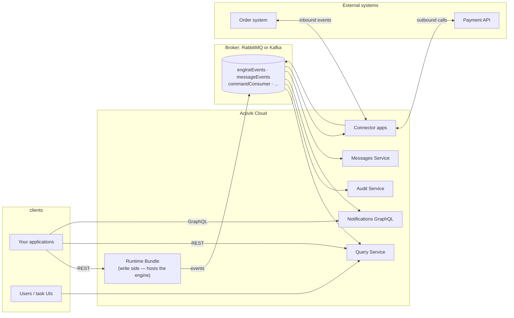

# Activiti Cloud Documentation

**Community-Maintained Documentation**

Welcome to the Activiti Cloud documentation. Activiti Cloud is the microservices, event-driven edition of the Activiti workflow platform: process execution, querying, auditing, messaging, and external integration are delivered as independently deployable services that communicate through a messaging broker.

> **Note:** This is community-contributed documentation and is not officially maintained by the Activiti team. For official documentation, please refer to the Activiti project repositories.

## Who This Is For

| You are... | Start here |
|------------|------------|
| A developer who needs to deploy and operate a workflow | [Local Development Setup](./getting-started/local-setup.md), then [Your First Workflow](./getting-started/first-workflow.md) |
| A developer who needs to call the REST APIs | [Runtime Bundle Service](./services/runtime-bundle.md) and [Query Service](./services/query.md) |
| An architect evaluating the platform | [Architecture Overview](./architecture/overview.md) and [Event-Driven Design](./architecture/event-driven.md) |
| Someone integrating external systems | [Connectors Overview](./connectors/overview.md) |
| Someone planning a production deployment | [Deployment Reference](./deployment/reference.md) |

## The Platform at a Glance

## Module Contents

### Getting Started

| Guide | Description |
|-------|-------------|
| [Overview](./getting-started/overview.md) | What Activiti Cloud is, key concepts, and when to choose it over the standalone engine |
| [Local Development Setup](./getting-started/local-setup.md) | Deploy the full stack to Kubernetes locally in one command |
| [Your First Workflow](./getting-started/first-workflow.md) | Deploy a process, start an instance, and complete a task via HTTP |
| [Standalone Engine vs. Cloud](./getting-started/standalone-vs-cloud.md) | Decision guide and migration map between the two editions |

### Architecture

| Guide | Description |
|-------|-------------|
| [Architecture Overview](./architecture/overview.md) | Service topology, design rationale, deployment options |
| [Event-Driven Design](./architecture/event-driven.md) | Event model, topics, broker options, ordering and delivery semantics |
| [Identity & Security](./architecture/identity.md) | Keycloak integration, roles, and identity propagation |

### Services

| Guide | Description |
|-------|-------------|
| [Runtime Bundle Service](./services/runtime-bundle.md) | The write side: REST API, configuration, and events emitted |
| [Query Service](./services/query.md) | The read side: query model, REST API, and filtering patterns |
| [Audit Service](./services/audit.md) | Compliance-grade activity log and its API |
| [Messages Service](./services/messages.md) | The messaging backbone between connectors and consumers |
| [Notifications GraphQL Service](./services/notifications-graphql.md) | GraphQL API with live event subscriptions |
| [Identity Adapter Service](./services/identity-adapter.md) | The identity bridge: user, group, and permission lookup against Keycloak |

### Connectors

| Guide | Description |
|-------|-------------|
| [Connectors Overview](./connectors/overview.md) | The integration boundary: concepts and connector definition anatomy |
| [Inbound Connectors](./connectors/inbound.md) | Start or advance processes from external events |
| [Outbound Connectors](./connectors/outbound.md) | Call external APIs from within a process |
| [Connector API Reference](./connectors/api-reference.md) | The connector framework API: bindings, request/result builders, error handling |

### Extending

| Guide | Description |
|-------|-------------|
| [Extending Overview](./extension/overview.md) | The extension map: what's built-in vs. what you build |
| [Custom Runtime Bundle](./extension/custom-runtime-bundle.md) | Build your own runtime bundle application from the starter |
| [Deploying Processes at Runtime](./extension/deploying-processes.md) | BPMN editor integration: the deploy + sync mechanism and a custom deploy endpoint |
| [Custom Connectors](./extension/custom-connectors.md) | Build a connector application end-to-end |
| [Multiple Runtime Bundles](./extension/multiple-bundles.md) | App vs. service identity; sharing one query/audit across bundles |
| [Custom Event Consumers](./extension/custom-read-models.md) | Consume `engineEvents` from your own services; reuse the query modules |

### Operations

| Guide | Description |
|-------|-------------|
| [Application Deployment & Rollback](./operations/applications.md) | Versioned applications: deploy mechanics, rollback, and the application read model |
| [Monitoring & Observability](./operations/monitoring.md) | Actuator endpoints, health, tracing, and what to watch in a deployed platform |

### API Reference

| Guide | Description |
|-------|-------------|
| [Cloud API Reference](./api-reference/overview.md) | The wire contracts: services, base paths, wire formats, and payload map |
| [Process & Task Payloads](./api-reference/process-and-task-payloads.md) | Every runtime-bundle REST payload with field-level reference |
| [Connector & Message Payloads](./api-reference/connector-and-message-payloads.md) | The broker contracts: integration requests/results, message events, runtime events |

### Deployment & Examples

| Guide | Description |
|-------|-------------|
| [Deployment Reference](./deployment/reference.md) | Helm deployment, namespaces, environment variables, and service inventory |
| [End-to-End Example](./examples/end-to-end.md) | A complete business workflow through the whole stack |

## Working with Both Editions

Activiti Cloud shares the engine with the standalone [Activiti](/docs/activiti) edition, so the [BPMN Reference](/docs/bpmn/index) and engine concepts apply to both. The differences:

- **Processes are packaged with the runtime bundle** — BPMN files on the classpath under `processes/` are deployed when the service starts; there is no REST deployment endpoint, but you can add one in a custom bundle to deploy from a BPMN editor at runtime. See [Deploying Processes at Runtime](./extension/deploying-processes.md).
- **Write and read are separated** — you call the runtime bundle to change state and the query service to read it, with short, bounded lag between them.
- **Integration is broker-based** — external systems connect through connector applications, not direct service calls.

For the full decision guide and a migration map, see [Standalone Engine vs. Cloud](./getting-started/standalone-vs-cloud.md). For BPMN element details, see the [BPMN Reference](/docs/bpmn/index) in the Activiti module.

## Additional Resources

- [activiti-cloud on GitHub](https://github.com/Activiti/activiti-cloud) — sources for all services
- [Activiti on GitHub](https://github.com/Activiti/Activiti) — the engine
- [BPMN 2.0 Specification](https://www.bpmn.org)

*Documentation based on Activiti Cloud 9.0.0.*
