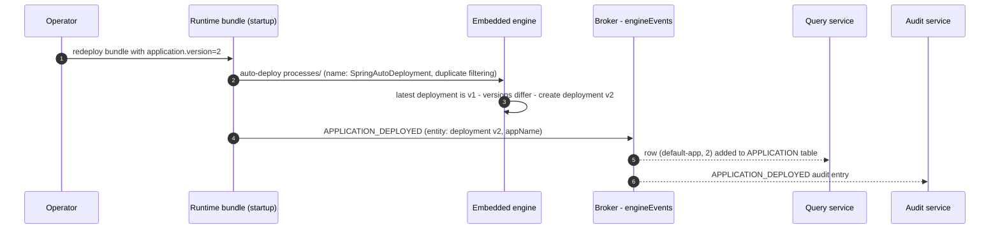

# Application Deployment & Rollback

In Activiti Cloud, an **application** is a versioned set of process deployments owned by a [runtime bundle](../services/runtime-bundle.md). When you ship a new build of the bundle under a new application version, the embedded engine records a new deployment and the platform announces it with an `APPLICATION_DEPLOYED` event. A rollback redeploys the bundle with a *lower* application version: the engine deletes the newer deployment, restores the older one, and announces the change with an `APPLICATION_ROLLBACK` event.

Deployment and rollback are **not REST operations**. The runtime bundle has no application controller — its REST API covers process definitions, instances, tasks, variables, and service tasks, and the admin family under `/rb/admin/v1` covers the same resources without visibility filters. Application lifecycle changes happen inside the engine through its standard deployment mechanism when the bundle starts, and the rest of the platform learns about them from the event stream.

## What an application is

Three things make up an application version:

| Piece | Where it comes from |
|---|---|
| **Name** | `activiti.cloud.application.name` on the runtime bundle (empty by default; `default-app` in the example bundle). This value travels as `appName` on every event payload and is the `name` of each application row in the [query service](../services/query.md). |
| **Deployment** | The engine deployment the bundle's packaged processes are auto-deployed into at startup — by default a single deployment named `SpringAutoDeployment`, built with duplicate filtering by every one of the engine's auto-deployment strategies. |
| **Version** | The *deployment* version of that deployment. Without versioning it stays `1`; with an enforced application version it equals that version (below). |

The *service* identity (`spring.application.name`) is a different axis — it names the service deployment (consumer groups, connector-result destinations). See the [identity model](../extension/multiple-bundles.md#identity-model) for how the two names interact across multiple bundles.

### Versioning properties

The application-versioning behavior is wired by the engine's Spring Boot configuration (`ApplicationUpgradeContextAutoConfiguration` in the engine's `activiti-spring-project` module, consumed by `SpringProcessEngineConfiguration`):

| Property | Default | Meaning |
|---|---|---|
| `application.version` | `0` | **Enforced application version.** When greater than `0`, the startup auto-deployment is given exactly this value as its deployment version. This is the number that becomes the application's version in the read model. |
| `project.manifest.file.path` | `classpath:/default-app.json` | Project manifest resource (`ProjectManifest` JSON). When present, its `version` is stamped onto the deployment as `projectReleaseVersion`, and each newly deployed process definition is given the deployment version as both its `version` and `appVersion`. |
| `activiti.deploy.after-rollback` | `false` | Marks this startup as a post-rollback: enables the engine's rollback deletion (below) and makes the startup announce `APPLICATION_ROLLBACK` instead of `APPLICATION_DEPLOYED`. |
| `spring.activiti.deployment-name` | `SpringAutoDeployment` | Name of the auto-deployment. Note: the application event producer queries deployments by the *literal* name `SpringAutoDeployment` — renaming the auto-deployment silences the application events. |
| `spring.activiti.deployment-mode` | `never-fail` — set by the bundle starter's `metadata.properties`; the engine's own default is `default` | Auto-deployment strategy for the packaged `processes/` resources. All strategies enable duplicate filtering, which is the code path the versioning and rollback logic runs on. |

The example bundle sets `spring.application.name=rb`, `activiti.cloud.application.name=default-app`, and `project.manifest.file.path=classpath:/default-project.json` (a manifest with `"version": "1"`), so a default deployment yields one application named `default-app`.

## How a new application version gets deployed

All of this happens at bundle startup, inside the engine:

1. The auto-deployment strategy builds one deployment named `SpringAutoDeployment` from the packaged `processes/` resources, with **duplicate filtering enabled** (`enableDuplicateFiltering()` — every engine auto-deployment strategy does this).
2. If `application.version` is greater than `0`, the strategy calls `DeploymentBuilder.setEnforcedAppVersion(n)`; if a manifest is present it also calls `setProjectManifest(...)`.
3. The engine's `DeployCmd` compares the new deployment against the latest existing deployment with the same name:
   - With an enforced version set, the comparison is **by version**: the deployments differ only when the enforced version differs from the latest deployment's version. When they are equal, the existing deployment is returned as-is — the engine logs *"An existing deployment of version N matching the current one was found, no need to deploy again."* and deploys nothing.
   - When they differ, the new deployment is created with **exactly the enforced version** (`applyUpgradeLogic`), not latest + 1.
   - With only a manifest (no enforced version), the comparison is by `projectReleaseVersion`, and the new deployment takes *latest version + 1*.
   - With neither, the comparison is by resource bytes, and the deployment version stays `1` while process definition versions auto-increment per key — the application stays at version `1` in the read model.
4. When a project manifest is present, each newly deployed process definition is stamped with the deployment version as both its `version` and its `appVersion` (visible in the bundle's `GET /rb/v1/process-definitions` responses); without a manifest, `appVersion` is `null` and definition versions auto-increment.
5. Once the engine is up, the engine's `ApplicationDeployedEventProducer` (a lifecycle bean in the engine's Spring Boot starter) queries the latest deployment named `SpringAutoDeployment` and publishes an `ApplicationDeployedEvents` Spring event. The bundle's `CloudApplicationDeployedProducer` wraps it as a `CloudRuntimeEvent` and publishes it on the `engineEvents` destination.

So a new application version in the cloud is a **rebuild and redeploy of the bundle with `application.version` bumped** (plus the manifest's `version`, when you use one). The previous deployment — and its process definitions — stays in the engine database; that is exactly what makes the later rollback possible.



## How rollback works

Rollback answers the question "revert this bundle to the previous application version". It is a **redeploy with two settings**: the bundle is built from the previous version's processes, `application.version` is the previous version, and `activiti.deploy.after-rollback` is `true`:

```properties
# the bundle is now built with the version-1 processes
application.version=1
activiti.deploy.after-rollback=true
```

What the engine does at that startup (all in `DeployCmd`, reachable only through the duplicate-filtering path that auto-deployments always use):

1. `checkForRollback` looks at the latest same-named deployment. The engine's rollback flag is `ProcessEngineConfigurationImpl.isRollbackDeployment` — a plain boolean field, **default `false`**, that the engine's Spring Boot wiring sets from `activiti.deploy.after-rollback` (`ApplicationUpgradeContextService` → `SpringProcessEngineConfiguration` constructor).
2. If the flag is set **and** the latest deployment's version is **higher** than the enforced app version (e.g. latest is `2`, enforced is `1`), the engine logs *"Rollback detected: Previous rolled back deployment will be deleted"* and deletes the newer deployment with a **non-cascade** `DeleteDeploymentCmd`: the deployment row, its resources, and its process definitions are removed, while running instances of those definitions are left in place (see [What cascade delete removes](../../activiti/advanced/deployment-builder.md#what-cascade-delete-removes)).
3. The deployment whose version equals the enforced app version becomes the upgrade target. In the normal case it is still in the database (version upgrades never delete older deployments), the packaged resources match it, and the engine returns it without deploying anything new. (If that deployment had itself been deleted, the engine creates a fresh deployment at version `1` — the rollback degrades into a fresh deploy.)
4. The startup producer sees `activiti.deploy.after-rollback=true` and publishes **`APPLICATION_ROLLBACK`** instead of `APPLICATION_DEPLOYED`, with the restored deployment as the entity.

Practical consequences:

- **New starts resolve to the rolled-back definitions.** The deleted version's process definitions are gone from the repository, so the standard API (which resolves a key to its latest version) can no longer start them. When the deleted definitions provided the latest timer/signal/message start events, the engine re-attaches the previous version's start events.
- **Running instances of the deleted version are left in the database.** Non-cascade deletion removes their definition rows, so treat those instances as orphans — finish, cancel, or destroy them through the admin API.
- **The application read model does not shrink.** The query service has no handler for `APPLICATION_ROLLBACK` — its `APPLICATION` table keeps the row for the rolled-back version. The rollback is visible in the **audit service** (which stores both event types) and in the process definition list, which converges back to the old version through the `PROCESS_DEPLOYED` events.

If you implement the lifecycle in a custom bundle instead of through the startup properties, the same mechanics are reachable through the engine API: `DeploymentBuilder.setEnforcedAppVersion(...)` together with `ProcessEngineConfigurationImpl.setRollbackDeployment(true)` (the flag lives on the implementation class, not the base `ProcessEngineConfiguration`) — see the engine's [Advanced Deployment Builder](../../activiti/advanced/deployment-builder.md#versioning-app-version--rollback).

## The application read model

The [query service](../services/query.md) projects `APPLICATION_DEPLOYED` events into an `APPLICATION` table and serves it:

| Method | Path (service) | Through the deployed gateway | Purpose |
|---|---|---|---|
| GET | `/v1/applications` | `/query/v1/applications` | Paged list of applications. QueryDSL predicates on `id`, `name`, `version` (string equality), plus the standard pagination parameters. |
| GET | `/admin/v1/applications` | `/query/admin/v1/applications` | The same query; the `/admin/*` pattern requires `ACTIVITI_ADMIN` instead of `ACTIVITI_USER`. There is no per-user visibility filter on the application entity — both endpoints return the same rows. |

(Through the deployed gateway the routes are prefixed per service — see [API Routes](../deployment/reference.md#api-routes).)

Each entry is a `CloudApplication` with three fields, all sourced from the event:

| Field | Type | Value |
|---|---|---|
| `id` | string | The engine deployment id (`entityId` of the event) |
| `name` | string | The event's `appName` — the bundle's `activiti.cloud.application.name` |
| `version` | string | The reported deployment's version |

Example (Alfresco-style envelope, as in the other [query service](../services/query.md) collections):

```json
{
  "list": {
    "entries": [
      { "entry": { "id": "6a1b2c3d-4e5f-4a6b-8c7d-9e0f1a2b3c4d", "name": "default-app", "version": "1" } },
      { "entry": { "id": "7b2c3d4e-5f6a-4b7c-8d9e-0f1a2b3c4d5e", "name": "default-app", "version": "2" } }
    ],
    "pagination": { "skipCount": 0, "maxItems": 100, "count": 2, "hasMoreItems": false, "totalItems": 2 }
  }
}
```

Update semantics, from the query service's `ApplicationDeployedEventHandler`:

- One row per `(name, version)` ever reported: the handler persists the event's deployment as `(id, appName, version)` **unless a row with the same name and version already exists**, in which case it is skipped — so replays are idempotent.
- Rows are **never deleted**: the query service handles only `APPLICATION_DEPLOYED`, and `APPLICATION_ROLLBACK` has no query-side handler. After v1 → v2 → rollback to v1, the table still holds both rows.
- The producer reports only the latest `SpringAutoDeployment` deployment, so the newest row always reflects the bundle's current application version — but the table is a history, not a pointer.

## Events

Two event types, both on `engineEvents`, both part of the full [event model](../architecture/event-driven.md#event-types):

| Event type | Emitted when | Entity payload |
|---|---|---|
| `APPLICATION_DEPLOYED` | Bundle starts (or upgrades) without the rollback flag | The latest `SpringAutoDeployment` deployment as a `Deployment`: `id`, `name`, `version`, `projectReleaseVersion` (a numeric release version is reported one higher — the engine stores project versions 0-based, the event 1-based) |
| `APPLICATION_ROLLBACK` | Bundle starts with `activiti.deploy.after-rollback=true` | The same payload, from the restored deployment |

They are emitted **once per bundle startup** (not per deployment) by the engine's `ApplicationDeployedEventProducer` and forwarded to the broker by the bundle's `CloudApplicationDeployedProducer` through the `auditProducer` binding. Consumers: the query service (deployed only — the `APPLICATION` table), the [audit service](../services/audit.md) (both — immutable entries, filterable e.g. with `search=eventType:APPLICATION_ROLLBACK`), and the notifications-graphql service (no subscription counterpart for either type).

## Working with applications

### Deploying a new application version

1. Update the processes (and their extensions) packaged under `processes/`.
2. Bump the version: `application.version=2` in the bundle configuration — or, when you use a manifest, bump the manifest's `version` instead (the deployment version then takes latest + 1).
3. Rebuild and redeploy the bundle. At startup the engine records the new deployment, and the read models converge within the usual event lag.
4. Verify: an `APPLICATION_DEPLOYED` entry in the audit service, a new row in `GET /query/v1/applications`, and the new definition version in the bundle's `GET /rb/v1/process-definitions`.

An alternative exists for editor-driven definitions: a custom deploy endpoint in a [custom runtime bundle](../extension/custom-runtime-bundle.md) that deploys through `RepositoryService` and syncs the read models ([Deploying Processes at Runtime](../extension/deploying-processes.md#building-the-bpmn-editor-backend)). Note that path deploys under its own deployment names, so it updates process definitions **without moving the application version** — the application producer tracks only the `SpringAutoDeployment` name.

### Rolling back to a previous version

1. Build the bundle from the previous version's processes.
2. Set `application.version` to the previous version **and** `activiti.deploy.after-rollback=true`.
3. Redeploy the bundle. Watch the bundle log for *"Rollback detected: Previous rolled back deployment will be deleted"*, then confirm the `APPLICATION_ROLLBACK` audit entry, the unchanged `GET /query/v1/applications` list, and the process definition list back on the old version.
4. Deal with any running instances of the deleted version — they are orphaned (see [How rollback works](#how-rollback-works)).

Once the rollback has settled you can move forward again: bump `application.version` and redeploy with `activiti.deploy.after-rollback` back to `false`.

### What an operator sees

| Signal | Where | Meaning |
|---|---|---|
| `APPLICATION_DEPLOYED` / `APPLICATION_ROLLBACK` entries | [Audit service](../services/audit.md) — `GET /audit/v1/events?search=eventType:APPLICATION_ROLLBACK` | Every application lifecycle transition, with the acting bundle's coordinates |
| Application rows | `GET /query/v1/applications` | One row per (application, version) ever deployed; the highest version is the current one — until a rollback, after which the history is unchanged |
| Definition `version` / `appVersion` fields | Bundle `GET /rb/v1/process-definitions` | With a manifest: stamped with the deployment (application) version; without: auto-incremented `version`, `null` `appVersion` |
| Engine log lines | Bundle pod log | *"Rollback detected: Previous rolled back deployment will be deleted"* (rollback) and *"no need to deploy again"* (no-op startup) |

## Behavior baseline: the acceptance scenario

The platform ships a Serenity/j-behave story that pins this behavior against a deployed cluster: `activiti-cloud-acceptance-scenarios/runtime-acceptance-tests/src/main/resources/stories/runtime-bundle/application-action.story` (steps in `ApplicationActions`), with two scenarios:

- **"application deployed events are saved in audit"** — after the services start, the audit service holds an `APPLICATION_DEPLOYED` event whose deployment entity has version `1`.
- **"getting applications"** — `GET /v1/applications` on the query service returns exactly one application, named `default-app` (the example bundle's `activiti.cloud.application.name`).

Use this story as the behavior baseline when you change bundle identity or versioning: if it passes, the deployment announcement and the application read model are working end to end.

## Related

- [Runtime Bundle Service](../services/runtime-bundle.md)
- [Query Service](../services/query.md)
- [Audit Service](../services/audit.md)
- [Event-Driven Design](../architecture/event-driven.md)
- [Deploying Processes at Runtime](../extension/deploying-processes.md)
- [Multiple Runtime Bundles](../extension/multiple-bundles.md)
- [Advanced Deployment Builder (engine)](../../activiti/advanced/deployment-builder.md)
