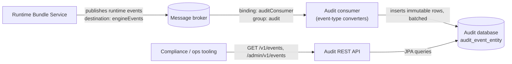

# Audit Service

The audit service records the complete runtime event stream of every process as an append-only, immutable log. It is the source for compliance reporting, process replay, and incident forensics.

## What it records and why

The audit service subscribes to the same `engineEvents` destination as the [query service](./query.md) and converts every incoming runtime event into an audit entry. Unlike the query model, it does not project state into denormalized tables: it stores each event verbatim as an immutable row, so the log is a faithful, time-ordered record of everything the engine did.

The recorded event types, grouped by domain:

| Category | Event types |
|---|---|
| Process | `PROCESS_STARTED`, `PROCESS_CREATED`, `PROCESS_COMPLETED`, `PROCESS_CANCELLED`, `PROCESS_RESUMED`, `PROCESS_SUSPENDED`, `PROCESS_UPDATED`, `PROCESS_DELETED`, `PROCESS_DEPLOYED` |
| Tasks | `TASK_CREATED`, `TASK_ASSIGNED`, `TASK_COMPLETED`, `TASK_CANCELLED`, `TASK_SUSPENDED`, `TASK_UPDATED`, `TASK_CANDIDATE_USER_ADDED`, `TASK_CANDIDATE_USER_REMOVED`, `TASK_CANDIDATE_GROUP_ADDED`, `TASK_CANDIDATE_GROUP_REMOVED` |
| BPMN | `ACTIVITY_STARTED`, `ACTIVITY_COMPLETED`, `ACTIVITY_CANCELLED`, `SEQUENCE_FLOW_TAKEN` |
| Variables | `VARIABLE_CREATED`, `VARIABLE_UPDATED`, `VARIABLE_DELETED` |
| Integration | `INTEGRATION_REQUESTED`, `INTEGRATION_RESULT_RECEIVED`, `INTEGRATION_ERROR_RECEIVED` |
| Messages | `MESSAGE_RECEIVED`, `MESSAGE_SENT`, `MESSAGE_WAITING`, `MESSAGE_SUBSCRIPTION_CANCELLED` |
| Timers | `TIMER_SCHEDULED`, `TIMER_FIRED`, `TIMER_EXECUTED`, `TIMER_FAILED`, `TIMER_CANCELLED`, `TIMER_RETRIES_DECREMENTED` |
| Signals, errors, incidents, applications | `SIGNAL_RECEIVED`, `ERROR_RECEIVED`, `INCIDENT_CREATED`, `APPLICATION_DEPLOYED`, `APPLICATION_ROLLBACK` |

Each event type has a dedicated converter that maps the event to a subclass of the audit entity. Event types without a converter are logged and skipped, so unknown event types never break the stream. Two emitted event types have no converter and are skipped (logged, not stored): `TASK_ACTIVATED` and `START_MESSAGE_DEPLOYED`.

Typical reasons to run the audit service:

- **Compliance and retention** — an unalterable, exportable record of who did what to which process and when.
- **Process replay** — reconstructing the exact sequence of a process instance for debugging or testing.
- **Forensics and SLA analysis** — correlating failures, delays, and variable changes after the fact.

## Audit entries

All entries share a single table (`audit_event_entity`, single-table inheritance with a `TYPE` discriminator column) and are marked immutable: rows are never updated or rewritten in place.

Common fields on every entry:

| Field | Description |
|---|---|
| `id` | Auto-generated sequence id (`audit_sequence`). |
| `eventId` | Id of the runtime event. |
| `timestamp` | Event timestamp (epoch millis). |
| `eventType` | The event type name (e.g. `TASK_COMPLETED`). |
| `appName`, `appVersion` | Application that produced the event. |
| `serviceName`, `serviceFullName`, `serviceType`, `serviceVersion` | Service that produced the event. |
| `sequenceNumber` | Position of the event within the consumed message batch. |
| `messageId` | Broker message id the event arrived in. |
| `entityId` | Id of the entity the event is about. |
| `processInstanceId`, `processDefinitionId`, `processDefinitionKey`, `parentProcessInstanceId`, `businessKey` | Process context of the event. |

Per event category, the schema adds payload columns: `process_instance`, `process_definition`, `bpmn_activity`, `flow_node_id`, `sequence_flow`, `task`, `task_id`, `task_name`, `candidate_user`, `candidate_group`, `variable_instance`, `variable_name`, `variable_type`, `signal`, `integration_context_id`, and `cause` (errors). The payload objects are stored as JSON text columns; the REST API rehydrates them into the original event objects, so each entry is returned as the full event, not just the common fields.

## How it works



- The consumer binding is `auditConsumer`; its destination is the `engineEvents` topic with consumer group `audit` (separate from the query group, so both services replay independently).
- Events are converted by type-specific converters and saved in batches (`REQUIRES_NEW` transaction per batch, Hibernate batched inserts).
- Storage is provided by the **`activiti-cloud-starter-audit`** starter. As the audit service README states, it "uses JPA and a relational DB to store audit logs"; in 9.0.0 it is the only storage-backed starter shipped. Supporting modules are `activiti-cloud-starter-audit-rest` (REST layer) and `activiti-cloud-starter-audit-consumer` (messaging bindings).
- The schema is managed by Liquibase (`config/audit/liquibase/master.xml`, change-log tables `DATABASECHANGELOG_AUDIT` / `DATABASECHANGELOGLOCK_AUDIT`).

## REST API

Two base paths exist: `/v1/events` (read access restricted by security policies) and `/admin/v1/events` (unrestricted, plus delete and export). Paged endpoints accept the standard pagination parameters `maxItems` (default `100`), `skipCount` (default `0`), and `sort=field,ASC|DESC`, and return the same `list` + `pagination` envelope as the query service.

| Method | Path | Purpose |
|---|---|---|
| GET | `/v1/events` | Search audit events. Parameters: `search` (filter expression), `eventTimeFrom`, `eventTimeTo` (event timestamp range), plus pagination. |
| GET | `/v1/events/{eventId}` | Get one audit event by its event id. |
| GET | `/admin/v1/events` | All audit events without security restrictions. |
| GET | `/admin/v1/events/export/{fileName}` | Export events between `from` and `to` (ISO dates, both required) as a CSV attachment (`text/csv`). |
| DELETE | `/admin/v1/events` | Delete all audit events. Enabled by default; set `activiti.rest.enable-deletion=false` to disable. |

### The `search` filter expression

The `search` parameter is a comma-separated list of `field:operation value` clauses. Supported operations: `:` (equals), `!` (not equals), `>` / `>=` (greater than / equal), `<` / `<=` (less than / equal), `~` (like). Values are matched against the common entry fields (for example `processInstanceId`, `eventType`, `appName`, `businessKey`, `entityId`, `timestamp`). Multiple clauses are combined with AND.

### Examples

All events of one process instance (here `PROCESS_STARTED` and `TASK_CREATED`), newest first:

```http
GET /v1/events?search=processInstanceId:1693287654321,&maxItems=10&skipCount=0&sort=timestamp,DESC HTTP/1.1
Accept: application/json
```

```json
{
  "list": {
    "entries": [
      {
        "entry": {
          "id": "1693287655010",
          "timestamp": 1786952871104,
          "eventType": "TASK_CREATED",
          "processInstanceId": "1693287654321",
          "entityId": "1693287655009",
          "processDefinitionId": "onboarding:1:1693287600000",
          "processDefinitionKey": "onboarding",
          "businessKey": "EMP-1042",
          "appName": "hr-app",
          "serviceName": "runtime-bundle",
          "sequenceNumber": 0,
          "messageId": "b2c7d910-77a1-4e3f-9a24-55c1f0d2c981"
        }
      },
      {
        "entry": {
          "id": "1693287654333",
          "timestamp": 1786951862412,
          "eventType": "PROCESS_STARTED",
          "processInstanceId": "1693287654321",
          "entityId": "1693287654321",
          "processDefinitionId": "onboarding:1:1693287600000",
          "processDefinitionKey": "onboarding",
          "processDefinitionVersion": 1,
          "businessKey": "EMP-1042",
          "entity": {
            "id": "1693287654321",
            "name": "Onboarding: John Doe",
            "processDefinitionId": "onboarding:1:1693287600000",
            "processDefinitionKey": "onboarding",
            "processDefinitionName": "Onboarding",
            "processDefinitionVersion": 1,
            "initiator": "jdoe",
            "startDate": "2026-08-14T09:31:02.412",
            "businessKey": "EMP-1042",
            "status": "RUNNING"
          },
          "appName": "hr-app",
          "appVersion": "1",
          "serviceName": "runtime-bundle",
          "serviceFullName": "org.activiti.cloud:hr-app",
          "serviceType": "runtime",
          "serviceVersion": "1.0.0",
          "sequenceNumber": 1,
          "messageId": "8f14e45f-ceea-4b1a-9d6d-2f0e5c1b7a33"
        }
      }
    ],
    "pagination": {
      "skipCount": 0,
      "maxItems": 10,
      "count": 2,
      "hasMoreItems": false,
      "totalItems": 2
    }
  }
}
```

Events in a time window, exported to CSV for archiving or BI tooling:

```http
GET /admin/v1/events/export/audit-2026-08.csv?from=2026-08-01&to=2026-08-31 HTTP/1.1
Accept: text/csv
```

The response is a CSV attachment (`Content-Disposition: attachment;filename=audit-2026-08.csv`) with one row per event: `time`, `sequenceNumber`, `messageId`, `entityId`, `id`, `entity` (JSON-serialized payload), `eventType`, `appVersion`, `serviceVersion`, `serviceType`, `serviceFullName`, `processInstanceId`, `appName`, `serviceName`, `businessKey`, `parentProcessInstanceId`, `processDefinitionId`, `processDefinitionKey`, `processDefinitionVersion`, `actor`.

## Configuration

| Property | Default | Description |
|---|---|---|
| `spring.cloud.stream.bindings.auditConsumer.destination` | `engineEvents` | Broker destination consumed for runtime events (env `ACT_AUDIT_CONSUMER_DEST`). |
| `spring.cloud.stream.bindings.auditConsumer.group` | `audit` | Consumer group (env `ACT_AUDIT_CONSUMER_GROUP`). |
| `spring.cloud.stream.bindings.auditConsumer.contentType` | `application/json` | Message content type (env `ACT_AUDIT_CONSUMER_CONTENT_TYPE`). |
| `spring.cloud.stream.bindings.auditConsumer.consumer.concurrency` | `1` | Consumer concurrency (env `ACT_QUERY_CONSUMER_CONCURRENCY`). |
| `spring.cloud.stream.rabbit.bindings.auditConsumer.consumer.prefetch` | `20` | RabbitMQ prefetch per consumer (env `ACT_QUERY_CONSUMER_RABBIT_PREFETCH`). |
| `activiti.cloud.messaging.destinations.engineEvents.name` | `engineEvents` | Default destination name for the engine-events scope (env `ACT_RB_ENG_EVT_DEST`). |
| `spring.audit.liquibase.change-log` | `classpath:config/audit/liquibase/master.xml` | Liquibase changelog for the audit schema. |
| `spring.audit.liquibase.database-change-log-table` | `DATABASECHANGELOG_AUDIT` | Liquibase change-log table name. |
| `activiti.rest.enable-deletion` | `true` | Expose `DELETE /admin/v1/events`. Set to `false` to disable. |
| `spring.datasource.*` | — | Standard Spring Boot datasource properties (`url`, `username`, `password`, `driver-class-name`). |

The consumer starter also enables batched SQL for the event handlers (`spring.jpa.properties.hibernate.jdbc.batch_size=50`, `order_inserts=true`, `order_updates=true`) and disables Zipkin reporting (`spring.zipkin.enabled=false`).

There is no built-in retention or auto-cleanup property in the audit service. The log grows monotonically; prune it with `DELETE /admin/v1/events` (for example, after archiving a period through the CSV export endpoint) or directly in the database.

## Use cases

**SLA analysis.** Query the timestamps of lifecycle events per process definition. Example: process duration is the gap between `PROCESS_STARTED` and `PROCESS_COMPLETED`; task latency is the gap between `TASK_CREATED` and `TASK_COMPLETED` (or `TASK_ASSIGNED` and `TASK_COMPLETED` for assignment-to-completion). Filter with `search=processDefinitionKey:onboarding,` and the `eventTimeFrom` / `eventTimeTo` parameters, then aggregate on the `timestamp` field.

**Incident forensics.** Reconstruct what a process was doing when it failed:

```http
GET /v1/events?search=processInstanceId:1693287654321,eventType:ERROR_RECEIVED,
GET /v1/events?search=processInstanceId:1693287654321,eventType:INTEGRATION_ERROR_RECEIVED,
GET /v1/events?search=processInstanceId:1693287654321,eventType:TIMER_FAILED,
```

The `INTEGRATION_ERROR_RECEIVED` and `ERROR_RECEIVED` entries carry the connector id, error code, and error message in their payload, and `INCIDENT_CREATED` entries capture engine incidents.

**Process replay.** Fetch every entry of a process instance in order (`search=processInstanceId:{id},` with `sort=timestamp,ASC`) to replay its full lifecycle, including variable changes and timer firings, in a simulator or test harness. The `sequenceNumber` and `messageId` fields preserve ordering within a batch.

## Related

- [Query Service](./query.md)
- [Architecture Overview](../architecture/overview.md)
- [Event-Driven Design](../architecture/event-driven.md)
