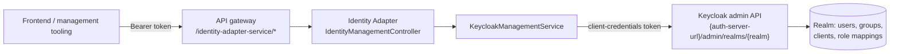

# Identity Adapter Service

**Module:** `activiti-cloud-identity-adapter` in `activiti-cloud-examples` (Activiti Cloud 9.0.0, Spring Boot 3.5.7, Java 25)

The identity adapter is the platform's bridge to an identity provider. Its README states the goal plainly: *"This project aims to provide a common interface to contact any identity provider."* The shipped implementation bridges **Keycloak**: it exposes a REST API for searching users and groups and for granting and reading application permissions, implemented on top of the Keycloak admin API.

## How it fits

[Identity & Security](../architecture/identity.md) covers the platform-wide model: every service is an OAuth2 resource server that validates Keycloak-issued JWTs, and the platform's identity lookups go through the `IdentityService` / `IdentityManagementService` abstractions rather than Keycloak directly. The identity adapter is the deployed, HTTP-facing implementation of that abstraction for user, group, and permission management:

- `IdentityAdapterApplication` is annotated with `@EnableIdentityManagementRestAPI`, which imports the shared `IdentityManagementController` (REST layer), its exception handler, and the search caches from `activiti-cloud-services-common-security`.
- `ActivitiKeycloakAutoConfiguration` in `activiti-cloud-services-common-identity-keycloak` provides the `IdentityManagementService` implementation (`KeycloakManagementService`) and a Feign-based `KeycloakClient` against the Keycloak admin API, authenticated with client credentials.

Note that other services do not call this service to validate tokens — every service validates JWTs on its own (see [Identity & Security](../architecture/identity.md#how-a-rest-call-carries-identity)). Frontends and management tools use this API to resolve "who exists, which groups they are in, and who holds which application role".

## Source layout

The deployed application lives at `activiti-cloud-examples/activiti-cloud-identity-adapter` and is deliberately thin: a `Dockerfile` (Alpine + Amazon Corretto 25, port 8080) and the one-class application `IdentityAdapterApplication`. The actual REST and Keycloak code is in the shared modules under `activiti-cloud-service-common`:

| Module | Key classes | Responsibility |
|--------|-------------|----------------|
| `activiti-cloud-services-common-security` | `org.activiti.cloud.identity.web.controller.IdentityManagementController`, `IdentityManagementRestExceptionHandler`, `IdentitySearchCacheConfiguration` | The identity REST API (enabled by `@EnableIdentityManagementRestAPI`), the `User`/`Group`/permission models, the `userSearch`/`groupSearch` Caffeine caches, and the generic Spring Security auto-configuration |
| `activiti-cloud-services-common-identity-keycloak` | `org.activiti.cloud.services.identity.keycloak.client.KeycloakClient`, `KeycloakManagementService`, `KeycloakUserGroupManager`, `ActivitiKeycloakAutoConfiguration` | The Feign-style Keycloak admin API client, the `IdentityManagementService` implementation, the model mappers, and the JWT issuer check |
| `activiti-cloud-services-common-security-keycloak` | `KeycloakSecurityConfiguration`, `KeycloakJwtAdapter` | The service's own JWT validation setup (issuer/JWKS derived from the Keycloak location) and role/claim extraction |

To bridge a different identity provider, deploy your own adapter implementing the same REST contract (or replacing the `IdentityService`/`IdentityManagementService` beans) — see [Bridging an External Identity Provider](../architecture/identity.md#bridging-an-external-identity-provider).

## REST API

All endpoints are under the base path **`${activiti.cloud.services.identity.url:/v1}`** (default `/v1`), produce `application/json`, and are reachable through the gateway at **`/identity-adapter-service/v1/...`** (see [API Routes](../deployment/reference.md#api-routes) and the gateway table in [Activiti Cloud Overview](../getting-started/overview.md#services-behind-the-gateway)).

| Method | Path | Query parameters | Returns |
|--------|------|------------------|---------|
| GET | `/v1/users` | `search`, `role` (repeatable), `group` (repeatable), `type`, `application`, `hideDeactivatedUser` | JSON array of `User` |
| GET | `/v1/users/{id}` | — | One `User` |
| GET | `/v1/groups` | `search`, `role` (repeatable), `application` | JSON array of `Group` |
| POST | `/v1/permissions/{application}` | — (body: JSON array of permission entries) | 200, no body |
| GET | `/v1/permissions/{application}` | `role` (repeatable) | JSON array of permission entries |

### `GET /v1/users`

| Parameter | Meaning |
|-----------|---------|
| `search` | Free-text Keycloak user search (matches username, email, first and last name). |
| `role` | Repeatable. Only users holding **all** listed roles — realm roles, or the roles of the `application` client when `application` is given. |
| `group` | Repeatable. Restricts the search to members of all listed groups. |
| `type` | `INTERACTIVE` (default) — regular users only; `ALL` — also includes service accounts (looked up by the `service-account-` username prefix, so a non-blank `search` is required for any service account to be returned). Any other value returns `400`. |
| `application` | A Keycloak **client id** scoping the search: the user must hold at least one role on that client. An unknown client yields an empty list. |
| `hideDeactivatedUser` | `true` excludes disabled users (default `false`). |

The underlying Keycloak user search is paged with `first=0&max=50`, so the response contains at most the first 50 matches. Results are cached in the `userSearch` Caffeine cache.

### `GET /v1/users/{id}`

Returns the `User` for the given **Keycloak user id**. An unknown id surfaces as a Keycloak `404` that propagates as an unhandled `FeignException.NotFound`, so the service answers `500` in that case.

### `GET /v1/groups`

| Parameter | Meaning |
|-----------|---------|
| `search` | Free-text group search. |
| `role` | Repeatable. Only groups holding all listed roles (realm scope, or client scope when `application` is given). |
| `application` | Keycloak client id; only groups holding at least one role on that client are returned. An unknown client yields an empty list. |

Results are cached in the `groupSearch` Caffeine cache.

### Permissions

`POST /v1/permissions/{application}` accepts a JSON array of `{ "role": "...", "users": ["username", ...], "groups": ["groupname", ...] }` entries and grants that client's role to the listed users and groups. The `application` must be an existing Keycloak client (`404` otherwise) and the role must exist on that client (`400` otherwise); every listed user or group must already hold the role at **realm** level, otherwise the call fails with `400`. On success the endpoint returns `200` with no body.

`GET /v1/permissions/{application}` returns one entry per role of the client — filtered by the optional repeatable `role` parameter, an unknown role filter yielding an empty list — listing the `users` and `groups` that hold each role.

### Response models

| Model | Fields |
|-------|--------|
| `User` | `id`, `firstName`, `lastName`, `username`, `email`, `displayName` |
| `Group` | `id`, `name` |
| Permission entry (GET) | `role`, `users` (list of `User`), `groups` (list of `Group`) |
| Permission entry (POST) | `role`, `users` (list of user names), `groups` (list of group names) |

## Keycloak admin client

`KeycloakClient` is a Feign-style interface targeted at the realm's admin API, `{keycloak.auth-server-url}/admin/realms/{keycloak.realm}/`, with a request interceptor that attaches a **client-credentials** access token (`activiti.keycloak.client-id` / `activiti.keycloak.client-secret`). It wraps the admin endpoints the service needs:

| Area | Admin endpoints wrapped |
|------|-------------------------|
| Users | `GET /users` (search, by `username`, count, `max` paging), `GET /users/{id}`, `GET /users/{id}/groups`, `GET /users/{id}/role-mappings`, `GET /users/{id}/role-mappings/realm/composite` and `/available`, `POST /users/{id}/role-mappings/realm` |
| Groups | `GET /groups` (search, all), `GET /groups/{id}`, `GET /group-by-path/{path}`, `GET /groups/{groupId}/members`, `GET /groups/{id}/role-mappings`, `GET /groups/{id}/role-mappings/realm/composite` |
| Clients and roles | `GET /clients` (by `clientId`), `GET`/`POST`/`PUT`/`DELETE` on `/clients[/{id}]`, `GET /clients/{id}/roles`, `GET /clients/{id}/roles/{role-name}`, `POST /clients/{id}/roles`, `GET /clients/{id}/roles/{role-name}/users` and `/groups`, `GET /clients/{id}/service-account-user` |
| Client role mappings | `POST`/`DELETE` `/users/{id}/role-mappings/clients/{client}` (reads via `/composite` and `/available`), `POST`/`DELETE` `/groups/{id}/role-mappings/clients/{client}` (reads via `/composite`), `GET`/`POST` `/clients/{id}/client-secret` |

`KeycloakManagementService` (the `IdentityManagementService` bean behind the controller) composes these calls and maps the results into the platform models through `KeycloakUserToUser`, `KeycloakGroupToGroup`, and `KeycloakRoleMappingToRole`. The same module provides `KeycloakUserGroupManager` (the engine's `UserGroupManager` for per-user roles/groups lookups) and `RealmValidationCheck`, a JWT validation check that rejects tokens whose issuer is not `{auth-server-url}/realms/{realm}`.

## Configuration

Values in parentheses are the built-in defaults; the environment variable, where one exists, is shown next to the default.

| Property | Default | Meaning |
|----------|---------|---------|
| `activiti.cloud.services.identity.url` | `/v1` | Base path of the identity management REST API. |
| `keycloak.auth-server-url` | `http://activiti-keycloak:8180/auth` (`ACT_KEYCLOAK_URL`) | Keycloak server. The admin client targets `{url}/admin/realms/{keycloak.realm}/`; the token issuer and JWK set for the service's own JWT validation are derived from it. |
| `keycloak.realm` | `activiti` (`ACT_KEYCLOAK_REALM`) | Realm the service reads users, groups, and roles from and validates tokens against. |
| `activiti.keycloak.client-id` | `activiti-keycloak` (`ACTIVITI_KEYCLOAK_CLIENT_ID`) | Confidential Keycloak client used for the admin API calls (client credentials). |
| `activiti.keycloak.client-secret` | built-in default (`ACTIVITI_KEYCLOAK_CLIENT_SECRET`) | Secret of that client. Replace it for any real deployment — the local install script does this for you (see [Local installation](#local-installation)). |
| `activiti.keycloak.grant-type` | `client_credentials` | Grant type of the `keycloak` OAuth2 client registration (the only supported value). |
| `activiti.cloud.services.oauth2.iam-name` | `keycloak` | Identity provider selection; `keycloak` enables the Keycloak client, the JWT adapters, and the admin client auto-configuration. |
| `identity.client.cache.cacheExpireAfterWrite` | `PT5m` | Caffeine cache TTL for the `userSearch`/`groupSearch` REST caches and the `userRoleMapping`/`userGroups`/`groupRoleMapping` client caches. |
| `identity.client.cache.cacheMaxSize` | `1000` | Maximum entries in those caches. |

The complete table of the Keycloak location/client properties shared by all services (`keycloak.resource`, `keycloak.public-client`, the derived `spring.security.oauth2.*` registrations, the JWT validation offset, and so on) is in [Identity & Security](../architecture/identity.md#security-properties).

The application ships `spring-boot-starter-web` and `spring-boot-starter-actuator` in addition to the three common modules above; its own `application.properties` adds only the Zipkin tracing group (`spring.zipkin.enabled=false`, `spring.zipkin.base-url=http://zipkin:80/`, `spring.zipkin.sender.type=web`, sampling `1.0`) and a swagger base-path entry (`activiti.cloud.swagger.identity-adapter-base-path=identity-adapter-service`). With the actuator on the classpath, `/actuator/**` requires authentication, except `/actuator/health/**` and `/actuator/info/**`.

## Authorization

The identity API follows the same URL-authorization model as the other services: in a deployed stack, `/v1/*` on this service requires the **`ACTIVITI_USER`** role (see the gateway tables in [Activiti Cloud Overview](../getting-started/overview.md#services-behind-the-gateway) and [Your First Workflow](../getting-started/first-workflow.md#how-requests-are-routed)).

The mechanism is the `authorizations.security-constraints` property parsed by `AuthorizationConfigurer` — see [Identity & Security](../architecture/identity.md#authorization) for the format and how roles and permissions are matched against the JWT. Note that the application's own `application.properties` ships **no** security constraints, and without any constraint configured the common security filter chain lets requests through as anonymous — so the role gate for a deployed stack is supplied by the deployment configuration, not by the application.

## Local installation

When installed with `scripts/local-install.sh`, the script points the adapter at your Keycloak instance after the Helm install (details in [Post-Install Identity Configuration](../deployment/reference.md#post-install-identity-configuration)):

1. Determines the Keycloak URL (`https://{cluster}.envalfresco.com/auth`) and realm (`alfresco`), and takes the client secret for the `activiti-keycloak` client from the `KEYCLOAK_CLIENT_SECRET` environment variable or an interactive prompt — validating it against the realm's token endpoint first.
2. Patches the `activiti-keycloak-client` Kubernetes secret with that real secret (replacing the UUID generated by the Helm install).
3. Patches the connector, identity-adapter, query, and runtime-bundle deployments with `ACT_KEYCLOAK_URL` and `ACT_KEYCLOAK_REALM` environment variables.
4. Restarts the identity adapter deployment so it picks up the new values.

If you deploy without the script, set `ACT_KEYCLOAK_URL` / `ACT_KEYCLOAK_REALM` (and the client secret) yourself.

## Related

- [Identity & Security](../architecture/identity.md) — tokens, roles, URL authorization, and bridging a different provider
- [Deployment Reference](../deployment/reference.md) — gateway routes, namespaces, and post-install identity configuration
- [Activiti Cloud Overview](../getting-started/overview.md) — gateway service table
- [Local Development Setup](../getting-started/local-setup.md) — standing up the stack with the install script
