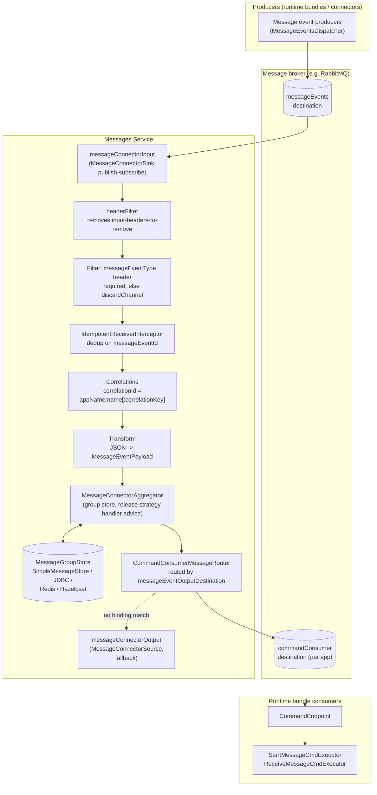

# Messages Service

**Module:** `activiti-cloud-messages-service` (Activiti Cloud 9.0.0, Spring Boot 3.5.7)

The messages service is the messaging backbone for BPMN message-based process coordination. It routes message events — for example "a message was thrown" or "a waiting subscription was cancelled" — between the places that produce them (runtime bundle engines, connectors) and the places that consume them (engine command endpoints, downstream services), without those consumers needing to know about each other or about the transport in between.

## Problem It Solves

In BPMN, a process instance can *throw* a message and another process instance (possibly in a completely different engine deployment, application, or service) can *wait* for it. When the engine and the waiting subscription live in the same JVM this is in-process coordination. In a cloud deployment they may be:

- different **runtime bundle** services (different deployments, different databases),
- different **applications** (`activiti.cloud.application.name` values) running the same or different services,
- fed by **message connectors** that ingest events from external systems.

The messages service solves this by acting as a centralized **correlation and aggregation point**:

- **Producers** publish fine-grained message events (`MESSAGE_WAITING`, `MESSAGE_SENT`, `MESSAGE_RECEIVED`, `START_MESSAGE_DEPLOYED`, `MESSAGE_SUBSCRIPTION_CANCELLED`) to a `messageEvents` destination.
- The service groups events into **message groups** by correlation identity, waits for the events that make an action possible, and emits a single actionable **command payload** (`StartMessagePayload` or `ReceiveMessagePayload`).
- **Consumers** (runtime bundles) subscribe to a `commandConsumer` destination and execute the resulting command against their own engine.

The service itself does not execute workflow logic — it only decides *when* an event combination becomes actionable and routes the result. That keeps engine deployments decoupled from each other and from the broker.

## Producers and Consumers

| Role | Who | What it sends / expects |
|------|-----|-------------------------|
| Producer | Runtime bundle engine (`MessageEventsDispatcher` in the runtime bundle `messages-events` module) | Message event payloads with `messageEventsOutput` binding → `messageEvents` destination (JSON). Emits `MESSAGE_WAITING`, `MESSAGE_SENT`, `MESSAGE_RECEIVED`, `START_MESSAGE_DEPLOYED`, `MESSAGE_SUBSCRIPTION_CANCELLED`. |
| Producer | Connectors and external systems (via their own `messageEvents` producers) | Same event model; see [Connectors Overview](../connectors/overview.md) |
| Consumer | The messages service itself | Subscribes with binding `messageConnectorInput` (destination `messageEvents`, consumer group `messages`) |
| Consumer | Runtime bundle command endpoints (`CommandEndpoint`) | Receive `StartMessagePayload` / `ReceiveMessagePayload` on their `commandConsumer` input binding (destination `commandConsumer`, group = application name) and execute `StartMessageCmdExecutor` / `ReceiveMessageCmdExecutor` |

The producer stamps every outgoing message with a `messageEventOutputDestination` header containing the destination of *its own* `commandConsumer` binding, so aggregated results are routed back to the correct application.

## Architecture

The service is built on Spring Integration and Spring Cloud Stream (managed by the Spring Cloud 2025.0.0 BOM). The core auto-configuration is `MessagesCoreAutoConfiguration` (`org.activiti.cloud.services.messages.core.config`), which enables integration, integration management, and transaction management, and wires the flow below.



### Flow stages (actual classes)

1. **`MessageConnectorSink`** — `@InputBinding("messageConnectorInput")` publish-subscribe channel. This is where the `messageEvents` destination is bound.
2. **Header filtering** — removes headers listed in `activiti.cloud.services.messages.input-headers-to-remove` (default: `kafka_consumer,replyChannel,discardChannel,errorChannel`).
3. **Type filter** — messages without a `messageEventType` header are sent to the `discardChannel` (logged at DEBUG by `discardChannelIntegrationFlow`).
4. **`IdempotentReceiverInterceptor`** — rejects duplicates identified by the `messageEventId` header (falling back to the Spring Integration message id). Duplicates go to the discard channel; rejection does not throw (`throwExceptionOnRejection=false`).
5. **Correlation enrichment** — `Correlations.getCorrelationId(message)` computes `appName:messageEventName[:messageEventCorrelationKey]` and stores it in the standard `correlationId` header. The default `CorrelationStrategy` (`HeaderAttributeCorrelationStrategy` on `correlationId`) groups messages by that value.
6. **Transform** — the JSON payload is deserialized to `org.activiti.api.process.model.payloads.MessageEventPayload`.
7. **`MessageConnectorAggregator`** — an `AbstractCorrelatingMessageHandler` that buffers each message in a `MessageGroup` in the `MessageGroupStore`, applies release and processing strategies, and wraps the handler with the advice chain.
8. **`CommandConsumerMessageRouter`** — reads the `messageEventOutputDestination` header, resolves the destination to a bound channel via `BindingService`/`StreamBridge`, and sends the result. If no binding matches, it falls back to the `messageConnectorOutput` source channel (destination `commandConsumer`).

### Aggregation rules

The aggregator releases a group when the **release strategy** (`MessageSentReleaseHandler`) finds the group contains a *waiting* side and a *sending* side: `(MESSAGE_WAITING or START_MESSAGE_DEPLOYED) and MESSAGE_SENT`. On release, the **group processor chain** (`MessageGroupProcessorChain`) runs:

| Order | Processor | Fires when group contains | Emits |
|-------|-----------|---------------------------|-------|
| 1 | `StartMessagePayloadGroupProcessor` | `START_MESSAGE_DEPLOYED` + `MESSAGE_SENT` | One `StartMessagePayload` per buffered `MESSAGE_SENT` (sorted by timestamp), tagged `messagePayloadType=StartMessagePayload` |
| 2 | `ReceiveMessagePayloadGroupProcessor` | `MESSAGE_WAITING` + `MESSAGE_SENT` | One `ReceiveMessagePayload` from the earliest buffered `MESSAGE_SENT`, tagged `messagePayloadType=ReceiveMessagePayload` |

Aggregator defaults (set by `MessageConnectorAggregatorFactoryBean`): `completeGroupsWhenEmpty=true`, `expireGroupsUponCompletion=true`, `sendPartialResultOnExpiry=true`, `popSequence=false`. After each release the aggregator removes completed messages from the group (`afterRelease`), and when a group becomes empty it is completed and (by default) expired, so a group is reusable for the next correlation cycle of the same message name.

### Handler advice (side-effect handling)

Two `HandleMessageAdvice` beans wrap the aggregator and act on specific event types before the normal group processing runs:

| Advice | Trigger | Effect |
|--------|---------|--------|
| `MessageReceivedHandlerAdvice` | `messageEventType=MESSAGE_RECEIVED` | Removes the oldest buffered `MESSAGE_WAITING` message of the group (under a lock from the `LockRegistry`), i.e. a receive acknowledges the earliest pending wait. |
| `SubscriptionCancelledHandlerAdvice` | `messageEventType=MESSAGE_SUBSCRIPTION_CANCELLED` | Removes all non-`START_MESSAGE_DEPLOYED` messages of the group (under a lock), so cancelled subscriptions stop pending `MESSAGE_SENT` events from starting/receiving anything. |

Both run through `LockTemplate` to serialize access to the group across instances.

### Control bus

`ControlBusGateway` (`@MessagingGateway`) exposes `void send(String command)` on the Spring Integration control bus (id `controlBus`). Commands are SpEL against managed components, e.g. `@aggregator.stop()` and `@aggregator.start()` to pause and resume aggregation. This is the supported way to drain the service for maintenance.

## Message Model

### Headers

All header names are defined in `MessageEventHeaders` (`org.activiti.cloud.services.messages.core.integration`):

| Header | Purpose |
|--------|---------|
| `appName` | Activiti Cloud application name (`activiti.cloud.application.name`) of the producer; part of the correlation id |
| `appVersion` | Application version |
| `serviceName` | Service name of the producer |
| `serviceFullName` | Fully qualified service name |
| `serviceType` | Service type |
| `serviceVersion` | Service version |
| `messageEventId` | Unique event id; used for idempotency (dedup) |
| `messageEventName` | BPMN message name; part of the correlation id |
| `messageEventCorrelationKey` | Optional correlation key; appended to the correlation id when present |
| `messageEventBusinessKey` | Business key carried by the event |
| `messageEventType` | Event type (see table below); required — messages without it are discarded |
| `messagePayloadType` | Set on output messages: `StartMessagePayload` or `ReceiveMessagePayload` |
| `messageEventOutputDestination` | Destination to which the aggregated result must be routed (the producer's `commandConsumer` destination) |

### Event types

The `messageEventType` header value comes from the Activiti process API event enums:

| Event type | Enum source | Meaning |
|------------|-------------|---------|
| `MESSAGE_WAITING` | `BPMNMessageEvent.MessageEvents` | A process is now waiting for the message (subscription created) |
| `MESSAGE_SENT` | `BPMNMessageEvent.MessageEvents` | A message was thrown/sent |
| `MESSAGE_RECEIVED` | `BPMNMessageEvent.MessageEvents` | A waiting process received/consumed the message |
| `START_MESSAGE_DEPLOYED` | `MessageDefinitionEvent.MessageDefinitionEvents` | A start-message process definition was deployed (a message can start the process) |
| `MESSAGE_SUBSCRIPTION_CANCELLED` | `MessageSubscriptionEvent.MessageSubscriptionEvents` | A waiting subscription was cancelled (e.g. process instance deleted) |

### Payloads

- **Input payload** — `MessageEventPayload` (`org.activiti.api.process.model.payloads`), JSON-serialized: `id`, `name`, `correlationKey`, `businessKey`, `variables` (map).
- **Output payloads** — produced by the group processors:
  - `StartMessagePayload` — `name`, `businessKey`, `variables`; used by `StartMessageCmdExecutor` to start a process.
  - `ReceiveMessagePayload` — `name`, `correlationKey`, `variables`; used by `ReceiveMessageCmdExecutor` to deliver the message to a waiting instance.

## Backends

The core ships an in-memory default; each starter replaces the `MessageGroupStore`, `ConcurrentMetadataStore`, `LockRegistry`, and (where applicable) `PlatformTransactionManager` with a durable implementation. All starters load **before** `MessagesCoreAutoConfiguration`, so their beans win by default.

| Starter (Maven artifact) | Beans provided | Durability |
|--------------------------|----------------|------------|
| — (none; core default) | `SimpleMessageStore`, `SimpleMetadataStore`, `DefaultLockRegistry`, `PseudoTransactionManager` | None — single-instance, in-memory |
| `activiti-cloud-starter-messages-hazelcast` | `HazelcastMessageStore`, `HazelcastMetadataStore`, `HazelcastLockRegistry`, `HazelcastTransactionManager` (CP subsystem, member count 3) | Distributed in-memory, shared across instances |
| `activiti-cloud-starter-messages-jdbc` | `JdbcMessageStore` (table prefix from `message-store-entity`), `JdbcMetadataStore`, `JdbcLockRegistry` (via `DefaultLockRepository`) | Durable in any JDBC database; schema auto-initialized (`spring.integration.jdbc.initialize-schema=always`) |
| `activiti-cloud-starter-messages-redis` | `RedisMessageStore`, `RedisMetadataStore`, `RedisLockRegistry` | Durable in Redis; enables transaction support on the `RedisTemplate` |

### Choosing a backend

- **In-memory default** — single-instance deployments and tests only. Groups are lost on restart; do not use it when multiple engine instances coordinate messages.
- **JDBC** — the safest general choice when you already run a relational database for the query/history services: durable, transactional, and easy to inspect (plain tables). Slightly higher latency than in-memory stores.
- **Redis** — good middle ground: shared, fast, and simple to operate; a natural fit when Redis is already part of the platform.
- **Hazelcast** — best when you want a self-contained, peer-to-peer in-memory store with a CP (consistent) subsystem for locks, and no separate database or cache cluster to run. It forms its own member cluster, so plan network access between instances.

Every backend must be shared by **all** instances that coordinate messages (multiple runtime bundles included); a group that one instance wrote must be visible to the instance that receives the matching event.

## Configuration Reference

Prefix: `activiti.cloud.services.messages` (bound by `MessageAggregatorProperties`).

| Property | Type | Default | Description |
|----------|------|---------|-------------|
| `activiti.cloud.services.messages.group-timeout` | SpEL `Expression` | unset | Timeout for expiring uncompleted message groups |
| `activiti.cloud.services.messages.message-store-entity` | `String` | unset | Persistence entity name: table prefix (JDBC), collection name (Mongo-style stores) |
| `activiti.cloud.services.messages.input-headers-to-remove` | `String[]` (comma-separated) | `kafka_consumer,replyChannel,discardChannel,errorChannel` | Input headers stripped before processing |
| `activiti.cloud.services.messages.header-channels-time-to-live-expression` | `String` (SpEL) | `headers['headerChannelsTTL']?:60000` | TTL expression for header-channel bindings created during processing |

Spring Cloud Stream bindings (defaults from `config/activiti-cloud-services-messages-core.properties`):

| Property | Default | Description |
|----------|---------|-------------|
| `spring.cloud.stream.bindings.messageConnectorInput.destination` | `messageEvents` | Input destination (message events) |
| `spring.cloud.stream.bindings.messageConnectorInput.group` | `messages` | Input consumer group |
| `spring.cloud.stream.bindings.messageConnectorInput.contentType` | `application/json` | Input content type |
| `spring.cloud.stream.bindings.messageConnectorOutput.destination` | `commandConsumer` | Output destination (fallback routing) |
| `spring.cloud.stream.bindings.messageConnectorOutput.contentType` | `application/json` | Output content type |

Related properties:

| Property | Default | Description |
|----------|---------|-------------|
| `activiti.cloud.application.name` | — | Application name; used by producers for the `appName` header and correlation id |
| `activiti.cloud.messaging.destination-separator` | `_` | Separator used when building per-application destinations (`commandConsumer` + separator + app name) |
| `spring.integration.jdbc.initialize-schema` | `always` (JDBC starter) | Auto-initialize the JDBC message store schema |

Example:

```yaml
spring:
  cloud:
    stream:
      bindings:
        messageConnectorInput:
          destination: messageEvents
        messageConnectorOutput:
          destination: commandConsumer
activiti:
  cloud:
    application:
      name: orders-app
    services:
      messages:
        group-timeout: "T(java.util.concurrent.TimeUnit).MINUTES.toMillis(5)"
        message-store-entity: messages_
```

## How It Integrates With the Platform

- **Connectors** produce `messageEvents` exactly like runtime bundles do; see [Connectors Overview](../connectors/overview.md) for the connector-side view.
- **Event-driven architecture** — the messages service is one of the event pipelines in Activiti Cloud; see [Event-Driven Design](../architecture/event-driven.md) for the end-to-end picture including the `engineEvents` pipeline used by the [Notifications GraphQL Service](notifications-graphql.md).
- **Runtime bundle** — the `commandConsumer` command endpoint and the `StartMessageCmdExecutor` / `ReceiveMessageCmdExecutor` that execute the aggregated payloads live in the runtime bundle service.

## Practical Notes

### Ordering

- A group is released as soon as *some* waiting side and *some* sent side exist, and the processors pick the **earliest** (by timestamp) buffered `MESSAGE_SENT` for receive delivery. If several `MESSAGE_SENT` events are buffered before a subscription arrives, they are delivered one per subsequent waiting event.
- `MESSAGE_RECEIVED` removes the **oldest** buffered `MESSAGE_WAITING`, so wait/send/receive interleavings stay FIFO per message name.

### Failure handling

- **Duplicates** — the idempotent interceptor (keyed on `messageEventId`) discards re-delivered events to the discard channel instead of double-processing them.
- **Bad messages** — messages without a `messageEventType` header, or whose payload cannot be converted to `MessageEventPayload`, are diverted to the `discardChannel` / `errorChannel` rather than crashing the flow.
- **Grouping races** — group mutations are guarded by the `LockRegistry` lock (per correlation key), so concurrent instances cannot corrupt a group.
- **Transactional rollback** — the gateway section of the flow is transactional; on failure the message is not considered delivered and can be re-consumed.

### Testing

The test suite exercises the flow end to end:

- **`services/tests`** (`AbstractMessagesCoreIntegrationTests`) — with the test binder: start-before-sent and sent-before-start ordering, buffered waiting messages with `MESSAGE_RECEIVED`, `StartMessagePayload`/`ReceiveMessagePayload` emission, subscription cancellation, idempotent duplicate discard, filter discard, error channel, control bus stop/start, transaction failure, and 100 concurrent events.
- **Starter tests** — the same suite runs against `JdbcMessageStore` (H2), `RedisMessageStore` (Testcontainers Redis), and `HazelcastMessageStore` (embedded 3-member CP cluster).
- **`integration-tests`** — real-broker integration tests (RabbitMQ, Keycloak, PostgreSQL containers): deployment-time `START_MESSAGE_DEPLOYED` events, throw/catch with intermediate/boundary/event-subprocess message events, 10-process-instance concurrency, subscription cancellation, the function-router variant (`activiti.cloud.messaging.function-router.enabled=true`), and two runtime bundles coordinating messages across applications (`MultipleRbMessagesIT`).
