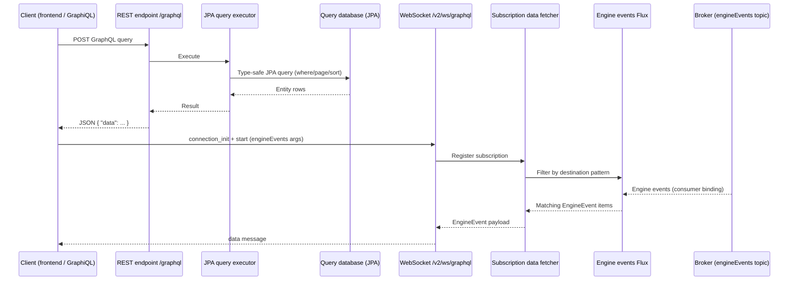

# Notifications GraphQL Service

**Module:** `activiti-cloud-notifications-graphql-service` (Activiti Cloud 9.0.0, Spring Boot 3.5.7)

The notifications GraphQL service is the GraphQL facade used by frontends and notification clients. It combines three capabilities in a single Spring Boot application:

1. **Queries** — a GraphQL query endpoint (`/graphql`) whose schema is generated at runtime from JPA entity models (process instances, tasks, variables, process definitions, and more), with criteria expressions, paging, sorting, and role-based field visibility.
2. **Subscriptions** — a WebSocket-based `engineEvents` subscription that streams engine events (process/task/variable/timer/message events) to clients, filtered by application, service, event type, process, and actor.
3. **GraphiQL** — an embedded browser UI for exploring the schema and testing queries and subscriptions.

The service is consumed through the `activiti-cloud-starter-notifications-graphql` starter, which bundles the modules below.

| Module | Artifact | Responsibility |
|--------|----------|----------------|
| `web` | `activiti-cloud-services-notifications-graphql-web` | GraphQL query executor wiring (`GraphQLJpaExecutor`), endpoint path, role constraints |
| `jpa-query` | `activiti-cloud-services-notifications-graphql-jpa-query` | Registers the JPA entities that become query types; aggregates, restricted keys, field visibility |
| `subscriptions` | `activiti-cloud-services-notifications-graphql-subscriptions` | Loads `activiti.graphqls`, wires the `engineEvents` subscription data fetcher |
| `events` | `activiti-cloud-services-notifications-graphql-events` | Consumes the `engineEvents` broker topic, transforms and republishes events as a reactive `Flux` with routing keys |
| `ws` | `activiti-cloud-services-notifications-graphql-ws` | WebSocket message broker endpoint for subscriptions |
| `security` | `activiti-cloud-services-notifications-graphql-security` | JWT/JWS bearer-token authentication for the WebSocket endpoint and role authorities |
| `graphiql` | `activiti-cloud-services-notifications-graphql-graphiql` | GraphiQL UI, endpoint configuration, Keycloak auth config |
| `api` | `activiti-cloud-services-notifications-graphql-api` | Request/message DTOs (`GraphQLQueryRequest`, `GraphQLMessage`, `GraphQLMessageType`) |
| `starter` | `activiti-cloud-starter-notifications-graphql` | Aggregates the modules; enables CORS (`keycloak.cors`, default `true`, all origins) |

## Architecture



- **Query path** — the query schema is generated at startup from the JPA entities registered by the `jpa-query` module (via `graphql-jpa-query`). Each entity appears as a singular field (single object by id) and a plural field (criteria, paging, sorting).
- **Subscription path** — the `events` module consumes the `engineEvents` destination (binding `graphQLEngineEventsConsumerSource`), converts each event into an `EngineEvent` map, and publishes it into a `Flux` with a routing key of the form `engineEvents.{serviceName}.{appName}.{eventType}.{processDefinitionKey}.{processInstanceId}.{businessKey}.{actor}` (missing attributes render as `_`). The subscription data fetcher turns the subscription arguments into destination patterns (missing arguments become `*`, cross-joined per argument) and matches them against routing keys with an Ant-style path matcher. A subscription with no arguments matches everything (`engineEvents.**`).
- **Security** — the REST endpoint enforces a role (default `ACTIVITI_ADMIN`), and the WebSocket endpoint authenticates JWT/JWS bearer tokens and checks the configured authorities (default `ACTIVITI_USER,ACTIVITI_ADMIN`).

## GraphiQL Developer UI

- Open **`http://<host>:<port>/graphiql`** in a browser. `GraphiQLIndexController` forwards to `graphiql/graphiql.html` (overridable with `graphiql.index`). The UI ships with vendored React/GraphiQL assets, a Keycloak JS client, and a WebSocket subscription transport.
- **`GET /graphiql/config.js`** (and `config.json`) — `GraphiQLConfigController` serves the endpoint paths the UI must use: `graphqlWebPath` (default `/graphql`) and `graphqlWsPath` (default `/ws/graphql`), each prefixed with `server.servlet.context-path` when one is set. Override with `graphiql.graphql.web.path` and `graphiql.graphql.ws.path`.
- **`GET /graphiql/keycloak.json`** — `KeycloakJsonController` exposes the service's own Keycloak client configuration to the UI so the browser can authenticate against the same realm: it returns `auth-server-url`, `realm`, `ssl-required`, `resource`, `public-client`, and `confidential-port` (from the standard `keycloak.*` properties). It is active when `activiti.cloud.services.oauth2.iam-name` is `keycloak` (the default).

## Schema Reference

The static subscription schema lives at `services/subscriptions/src/main/resources/activiti.graphqls`. It defines two custom scalars (`ObjectScalar`, `Long`) and the roots `Query` and `Subscription` — **there is no `Mutation` root**: the notifications service is read-only, and engine commands are executed through the runtime bundle command API (see [Query Service](query.md) for the REST counterpart).

### Query fields

| Field | Return | Source | Description |
|-------|--------|--------|-------------|
| `hello` | `String` | Static schema | Placeholder query field defined in `activiti.graphqls`; no production data fetcher is wired, so it returns `null`. Useful for connectivity checks. |
| `Application` / `Applications` | `Application` / paginated wrapper | JPA query generator | Application(s), by id or criteria |
| `Task` / `Tasks` | `Task` / paginated wrapper | JPA query generator | Task(s), by id or criteria |
| `ProcessInstance` / `ProcessInstances` | `ProcessInstance` / paginated wrapper | JPA query generator | Process instance(s) |
| `ProcessDefinition` / `ProcessDefinitions` | `ProcessDefinition` / paginated wrapper | JPA query generator | Process definition(s) |
| `ProcessVariable` / `ProcessVariables` | `ProcessVariable` / paginated wrapper | JPA query generator | Process variable(s) |
| `TaskVariable` / `TaskVariables` | `TaskVariable` / paginated wrapper | JPA query generator | Task variable(s) |
| `ProcessModel` / `ProcessModels` | `ProcessModel` / paginated wrapper | JPA query generator | Process model(s) |
| `ServiceTask` / `ServiceTasks` | `ServiceTask` / paginated wrapper | JPA query generator | Service task(s) |

The entity list is configurable via `spring.activiti.cloud.services.notifications.graphql.jpa-query.entities` (the defaults are the eight `org.activiti.cloud.services.query.model` entities above).

### Mutation fields

None — the schema declares no mutation root type.

### Subscription fields

| Field | Arguments | Return |
|-------|-----------|--------|
| `engineEvents` | `serviceName: [String!]`, `appName: [String!]`, `eventType: [EngineEventType!]`, `processDefinitionKey: [String!]`, `processInstanceId: [String!]`, `businessKey: [String!]`, `actor: [String!]` | `[EngineEvent]` |

All arguments are optional lists; omitted arguments match any value. Multiple values match any of the listed values.

### `EngineEventType` enum

| Group | Values |
|-------|--------|
| Process | `PROCESS_STARTED`, `PROCESS_COMPLETED`, `PROCESS_CREATED`, `PROCESS_CANCELLED`, `PROCESS_RESUMED`, `PROCESS_SUSPENDED`, `PROCESS_DEPLOYED`, `PROCESS_UPDATED` |
| Activity | `ACTIVITY_STARTED`, `ACTIVITY_CANCELLED`, `ACTIVITY_COMPLETED` |
| Variable | `VARIABLE_CREATED`, `VARIABLE_UPDATED`, `VARIABLE_DELETED` |
| Flow | `SEQUENCE_FLOW_TAKEN` |
| Task | `TASK_CREATED`, `TASK_COMPLETED`, `TASK_ASSIGNED`, `TASK_ACTIVATED`, `TASK_SUSPENDED`, `TASK_CANCELLED`, `TASK_UPDATED`, `TASK_CANDIDATE_USER_ADDED`, `TASK_CANDIDATE_USER_REMOVED`, `TASK_CANDIDATE_GROUP_ADDED`, `TASK_CANDIDATE_GROUP_REMOVED` |
| Integration | `INTEGRATION_REQUESTED`, `INTEGRATION_RESULT_RECEIVED`, `INTEGRATION_ERROR_RECEIVED` |
| Signal | `SIGNAL_RECEIVED` |
| Timer | `TIMER_SCHEDULED`, `TIMER_FIRED`, `TIMER_CANCELLED`, `TIMER_EXECUTED`, `TIMER_FAILED`, `TIMER_RETRIES_DECREMENTED` |
| Message | `MESSAGE_WAITING`, `MESSAGE_RECEIVED`, `MESSAGE_SENT`, `MESSAGE_SUBSCRIPTION_CANCELLED` |

### `EngineEvent` type

| Field | Type | Description |
|-------|------|-------------|
| `id` | `String` | Event id |
| `timestamp` | `Long` | Event timestamp (epoch millis) |
| `serviceName` | `String` | Service name that produced the event |
| `serviceFullName` | `String` | Fully qualified service name |
| `serviceVersion` | `String` | Service version |
| `serviceType` | `String` | Service type |
| `appName` | `String` | Application name (`activiti.cloud.application.name`) |
| `appVersion` | `String` | Application version |
| `processInstanceId` | `String` | Process instance the event belongs to |
| `parentProcessInstanceId` | `String` | Parent process instance, when applicable |
| `processDefinitionId` | `String` | Process definition id |
| `processDefinitionKey` | `String` | Process definition key |
| `processDefinitionVersion` | `Long` | Process definition version |
| `businessKey` | `String` | Business key of the process instance |
| `entityId` | `String` | Id of the entity the event is about |
| `entity` | `ObjectScalar` | The event entity as a free-form object |
| `eventType` | `EngineEventType` | Event type |
| `actor` | `String` | Actor (user) associated with the event |

## Example Operations

### Query (JPA criteria)

Find running process instances with their completed tasks:

```graphql
query {
  ProcessInstances(where: {
    OR: {
      status: { LIKE: "Running" }
    }
  }) {
    select {
      processInstanceId
      status
      tasks(where: { status: { EQ: "Completed" } }) {
        id
        name
        assignee
        status
      }
    }
  }
}
```

The `data` object in the JSON response:

```json
{
  "ProcessInstances": {
    "select": [
      {
        "processInstanceId": 0,
        "status": "Running",
        "tasks": [
          { "id": "1", "name": "task1", "assignee": "assignee", "status": "Completed" }
        ]
      }
    ]
  }
}
```

Paging and sorting use the `page: {start, limit}` and `orderBy` (ASC/DESC) arguments on plural fields, and `pages`/`total` fields on the paginated wrapper.

### Subscription

Stream task and process events for one application:

```graphql
subscription {
  engineEvents(
    appName: ["orders-app"]
    eventType: [TASK_CREATED, TASK_COMPLETED, PROCESS_COMPLETED]
  ) {
    id
    timestamp
    appName
    processInstanceId
    processDefinitionKey
    eventType
    actor
    entity
  }
}
```

Each delivered item is an `EngineEvent` object, e.g. the `data` payload of a WebSocket `data` message:

```json
{
  "id": "9f2b1c7d-4e5a-4c6b-8d9e-0a1b2c3d4e5f",
  "timestamp": 1755206400000,
  "appName": "orders-app",
  "serviceName": "runtime-bundle",
  "processInstanceId": "12",
  "processDefinitionKey": "OrderProcess",
  "eventType": "TASK_CREATED",
  "actor": "testadmin",
  "entity": { "id": "34", "name": "Approve order" }
}
```

### Mutations

Not available. This service exposes no mutation operations; state changes go through the runtime bundle command endpoint.

## Configuration

### Endpoint and module toggles

| Property | Default | Description |
|----------|---------|-------------|
| `spring.activiti.cloud.services.query.graphql.enabled` | `true` | Enable the GraphQL query module (web executor) |
| `spring.activiti.cloud.services.notifications.graphql.path` | `/graphql` (env `ACT_NOTIFICATIONS_GRAPHQL_ENDPOINT`) | GraphQL query REST endpoint path |
| `spring.activiti.cloud.services.query.graphql.ws.enabled` | `true` | Enable the WebSocket subscription endpoint |
| `spring.graphql.websocket.path` | `/v2/ws/graphql` | WebSocket endpoint path |
| `spring.graphql.websocket.keep-alive` | `PT5S` | WebSocket keep-alive interval |
| `spring.activiti.cloud.services.notifications.graphql.subscriptions.enabled` | `true` | Enable the `engineEvents` subscription schema |
| `spring.activiti.cloud.services.notifications.graphql.events.enabled` | `true` | Enable the engine events consumer |
| `spring.activiti.cloud.services.graphql.graphiql.enabled` | `true` | Enable the GraphiQL UI controllers |
| `keycloak.cors` | `true` | Enable the CORS mapping for browser clients (all origins; GET/POST/PUT/DELETE/OPTIONS) |

In a deployed platform (behind the gateway), the service is reached at `${gateway}/notifications/graphql` and `${gateway}/notifications/v2/ws/graphql`.

### Subscription schema

Prefix `org.activiti.cloud.services.notifications.graphql.subscriptions` (`GraphQLSubscriptionSchemaProperties`):

| Property | Default | Description |
|----------|---------|-------------|
| `graphqls` | `classpath:activiti.graphqls` | Location of the subscription schema file |
| `subscription-field-name` | `engineEvents` | Name of the subscription field wired to the events data fetcher |
| `subscription-argument-names` | `serviceName,appName,eventType,processDefinitionKey,processInstanceId,businessKey,actor` | Arguments used to build the hierarchical destination patterns |
| `relay-host` | `${spring.rabbitmq.host:localhost}` | STOMP relay host |
| `relay-port` | `61613` | STOMP relay port |
| `client-login` | `${spring.rabbitmq.username:guest}` | STOMP relay user |
| `client-passcode` | `${spring.rabbitmq.password:guest}` | STOMP relay password |

### Engine events consumer

Prefix `spring.activiti.cloud.services.notifications.graphql.events` (`EngineEventsConsumerProperties`):

| Property | Default | Description |
|----------|---------|-------------|
| `process-engine-event-attribute-keys` | `serviceName,appName,processDefinitionKey,processInstanceId,businessKey` | Attributes carried into the event routing key |
| `process-engine-event-type-key` | `eventType` | Attribute key holding the event type |

Consumer binding (defaults from `META-INF/graphql-events.properties`):

| Property | Default | Description |
|----------|---------|-------------|
| `spring.cloud.stream.bindings.graphQLEngineEventsConsumerSource.destination` | `engineEvents` | Broker topic consumed for engine events |
| `spring.cloud.stream.bindings.graphQLEngineEventsConsumerSource.consumer.concurrency` | `1` (env `ACT_NOTIFICATIONS_GRAPHQL_ENGINE_EVENTS_CONSUMER_CONCURRENCY`) | Consumer concurrency |
| `spring.cloud.stream.rabbit.bindings.graphQLEngineEventsConsumerSource.consumer.prefetch` | `20` (env `ACT_NOTIFICATIONS_GRAPHQL_ENGINE_EVENTS_CONSUMER_PREFETCH`) | RabbitMQ prefetch |

### Security

| Property | Default | Description |
|----------|---------|-------------|
| `ACT_GRAPHQL_AUTH_ROLES` | `ACTIVITI_ADMIN` | Roles allowed on the GraphQL REST endpoint (bound to the `authorizations.security-constraints` for the endpoint path) |
| `spring.activiti.cloud.services.notifications.graphql.ws.security.authorities` | `ACTIVITI_USER,ACTIVITI_ADMIN` (env `ACT_NOTIFICATIONS_GRAPHQL_WS_SECURITY_AUTHORITIES`) | Authorities allowed on the WebSocket endpoint |
| `activiti.cloud.services.oauth2.iam-name` | `keycloak` | Identity provider selection; `keycloak` enables the Keycloak token verifier and the `graphiql/keycloak.json` endpoint |

### JPA query schema

Prefix `spring.activiti.cloud.services.notifications.graphql.jpa-query`:

| Property | Default | Description |
|----------|---------|-------------|
| `enabled` | `true` | Enable the JPA-generated query schema |
| `entities` | the eight query-model entities listed above | Entity classes exposed as GraphQL types |
| `aggregate.enabled` | `true` | Enable aggregate query support |
| `restricted-keys-provider.enabled` | `true` | Enforce role-restricted process definition keys |
| `restricted-keys-provider.unrestricted-roles` | `ACTIVITI_ADMIN`, `APPLICATION_MANAGER` | Roles that can query any process definition |
| `restricted-keys-provider.role-prefix` | `ROLE_` | Prefix for role authorities |
| `fields-visibility.patterns.<ROLE>` | e.g. `ACTIVITI_MODELER` → `JPA\.(ProcessModel\|ProcessModels)` | Per-role regex of query fields the role may read |

### GraphiQL

| Property | Default | Description |
|----------|---------|-------------|
| `graphiql.index` | `graphiql/graphiql.html` | HTML view the `/graphiql` route forwards to |
| `graphiql.graphql.web.path` | `/graphql` | Web endpoint path advertised to the UI |
| `graphiql.graphql.ws.path` | `/ws/graphql` | WebSocket path advertised to the UI |
| `server.servlet.context-path` | empty | Servlet context path prepended to both UI paths |

## GraphQL vs. REST Query Service

The platform also exposes a REST-based query service ([Query Service](query.md)) for the same query-model entities. Decision notes:

- **Use GraphQL** when clients need flexible, nested projections (e.g. a process instance with selected tasks and only a few fields per task) in a single round trip, or when they need **live updates** — only the GraphQL service provides the `engineEvents` subscription over WebSocket.
- **Use REST** for simple, flat lookups, for clients without a GraphQL stack, or when integration tooling (code generation, gateway routes, monitoring) is standardized around REST resources.
- **Field visibility differs by role** — the JPA query schema restricts fields per role (e.g. `ACTIVITI_MODELER` only sees `ProcessModel(s)`, `ACTIVITI_USER` sees task/process/variable types). When designing a frontend, plan the client's roles accordingly; the same roles apply to the REST query service.
- **Mutations are not available through either API** — both are read facades; commands go to the runtime bundle command endpoint.

## Related Documentation

- [Messages Service](messages.md) — the message-event backbone that feeds `MESSAGE_*` engine events
- [Query Service](query.md) — the REST counterpart for the same query model
- [Connectors Overview](../connectors/overview.md) — how external systems connect to the platform
- [Event-Driven Design](../architecture/event-driven.md) — the end-to-end event pipelines
