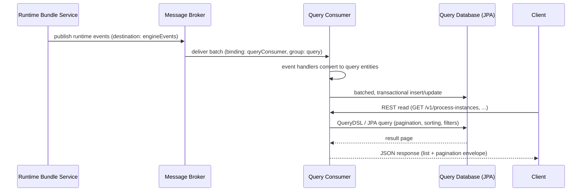

# Query Service

The query service is the read side of Activiti Cloud. It owns a query database that it maintains by consuming the runtime event stream, and it answers all read and monitoring requests (process lists, task inboxes, variables, diagrams) through a REST API.

## What it is and why it exists

In Activiti Cloud, the runtime bundle service executes processes and publishes every engine event to the message broker. The query service does not execute anything and never talks to the engine database. Instead it applies a CQRS-style separation:

- **Write side** — the runtime bundle owns the engine state and publishes runtime events (`PROCESS_STARTED`, `TASK_CREATED`, `VARIABLE_UPDATED`, `ACTIVITY_COMPLETED`, and so on) to the `engineEvents` destination.
- **Read side** — the query service subscribes to that destination and projects the events into normalized, indexed relational tables shaped for searching: process instances, tasks, process definitions, variables, applications, and integration contexts.
- **Result** — read-heavy workloads (dashboards, inboxes, reports) scale the query service independently of process execution, and a failing reader never blocks the engine.

The trade-off is **eventual consistency**: a read issued immediately after a write may not see the change yet. See [Event-Driven Design](../architecture/event-driven.md) for delivery guarantees and the practical consequences.

## How it works



The consumer is configured by the `queryConsumer` binding. Every event type has a dedicated handler (`ProcessCreatedEventHandler`, `TaskCreatedEventHandler`, `VariableCreatedEventHandler`, `BPMNActivityStartedEventHandler`, ...). Incoming batches are optimized, converted to entities, and persisted in a single transaction (`REQUIRES_NEW`) with Hibernate batched inserts, so a failed batch rolls back without affecting the rest of the stream.

The service ships as Spring Boot starters:

| Starter | Purpose |
|---|---|
| `activiti-cloud-starter-query-consumer` | Event consumer (channel, messaging bindings, JPA batching settings) |
| `activiti-cloud-starter-query-rest` | REST controllers, assemblers, security restrictions |
| `activiti-cloud-starter-query` | Aggregates the above plus Liquibase and common services |

## Data model

The query model (`activiti-cloud-services-query-model`) stores one table per entity type. Every entity also carries metadata about its origin: `appName`, `appVersion`, `serviceName`, `serviceFullName`, `serviceVersion`, and `serviceType`.

| Entity | Table | Key fields |
|---|---|---|
| `ProcessInstanceEntity` | `PROCESS_INSTANCE` | `id`, `name`, `processDefinitionId`, `processDefinitionKey`, `processDefinitionName`, `processDefinitionVersion`, `initiator`, `startDate`, `completedDate`, `suspendedDate`, `lastModified`, `businessKey`, `status` (`CREATED`, `RUNNING`, `SUSPENDED`, `CANCELLED`, `COMPLETED`), `parentId`, `rootProcessInstanceId`, `linkedProcessInstanceId`, `linkedProcessInstanceType` |
| `TaskEntity` | `TASK` | `id`, `name`, `description`, `assignee`, `owner`, `candidateUsers` / `candidateGroups`, `priority`, `status` (`CREATED`, `ASSIGNED`, `SUSPENDED`, `COMPLETED`, `CANCELLED`, `DELETED`), `createdDate`, `claimedDate`, `dueDate`, `completedDate`, `completedBy`, `duration`, `processInstanceId`, `rootProcessInstanceId`, `processDefinitionId`, `processDefinitionName`, `processDefinitionVersion`, `businessKey`, `taskDefinitionKey`, `formKey`, `parentTaskId`, `lastModified` |
| `ProcessDefinitionEntity` | `PROCESS_DEFINITION` | `id`, `name`, `key`, `description`, `version`, `formKey`, `category`, candidate starter users and groups |
| `ProcessVariableEntity` | `PROCESS_VARIABLE` | `id` (sequence), `name`, `type`, `value` (JSON), `processInstanceId`, `executionId`, `variableDefinitionId`, `processDefinitionKey`, `createTime`, `lastUpdatedTime`, `ephemeral`, `markedAsDeleted` |
| `TaskVariableEntity` | `TASK_VARIABLE` | same as process variables plus `taskId` |
| `ApplicationEntity` | `APPLICATION` | `id`, `name`, `version` |
| `IntegrationContextEntity` | `INTEGRATION_CONTEXT` | `id`, `status` (`INTEGRATION_REQUESTED`, `INTEGRATION_RESULT_RECEIVED`, `INTEGRATION_ERROR_RECEIVED`), `processInstanceId`, `executionId`, `processDefinitionId`, `processDefinitionKey`, `processDefinitionVersion`, `businessKey`, `clientId`, `clientName`, `clientType`, `connectorType`, `inBoundVariables` / `outBoundVariables` (JSON maps), `requestDate`, `resultDate`, `errorDate`, `errorCode`, `errorMessage`, `errorClassName`, `stackTraceElements` |

Supporting entities used for diagram rendering and process modeling: `BPMNActivityEntity`, `BPMNSequenceFlowEntity`, `ProcessModelEntity` (stores the BPMN XML), `ServiceTaskEntity`, and the candidate-starter / candidate-user / candidate-group join entities.

Indexes are declared on the hot filter columns (`status`, `businessKey`, `name`, `processDefinitionId`, `processDefinitionKey`, `processDefinitionName` for process instances; `status`, `processInstanceId`, `processDefinitionName` for tasks).

## REST API

The API exposes two base paths:

- `/v1/...` — user-facing endpoints. Results are restricted by security policies: task lookups are limited to tasks the caller can see, process definitions are limited to definitions the caller can start or has read access to, and variable/process-definition access is filtered by the configured security policies.
- `/admin/v1/...` — administrative endpoints that return unrestricted data. Protect this path with the `ACTIVITI_ADMIN` role (the reference security constraints map `/admin/*` to that role).

Paged endpoints use the pagination parameters below and return a `list` + `pagination` envelope:

| Parameter | Default | Description |
|---|---|---|
| `maxItems` | `100` | Page size. Hard-capped by `activiti.cloud.rest.max-items` (default `1000`, cap enforced by default). |
| `skipCount` | `0` | Number of items to skip. |
| `sort` | none | `field,ASC` or `field,DESC` (repeatable), e.g. `sort=startDate,DESC`. |

Example envelope:

```json
{
  "list": {
    "entries": [ { "entry": { "...": "entity fields" } } ],
    "pagination": {
      "skipCount": 0,
      "maxItems": 20,
      "count": 1,
      "hasMoreItems": false,
      "totalItems": 1
    }
  }
}
```

### Process instances

| Method | Path | Purpose |
|---|---|---|
| GET | `/v1/process-instances` | Find process instances (predicate + pagination) |
| GET | `/v1/process-instances?variableKeys={key}/{name}` | Same, with the listed process variables embedded in each entry |
| POST | `/v1/process-instances/search` | Search by body (`ProcessInstanceSearchRequest`) |
| POST | `/v1/process-instances/count` | Count matching process instances (same body) |
| GET | `/v1/process-instances/{processInstanceId}` | Get a process instance by id |
| GET | `/v1/process-instances/{processInstanceId}/subprocesses` | Sub-processes of a process instance |
| GET | `/v1/process-instances/{processInstanceId}/tasks` | Tasks of a process instance (add `variableKeys` to embed process variables) |
| GET | `/v1/process-instances/{processInstanceId}/variables` | Variables of a process instance |
| GET | `/v1/process-instances/{processInstanceId}/diagram` | Process diagram as `image/svg+xml` (BPMN with completed, in-progress, and errored elements highlighted) |
| POST | `/v1/process-instances/{mainProcessInstanceId}/link` | Link orphan process instances to a main process instance |

### Tasks

| Method | Path | Purpose |
|---|---|---|
| GET | `/v1/tasks` | Find tasks; supports `rootTasksOnly=true` (tasks without a parent task), `standalone=true` (tasks without a process), and variable filters (`variables.name`, `variables.value`, `variables.type`) |
| GET | `/v1/tasks?variableKeys=...` | Same, with the listed process variables embedded |
| POST | `/v1/tasks/search` | Search by body (`TaskSearchRequest`) |
| POST | `/v1/tasks/count` | Count matching tasks |
| GET | `/v1/tasks/{taskId}` | Get a task by id (403 if the caller has no view permission) |
| GET | `/v1/tasks/{taskId}/candidate-users` | Candidate user ids of a task |
| GET | `/v1/tasks/{taskId}/candidate-groups` | Candidate group ids of a task |
| GET | `/v1/tasks/{taskId}/variables` | Variables of a task |

### Process definitions

| Method | Path | Purpose |
|---|---|---|
| GET | `/v1/process-definitions` | Find process definitions the caller can start or read (predicate + pagination) |
| GET | `/v1/process-definitions/{processDefinitionId}/model` | BPMN 2.0 XML of a deployed process definition (`application/xml`) |

### Applications

| Method | Path | Purpose |
|---|---|---|
| GET | `/v1/applications` | Find deployed applications (predicate + pagination) |

### Administrative endpoints

| Method | Path | Purpose |
|---|---|---|
| GET | `/admin/v1/process-instances` | Find process instances without restrictions |
| POST | `/admin/v1/process-instances` | Find by body (`ProcessInstanceQueryBody` with `variableKeys`) |
| POST | `/admin/v1/process-instances/search` | Search by body (`ProcessInstanceSearchRequest`) |
| POST | `/admin/v1/process-instances/count` | Count |
| GET | `/admin/v1/process-instances/{processInstanceId}` | Get by id |
| GET | `/admin/v1/process-instances/{processInstanceId}/subprocesses` | Sub-processes |
| GET | `/admin/v1/process-instances/{linkedProcessInstanceId}/linkedprocesses` | Processes linked to a main process instance |
| GET | `/admin/v1/process-instances/appVersions` | Distinct application versions of the matching process instances |
| GET | `/admin/v1/process-instances/{processInstanceId}/tasks` | All tasks of a process instance |
| GET | `/admin/v1/process-instances/{processInstanceId}/variables` | All variables of a process instance |
| GET | `/admin/v1/process-instances/{processInstanceId}/diagram` | Diagram without the security check |
| GET | `/admin/v1/process-instances/{processInstanceId}/service-tasks` | Service tasks of a process instance |
| DELETE | `/admin/v1/process-instances` | Delete process instances matching a predicate (cascades to tasks, variables, service tasks, activities, sequence flows) |
| GET | `/admin/v1/tasks` | Find tasks without restrictions (same `rootTasksOnly` / `standalone` / variable filters) |
| POST | `/admin/v1/tasks` | Find by body (`TasksQueryBody`) |
| POST | `/admin/v1/tasks/search` | Search by body (`TaskSearchRequest`) |
| POST | `/admin/v1/tasks/count` | Count |
| GET | `/admin/v1/tasks/{taskId}` | Get by id |
| GET | `/admin/v1/tasks/{taskId}/candidate-users` | Candidate user ids |
| GET | `/admin/v1/tasks/{taskId}/candidate-groups` | Candidate group ids |
| GET | `/admin/v1/tasks/{taskId}/variables` | Variables of a task |
| DELETE | `/admin/v1/tasks` | Delete tasks matching a predicate |
| GET | `/admin/v1/process-definitions` | All process definitions |
| GET | `/admin/v1/process-definitions/{processDefinitionId}/model` | BPMN 2.0 XML of a process definition without the security check |
| GET | `/admin/v1/service-tasks` | All service tasks |
| GET | `/admin/v1/service-tasks/{serviceTaskId}` | Service task by id |
| GET | `/admin/v1/service-tasks/{serviceTaskId}/integration-context` | Latest integration context of a service task |
| GET | `/admin/v1/service-tasks/{serviceTaskId}/integration-contexts` | All integration contexts of a service task |
| GET | `/admin/v1/integration-contexts/{integrationContextId}` | Integration context by id |
| GET | `/admin/v1/applications` | All applications |

### Examples

List running onboarding instances, newest first, first page of 20:

```http
GET /v1/process-instances?status=RUNNING&processDefinitionKey=onboarding&sort=startDate,DESC&maxItems=20&skipCount=0 HTTP/1.1
Accept: application/json
```

```json
{
  "list": {
    "entries": [
      {
        "entry": {
          "id": "1693287654321",
          "name": "Onboarding: John Doe",
          "processDefinitionId": "onboarding:1:1693287600000",
          "processDefinitionKey": "onboarding",
          "processDefinitionName": "Onboarding",
          "processDefinitionVersion": 1,
          "initiator": "jdoe",
          "startDate": "2026-08-14T09:31:02.412",
          "completedDate": null,
          "suspendedDate": null,
          "lastModified": "2026-08-14T09:31:05.987",
          "businessKey": "EMP-1042",
          "status": "RUNNING",
          "parentId": null,
          "rootProcessInstanceId": "1693287654321",
          "appName": "hr-app",
          "appVersion": "1",
          "serviceName": "runtime-bundle",
          "serviceFullName": "org.activiti.cloud:hr-app",
          "serviceVersion": "1.0.0"
        }
      }
    ],
    "pagination": {
      "skipCount": 0,
      "maxItems": 20,
      "count": 1,
      "hasMoreItems": false,
      "totalItems": 1
    }
  }
}
```

Get the variables of a process instance:

```http
GET /v1/process-instances/1693287654321/variables?maxItems=20&skipCount=0 HTTP/1.1
Accept: application/json
```

```json
{
  "list": {
    "entries": [
      {
        "entry": {
          "id": 1001,
          "name": "approved",
          "type": "boolean",
          "value": { "value": true },
          "processInstanceId": "1693287654321",
          "executionId": null,
          "processDefinitionKey": "onboarding",
          "createTime": "2026-08-14T09:31:04.221",
          "lastUpdatedTime": "2026-08-14T10:02:11.556",
          "taskId": null
        }
      },
      {
        "entry": {
          "id": 1002,
          "name": "employeeId",
          "type": "string",
          "value": { "value": "EMP-1042" },
          "processInstanceId": "1693287654321",
          "executionId": null,
          "processDefinitionKey": "onboarding",
          "createTime": "2026-08-14T09:31:02.412",
          "lastUpdatedTime": "2026-08-14T09:31:02.412",
          "taskId": null
        }
      }
    ],
    "pagination": {
      "skipCount": 0,
      "maxItems": 20,
      "count": 2,
      "hasMoreItems": false,
      "totalItems": 2
    }
  }
}
```

Get the current diagram of a process instance:

```http
GET /v1/process-instances/1693287654321/diagram HTTP/1.1
Accept: image/svg+xml
```

```xml
<svg xmlns="http://www.w3.org/2000/svg" ...>
  <!-- BPMN diagram with completed activities and flows highlighted,
       the current activity marked, and errored activities flagged -->
</svg>
```

## Query patterns

**Filtering.** GET endpoints bind request parameters to entity properties (QueryDSL predicate binding). Common patterns:

- Exact match on any entity field: `status=RUNNING`, `initiator=jdoe`, `name=Onboarding: John Doe`, `businessKey=EMP-1042`.
- Date-range fields on the entities: process instances expose `startFrom` / `startTo`, `lastModifiedFrom` / `lastModifiedTo`, `completedFrom` / `completedTo`, `suspendedFrom` / `suspendedTo`; tasks expose `createdFrom` / `createdTo`, `lastModifiedFrom` / `lastModifiedTo`, `lastClaimedFrom` / `lastClaimedTo`, `completedFrom` / `completedTo`, `dueDateFrom` / `dueDateTo`.
- `variableKeys` (process instances and tasks) — embeds only the listed process variables in each entry. Keys are `{processDefinitionKey}/{variableName}`, e.g. `variableKeys=onboarding/approved`.
- Task-only flags: `rootTasksOnly`, `standalone`, and `variables.name` / `variables.value` / `variables.type` to filter on a variable's value.

**POST /search bodies.** For richer queries, `POST /v1/process-instances/search` and `POST /v1/tasks/search` accept a JSON body. `ProcessInstanceSearchRequest` supports: `id`, `parentId`, `name`, `processDefinitionName`, `initiator`, `appVersion`, `status` (set), `lastModifiedFrom/To`, `startFrom/To`, `completedFrom/To`, `suspendedFrom/To`, `processVariableFilters`, `processVariableKeys`, `sort`, `includeSubprocesses`, `linkedProcessInstanceId`, `linkedProcessInstanceType`, `processRelatedTo`, `includeUnlinkedProcesses`, `includeLinkedProcesses`. `TaskSearchRequest` supports: `onlyStandalone`, `onlyRoot`, `id`, `parentId`, `processInstanceId`, `name`, `description`, `processDefinitionName`, `priority`, `status`, `completedBy`, `assignee`, `createdFrom/To`, `lastModifiedFrom/To`, `lastClaimedFrom/To`, `dueDateFrom/To`, `completedFrom/To`, `candidateUserId`, `candidateGroupId`, `taskVariableFilters`, `processVariableFilters`, `processVariableKeys`, `sort`. Variable filters are objects with `processDefinitionKey`, `name`, `type` (`string`, `integer`, `bigdecimal`, `boolean`, `date`, `datetime`), `value`, and `operator` (`eq`, `ne`, `like`, `gt`, `gte`, `lt`, `lte`).

```json
{
  "status": ["RUNNING"],
  "processDefinitionName": ["Onboarding"],
  "processVariableFilters": [
    { "processDefinitionKey": "onboarding", "name": "approved", "type": "boolean", "value": "false", "operator": "eq" }
  ],
  "sort": { "field": "lastModified", "direction": "DESC" }
}
```

**Sorting and pagination.** Use `sort=field,ASC|DESC` together with `maxItems` / `skipCount` on any paged endpoint. The `count` endpoints answer the same query without returning entries — useful for progress indicators.

**Common UI patterns.**

- *Task inbox* — `GET /v1/tasks?assignee=jdoe&status=CREATED&sort=createdDate,ASC` (add `candidateGroupId=...` for a group inbox; the non-admin API already hides tasks the caller cannot see).
- *Process list* — `GET /v1/process-instances?status=RUNNING&sort=startDate,DESC&maxItems=50&skipCount=0`.
- *Process detail view* — resolve the instance with `GET /v1/process-instances/{id}`, then call the sub-resources `tasks`, `variables`, and `diagram` with the same `processInstanceId`.

## Configuration

| Property | Default | Description |
|---|---|---|
| `spring.cloud.stream.bindings.queryConsumer.destination` | `engineEvents` | Broker destination consumed for runtime events (env `ACT_QUERY_CONSUMER_DEST`). |
| `spring.cloud.stream.bindings.queryConsumer.group` | `query` | Consumer group (env `ACT_QUERY_CONSUMER_GROUP`). |
| `spring.cloud.stream.bindings.queryConsumer.contentType` | `application/json` | Message content type (env `ACT_QUERY_CONSUMER_CONTENT_TYPE`). |
| `spring.cloud.stream.bindings.queryConsumer.consumer.concurrency` | `1` | Consumer concurrency (env `ACT_QUERY_CONSUMER_CONCURRENCY`). |
| `spring.cloud.stream.rabbit.bindings.queryConsumer.consumer.prefetch` | `20` | RabbitMQ prefetch per consumer (env `ACT_QUERY_CONSUMER_RABBIT_PREFETCH`). |
| `activiti.cloud.messaging.destinations.engineEvents.name` | `engineEvents` | Default destination name for the engine-events scope (env `ACT_RB_ENG_EVT_DEST`). |
| `spring.data.rest.default-page-size` | `100` | Default page size when `maxItems` is absent. |
| `activiti.cloud.rest.max-items` | `1000` | Maximum allowed `maxItems` (env `MAX_ITEMS_LIMIT`). |
| `activiti.cloud.rest.max-items.enabled` | `true` | Enforce the `maxItems` cap (env `MAX_ITEMS_LIMIT_ENABLED`). |
| `activiti.rest.enable-deletion` | `true` | Expose the `DELETE /admin/v1/...` endpoints. Set to `false` to disable. |
| `spring.query.liquibase.change-log` | `classpath:config/query/liquibase/master.xml` | Liquibase changelog for the query schema. |
| `spring.query.liquibase.database-change-log-table` | `DATABASECHANGELOG_QUERY` | Liquibase change-log table name. |
| `activiti.cloud.messaging.partitioned` | `false` | Enable partitioned messaging for the engine events. |
| `activiti.cloud.messaging.partition-count` | `1` | Number of partitions (partitioned mode). |
| `activiti.cloud.messaging.instance-index` | `0` | Index of this consumer instance (partitioned mode). |
| `spring.datasource.*` | — | Standard Spring Boot datasource properties (`url`, `username`, `password`, `driver-class-name`). |

The consumer starter additionally sets JPA batched inserts for the event handlers (`spring.jpa.properties.hibernate.jdbc.batch_size=50`, `order_inserts=true`, `order_updates=true`) and disables Zipkin reporting (`spring.zipkin.enabled=false`).

## Consistency and troubleshooting

The query store is a projection of the event stream, so it lags the runtime by the time it takes the broker to deliver and the consumer to process a batch. Under normal load this is well under a second, but bursts of events or a busy consumer increase the lag.

When data appears missing or stale:

1. **Verify the event was published.** The runtime bundle publishes through its `auditProducer` binding (and `auditProducerIncidents` for incident events) to the `engineEvents` destination. Check the broker for the message and the runtime bundle logs.
2. **Check consumer lag.** Inspect the broker queue for the `query` consumer group and look at the query service logs for batch processing errors. A failed batch is rolled back; subsequent batches still apply.
3. **Confirm the consumer is running.** The query service must include the consumer starter and have `queryConsumer.destination` pointing at the right destination.
4. **Remember the security filters.** The non-admin API restricts what a caller can see (task visibility, candidate-startable definitions, policy-filtered variables). The same data is visible through the `/admin/v1` endpoints.
5. **Check the `maxItems` cap.** Page sizes above `activiti.cloud.rest.max-items` are rejected; raise the cap or paginate.

## Related

- [Audit Service](./audit.md)
- [Architecture Overview](../architecture/overview.md)
- [Event-Driven Design](../architecture/event-driven.md)
