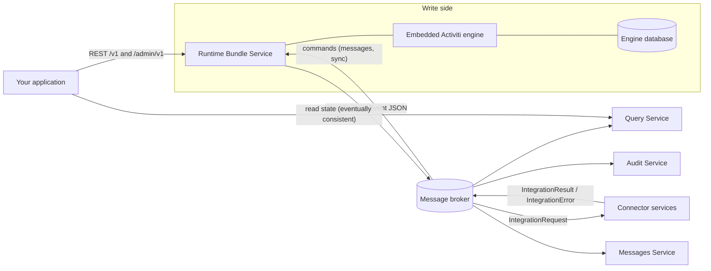
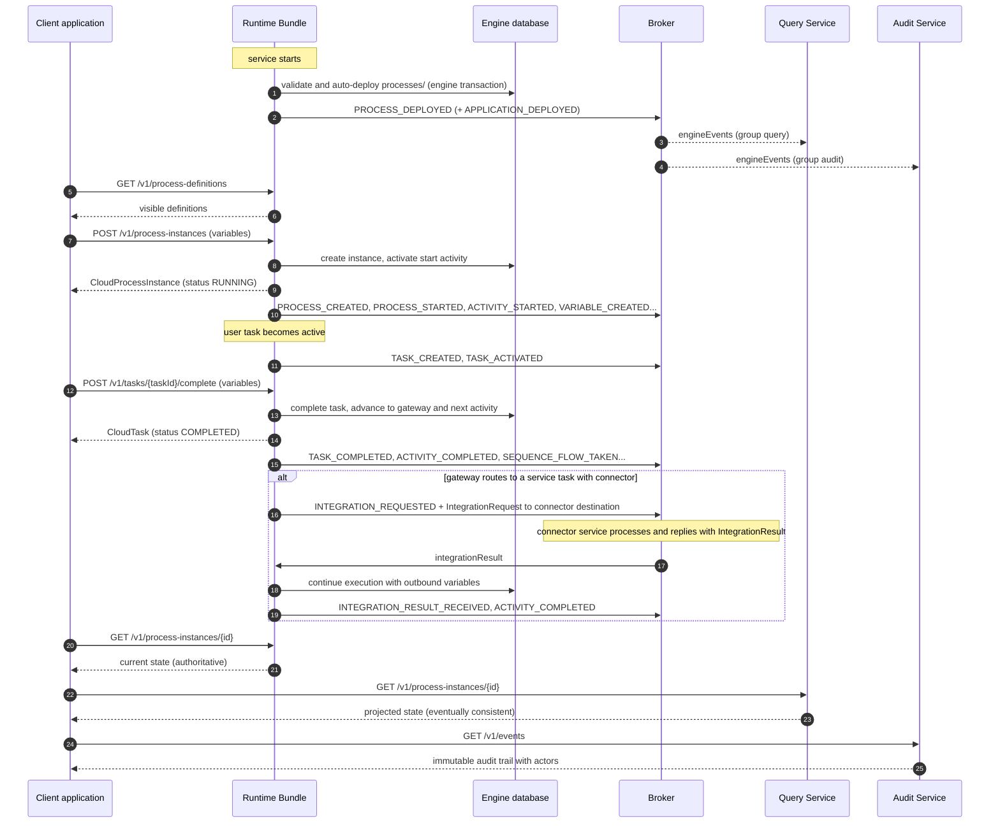

# Runtime Bundle Service

The **runtime bundle service** is the only write-side service in Activiti Cloud. It embeds the [Activiti engine](../../activiti/index.md) as a Spring Boot application and is the service your applications call to deploy process definitions, start and steer process instances, work on tasks, and integrate with external systems. Every state change is executed inside the engine, persisted to the engine's database, and published as events to the message broker for the read-side services.

## Responsibilities

| Responsibility | How it works |
|----------------|--------------|
| Host the engine | The starter (`activiti-cloud-starter-runtime-bundle`) auto-configures a full process engine with its own database. All engine behavior documented in the [Activiti module](../../activiti/index.md) runs in-process here. |
| Deploy process definitions | BPMN files packaged in the application (`src/main/resources/processes/`) are validated and auto-deployed when the service starts. There is no deploy REST endpoint (see [Deploying a process definition](#deploying-a-process-definition)). |
| Start and execute process instances | `POST /v1/process-instances` and friends create and advance executions inside an engine transaction. |
| Work on tasks | User tasks are claimed, assigned, and completed through the task endpoints; variables can be set on tasks and instances. |
| Integrate with connectors | Service tasks that reference a connector publish an `IntegrationRequest` to the broker; the process waits until the connector publishes its result back. |
| Emit events | Every engine audit event becomes a `CloudRuntimeEvent` published to the `engineEvents` destination (plus `integrationResult`/`integrationError` consumption). See [Event-Driven Design](../architecture/event-driven.md). |
| Consume commands | The `commandConsumer` channel receives engine commands (including correlated BPMN messages delivered by the messages service) and executes them with admin-level authority. |

The read side — query, audit, and notifications services — never talks to the engine database. It rebuilds its state from the event stream. For the full picture, see [Architecture Overview](../architecture/overview.md).



## REST API

### Base URL, formats, authentication

- All endpoints are relative to the service root. The standard API is under **`/v1/`** and the administration API under **`/admin/v1/`** (if you set `server.servlet.context-path`, it is prepended).
- Responses come in two shapes depending on `Accept`: `application/json` (the default) returns the Alfresco-style envelope — a single entity wrapped in `{"entry": ...}`, and collections as `{"list": {"entries": [...], "pagination": {...}}}` (see the [response examples below](#request-and-response-examples)); `application/hal+json` returns HATEOAS responses with `_links`.
- Requests require an OAuth2 bearer token (JWT). By default the runtime bundle authorizes `/v1/*` for the `ACTIVITI_USER` role and `/admin/*` for the `ACTIVITI_ADMIN` role through `authorizations.security-constraints` (see [Configuration](#security)). The JWT carries the user id, groups, and roles the engine uses for visibility filtering.

### Standard vs admin endpoints

Each resource has two families of endpoints. They differ in two verified ways:

| | Standard (`/v1/...`) | Admin (`/admin/v1/...`) |
|---|---|---|
| Authorization | `ACTIVITI_USER` role (default pattern `/v1/*`) | `ACTIVITI_ADMIN` role (default pattern `/admin/*`) |
| Engine API used | `ProcessRuntime`, `TaskRuntime`, ... (user-scoped) | `ProcessAdminRuntime`, `TaskAdminRuntime`, ... (annotated `@PreAuthorize("hasAnyRole('ACTIVITI_ADMIN','APPLICATION_MANAGER')")` in the engine) |
| Data visibility | Filtered by the engine's security policies for the authenticated user and groups: a user sees the definitions, instances, and tasks they can access (initiator, candidate users/groups, security policies) | Unfiltered: every definition, instance, task, and variable in this runtime bundle's database |
| Extra operations | — | `destroy` a running instance, remove process variables, bulk-assign tasks, replay a service task, `latestVersion` definition filtering |

In short: use `/v1` for your application's normal user-driven traffic and `/admin/v1` for operators and management tools. An admin token does not magically change the engine's behavior — it switches to the admin runtimes, which skip the user-visibility filters.

### System

| Method | Path | Purpose |
|--------|------|---------|
| GET | `/v1` | Service home; HAL links to `process-definitions`, `process-instances`, and `tasks`. |

### Process definitions

| Method | Path | Purpose |
|--------|------|---------|
| GET | `/v1/process-definitions` | List definitions visible to the current user. Query params: `include` (comma-separated: `variables`, `constant-values` — adds `variableDefinitions` and `constantValues` to each entry), `page`, `size`, `sort`. Returns a paged collection of extended `CloudProcessDefinition` entries. |
| GET | `/v1/process-definitions/{id}` | Fetch one definition by id or key. |
| GET | `/v1/process-definitions/{id}/model` | Fetch the model with content negotiation: `application/xml` returns the BPMN 2.0 XML, `application/json` returns the BPMN JSON interchange format, `image/svg+xml` returns the rendered diagram. |
| GET | `/v1/process-definitions/{id}/static-values` | Static variable values declared for the start event (from the process extensions). |
| GET | `/v1/process-definitions/{id}/constant-values` | Constant variable values for the start event. |
| GET | `/v1/process-definitions/{id}/meta` | `ProcessDefinitionMeta`: `users`, `groups`, `variables`, `userTasks`, `serviceTasks` of the definition. |

### Process definitions (admin)

| Method | Path | Purpose |
|--------|------|---------|
| GET | `/admin/v1/process-definitions` | List **all** definitions regardless of the caller's visibility. Query params: `include` (as above), `latestVersion` (default `false`; `true` returns only the latest version of each key), `page`, `size`, `sort`. |

### Process instances

| Method | Path | Purpose |
|--------|------|---------|
| GET | `/v1/process-instances` | List instances visible to the current user (paged). |
| POST | `/v1/process-instances` | Start an instance. Body: `StartProcessPayload` — `processDefinitionId` or `processDefinitionKey`, optional `name`, `businessKey`, and `variables`. Returns the created `CloudProcessInstance`. |
| GET | `/v1/process-instances/{processInstanceId}` | Fetch one instance. |
| GET | `/v1/process-instances/{processInstanceId}/model` | Diagram of the instance (`image/svg+xml`), with the active activities highlighted. |
| PUT | `/v1/process-instances/{processInstanceId}` | Update instance fields. Body: `UpdateProcessPayload` — `name`, `description`, `businessKey`. |
| DELETE | `/v1/process-instances/{processInstanceId}` | Delete (cancel) the instance. |
| POST | `/v1/process-instances/{processInstanceId}/suspend` | Suspend the instance. |
| POST | `/v1/process-instances/{processInstanceId}/resume` | Resume the instance. |
| GET | `/v1/process-instances/{processInstanceId}/subprocesses` | List child instances (paged). |
| POST | `/v1/process-instances/signal` | Send a signal. Body: `SignalPayload` — `name`, optional `variables`. 200 on success. |
| POST | `/v1/process-instances/message` | Start a process through a message start event. Body: `StartMessagePayload` — `name`, optional `businessKey`, `variables`. |
| PUT | `/v1/process-instances/message` | Deliver a correlated message to a waiting instance. Body: `ReceiveMessagePayload` — `name`, `correlationKey`, optional `variables`. 200 on success. |
| POST | `/v1/process-instances/create` | Deprecated. Create an instance without starting it (`CreateProcessInstancePayload`). |
| POST | `/v1/process-instances/{processInstanceId}/start` | Deprecated. Start a previously created instance. |

### Process instances (admin)

Same operations as above, unscoped, under `/admin/v1/process-instances`, plus:

| Method | Path | Purpose |
|--------|------|---------|
| DELETE | `/admin/v1/process-instances/{processInstanceId}/destroy?force={false}` | Destroy the instance and all its related data; `force=true` destroys a running instance. 200 on success. |

### Tasks

| Method | Path | Purpose |
|--------|------|---------|
| GET | `/v1/process-instances/{processInstanceId}/tasks` | List the tasks of one instance (paged). |
| GET | `/v1/tasks` | List tasks visible to the current user (paged). |
| GET | `/v1/tasks/{taskId}` | Fetch one task. |
| POST | `/v1/tasks` | Create a standalone task. Body: `CreateTaskPayload` — `name`, optional `description`, `assignee`, `candidateUsers`, `candidateGroups`, `dueDate`, `priority`, `parentTaskId`, `formKey`. |
| PUT | `/v1/tasks/{taskId}` | Update task fields. Body: `UpdateTaskPayload` — `name`, `description`, `assignee`, `dueDate`, `priority`, `parentTaskId`, `formKey`. |
| POST | `/v1/tasks/{taskId}/claim` | Claim the task for the authenticated user. |
| POST | `/v1/tasks/{taskId}/release` | Release a claimed task. |
| POST | `/v1/tasks/{taskId}/assign` | Assign the task to a specific user. Body: `AssignTaskPayload` — `assignee`. |
| POST | `/v1/tasks/{taskId}/complete` | Complete the task. Body (optional): `CompleteTaskPayload` — `variables` to set on completion. Returns the `CloudTask`. |
| POST | `/v1/tasks/{taskId}/save` | Persist task variables without completing. Body: `SaveTaskPayload` — `variables`. |
| DELETE | `/v1/tasks/{taskId}` | Delete the task. |
| GET | `/v1/tasks/{taskId}/subtasks` | List subtasks (paged). |

### Tasks (admin)

Under `/admin/v1/tasks` — `GET` (list all), `GET /{taskId}`, `PUT /{taskId}`, `POST /{taskId}/complete` (body optional), `DELETE /{taskId}`, `POST /{taskId}/assign` — plus:

| Method | Path | Purpose |
|--------|------|---------|
| POST | `/admin/v1/tasks/assign` | Bulk-assign. Body: `AssignTasksPayload` — `taskIds` (list), `assignee`. Returns the paged list of assigned tasks. |

### Variables

| Method | Path | Purpose |
|--------|------|---------|
| GET | `/v1/process-instances/{processInstanceId}/variables` | List instance variables. |
| PUT | `/v1/process-instances/{processInstanceId}/variables` | Create or update instance variables. Body: `SetProcessVariablesPayload` — `variables` map. 200 on success. |
| DELETE | `/admin/v1/process-instances/{processInstanceId}/variables` | Remove instance variables (admin only). Body: `RemoveProcessVariablesPayload` — `variableNames` (list). |
| GET | `/v1/tasks/{taskId}/variables` | List task-local variables. |
| POST | `/v1/tasks/{taskId}/variables` | Create a task variable. Body: `CreateTaskVariablePayload` — one variable: `name` and `value`. |
| PUT | `/v1/tasks/{taskId}/variables/{variableName}` | Update a task variable. Body: `UpdateTaskVariablePayload` — `value` (the variable name is taken from the path). |
| GET | `/admin/v1/tasks/{taskId}/variables` | List task variables (admin). |
| POST | `/admin/v1/tasks/{taskId}/variables` | Create task variables (admin). |
| PUT | `/admin/v1/tasks/{taskId}/variables/{variableName}` | Update a task variable (admin). |

Variable values in responses are `CloudVariableInstance` objects: `name`, `type`, `value`, `processInstanceId`, `taskId`.

### Candidate users and groups

| Method | Path | Purpose |
|--------|------|---------|
| GET | `/v1/tasks/{taskId}/candidate-users` | List candidate users of the task. |
| POST | `/v1/tasks/{taskId}/candidate-users` | Add candidate users. Body: `CandidateUsersPayload` — `candidateUsers` (list). |
| DELETE | `/v1/tasks/{taskId}/candidate-users` | Remove candidate users (same body). |
| GET | `/v1/tasks/{taskId}/candidate-groups` | List candidate groups of the task. |
| POST | `/v1/tasks/{taskId}/candidate-groups` | Add candidate groups. Body: `CandidateGroupsPayload` — `candidateGroups` (list). |
| DELETE | `/v1/tasks/{taskId}/candidate-groups` | Remove candidate groups (same body). |

Admin equivalents exist under `/admin/v1/tasks/{taskId}/candidate-users` and `/admin/v1/tasks/{taskId}/candidate-groups` with the same methods.

### Connector definitions

| Method | Path | Purpose |
|--------|------|---------|
| GET | `/v1/connector-definitions` | List the connector definitions packaged with this runtime bundle (see [Connector configuration format](../examples/end-to-end.md#connector-configuration)). |
| GET | `/v1/connector-definitions/{id}` | Fetch one connector definition by id. |

### Service tasks (admin)

| Method | Path | Purpose |
|--------|------|---------|
| POST | `/admin/v1/executions/{executionId}/replay/service-task` | Replay the service task bound to the given execution. Body: `ReplayServiceTaskRequest` — `flowNodeId`. Re-sends the `IntegrationRequest` for a failed or stuck integration. 200 on success. |

### Error responses

Errors are returned as JSON `ActivitiErrorMessage` payloads: not-found situations produce `404`, invalid or impossible commands `400`, and missing authorization `403`.

## Request and response examples

### Deploying a process definition

The runtime bundle has **no REST endpoint for deployment**. Process definitions are packaged into the application and auto-deployed by the engine when the service starts. The starter sets `spring.activiti.deployment-mode=never-fail`, which validates each model and **skips** the ones that fail validation (logging an error) instead of failing startup, so a partially invalid package still boots. A typical application layout:

```text
src/main/resources/
  processes/
    leaveRequestProcess.bpmn20.xml          # BPMN model
    leaveRequestProcess-extensions.json     # optional process extensions (variables, connector mappings)
  connectors/
    hrSystem.json                           # optional connector definition
```

(The [End-to-End Example](../examples/end-to-end.md) uses exactly this layout for a leave-request process.)

After startup, verify the deployment:

```http
GET /v1/process-definitions HTTP/1.1
Authorization: Bearer <token>
Accept: application/json
```

```json
{
  "list": {
    "entries": [
      {
        "entry": {
          "id": "leaveRequestProcess:1:9f2c1a6e-4b8d-4e7a-9c1f-3d5e6f7a8b9c",
          "name": "Employee Leave Request",
          "key": "leaveRequestProcess",
          "description": null,
          "version": 1,
          "formKey": null,
          "category": "http://activiti.org/bpmn",
          "appName": "default-app",
          "serviceName": "rb",
          "serviceFullName": "rb",
          "serviceType": "runtime-bundle",
          "serviceVersion": null,
          "appVersion": null
        }
      }
    ],
    "pagination": {
      "skipCount": 0,
      "maxItems": 100,
      "count": 1,
      "hasMoreItems": false,
      "totalItems": 1
    }
  }
}
```

(`id` is `key:version:uuid` with the default `use-strong-uuids=true`; `category` is the BPMN `targetNamespace`; `appVersion` is null for a plain auto-deployment.)

Use `?include=variables,constant-values` to also return `variableDefinitions` and `constantValues` per definition. Fetch the deployed model with `GET /v1/process-definitions/{id}/model` (send `Accept: application/xml` for the BPMN XML, `application/json` for the JSON interchange, `image/svg+xml` for the diagram).

### Start a process instance

```http
POST /v1/process-instances HTTP/1.1
Authorization: Bearer <token>
Content-Type: application/json

{
  "processDefinitionKey": "leaveRequestProcess",
  "name": "Leave request for jdoe",
  "businessKey": "LEAVE-2026-0042",
  "variables": {
    "employeeId": "jdoe",
    "startDate": "2026-08-24",
    "days": 5
  }
}
```

```json
{
  "entry": {
    "id": "a1b2c3d4-0000-4000-8000-000000000001",
    "name": "Leave request for jdoe",
    "startDate": "2026-08-15T10:15:30.000+00:00",
    "completedDate": null,
    "initiator": "jdoe",
    "businessKey": "LEAVE-2026-0042",
    "status": "RUNNING",
    "processDefinitionId": "leaveRequestProcess:1:9f2c1a6e-4b8d-4e7a-9c1f-3d5e6f7a8b9c",
    "processDefinitionKey": "leaveRequestProcess",
    "parentId": null,
    "processDefinitionVersion": 1,
    "processDefinitionName": "Employee Leave Request",
    "appName": "default-app",
    "serviceName": "rb",
    "serviceFullName": "rb",
    "serviceType": "runtime-bundle",
    "serviceVersion": null,
    "appVersion": null
  }
}
```

Statuses are `CREATED`, `RUNNING`, `SUSPENDED`, `CANCELLED`, and `COMPLETED`. The response is authoritative for the state at commit time; the query service reflects it a moment later.

### List the process definitions a user can start

There is no separate "startable instances" collection: the list of startable processes is the list of process definitions visible to the caller (each has a start event), and starting one is a `POST /v1/process-instances` with the definition's `key`. For an application that renders a "start process" menu, list the definitions (optionally with `?include=variables` to know which variables the start form requires) and let the user post a start payload.

### Complete a task

First, find the active task of the instance:

```http
GET /v1/process-instances/a1b2c3d4-0000-4000-8000-000000000001/tasks HTTP/1.1
Authorization: Bearer <token>
```

```json
{
  "list": {
    "entries": [
      {
        "entry": {
          "id": "d4e5f6a7-0000-4000-8000-000000000002",
          "name": "Approve leave request",
          "description": null,
          "createdDate": "2026-08-15T10:15:30.000+00:00",
          "claimedDate": null,
          "dueDate": null,
          "priority": 50,
          "status": "CREATED",
          "processInstanceId": "a1b2c3d4-0000-4000-8000-000000000001",
          "processDefinitionId": "leaveRequestProcess:1:9f2c1a6e-4b8d-4e7a-9c1f-3d5e6f7a8b9c",
          "processDefinitionVersion": 1,
          "businessKey": "LEAVE-2026-0042",
          "taskDefinitionKey": "approvalTask",
          "candidateUsers": [],
          "candidateGroups": [ "managers" ],
          "appName": "default-app",
          "serviceName": "rb"
        }
      }
    ],
    "pagination": {
      "skipCount": 0,
      "maxItems": 100,
      "count": 1,
      "hasMoreItems": false,
      "totalItems": 1
    }
  }
}
```

Complete it (the request body is optional; send `{}` or omit it to complete without variables):

```http
POST /v1/tasks/d4e5f6a7-0000-4000-8000-000000000002/complete HTTP/1.1
Authorization: Bearer <token>
Content-Type: application/json

{
  "variables": {
    "approved": true,
    "comment": "Enjoy your holiday"
  }
}
```

```json
{
  "entry": {
    "id": "d4e5f6a7-0000-4000-8000-000000000002",
    "name": "Approve leave request",
    "status": "COMPLETED",
    "completedDate": "2026-08-15T11:02:12.000+00:00",
    "completedBy": "manager1",
    "processInstanceId": "a1b2c3d4-0000-4000-8000-000000000001",
    "taskDefinitionKey": "approvalTask",
    "candidateGroups": [ "managers" ]
  }
}
```

Task statuses are `CREATED`, `ASSIGNED`, `SUSPENDED`, `COMPLETED`, `CANCELLED`, `DELETED`. The `approved` variable set at completion is available to the gateway condition expressions and to the service task that follows.

## Configuration

The tables below list the properties a runtime bundle deployment is typically configured with. Values in parentheses are defaults.

### Application identity

| Property | Default | Meaning |
|----------|---------|---------|
| `spring.application.name` | — (required) | Service name. Used as the consumer group for `integrationResult`/`integrationError` and for per-service scoping. |
| `activiti.cloud.application.name` | *(empty)* | Application name. Scopes the `commandConsumer`, `commandResults`, and `messageEvents` destinations and appears in every event payload (`appName`). |
| `activiti.cloud.service.type` | *(empty)* | Service type reported in payloads and events (the platform sets `runtime-bundle`). |
| `activiti.cloud.service.version` | *(empty)* | Service version reported in payloads and events. |

### Datasource

The engine uses Spring Boot's datasource auto-configuration; the starter ships the H2 driver, so with no configuration the service runs on an in-memory H2 database. Point `spring.datasource.url` (and friends) at PostgreSQL for real deployments; the example applications run against PostgreSQL via Testcontainers.

| Property | Default | Meaning |
|----------|---------|---------|
| `spring.datasource.url` | H2 in-memory (driver on classpath) | JDBC URL of the engine database. |
| `spring.datasource.username` / `spring.datasource.password` | H2 defaults | Credentials. |
| `spring.activiti.database-schema-update` | `true` | Create/update the engine schema at startup (`true`, `false`, `drop-create`). |
| `spring.activiti.database-schema` | *(empty)* | Schema name for the engine tables. |

### Messaging broker

| Property | Default | Meaning |
|----------|---------|---------|
| `activiti.cloud.messaging.broker` | `rabbitmq` | Broker to bind: `rabbitmq`, `kafka`, or `aws`. |
| `spring.rabbitmq.host` | `localhost` | RabbitMQ host (used by the example apps via `ACT_RABBITMQ_HOST`). |
| `activiti.cloud.messaging.destination-separator` | `_` | Separator for `prefix_destination` names. |
| `activiti.cloud.messaging.destination-prefix` | *(empty)* | Global prefix for all destinations. |
| `activiti.cloud.messaging.partitioned` | `false` | Enable partitioned production/consumption (ordering per root process instance). |
| `activiti.cloud.messaging.partition-count` | `1` | Number of partitions. |
| `activiti.cloud.messaging.rabbitmq.compress` | `false` | Compress outgoing messages (the example sets `true`). |
| `activiti.cloud.messaging.rabbitmq.compression-level` | `1` | Compression level (1–9). |
| `spring.cloud.stream.bindings.auditProducer.destination` | `engineEvents` | Destination for engine events (override `ACT_RB_AUDIT_PRODUCER_DEST`). |
| `spring.cloud.stream.bindings.integrationResultsConsumer.destination` | `integrationResult` | Destination the runtime bundle consumes connector results from (group = `spring.application.name`). |
| `spring.cloud.stream.bindings.integrationErrorsConsumer.destination` | `integrationError` | Destination for connector errors (group = `spring.application.name`). |

The full destination topology, naming rules, and ordering semantics are documented in [Event-Driven Design](../architecture/event-driven.md).

### Engine

Engine behavior is configured with the standard `spring.activiti` properties of the embedded engine (see the [Activiti module](../../activiti/index.md) for the complete reference). The ones that matter most for a cloud deployment:

| Property | Default | Meaning |
|----------|---------|---------|
| `spring.activiti.check-process-definitions` | `true` | Validate BPMN at deployment (with the default `never-fail` deployment mode, invalid models are logged and skipped rather than failing startup). |
| `spring.activiti.deployment-mode` | `never-fail` (starter default; the bare engine default is `default`) | Auto-deployment strategy for the `processes/` resources (`default`, `never-fail`, `single-resource`, `resource-parent-folder`, `fail-on-no-process`). |
| `spring.activiti.process-definition-location-prefix` | `classpath*:**/processes/` | Where BPMN models are looked up. |
| `spring.activiti.process-definition-location-suffixes` | `**.bpmn20.xml`, `**.bpmn` | File suffixes accepted as process definitions. |
| `spring.activiti.deployment-name` | `SpringAutoDeployment` | Deployment name used for auto-deployments. |
| `spring.activiti.use-strong-uuids` | `true` | Use `SecureRandom`-based UUIDs. |
| `spring.activiti.copy-variables-to-local-for-tasks` | `true` | Copy process variables into task local scope at task creation. |
| `spring.activiti.serialize-pojos-in-variables-to-json` | `true` | Serialize POJO variables to JSON. |
| `spring.activiti.history-level` | `NONE` | Engine history level. |
| `spring.activiti.async-executor-activate` | `true` | Activate the engine's async executor (jobs may be moved to the message-based executor). |
| `spring.activiti.async-executor.core-pool-size` / `max-pool-size` | `2` / `10` | Async executor thread pool sizing. |

### Security

| Property | Default | Meaning |
|----------|---------|---------|
| `authorizations.security-constraints[N].authRoles[0]` | — | Role required for the constraint's patterns. The example config: `ACTIVITI_USER` for `/v1/*` and `ACTIVITI_ADMIN` for `/admin/*`. |
| `authorizations.security-constraints[N].securityCollections[0].patterns[0]` | — | URL pattern the constraint applies to. |
| `activiti.security.policies` | *(none)* | Engine security policies that filter which users/groups may see and start which process definitions and tasks (the data-scoping behind the standard endpoints). |
| `spring.security.oauth2.resourceserver.jwt.*` | — | Standard Spring Security settings for the JWT validator (issuer, jwk set uri, or verification key). |

### Events

| Property | Default | Meaning |
|----------|---------|---------|
| `activiti.cloud.runtime-bundle.events-properties.integration-audit-events-enabled` | `true` | Publish `INTEGRATION_REQUESTED` / `INTEGRATION_RESULT_RECEIVED` / `INTEGRATION_ERROR_RECEIVED` audit events (ephemeral variables are redacted). |
| `activiti.cloud.runtime-bundle.events-properties.chunk-size` | `100` | Max process definitions per `PROCESS_DEPLOYED` event chunk. |
| `activiti.cloud.runtime-bundle.events-properties.chunk-size-in-bytes-close-listener` | `0` (disabled) | When greater than `0`, split the per-transaction `engineEvents` array into chunks no larger than this many bytes (otherwise all events of one transaction are published as a single array). |

### Connectors

| Property | Default | Meaning |
|----------|---------|---------|
| `activiti.connectors.dir` | `classpath:/connectors/` | Location of the `ConnectorDefinition` JSON files served by `/v1/connector-definitions`. |

## Events emitted

The runtime bundle converts each engine audit event into a `CloudRuntimeEvent` and publishes it (aggregated per engine transaction) to the `engineEvents` destination. The main event types, grouped by what they tell you:

| Group | Event types |
|-------|-----------|
| Deployment | `PROCESS_DEPLOYED`, `APPLICATION_DEPLOYED` |
| Instance lifecycle | `PROCESS_CREATED`, `PROCESS_STARTED`, `PROCESS_SUSPENDED`, `PROCESS_RESUMED`, `PROCESS_COMPLETED`, `PROCESS_CANCELLED`, `PROCESS_UPDATED`, `PROCESS_DELETED` |
| Activities | `ACTIVITY_STARTED`, `ACTIVITY_COMPLETED`, `ACTIVITY_CANCELLED`, `SEQUENCE_FLOW_TAKEN` |
| Tasks | `TASK_CREATED`, `TASK_ACTIVATED`, `TASK_ASSIGNED`, `TASK_COMPLETED`, `TASK_CANCELLED`, `TASK_SUSPENDED`, `TASK_UPDATED`, `TASK_CANDIDATE_USER_ADDED`, `TASK_CANDIDATE_USER_REMOVED`, `TASK_CANDIDATE_GROUP_ADDED`, `TASK_CANDIDATE_GROUP_REMOVED` |
| Variables | `VARIABLE_CREATED`, `VARIABLE_UPDATED`, `VARIABLE_DELETED` |
| Integrations | `INTEGRATION_REQUESTED`, `INTEGRATION_RESULT_RECEIVED`, `INTEGRATION_ERROR_RECEIVED`, `ERROR_RECEIVED` |
| Messages and signals | `MESSAGE_WAITING`, `MESSAGE_RECEIVED`, `MESSAGE_SENT`, `MESSAGE_SUBSCRIPTION_CANCELLED`, `START_MESSAGE_DEPLOYED`, `SIGNAL_RECEIVED` |
| Timers | `TIMER_SCHEDULED`, `TIMER_FIRED`, `TIMER_EXECUTED`, `TIMER_CANCELLED`, `TIMER_FAILED`, `TIMER_RETRIES_DECREMENTED` |

Each event carries the entity payload, the acting user, the definition coordinates, and routing headers. Consumers (query, audit, notifications, your own services) filter on `eventType` plus headers. Full event schema, message headers, chunking, and delivery semantics: [Event-Driven Design](../architecture/event-driven.md).

## Request lifecycle

The diagram below follows one process from deployment to completion, showing where the REST calls, the engine database, and the broker sit.



## Troubleshooting and notes

- **Service starts but no processes appear.** Confirm the BPMN files are under a `processes/` directory on the classpath (the default prefix is `classpath*:**/processes/`) and that they match one of the default suffixes (`**.bpmn20.xml`, `**.bpmn`). With the default `never-fail` deployment mode an invalid model is skipped at startup with an error log ("wasn't included in the deployment since it is invalid") — so a partially working service usually means the model was packaged but failed validation; check the startup log for that message.
- **`403` on `/v1/...` calls.** The caller's token lacks the role mapped to the `/v1/*` pattern (default `ACTIVITI_USER`), or the engine's security policies (`activiti.security.policies`) hide the resource from the user. The `403` on a definition you can see elsewhere almost always means the user is not an authorized starter/viewer for that key — fix the policy or use an admin token on `/admin/v1`.
- **`403` on `/admin/v1/...`.** The token must carry `ACTIVITI_ADMIN` (or `APPLICATION_MANAGER`, which the engine admin runtimes accept).
- **Instance stuck at a service task.** The runtime bundle published the `IntegrationRequest` but the connector has not answered. Verify a connector service is running and subscribed to the destination matching the service task `implementation` (by default the implementation string itself), and check the broker for messages on `integrationResult`/`integrationError` with the runtime bundle's application group. `INTEGRATION_REQUESTED` / `INTEGRATION_ERROR_RECEIVED` events in the audit service tell you whether the request left the runtime bundle and whether an error came back. To retry a stuck task, call `POST /admin/v1/executions/{executionId}/replay/service-task`.
- **Broker connectivity at startup.** The runtime bundle binds its producer and consumer channels at startup; with the Rabbit binder and the default `missing-durable-queues-fatal=true`, a missing broker fails the application. Set `ACT_RABBITMQ_HOST` (or `spring.rabbitmq.host`) correctly, or switch `activiti.cloud.messaging.broker` to `kafka` when running against Kafka.
- **Query service "missing" data right after a write.** Expected: the read side is projected from the event stream and converges shortly after the engine commit. Use the runtime bundle's own response for immediate state, and the query service for search and listing.
- **Variables of a completed instance.** After completion the instance and its variables remain in the engine database and are queryable through the standard endpoints until you delete the instance; the query service keeps the completed state in its read model.

## Related

- [Architecture Overview](../architecture/overview.md)
- [Event-Driven Design](../architecture/event-driven.md)
- [Local Development Setup](../getting-started/local-setup.md)
- [End-to-End Example](../examples/end-to-end.md)
- [Activiti Engine Documentation](../../activiti/index.md)
