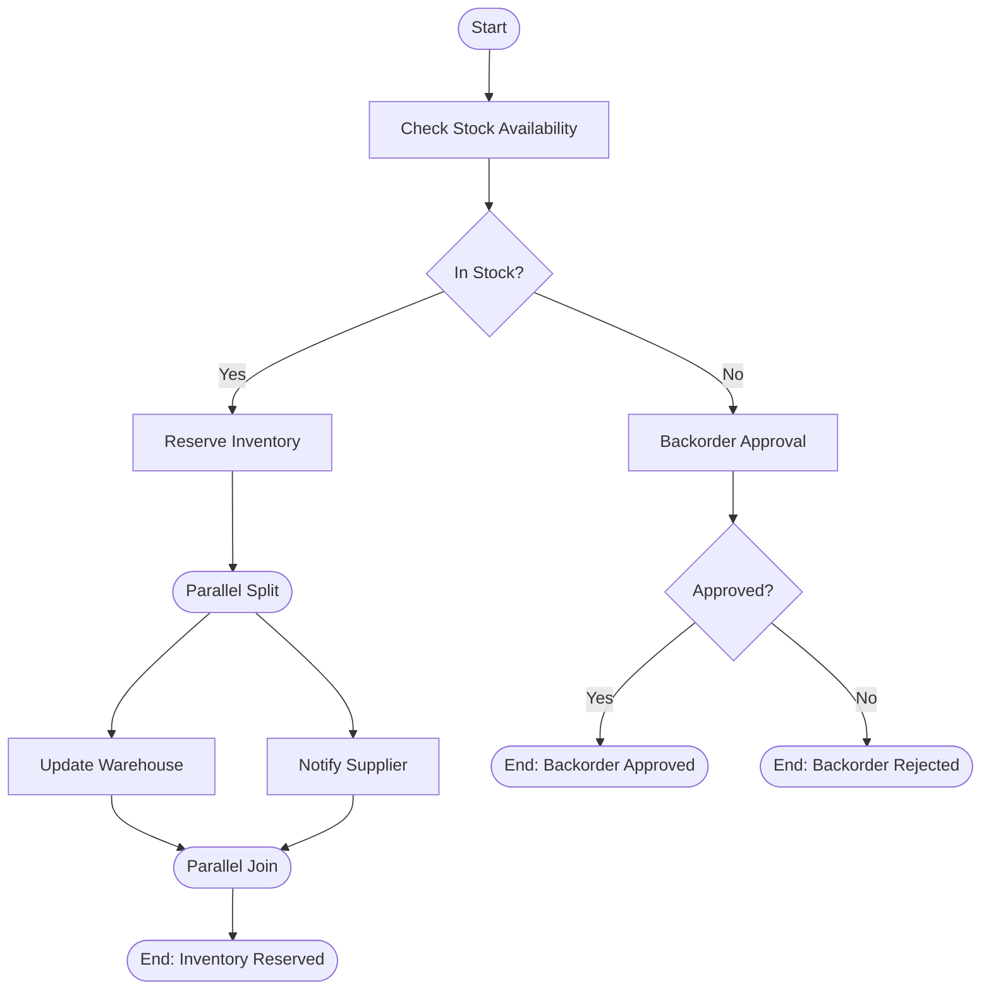

# Inventory Sub-Process

The inventory process handles stock availability checking, item reservation, and backorder management. This sub-process demonstrates parallel execution for concurrent warehouse and supplier operations.

## Process Overview



## Key Features

- **Stock Availability Check** - Automated inventory verification
- **Parallel Execution** - Concurrent warehouse update and supplier notification
- **Backorder Workflow** - Human approval for out-of-stock items
- **Terminate on Rejection** - Clean failure handling

---

## Step-by-Step Walkthrough

### Step 1: Start Event

**Element ID:** `inventoryStartEvent`

```xml
<bpmn:startEvent id="inventoryStartEvent" name="Inventory Check Started">
  <bpmn:outgoing>flowToCheckStock</bpmn:outgoing>
</bpmn:startEvent>
```

**Purpose:** Entry point when called from the main process.

**Called via:**
```xml
<!-- In orderManagementProcess.bpmn -->
<bpmn:callActivity id="inventoryCallActivity" 
                   calledElement="inventoryProcess"/>
```

**Input Variables (from main process):**
- `orderId` - Order identifier
- `orderItems` - Array of items to check (JSON)

---

### Step 2: Check Stock Availability (Service Task)

**Element ID:** `checkStockAvailabilityTask`

```xml
<bpmn:serviceTask id="checkStockAvailabilityTask" 
                  name="Check Stock Availability" 
                  implementation="stockCheckService">
  <bpmn:incoming>flowToCheckStock</bpmn:incoming>
  <bpmn:outgoing>flowToStockGateway</bpmn:outgoing>
</bpmn:serviceTask>
```

**Service Delegate:** `StockCheckService`

**Implementation:**
```java
@Component("stockCheckService")
public class StockCheckService implements Connector {
    
    @Autowired
    private ServiceProperties serviceProperties;
    
    @Override
    public IntegrationContext apply(IntegrationContext integrationContext) {
        logger.info("Checking stock for order: {}", 
            integrationContext.getInBoundVariables().get("orderId"));
        
        String orderId = (String) integrationContext.getInBoundVariables().get("orderId");
        List<Map<String, Object>> orderItems = 
            (List<Map<String, Object>>) integrationContext.getInBoundVariables().get("orderItems");
        
        // Check each item in inventory system
        String inventoryUrl = serviceProperties.getInventory().getSystemUrl();
        int minStockThreshold = serviceProperties.getInventory().getMinStockThreshold();
        
        boolean allInStock = checkAllItems(inventoryUrl, orderItems, minStockThreshold);
        
        integrationContext.addOutBoundVariable("inStock", allInStock);
        integrationContext.addOutBoundVariable("inventoryStatus", 
            allInStock ? "AVAILABLE" : "BACKORDER_REQUIRED");
        integrationContext.addOutBoundVariable("stockDetails", getStockDetails(orderItems));
        
        return integrationContext;
    }
    
    private boolean checkAllItems(String url, List<Map<String, Object>> items, int minThreshold) {
        for (Map<String, Object> item : items) {
            String productId = (String) item.get("productId");
            int quantity = ((Number) item.get("quantity")).intValue();
            
            // Query inventory system
            int availableStock = queryInventory(url, productId);
            
            if (availableStock < quantity || availableStock < minThreshold) {
                return false;
            }
        }
        return true;
    }
}
```

**Configuration:**
```yaml
services:
  inventory:
    system-url: https://inventory.company.com/api
    min-stock-threshold: 10
```

**Output Variables:**
- `inStock` - Boolean availability flag
- `inventoryStatus` - "AVAILABLE" or "BACKORDER_REQUIRED"
- `stockDetails` - Detailed stock information per item

---

### Step 3: Stock Availability Gateway

**Element ID:** `stockAvailabilityGateway`

```xml
<bpmn:exclusiveGateway id="stockAvailabilityGateway" name="In Stock?">
  <bpmn:incoming>flowToStockGateway</bpmn:incoming>
  <bpmn:outgoing>flowToReserveInventory</bpmn:outgoing>
  <bpmn:outgoing>flowToBackorderApproval</bpmn:outgoing>
</bpmn:exclusiveGateway>
```

**Conditions:**
```xml
<!-- In stock path -->
<bpmn:sequenceFlow id="flowToReserveInventory" 
                   name="Yes" 
                   sourceRef="stockAvailabilityGateway" 
                   targetRef="reserveInventoryTask">
  <bpmn:conditionExpression>${inStock == true}</bpmn:conditionExpression>
</bpmn:sequenceFlow>

<!-- Out of stock path -->
<bpmn:sequenceFlow id="flowToBackorderApproval" 
                   name="No" 
                   sourceRef="stockAvailabilityGateway" 
                   targetRef="backorderApprovalTask">
  <bpmn:conditionExpression>${inStock == false}</bpmn:conditionExpression>
</bpmn:sequenceFlow>
```

**Business Logic:**
- `inStock == true` → Reserve inventory and continue
- `inStock == false` → Require backorder approval

---

### Step 4: Reserve Inventory (Service Task)

**Element ID:** `reserveInventoryTask`

```xml
<bpmn:serviceTask id="reserveInventoryTask" 
                  name="Reserve Inventory" 
                  implementation="inventoryReservationService">
  <bpmn:incoming>flowToReserveInventory</bpmn:incoming>
  <bpmn:outgoing>flowToParallelSplit</bpmn:outgoing>
</bpmn:serviceTask>
```

**Service Delegate:** `InventoryReservationService`

**Implementation:**
```java
@Component("inventoryReservationService")
public class InventoryReservationService implements Connector {
    
    @Autowired
    private ServiceProperties serviceProperties;
    
    @Override
    public IntegrationContext apply(IntegrationContext integrationContext) {
        String orderId = (String) integrationContext.getInBoundVariables().get("orderId");
        List<Map<String, Object>> orderItems = 
            (List<Map<String, Object>>) integrationContext.getInBoundVariables().get("orderItems");
        
        // Reserve items in inventory system
        String inventoryUrl = serviceProperties.getInventory().getSystemUrl();
        
        ReservationResult result = reserveItems(inventoryUrl, orderId, orderItems);
        
        integrationContext.addOutBoundVariable("reservationId", result.getReservationId());
        integrationContext.addOutBoundVariable("reservedItems", result.getReservedItems());
        integrationContext.addOutBoundVariable("reservationExpiry", result.getExpiryDate());
        
        return integrationContext;
    }
    
    private ReservationResult reserveItems(String url, String orderId, List<Map<String, Object>> items) {
        // Create reservation record
        // Deduct from available stock
        // Set expiry time (e.g., 24 hours)
        return new ReservationResult("RES-" + orderId, items, LocalDateTime.now().plusDays(1));
    }
}
```

**Output Variables:**
- `reservationId` - Reservation identifier
- `reservedItems` - List of reserved items
- `reservationExpiry` - Reservation expiration date

**Why reserve before parallel operations?**
- Ensures stock is held for this order
- Prevents double-booking
- Sets expiry to release if order fails

---

### Step 5: Parallel Gateway (Split)

**Element ID:** `inventoryParallelSplitGateway`

```xml
<bpmn:parallelGateway id="inventoryParallelSplitGateway" name="">
  <bpmn:incoming>flowToParallelSplit</bpmn:incoming>
  <bpmn:outgoing>flowToUpdateWarehouse</bpmn:outgoing>
  <bpmn:outgoing>flowToNotifySupplier</bpmn:outgoing>
</bpmn:parallelGateway>
```

**Purpose:** Splits flow into two parallel paths.

**Parallel Operations:**
1. **Update Warehouse System** - Internal inventory management
2. **Notify Supplier** - External supplier replenishment alert

**Why parallel execution?**
- Both operations are independent
- Warehouse update doesn't depend on supplier notification
- Reduces overall process time
- Ensures both systems are updated promptly

---

### Step 6: Update Warehouse System (Service Task)

**Element ID:** `updateWarehouseSystemTask`

```xml
<bpmn:serviceTask id="updateWarehouseSystemTask" 
                  name="Update Warehouse System" 
                  implementation="warehouseUpdateService">
  <bpmn:incoming>flowToUpdateWarehouse</bpmn:incoming>
  <bpmn:outgoing>flowToParallelJoin</bpmn:outgoing>
</bpmn:serviceTask>
```

**Service Delegate:** `WarehouseUpdateService`

**Implementation:**
```java
@Component("warehouseUpdateService")
public class WarehouseUpdateService implements Connector {
    
    @Autowired
    private ServiceProperties serviceProperties;
    
    @Override
    public IntegrationContext apply(IntegrationContext integrationContext) {
        String orderId = (String) integrationContext.getInBoundVariables().get("orderId");
        String reservationId = (String) integrationContext.getInBoundVariables().get("reservationId");
        List<Map<String, Object>> reservedItems = 
            (List<Map<String, Object>>) integrationContext.getInBoundVariables().get("reservedItems");
        
        // Update warehouse management system (WMS)
        logger.info("Updating warehouse for order: {}, reservation: {}", orderId, reservationId);
        
        // Create pick list
        // Update bin locations
        // Notify warehouse staff
        
        updateWMS(orderId, reservationId, reservedItems);
        
        integrationContext.addOutBoundVariable("warehouseUpdated", true);
        integrationContext.addOutBoundVariable("pickListId", generatePickListId(orderId));
        
        return integrationContext;
    }
    
    private void updateWMS(String orderId, String reservationId, List<Map<String, Object>> items) {
        // Internal warehouse system update
        // Create picking instructions
        // Allocate storage locations
    }
}
```

**Purpose:**
- Updates internal warehouse management system
- Creates pick lists for warehouse staff
- Allocates storage locations
- Prepares for order fulfillment

**Output Variables:**
- `warehouseUpdated` - Confirmation flag
- `pickListId` - Warehouse pick list identifier

---

### Step 7: Notify Supplier (Service Task)

**Element ID:** `notifySupplierTask`

```xml
<bpmn:serviceTask id="notifySupplierTask" 
                  name="Notify Supplier" 
                  implementation="supplierNotificationService">
  <bpmn:incoming>flowToNotifySupplier</bpmn:incoming>
  <bpmn:outgoing>flowToParallelJoin</bpmn:outgoing>
</bpmn:serviceTask>
```

**Service Delegate:** `SupplierNotificationService`

**Implementation:**
```java
@Component("supplierNotificationService")
public class SupplierNotificationService implements Connector {
    
    @Autowired
    private ServiceProperties serviceProperties;
    
    @Override
    public IntegrationContext apply(IntegrationContext integrationContext) {
        String orderId = (String) integrationContext.getInBoundVariables().get("orderId");
        List<Map<String, Object>> reservedItems = 
            (List<Map<String, Object>>) integrationContext.getInBoundVariables().get("reservedItems");
        
        logger.info("Notifying supplier for order: {}", orderId);
        
        // Notify supplier of stock depletion
        // Request replenishment if needed
        // Update supplier portal
        
        notifySuppliers(reservedItems);
        
        integrationContext.addOutBoundVariable("supplierNotified", true);
        integrationContext.addOutBoundVariable("replenishmentRequested", checkReplenishmentNeeded(reservedItems));
        
        return integrationContext;
    }
    
    private void notifySuppliers(List<Map<String, Object>> items) {
        // Group items by supplier
        // Send notifications via API or email
        // Request replenishment if stock below threshold
    }
    
    private boolean checkReplenishmentNeeded(List<Map<String, Object>> items) {
        // Check if any item is below min threshold
        // Trigger automatic reorder
        return false;
    }
}
```

**Purpose:**
- Notifies suppliers of stock depletion
- Requests replenishment if needed
- Maintains supplier relationships
- Ensures future stock availability

**Output Variables:**
- `supplierNotified` - Confirmation flag
- `replenishmentRequested` - Reorder trigger flag

---

### Step 8: Parallel Gateway (Join)

**Element ID:** `inventoryParallelJoinGateway`

```xml
<bpmn:parallelGateway id="inventoryParallelJoinGateway" name="">
  <bpmn:incoming>flowToParallelJoin</bpmn:incoming>
  <bpmn:incoming>flowToParallelJoinFromWarehouse</bpmn:incoming>
  <bpmn:incoming>flowToParallelJoinFromSupplier</bpmn:incoming>
  <bpmn:outgoing>flowToInventoryCompleted</bpmn:outgoing>
</bpmn:parallelGateway>
```

**Purpose:** Waits for both parallel paths to complete.

**Why a join gateway?**
- Synchronization point
- Ensures warehouse and supplier both updated
- Prevents proceeding until all operations complete
- Maintains data consistency

---

### Step 9: End Event (Inventory Reserved)

**Element ID:** `inventoryCompletedEndEvent`

```xml
<bpmn:endEvent id="inventoryCompletedEndEvent" name="Inventory Reserved">
  <bpmn:incoming>flowToInventoryCompleted</bpmn:incoming>
</bpmn:endEvent>
```

**Purpose:** Normal completion when items are in stock and reserved.

**Output Variables (returned to main process):**
- `inventoryStatus` - "RESERVED"
- `inStock` - `true`
- `reservationId` - Reservation identifier

---

### Step 10: Backorder Approval (User Task)

**Element ID:** `backorderApprovalTask`

```xml
<bpmn:userTask id="backorderApprovalTask" 
               name="Backorder Approval" 
               activiti:assignee="${inventoryManager}">
  <bpmn:incoming>flowToBackorderApproval</bpmn:incoming>
  <bpmn:outgoing>flowToBackorderGateway</bpmn:outgoing>
</bpmn:userTask>
```

**Purpose:** Human decision for out-of-stock items.

**Assignee:** `${inventoryManager}` - Inventory manager role

**Input Variables:**
- `orderId` - Order identifier
- `orderItems` - Items that are out of stock
- `stockDetails` - Current stock levels
- `customerEmail` - Customer contact for notification

**Runtime Completion:**
```java
// Approve backorder
taskService.complete(taskId, Map.of(
    "backorderApproved", true,
    "approvalReason", "Customer agrees to wait",
    "estimatedDelivery", "2024-02-15"
));

// Reject backorder
taskService.complete(taskId, Map.of(
    "backorderApproved", false,
    "rejectionReason", "Customer prefers cancellation"
));
```

**Why human approval?**
- Backorders impact customer satisfaction
- May require customer communication
- Business decision based on priorities
- Exception handling for out-of-stock scenarios

---

### Step 11: Backorder Decision Gateway

**Element ID:** `backorderDecisionGateway`

```xml
<bpmn:exclusiveGateway id="backorderDecisionGateway" name="Approve Backorder?">
  <bpmn:incoming>flowToBackorderGateway</bpmn:incoming>
  <bpmn:outgoing>flowToBackorderApproved</bpmn:outgoing>
  <bpmn:outgoing>flowToBackorderRejected</bpmn:outgoing>
</bpmn:exclusiveGateway>
```

**Conditions:**
```xml
<!-- Approved path -->
<bpmn:sequenceFlow id="flowToBackorderApproved" 
                   name="Yes" 
                   sourceRef="backorderDecisionGateway" 
                   targetRef="backorderApprovedEndEvent">
  <bpmn:conditionExpression>${backorderApproved == true}</bpmn:conditionExpression>
</bpmn:sequenceFlow>

<!-- Rejected path -->
<bpmn:sequenceFlow id="flowToBackorderRejected" 
                   name="No" 
                   sourceRef="backorderDecisionGateway" 
                   targetRef="backorderRejectedEndEvent">
  <bpmn:conditionExpression>${backorderApproved == false}</bpmn:conditionExpression>
</bpmn:sequenceFlow>
```

---

### Step 12: End Event (Backorder Approved)

**Element ID:** `backorderApprovedEndEvent`

```xml
<bpmn:endEvent id="backorderApprovedEndEvent" name="Backorder Approved">
  <bpmn:incoming>flowToBackorderApproved</bpmn:incoming>
</bpmn:endEvent>
```

**Purpose:** Backorder approved, order can proceed.

**Output Variables (returned to main process):**
- `inventoryStatus` - "BACKORDER_APPROVED"
- `inStock` - `false` (but approved to proceed)

**Note:** Main process continues even though items aren't physically in stock.

---

### Step 13: End Event (Backorder Rejected)

**Element ID:** `backorderRejectedEndEvent`

```xml
<bpmn:endEvent id="backorderRejectedEndEvent" name="Backorder Rejected">
  <bpmn:incoming>flowToBackorderRejected</bpmn:incoming>
  <bpmn:terminateEventDefinition/>
</bpmn:endEvent>
```

**Purpose:** Backorder rejected, order cannot proceed.

**Why terminate?**
- Items unavailable and customer doesn't want to wait
- Order must be cancelled
- Prevents further processing

**Effect:** Terminates the entire process instance (including main process).

---

## Process Statistics

| Metric | Value |
|--------|-------|
| **Total Elements** | 10 |
| **Start Events** | 1 |
| **End Events** | 3 (2 normal, 1 terminate) |
| **User Tasks** | 1 |
| **Service Tasks** | 4 |
| **Exclusive Gateways** | 2 |
| **Parallel Gateways** | 2 |

---

## Key Patterns Demonstrated

### 1. Parallel Execution for Independent Operations

```xml
<parallelGateway id="inventoryParallelSplitGateway"/>
  <serviceTask id="updateWarehouseSystemTask"/>
  <serviceTask id="notifySupplierTask"/>
<parallelGateway id="inventoryParallelJoinGateway"/>
```

**When to use parallel gateways:**
- Operations don't depend on each other
- Both must complete before proceeding
- Reduces overall execution time
- Improves system responsiveness

**Benefits:**
- Warehouse updated immediately
- Supplier notified simultaneously
- Total time = max(warehouse, supplier) not sum

### 2. Stock Reservation Pattern

```
Check Availability → Reserve → Update Systems
```

**Why reserve first?**
- Prevents double-booking
- Sets expiry for failed orders
- Holds stock during order processing
- Enables accurate availability reporting

### 3. Backorder Approval Workflow

```
Out of Stock → Human Decision → Approve/Reject
```

**When to use human approval:**
- Exception handling
- Customer impact decisions
- Business rule exceptions
- Risk management

### 4. Terminate on Critical Failure

```xml
<endEvent>
  <terminateEventDefinition/>
</endEvent>
```

**When to terminate:**
- Order cannot proceed
- Customer cancellation
- Critical business rule violation
- No recovery path available

---

## Variable Flow

```
Input (from main process)
    ↓
orderId, orderItems
    ↓
[Check Stock Availability]
    ↓
inStock, inventoryStatus, stockDetails
    ↓
    ├─ In Stock Path
    │   ↓
    │ [Reserve Inventory]
    │   ↓
    │ reservationId, reservedItems
    │   ↓
    │ ┌─ Parallel ───────────┐
    │ ↓                      ↓
    │ [Warehouse]      [Supplier]
    │   ↓                      ↓
    │ └────→ Join ←────────────┘
    │   ↓
    │ End (Inventory Reserved)
    │
    └─ Out of Stock Path
        ↓
    [Backorder Approval]
        ↓
        ├─ Approved → End (Backorder Approved)
        └─ Rejected → End (Backorder Rejected - Terminate)
```

---

## Error Scenarios

| Scenario | Trigger | Outcome |
|----------|---------|---------|
| All items in stock | `inStock == true` | Reserve and complete |
| Some items out of stock | `inStock == false` | Backorder approval |
| Backorder approved | Manager decision | Continue with backorder |
| Backorder rejected | Manager decision | Terminate order |
| Reservation fails | Service error | Process exception |
| Warehouse update fails | Service error | Join waits indefinitely |

---

## Configuration

### Service Properties

```yaml
services:
  inventory:
    system-url: https://inventory.company.com/api
    min-stock-threshold: 10
    reservation-expiry-hours: 24
```

### Extension JSON Constants

```json
"checkStockAvailabilityTask": {
  "inventorySystem": {"value": "https://inventory.company.com/api"},
  "minStockThreshold": {"value": "10"}
},
"reserveInventoryTask": {
  "reservationExpiry": {"value": "PT24H"}
}
```

---

## Best Practices Illustrated

1. **Check Before Reserve** - Verify availability before committing stock
2. **Parallel Independent Operations** - Update warehouse and notify supplier concurrently
3. **Human Exception Handling** - Backorder approval for edge cases
4. **Clear Termination** - Reject path terminates cleanly
5. **Reservation Expiry** - Prevents stock held indefinitely
6. **Supplier Integration** - Maintains supply chain visibility

---

## Next Steps

- [Shipping Sub-Process](shipping-process.md) - Delivery options
- [Service Delegates](service-delegates.md) - Java implementations
- [Process Extensions](process-extensions.md) - Variable mappings

---

**Related Documentation:**
- [Parallel Gateways](../../bpmn/gateways/parallel-gateway.md)
- [Exclusive Gateways](../../bpmn/gateways/exclusive-gateway.md)
- [Call Activities](../../bpmn/elements/call-activity.md)
- [User Tasks](../../bpmn/elements/user-task.md)
