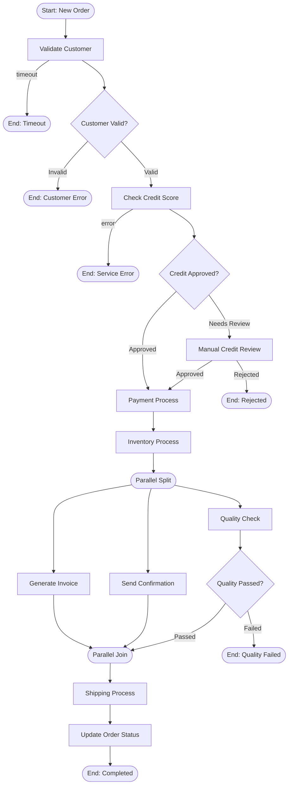

# Order Management - Main Process

The main process orchestrates the complete order workflow, coordinating customer validation, credit checks, payment, inventory, and shipping operations.

## Process Diagram



## Step-by-Step Walkthrough

### Step 1: Message Start Event

**Element ID:** `startEvent`

```xml
<bpmn:startEvent id="startEvent" name="Order Received">
  <bpmn:outgoing>flowToValidateCustomer</bpmn:outgoing>
  <bpmn:messageEventDefinition messageRef="newOrderMessage"/>
</bpmn:startEvent>
```

**Purpose:** Initiates the process when a new order message arrives.

**Why a message event?**
- Decouples process start from specific triggers
- Can be activated by REST API, message queue, or webhook
- Enables event-driven architecture
- Allows multiple entry points

**Message Definition:**
```xml
<bpmn:message id="newOrderMessage" name="NewOrder"/>
```

**Runtime Trigger:**
```java
ProcessPayloadBuilder.start()
    .withProcessDefinitionKey("orderManagementProcess")
    .withVariable("orderId", "ORD-001")
    .withVariable("customerName", "John Doe")
    // ... more variables
    .build();
```

---

### Step 2: Customer Validation User Task

**Element ID:** `validateCustomerTask`

```xml
<bpmn:userTask id="validateCustomerTask" 
               name="Validate Customer Information" 
               activiti:assignee="customerValidator">
  <bpmn:incoming>flowToValidateCustomer</bpmn:incoming>
  <bpmn:outgoing>flowToCustomerGateway</bpmn:outgoing>
  <bpmn:property id="customerData" name="customerData"/>
</bpmn:userTask>
```

**Purpose:** Human task for verifying customer information before processing the order.

**Key Features:**
- **Assignee:** `customerValidator` - Static user ID or group (can also use EL expression `${customerValidator}` for dynamic resolution)
- **Task Property:** `customerData` - stores validated customer information
- **Boundary Event:** 30-minute timeout

**Boundary Timer Event:**
```xml
<bpmn:boundaryEvent id="validateCustomerTimeout" 
                    name="Validation Timeout" 
                    attachedToRef="validateCustomerTask" 
                    cancelActivity="true">
  <bpmn:outgoing>flowToTimeoutHandler</bpmn:outgoing>
  <bpmn:timerEventDefinition>
    <bpmn:timeDuration>PT30M</timeDuration>
  </bpmn:timerEventDefinition>
</bpmn:boundaryEvent>
```

**Why a boundary timer?**
- Prevents orders from waiting indefinitely
- `cancelActivity="true"` - interrupts the task and follows timeout path
- `PT30M` = 30 minutes in ISO 8601 duration format

**Timeout Handling:**
```java
// Task times out after 30 minutes
// Process follows flowToTimeoutHandler → timeoutEndEvent
// Order is logged but not terminated (can be resumed)
```

**Input Variables:**
- `customerName` - Customer full name
- `customerEmail` - Contact email
- `customerAddress` - Shipping address (JSON)

**Output Variables:**
- `customerValid` - Boolean validation result
- `customerData` - Validated customer information

---

### Step 3: Customer Validation Gateway

**Element ID:** `customerValidationGateway`

```xml
<bpmn:exclusiveGateway id="customerValidationGateway" name="Customer Valid?">
  <bpmn:incoming>flowToCustomerGateway</bpmn:incoming>
  <bpmn:outgoing>flowToCreditCheck</bpmn:outgoing>
  <bpmn:outgoing>flowToCustomerError</bpmn:outgoing>
</bpmn:exclusiveGateway>
```

**Purpose:** Routes flow based on customer validation result.

**Sequence Flow Conditions:**

```xml
<!-- Valid customer path -->
<bpmn:sequenceFlow id="flowToCreditCheck" 
                   name="Yes" 
                   sourceRef="customerValidationGateway" 
                   targetRef="checkCreditScoreTask">
  <bpmn:conditionExpression>${customerValid == true}</bpmn:conditionExpression>
</bpmn:sequenceFlow>

<!-- Invalid customer path -->
<bpmn:sequenceFlow id="flowToCustomerError" 
                   name="No" 
                   sourceRef="customerValidationGateway" 
                   targetRef="customerErrorEndEvent">
  <bpmn:conditionExpression>${customerValid == false}</bpmn:conditionExpression>
</bpmn:sequenceFlow>
```

**Why an exclusive gateway?**
- Only one path can be taken
- Clear decision point in the process
- EL expressions for conditions

**Error Path:**
```xml
<bpmn:endEvent id="customerErrorEndEvent" name="Customer Error">
  <bpmn:terminateEventDefinition/>
</bpmn:endEvent>
```

**Terminate Event:** Ends the entire process instance immediately, not just the current path.

---

### Step 4: Credit Score Service Task

**Element ID:** `checkCreditScoreTask`

```xml
<bpmn:serviceTask id="checkCreditScoreTask" 
                  name="Check Credit Score" 
                  implementation="creditScoreService">
  <bpmn:incoming>flowToCreditCheck</bpmn:incoming>
  <bpmn:outgoing>flowToCreditGateway</bpmn:outgoing>
</bpmn:serviceTask>
```

**Purpose:** Automated credit check using the `CreditScoreService` Spring bean.

**Implementation Reference:**
- `implementation="creditScoreService"` - refers to `@Component("creditScoreService")`

**Service Delegate:**
```java
@Component("creditScoreService")
public class CreditScoreService implements Connector {
    
    @Autowired
    private ServiceProperties serviceProperties;
    
    @Override
    public IntegrationContext apply(IntegrationContext integrationContext) {
        // Read input variables
        String customerId = (String) integrationContext.getInBoundVariables().get("customerId");
        BigDecimal orderAmount = (BigDecimal) integrationContext.getInBoundVariables().get("orderAmount");
        
        // Business logic
        int creditScore = calculateCreditScore(customerId, orderAmount);
        int minScore = serviceProperties.getCreditBureau().getMinCreditScore();
        boolean approved = creditScore >= minScore;
        
        // Set output variables
        integrationContext.addOutBoundVariable("score", creditScore);
        integrationContext.addOutBoundVariable("approved", approved);
        integrationContext.addOutBoundVariable("minRequiredScore", minScore);
        
        return integrationContext;
    }
}
```

**Boundary Error Event:**
```xml
<bpmn:boundaryEvent id="creditServiceError" 
                    name="Credit Service Unavailable" 
                    attachedToRef="checkCreditScoreTask" 
                    cancelActivity="true">
  <bpmn:outgoing>flowToCreditErrorHandler</bpmn:outgoing>
  <bpmn:errorEventDefinition errorRef="creditServiceError"/>
</bpmn:boundaryEvent>
```

**Error Definition:**
```xml
<bpmn:error id="creditServiceError" name="CreditServiceError" errorCode="CREDIT001"/>
```

**Why error boundary?**
- Handles service failures gracefully
- Prevents process from hanging on external service errors
- Can log, notify, or retry based on error type

---

### Step 5: Credit Approval Gateway

**Element ID:** `creditApprovalGateway`

```xml
<bpmn:exclusiveGateway id="creditApprovalGateway" name="Credit Approved?">
  <bpmn:incoming>flowToCreditGateway</bpmn:incoming>
  <bpmn:outgoing>flowToPaymentCall</bpmn:outgoing>
  <bpmn:outgoing>flowToManualReview</bpmn:outgoing>
</bpmn:exclusiveGateway>
```

**Conditions:**
```xml
<!-- Auto-approved path -->
<bpmn:sequenceFlow id="flowToPaymentCall" 
                   name="Approved" 
                   sourceRef="creditApprovalGateway" 
                   targetRef="paymentCallActivity">
  <bpmn:conditionExpression>${creditApproved == true}</bpmn:conditionExpression>
</bpmn:sequenceFlow>

<!-- Manual review path -->
<bpmn:sequenceFlow id="flowToManualReview" 
                   name="Needs Review" 
                   sourceRef="creditApprovalGateway" 
                   targetRef="manualCreditReviewTask">
  <bpmn:conditionExpression>${creditApproved == false}</bpmn:conditionExpression>
</bpmn:sequenceFlow>
```

**Business Logic:**
- Credit score ≥ 650 → Auto-approved
- Credit score < 650 → Manual review required

---

### Step 6: Manual Credit Review (Fallback Path)

**Element ID:** `manualCreditReviewTask`

```xml
<bpmn:userTask id="manualCreditReviewTask" 
               name="Manual Credit Review" 
               activiti:assignee="creditManager">
  <bpmn:incoming>flowToManualReview</bpmn:incoming>
  <bpmn:outgoing>flowToManualReviewGateway</bpmn:outgoing>
</bpmn:userTask>
```

**Purpose:** Human review for borderline credit cases.

**Assignee:** `creditManager` - Static user ID (can also use EL expression `${creditManager}` for dynamic resolution)

**Manual Review Gateway:**
```xml
<bpmn:exclusiveGateway id="manualReviewGateway" name="Approved?">
  <bpmn:incoming>flowToManualReviewGateway</bpmn:incoming>
  <bpmn:outgoing>flowToPaymentCall</bpmn:outgoing>
  <bpmn:outgoing>flowToRejectedEnd</bpmn:outgoing>
</bpmn:exclusiveGateway>
```

**Why manual review?**
- Not all credit decisions can be automated
- Provides flexibility for exceptional cases
- Human oversight for risk management

---

### Step 7: Payment Process Call Activity

**Element ID:** `paymentCallActivity`

```xml
<bpmn:callActivity id="paymentCallActivity" 
                   name="Payment Process" 
                   calledElement="paymentProcess">
  <bpmn:incoming>flowToPaymentCall</bpmn:incoming>
  <bpmn:outgoing>flowToInventoryCall</bpmn:outgoing>
</bpmn:callActivity>
```

**Purpose:** Invokes the payment sub-process.

**Variable Mapping:**
```json
"paymentCallActivity": {
  "inputs": {
    "orderId": {"type": "variable", "value": "orderId"},
    "amount": {"type": "variable", "value": "orderTotal"},
    "customerEmail": {"type": "variable", "value": "customerEmail"}
  },
  "outputs": {
    "paymentStatus": {"type": "variable", "value": "paymentStatus"},
    "paymentResult": {"type": "variable", "value": "paymentDetails"}
  }
}
```

**Why a call activity?**
- Reusable payment logic
- Independent versioning
- Clear separation of concerns
- Can be called from multiple processes

**See:** [Payment Sub-Process](payment-process.md) for details.

---

### Step 8: Inventory Process Call Activity

**Element ID:** `inventoryCallActivity`

```xml
<bpmn:callActivity id="inventoryCallActivity" 
                   name="Inventory Management" 
                   calledElement="inventoryProcess">
  <bpmn:incoming>flowToInventoryCall</bpmn:incoming>
  <bpmn:outgoing>flowToParallelSplit</bpmn:outgoing>
</bpmn:callActivity>
```

**Purpose:** Checks stock availability and reserves items.

**Variable Mapping:**
```json
"inventoryCallActivity": {
  "inputs": {
    "orderId": {"type": "variable", "value": "orderId"},
    "orderItems": {"type": "variable", "value": "orderItems"}
  },
  "outputs": {
    "inventoryStatus": {"type": "variable", "value": "inventoryStatus"},
    "inStock": {"type": "variable", "value": "inStock"}
  }
}
```

**See:** [Inventory Sub-Process](inventory-process.md) for details.

---

### Step 9: Parallel Gateway (Split)

**Element ID:** `parallelSplitGateway`

```xml
<bpmn:parallelGateway id="parallelSplitGateway" name="">
  <bpmn:incoming>flowToParallelSplit</bpmn:incoming>
  <bpmn:outgoing>flowToGenerateInvoice</bpmn:outgoing>
  <bpmn:outgoing>flowToSendConfirmation</bpmn:outgoing>
  <bpmn:outgoing>flowToQualityCheck</bpmn:outgoing>
</bpmn:parallelGateway>
```

**Purpose:** Splits flow into three parallel paths.

**Parallel Tasks:**
1. **Generate Invoice** - Create billing document
2. **Send Confirmation Email** - Notify customer
3. **Quality Check** - Human verification

**Why parallel execution?**
- These tasks are independent
- Reduces overall process time
- Models real-world concurrent operations

---

### Step 10: Parallel Task - Generate Invoice

**Element ID:** `generateInvoiceTask`

```xml
<bpmn:serviceTask id="generateInvoiceTask" 
                  name="Generate Invoice" 
                  implementation="invoiceService">
  <bpmn:incoming>flowToGenerateInvoice</bpmn:incoming>
  <bpmn:outgoing>flowToParallelJoin</bpmn:outgoing>
</bpmn:serviceTask>
```

**Service Delegate:** `InvoiceService`

**Output Variables:**
- `invoiceNumber` - Generated invoice ID
- `invoiceUrl` - Download link

---

### Step 11: Parallel Task - Send Confirmation Email

**Element ID:** `sendConfirmationTask`

```xml
<bpmn:serviceTask id="sendConfirmationTask" 
                  name="Send Order Confirmation Email" 
                  implementation="emailService">
  <bpmn:incoming>flowToSendConfirmation</bpmn:incoming>
  <bpmn:outgoing>flowToParallelJoin</bpmn:outgoing>
</bpmn:serviceTask>
```

**Service Delegate:** `EmailService`

**Constants:**
```json
"sendConfirmationTask": {
  "smtpServer": {"value": "smtp.company.com"},
  "fromAddress": {"value": "orders@company.com"},
  "emailTemplate": {"value": "order_confirmation"}
}
```

---

### Step 12: Parallel Task - Quality Check

**Element ID:** `qualityCheckTask`

```xml
<bpmn:userTask id="qualityCheckTask" 
               name="Quality Check" 
               activiti:assignee="qualityTeam">
  <bpmn:incoming>flowToQualityCheck</bpmn:incoming>
  <bpmn:outgoing>flowToQualityGateway</bpmn:outgoing>
  
  <!-- Non-cancelling boundary event -->
  <bpmn:boundaryEvent id="qualityEscalation" 
                      name="Escalation Request" 
                      attachedToRef="qualityCheckTask" 
                      cancelActivity="false">
    <bpmn:outgoing>flowToEscalationHandler</bpmn:outgoing>
    <bpmn:messageEventDefinition messageRef="escalationMessage"/>
  </bpmn:boundaryEvent>
</bpmn:userTask>
```

**Key Feature:** Non-cancelling boundary event

**Assignee:** `qualityTeam` - Static user ID or group (can also use EL expression `${qualityTeam}` for dynamic resolution)

```xml
<bpmn:message id="escalationMessage" name="EscalationRequest"/>
```

**Why `cancelActivity="false"`?**
- Escalation notification sent
- Original task continues
- Enables parallel handling (notify manager + complete task)

**Quality Check Gateway:**
```xml
<bpmn:exclusiveGateway id="qualityCheckGateway" name="Quality Passed?">
  <bpmn:incoming>flowToQualityGateway</bpmn:incoming>
  <bpmn:outgoing>flowToParallelJoin</bpmn:outgoing>
  <bpmn:outgoing>flowToQualityFail</bpmn:outgoing>
</bpmn:exclusiveGateway>
```

**Fail Path:**
```xml
<bpmn:endEvent id="qualityFailEndEvent" name="Quality Failed">
  <bpmn:terminateEventDefinition/>
</bpmn:endEvent>
```

---

### Step 13: Parallel Gateway (Join)

**Element ID:** `parallelJoinGateway`

```xml
<bpmn:parallelGateway id="parallelJoinGateway" name="">
  <bpmn:incoming>flowToParallelJoin</bpmn:incoming>
  <bpmn:incoming>flowToParallelJoinFromInvoice</bpmn:incoming>
  <bpmn:incoming>flowToParallelJoinFromEmail</bpmn:incoming>
  <bpmn:outgoing>flowToShippingCall</bpmn:outgoing>
</bpmn:parallelGateway>
```

**Purpose:** Waits for all parallel paths to complete.

**Why a join gateway?**
- Synchronization point
- Ensures invoice, email, and quality check all complete
- Prevents race conditions

---

### Step 14: Shipping Process Call Activity

**Element ID:** `shippingCallActivity`

```xml
<bpmn:callActivity id="shippingCallActivity" 
                   name="Shipping & Delivery" 
                   calledElement="shippingProcess">
  <bpmn:incoming>flowToShippingCall</bpmn:incoming>
  <bpmn:outgoing>flowToUpdateStatus</bpmn:outgoing>
</bpmn:callActivity>
```

**Purpose:** Handles shipping based on customer's selected method.

**See:** [Shipping Sub-Process](shipping-process.md) for details.

---

### Step 15: Update Order Status

**Element ID:** `updateOrderStatusTask`

```xml
<bpmn:serviceTask id="updateOrderStatusTask" 
                  name="Update Order Status" 
                  implementation="orderStatusService">
  <bpmn:incoming>flowToUpdateStatus</bpmn:incoming>
  <bpmn:outgoing>flowToCompletedEnd</bpmn:outgoing>
</bpmn:serviceTask>
```

**Service Delegate:** `OrderStatusService`

**Constants:**
```json
"updateOrderStatusTask": {
  "orderManagementSystem": {"value": "https://oms.company.com/api"},
  "statusCompleted": {"value": "COMPLETED"}
}
```

---

### Step 16: End Event (Completed)

**Element ID:** `completedEndEvent`

```xml
<bpmn:endEvent id="completedEndEvent" name="Order Completed">
  <bpmn:incoming>flowToCompletedEnd</bpmn:incoming>
</bpmn:endEvent>
```

**Purpose:** Normal process completion.

---

## Process Statistics

| Metric | Value |
|--------|-------|
| **Total Elements** | 25 |
| **Start Events** | 1 (message) |
| **End Events** | 6 (1 normal, 5 terminate) |
| **User Tasks** | 4 |
| **Service Tasks** | 5 |
| **Call Activities** | 3 |
| **Exclusive Gateways** | 4 |
| **Parallel Gateways** | 2 |
| **Boundary Events** | 3 |
| **Sequence Flows** | 20+ |

## Error Handling Summary

| Error Type | Boundary Event | Outcome |
|------------|----------------|---------|
| Validation timeout | `validateCustomerTimeout` | End (timeout) |
| Customer invalid | Gateway decision | Terminate |
| Credit service error | `creditServiceError` | Terminate |
| Credit denied | Gateway decision | Manual review |
| Manual rejected | Gateway decision | Terminate |
| Quality failed | Gateway decision | Terminate |
| Quality escalation | `qualityEscalation` | Notify + continue |

## Next Steps

- [Payment Sub-Process](payment-process.md) - Detailed payment handling
- [Inventory Sub-Process](inventory-process.md) - Stock management
- [Shipping Sub-Process](shipping-process.md) - Delivery options

---

**Related Documentation:**
- [Exclusive Gateways](../../bpmn/gateways/exclusive-gateway.md)
- [Parallel Gateways](../../bpmn/gateways/parallel-gateway.md)
- [Call Activities](../../bpmn/elements/call-activity.md)
- [Boundary Events](../../bpmn/events/boundary-event.md)
