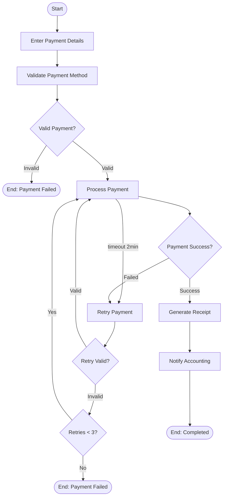
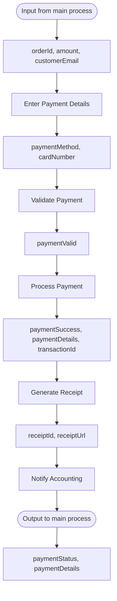

# Payment Sub-Process

The payment process handles customer payment with validation, retry logic, and accounting integration. This sub-process demonstrates async execution, timeout handling, and multi-instance patterns.

## Process Overview



## Key Features

- **Async Service Task** - Non-blocking payment processing
- **Timer Boundary Event** - 2-minute timeout triggers retry
- **Multi-Instance** - Sequential retry up to 3 attempts
- **Completion Condition** - Early exit on successful retry
- **Terminate End Event** - Clean failure handling

---

## Step-by-Step Walkthrough

### Step 1: Start Event

**Element ID:** `paymentStartEvent`

```xml
<bpmn:startEvent id="paymentStartEvent" name="Payment Started">
  <bpmn:outgoing>flowToEnterPayment</bpmn:outgoing>
</bpmn:startEvent>
```

**Purpose:** Entry point when called from the main process.

**Called via:**
```xml
<!-- In orderManagementProcess.bpmn -->
<bpmn:callActivity id="paymentCallActivity" 
                   calledElement="paymentProcess"/>
```

**Input Variables (from main process):**
- `orderId` - Order identifier
- `amount` - Payment amount
- `customerEmail` - Customer contact

---

### Step 2: Enter Payment Details (User Task)

**Element ID:** `enterPaymentDetailsTask`

```xml
<bpmn:userTask id="enterPaymentDetailsTask" 
               name="Enter Payment Details" 
               activiti:assignee="paymentProcessor">
  <bpmn:incoming>flowToEnterPayment</bpmn:incoming>
  <bpmn:outgoing>flowToValidatePayment</bpmn:outgoing>
  <bpmn:extensionElements>
    <activiti:formProperty id="paymentMethod" name="paymentMethod" type="string"/>
    <activiti:formProperty id="cardNumber" name="cardNumber" type="string"/>
  </bpmn:extensionElements>
</bpmn:userTask>
```

**Purpose:** Human task for entering or confirming payment information.

**Form Properties:**
- `paymentMethod` - Credit card, PayPal, etc.
- `cardNumber` - Payment card details (masked)

**Assignee:** `paymentProcessor` - Static user ID or group (can also use EL expression `${paymentProcessor}` for dynamic resolution)

**Why a user task here?**
- Payment details may need manual entry
- Customer might need to confirm payment method
- Compliance requirements for human verification

**Runtime Completion:**
```java
taskRuntime.complete(
    TaskPayloadBuilder.complete()
        .withTaskId(taskId)
        .withVariable("paymentMethod", "CREDIT_CARD")
        .withVariable("cardNumber", "****-****-****-1234")
        .build()
);
```

---

### Step 3: Validate Payment Method (Service Task)

**Element ID:** `validatePaymentMethodTask`

```xml
<bpmn:serviceTask id="validatePaymentMethodTask" 
                  name="Validate Payment Method" 
                  implementation="paymentValidationService">
  <bpmn:incoming>flowToValidatePayment</bpmn:incoming>
  <bpmn:outgoing>flowToPaymentValidationGateway</bpmn:outgoing>
</bpmn:serviceTask>
```

**Service Delegate:** `PaymentValidationService`

**Implementation:**
```java
@Component("paymentValidationService")
public class PaymentValidationService implements Connector {
    
    @Override
    public IntegrationContext apply(IntegrationContext integrationContext) {
        String paymentMethod = (String) integrationContext.getInBoundVariables().get("paymentMethod");
        String cardNumber = (String) integrationContext.getInBoundVariables().get("cardNumber");
        
        // Validate payment method
        boolean isValid = validatePaymentMethod(paymentMethod, cardNumber);
        
        integrationContext.addOutBoundVariable("paymentValid", isValid);
        integrationContext.addOutBoundVariable("validationMessage", 
            isValid ? "Payment method valid" : "Invalid payment method");
        
        return integrationContext;
    }
    
    private boolean validatePaymentMethod(String method, String cardNumber) {
        // Luhn algorithm for card validation
        // Check payment method is supported
        // Verify card not expired
        return true; // Simplified
    }
}
```

**Output Variables:**
- `paymentValid` - Boolean validation result
- `validationMessage` - Validation feedback

---

### Step 4: Payment Validation Gateway

**Element ID:** `paymentValidationGateway`

```xml
<bpmn:exclusiveGateway id="paymentValidationGateway" name="Valid Payment?">
  <bpmn:incoming>flowToPaymentValidationGateway</bpmn:incoming>
  <bpmn:outgoing>flowToProcessPayment</bpmn:outgoing>
  <bpmn:outgoing>flowToPaymentFailed</bpmn:outgoing>
</bpmn:exclusiveGateway>
```

**Conditions:**
```xml
<!-- Valid path -->
<bpmn:sequenceFlow id="flowToProcessPayment" 
                   name="Yes" 
                   sourceRef="paymentValidationGateway" 
                   targetRef="processPaymentTask">
  <bpmn:conditionExpression>${paymentValid == true}</bpmn:conditionExpression>
</bpmn:sequenceFlow>

<!-- Invalid path -->
<bpmn:sequenceFlow id="flowToPaymentFailed" 
                   name="No" 
                   sourceRef="paymentValidationGateway" 
                   targetRef="paymentFailedEndEvent">
  <bpmn:conditionExpression>${paymentValid == false}</bpmn:conditionExpression>
</bpmn:sequenceFlow>
```

**Invalid Outcome:**
```xml
<bpmn:endEvent id="paymentFailedEndEvent" name="Payment Failed">
  <bpmn:terminateEventDefinition/>
</bpmn:endEvent>
```

**Why terminate?** Invalid payment stops the entire order process.

---

### Step 5: Process Payment (Async Service Task)

**Element ID:** `processPaymentTask`

```xml
<bpmn:serviceTask id="processPaymentTask" 
                  name="Process Payment" 
                  implementation="paymentProcessingService" 
                  activiti:async="true">
  <bpmn:incoming>flowToProcessPayment</bpmn:incoming>
  <bpmn:outgoing>flowToPaymentResultGateway</bpmn:outgoing>
</bpmn:serviceTask>

<!-- Timer boundary event (sibling, not child of the serviceTask) -->
<bpmn:boundaryEvent id="paymentTimeoutEvent" 
                    name="Payment Timeout" 
                    attachedToRef="processPaymentTask" 
                    cancelActivity="true">
  <bpmn:outgoing>flowToRetryPayment</bpmn:outgoing>
  <bpmn:timerEventDefinition>
    <bpmn:timeDuration>PT2M</timeDuration>
  </bpmn:timerEventDefinition>
</bpmn:boundaryEvent>
```

**Key Features:**

1. **Async Execution:** `activiti:async="true"`
   - Task runs in background
   - Doesn't block database connection
   - Suitable for long-running operations

2. **Timer Boundary:** 2-minute timeout
   - `PT2M` = 2 minutes (ISO 8601)
   - `cancelActivity="true"` = interrupts payment task
   - Triggers retry flow

**Service Delegate:** `PaymentProcessingService`

**Implementation:**
```java
@Component("paymentProcessingService")
public class PaymentProcessingService implements Connector {
    
    @Autowired
    private ServiceProperties serviceProperties;
    
    @Override
    public IntegrationContext apply(IntegrationContext integrationContext) {
        logger.info("Processing payment for order: {}", 
            integrationContext.getInBoundVariables().get("orderId"));
        
        String orderId = (String) integrationContext.getInBoundVariables().get("orderId");
        BigDecimal amount = (BigDecimal) integrationContext.getInBoundVariables().get("amount");
        String paymentMethod = (String) integrationContext.getInBoundVariables().get("paymentMethod");
        
        // Call payment gateway
        String gatewayUrl = serviceProperties.getPayment().getGateway();
        String apiKey = serviceProperties.getPayment().getApiKey();
        
        PaymentResult result = callPaymentGateway(gatewayUrl, apiKey, orderId, amount, paymentMethod);
        
        integrationContext.addOutBoundVariable("paymentSuccess", result.isSuccess());
        integrationContext.addOutBoundVariable("paymentDetails", result);
        integrationContext.addOutBoundVariable("transactionId", result.getTransactionId());
        
        return integrationContext;
    }
    
    private PaymentResult callPaymentGateway(String url, String apiKey, 
                                             String orderId, BigDecimal amount, String method) {
        // Simulate payment gateway call
        // In production: HTTP POST to Stripe/PayPal/etc.
        // This might take 1-2 seconds
        try {
            Thread.sleep(2000); // Simulate network delay
        } catch (InterruptedException e) {
            Thread.currentThread().interrupt();
        }
        
        return new PaymentResult(true, "TXN-" + orderId, "Payment successful");
    }
}
```

**Configuration:**
```yaml
services:
  payment:
    gateway: https://api.stripe.com/v1
    api-key: ${STRIPE_API_KEY}
    timeout: 30000
    currency: USD
```

**Constants (from extension JSON):**
```json
"processPaymentTask": {
  "paymentGateway": {"value": "https://api.stripe.com/v1"},
  "apiKey": {"value": "${STRIPE_API_KEY}"},
  "currency": {"value": "USD"}
}
```

---

### Step 6: Payment Result Gateway

**Element ID:** `paymentResultGateway`

```xml
<bpmn:exclusiveGateway id="paymentResultGateway" name="Payment Success?">
  <bpmn:incoming>flowToPaymentResultGateway</bpmn:incoming>
  <bpmn:outgoing>flowToGenerateReceipt</bpmn:outgoing>
  <bpmn:outgoing>flowToRetryGateway</bpmn:outgoing>
</bpmn:exclusiveGateway>
```

**Conditions:**
```xml
<!-- Success path -->
<bpmn:sequenceFlow id="flowToGenerateReceipt" 
                   name="Success" 
                   sourceRef="paymentResultGateway" 
                   targetRef="generateReceiptTask">
  <bpmn:conditionExpression>${paymentSuccess == true}</bpmn:conditionExpression>
</bpmn:sequenceFlow>

<!-- Failure path -->
<bpmn:sequenceFlow id="flowToRetryGateway" 
                   name="Failed" 
                   sourceRef="paymentResultGateway" 
                   targetRef="retryPaymentTask">
  <bpmn:conditionExpression>${paymentSuccess == false}</bpmn:conditionExpression>
</bpmn:sequenceFlow>
```

---

### Step 7: Retry Payment (Multi-Instance User Task)

**Element ID:** `retryPaymentTask`

```xml
<bpmn:userTask id="retryPaymentTask" 
               name="Retry Payment" 
               activiti:assignee="paymentProcessor">
  <bpmn:incoming>flowToRetryPayment</bpmn:incoming>
  <bpmn:outgoing>flowToRetryValidation</bpmn:outgoing>
  
  <bpmn:multiInstanceLoopCharacteristics isSequential="true">
    <bpmn:loopCardinality>3</bpmn:loopCardinality>
  </bpmn:multiInstanceLoopCharacteristics>
</bpmn:userTask>
```

**Multi-Instance Configuration:**

| Attribute | Value | Purpose |
|-----------|-------|---------|
| `isSequential` | `true` | One retry at a time |
| `loopCardinality` | `3` | Maximum 3 retry attempts |

**Alternative with completion condition:**
```xml
<bpmn:multiInstanceLoopCharacteristics isSequential="true">
  <bpmn:loopCardinality>3</bpmn:loopCardinality>
  <bpmn:completionCondition>${nrOfCompletedInstances >= 1}</bpmn:completionCondition>
</bpmn:multiInstanceLoopCharacteristics>
```

**Built-in Multi-Instance Variables:**
- `nrOfInstances` - Total number of instances
- `nrOfCompletedInstances` - Number of completed instances
- `loopCounter` - Current iteration counter
- `attempt` - Current element from collection (as defined by `elementVariable`)

**Why multi-instance?**
- Retry pattern without complex gateway logic
- Built-in iteration counter
- Early completion condition
- Clear maximum retry limit

---

### Step 8: Retry Validation Gateway

**Element ID:** `retryValidationGateway`

```xml
<bpmn:exclusiveGateway id="retryValidationGateway" name="Retry Valid?">
  <bpmn:incoming>flowToRetryValidation</bpmn:incoming>
  <bpmn:outgoing>flowToProcessPaymentFromRetry</bpmn:outgoing>
  <bpmn:outgoing>flowToCheckRetryCount</bpmn:outgoing>
</bpmn:exclusiveGateway>
```

**Conditions:**
```xml
<!-- Valid retry → Process payment -->
<bpmn:sequenceFlow id="flowToProcessPaymentFromRetry" 
                   name="Valid" 
                   sourceRef="retryValidationGateway" 
                   targetRef="processPaymentTask">
  <bpmn:conditionExpression>${retryValid == true}</bpmn:conditionExpression>
</bpmn:sequenceFlow>

<!-- Invalid retry → Check count -->
<bpmn:sequenceFlow id="flowToCheckRetryCount" 
                   name="Invalid" 
                   sourceRef="retryValidationGateway" 
                   targetRef="retryCountGateway">
  <bpmn:conditionExpression>${retryValid == false}</bpmn:conditionExpression>
</bpmn:sequenceFlow>
```

---

### Step 9: Retry Count Gateway

**Element ID:** `retryCountGateway`

```xml
<bpmn:exclusiveGateway id="retryCountGateway" name="Retries Exhausted?">
  <bpmn:incoming>flowToCheckRetryCount</bpmn:incoming>
  <bpmn:outgoing>flowToProcessPaymentFromRetry</bpmn:outgoing>
  <bpmn:outgoing>flowToPaymentFailedFromRetry</bpmn:outgoing>
</bpmn:exclusiveGateway>
```

**Conditions:**
```xml
<!-- More retries available -->
<bpmn:sequenceFlow id="flowToProcessPaymentFromRetry2" 
                   name="More Retries" 
                   sourceRef="retryCountGateway" 
                   targetRef="processPaymentTask">
  <bpmn:conditionExpression>${retryCount < 3}</bpmn:conditionExpression>
</bpmn:sequenceFlow>

<!-- No more retries -->
<bpmn:sequenceFlow id="flowToPaymentFailedFromRetry" 
                   name="No More Retries" 
                   sourceRef="retryCountGateway" 
                   targetRef="paymentFailedEndEvent">
  <bpmn:conditionExpression>${retryCount >= 3}</bpmn:conditionExpression>
</bpmn:sequenceFlow>
```

**Why check retry count?**
- Multi-instance completion condition exits on success
- This gateway handles exhaustion of all retries
- Prevents infinite retry loops

---

### Step 10: Generate Receipt (Service Task)

**Element ID:** `generateReceiptTask`

```xml
<bpmn:serviceTask id="generateReceiptTask" 
                  name="Generate Receipt" 
                  implementation="receiptService">
  <bpmn:incoming>flowToGenerateReceipt</bpmn:incoming>
  <bpmn:outgoing>flowToNotifyAccounting</bpmn:outgoing>
</bpmn:serviceTask>
```

**Service Delegate:** `ReceiptService`

**Implementation:**
```java
@Component("receiptService")
public class ReceiptService implements Connector {
    
    @Override
    public IntegrationContext apply(IntegrationContext integrationContext) {
        String orderId = (String) integrationContext.getInBoundVariables().get("orderId");
        PaymentResult paymentDetails = (PaymentResult) integrationContext.getInBoundVariables().get("paymentDetails");
        
        // Generate PDF receipt
        Receipt receipt = generateReceipt(orderId, paymentDetails);
        
        integrationContext.addOutBoundVariable("receiptId", receipt.getId());
        integrationContext.addOutBoundVariable("receiptUrl", receipt.getDownloadUrl());
        
        return integrationContext;
    }
}
```

**Output Variables:**
- `receiptId` - Receipt identifier
- `receiptUrl` - Download link

---

### Step 11: Notify Accounting System (Service Task)

**Element ID:** `notifyAccountingTask`

```xml
<bpmn:serviceTask id="notifyAccountingTask" 
                  name="Notify Accounting System" 
                  implementation="accountingNotificationService">
  <bpmn:incoming>flowToNotifyAccounting</bpmn:incoming>
  <bpmn:outgoing>flowToPaymentCompleted</bpmn:outgoing>
</bpmn:serviceTask>
```

**Service Delegate:** `AccountingNotificationService`

**Purpose:** Integrates with external accounting/ERP system.

**Implementation:**
```java
@Component("accountingNotificationService")
public class AccountingNotificationService implements Connector {
    
    @Autowired
    private ServiceProperties serviceProperties;
    
    @Override
    public IntegrationContext apply(IntegrationContext integrationContext) {
        String orderId = (String) integrationContext.getInBoundVariables().get("orderId");
        BigDecimal amount = (BigDecimal) integrationContext.getInBoundVariables().get("amount");
        String transactionId = (String) integrationContext.getInBoundVariables().get("transactionId");
        
        // Notify accounting system
        String accountingUrl = serviceProperties.getAccounting().getApiUrl();
        notifyAccountingSystem(accountingUrl, orderId, amount, transactionId);
        
        return integrationContext;
    }
}
```

---

### Step 12: End Event (Payment Completed)

**Element ID:** `paymentCompletedEndEvent`

```xml
<bpmn:endEvent id="paymentCompletedEndEvent" name="Payment Completed">
  <bpmn:incoming>flowToPaymentCompleted</bpmn:incoming>
</bpmn:endEvent>
```

**Purpose:** Normal completion of payment process.

**Output Variables (returned to main process):**
- `paymentStatus` - "COMPLETED"
- `paymentDetails` - Transaction information

---

## Process Statistics

| Metric | Value |
|--------|-------|
| **Total Elements** | 12 |
| **Start Events** | 1 |
| **End Events** | 2 (1 normal, 1 terminate) |
| **User Tasks** | 2 (1 multi-instance) |
| **Service Tasks** | 3 (1 async) |
| **Exclusive Gateways** | 4 |
| **Boundary Events** | 1 (timer) |
| **Multi-Instance** | 1 |

---

## Key Patterns Demonstrated

### 1. Async Service Task

```xml
<serviceTask id="processPaymentTask" activiti:async="true"/>
```

**When to use:**
- Long-running operations (> 1 second)
- External API calls
- Database-intensive tasks
- Operations that should not block the engine

**Benefits:**
- Releases database connections
- Improves engine throughput
- Enables timeout handling

### 2. Timer Boundary Event

```xml
<boundaryEvent id="paymentTimeoutEvent" cancelActivity="true">
  <timerEventDefinition>
    <timeDuration>PT2M</timeDuration>
  </timerEventDefinition>
</boundaryEvent>
```

**ISO 8601 Duration Formats:**
- `PT30S` - 30 seconds
- `PT2M` - 2 minutes
- `PT1H` - 1 hour
- `P1D` - 1 day

### 3. Multi-Instance Retry

```xml
<multiInstanceLoopCharacteristics isSequential="true">
  <loopCardinality>3</loopCardinality>
  <completionCondition>${nrOfCompletedInstances >= 1}</completionCondition>
</multiInstanceLoopCharacteristics>
```

**Completion Conditions:**
- `${nrOfCompletedInstances >= 1}` - Exit on first successful completion
- `${nrOfCompletedInstances >= nrOfInstances}` - Wait for all instances to complete
- Custom conditions based on process variables (e.g., `${approvedRetries >= 1}`)

### 4. Terminate End Event

```xml
<endEvent id="paymentFailedEndEvent">
  <terminateEventDefinition/>
</endEvent>
```

**Effect:** Immediately ends the entire process instance, not just this sub-process.

---

## Variable Flow



---

## Error Scenarios

| Scenario | Trigger | Outcome |
|----------|---------|---------|
| Invalid payment method | Validation fails | Terminate |
| Payment timeout | 2-minute boundary | Retry flow |
| Payment failure | Gateway result | Retry flow |
| Invalid retry | User input | Check retry count |
| Max retries exceeded | Count ≥ 3 | Terminate |
| Successful payment | Any attempt | Complete |

---

## Next Steps

- [Inventory Sub-Process](inventory-process.md) - Stock management
- [Shipping Sub-Process](shipping-process.md) - Delivery options
- [Service Delegates](service-delegates.md) - Java implementations

---

**Related Documentation:**
- [Multi-Instance](../../bpmn/advanced/multi-instance.md)
- [Async Configuration](../../bpmn/advanced/async-execution.md)
- [Boundary Events](../../bpmn/events/boundary-event.md)
