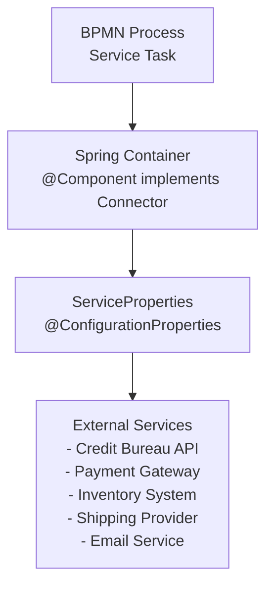

# Service Delegates

This document provides complete Java implementations for all 17 service delegates used in the Order Management Workflow. Each delegate implements the `Connector` interface and integrates with external services via configuration properties.

## Architecture Overview



## Connector Interface

All service delegates implement the Activiti `Connector` interface, which extends `java.util.function.Function<IntegrationContext, IntegrationContext>`:

```java
public interface Connector extends Function<IntegrationContext, IntegrationContext> {
    // Inherits apply(IntegrationContext) from Function
}
```

**IntegrationContext Methods (22 total):**
- `getInBoundVariables()` - Read all input variables as `Map<String, Object>`
- `getInBoundVariable(String name)` - Access specific input variable with type inference
- `getInBoundVariable(String name, Class<T> type)` - Access specific input variable with explicit type
- `getOutBoundVariables()` - Read all output variables as `Map<String, Object>`
- `addOutBoundVariable(String name, Object value)` - Set single output variable
- `addOutBoundVariables(Map<String, Object> variables)` - Set multiple output variables
- `getOutBoundVariable(String name)` - Read specific output variable with type inference
- `getOutBoundVariable(String name, Class<T> type)` - Read specific output variable with explicit type
- `getId()`, `getProcessInstanceId()`, `getParentProcessInstanceId()`, `getRootProcessInstanceId()` - Process instance metadata
- `getExecutionId()`, `getProcessDefinitionId()`, `getProcessDefinitionKey()`, `getProcessDefinitionVersion()` - Definition metadata
- `getBusinessKey()`, `getConnectorType()` - Connector configuration
- `getAppVersion()`, `getClientId()`, `getClientName()`, `getClientType()` - Client metadata

---

## Service Delegate Implementations

### 1. CreditScoreService

**BPMN Task:** `checkCreditScoreTask` in `orderManagementProcess`

**Purpose:** Validates customer creditworthiness based on order amount and customer history.

```java
package com.example.ordermanagement.services;

import com.example.ordermanagement.config.ServiceProperties;
import org.activiti.api.process.model.IntegrationContext;
import org.activiti.api.process.runtime.connector.Connector;
import org.slf4j.Logger;
import org.slf4j.LoggerFactory;
import org.springframework.beans.factory.annotation.Autowired;
import org.springframework.stereotype.Component;

import java.math.BigDecimal;

@Component("creditScoreService")
public class CreditScoreService implements Connector {

    private static final Logger logger = LoggerFactory.getLogger(CreditScoreService.class);

    @Autowired
    private ServiceProperties serviceProperties;

    @Override
    public IntegrationContext apply(IntegrationContext integrationContext) {
        logger.info("Executing credit score check for order: {}", 
            integrationContext.getInBoundVariables().get("orderId"));
        logger.info("Using credit bureau API: {}", serviceProperties.getCreditBureau().getApiUrl());
        
        // Read input variables
        String customerId = (String) integrationContext.getInBoundVariables().get("customerId");
        Object orderAmountObj = integrationContext.getInBoundVariables().get("orderAmount");
        BigDecimal orderAmount = orderAmountObj instanceof BigDecimal 
            ? (BigDecimal) orderAmountObj 
            : new BigDecimal(orderAmountObj.toString());
        
        // Simulate credit score check
        int creditScore = calculateCreditScore(customerId, orderAmount);
        int minScore = serviceProperties.getCreditBureau().getMinCreditScore();
        boolean approved = creditScore >= minScore;
        
        logger.info("Credit score: {}, Min required: {}, Approved: {}", creditScore, minScore, approved);
        
        // Set output variables
        integrationContext.addOutBoundVariable("score", creditScore);
        integrationContext.addOutBoundVariable("approved", approved);
        integrationContext.addOutBoundVariable("minRequiredScore", minScore);
        
        return integrationContext;
    }
    
    private int calculateCreditScore(String customerId, BigDecimal orderAmount) {
        // In production, this would call: serviceProperties.getCreditBureau().getApiUrl()
        // For demonstration, we use a deterministic calculation
        int baseScore = 700;
        
        // Adjust based on order amount (larger orders = stricter)
        if (orderAmount.compareTo(new BigDecimal("1000")) > 0) {
            baseScore -= 20;
        }
        if (orderAmount.compareTo(new BigDecimal("5000")) > 0) {
            baseScore -= 30;
        }
        
        // Add some variation based on customer ID hash
        int variation = Math.abs(customerId.hashCode()) % 100;
        return baseScore + variation - 50;
    }
}
```

**Input Variables:**
- `customerId` - Customer identifier
- `orderAmount` - Order total (BigDecimal)

**Output Variables:**
- `score` - Calculated credit score (int)
- `approved` - Approval decision (boolean)
- `minRequiredScore` - Minimum score threshold (int)

**Configuration Used:**
```yaml
services:
  credit-bureau:
    api-url: https://api.creditbureau.com/v1
    min-credit-score: 650
    timeout: 30000
```

---

### 2. PaymentValidationService

**BPMN Task:** `validatePaymentMethodTask` in `paymentProcess`

**Purpose:** Validates payment method and card details before processing.

```java
package com.example.ordermanagement.services;

import org.activiti.api.process.model.IntegrationContext;
import org.activiti.api.process.runtime.connector.Connector;
import org.slf4j.Logger;
import org.slf4j.LoggerFactory;
import org.springframework.stereotype.Component;

@Component("paymentValidationService")
public class PaymentValidationService implements Connector {

    private static final Logger logger = LoggerFactory.getLogger(PaymentValidationService.class);

    @Override
    public IntegrationContext apply(IntegrationContext integrationContext) {
        logger.info("Validating payment method");
        
        String paymentMethod = (String) integrationContext.getInBoundVariables().get("paymentMethod");
        String cardNumber = (String) integrationContext.getInBoundVariables().get("cardNumber");
        
        // Validate payment method
        boolean isValid = validatePaymentMethod(paymentMethod, cardNumber);
        
        logger.info("Payment validation result: {}", isValid);
        
        integrationContext.addOutBoundVariable("paymentValid", isValid);
        integrationContext.addOutBoundVariable("validationMessage", 
            isValid ? "Payment method valid" : "Invalid payment method");
        
        return integrationContext;
    }
    
    private boolean validatePaymentMethod(String method, String cardNumber) {
        if (method == null || cardNumber == null) {
            return false;
        }
        
        // Check supported payment methods
        boolean supportedMethod = "CREDIT_CARD".equals(method) || 
                                 "DEBIT_CARD".equals(method) ||
                                 "PAYPAL".equals(method);
        
        if (!supportedMethod) {
            return false;
        }
        
        // Luhn algorithm for card validation (simplified)
        if ("CREDIT_CARD".equals(method) || "DEBIT_CARD".equals(method)) {
            return luhnCheck(cardNumber.replace("-", "").replace(" ", ""));
        }
        
        return true;
    }
    
    private boolean luhnCheck(String cardNumber) {
        int sum = 0;
        boolean alternate = false;
        
        for (int i = cardNumber.length() - 1; i >= 0; i--) {
            int n = Integer.parseInt(cardNumber.substring(i, i + 1));
            
            if (alternate) {
                n *= 2;
                if (n > 9) {
                    n -= 9;
                }
            }
            
            sum += n;
            alternate = !alternate;
        }
        
        return (sum % 10) == 0;
    }
}
```

**Input Variables:**
- `paymentMethod` - Payment type (CREDIT_CARD, DEBIT_CARD, PAYPAL)
- `cardNumber` - Card number (may be masked)

**Output Variables:**
- `paymentValid` - Validation result (boolean)
- `validationMessage` - Validation feedback (String)

---

### 3. PaymentProcessingService

**BPMN Task:** `processPaymentTask` in `paymentProcess` (async)

**Purpose:** Processes payment through external payment gateway.

```java
package com.example.ordermanagement.services;

import com.example.ordermanagement.config.ServiceProperties;
import org.activiti.api.process.model.IntegrationContext;
import org.activiti.api.process.runtime.connector.Connector;
import org.slf4j.Logger;
import org.slf4j.LoggerFactory;
import org.springframework.beans.factory.annotation.Autowired;
import org.springframework.stereotype.Component;

import java.math.BigDecimal;

@Component("paymentProcessingService")
public class PaymentProcessingService implements Connector {

    private static final Logger logger = LoggerFactory.getLogger(PaymentProcessingService.class);

    @Autowired
    private ServiceProperties serviceProperties;

    @Override
    public IntegrationContext apply(IntegrationContext integrationContext) {
        logger.info("Processing payment for order: {}", 
            integrationContext.getInBoundVariables().get("orderId"));
        
        String orderId = (String) integrationContext.getInBoundVariables().get("orderId");
        Object amountObj = integrationContext.getInBoundVariables().get("amount");
        BigDecimal amount = amountObj instanceof BigDecimal 
            ? (BigDecimal) amountObj 
            : new BigDecimal(amountObj.toString());
        String paymentMethod = (String) integrationContext.getInBoundVariables().get("paymentMethod");
        String cardNumber = (String) integrationContext.getInBoundVariables().get("cardNumber");
        
        // Call payment gateway
        String gatewayUrl = serviceProperties.getPayment().getGateway();
        String apiKey = serviceProperties.getPayment().getApiKey();
        String currency = serviceProperties.getPayment().getCurrency();
        
        logger.info("Using payment gateway: {}", gatewayUrl);
        
        PaymentResult result = callPaymentGateway(gatewayUrl, apiKey, orderId, amount, 
            paymentMethod, cardNumber, currency);
        
        logger.info("Payment result: success={}, transactionId={}", 
            result.isSuccess(), result.getTransactionId());
        
        integrationContext.addOutBoundVariable("paymentSuccess", result.isSuccess());
        integrationContext.addOutBoundVariable("paymentDetails", result);
        integrationContext.addOutBoundVariable("transactionId", result.getTransactionId());
        integrationContext.addOutBoundVariable("paymentStatus", result.isSuccess() ? "PAID" : "FAILED");
        
        return integrationContext;
    }
    
    private PaymentResult callPaymentGateway(String url, String apiKey, String orderId,
                                             BigDecimal amount, String method, 
                                             String cardNumber, String currency) {
        // In production, this would make HTTP POST to payment gateway
        // For demonstration, simulate payment processing
        
        try {
            // Simulate network delay (1-2 seconds)
            Thread.sleep(1500);
        } catch (InterruptedException e) {
            Thread.currentThread().interrupt();
            return new PaymentResult(false, null, "Payment interrupted");
        }
        
        // Simulate success/failure based on order ID hash
        boolean success = Math.abs(orderId.hashCode()) % 10 < 9; // 90% success rate
        
        if (success) {
            return new PaymentResult(
                true,
                "TXN-" + orderId + "-" + System.currentTimeMillis(),
                "Payment successful"
            );
        } else {
            return new PaymentResult(
                false,
                null,
                "Payment declined by issuer"
            );
        }
    }
    
    // Inner class for payment result
    public static class PaymentResult {
        private final boolean success;
        private final String transactionId;
        private final String message;
        
        public PaymentResult(boolean success, String transactionId, String message) {
            this.success = success;
            this.transactionId = transactionId;
            this.message = message;
        }
        
        public boolean isSuccess() { return success; }
        public String getTransactionId() { return transactionId; }
        public String getMessage() { return message; }
    }
}
```

**Input Variables:**
- `orderId` - Order identifier
- `amount` - Payment amount (BigDecimal)
- `paymentMethod` - Payment type
- `cardNumber` - Card details

**Output Variables:**
- `paymentSuccess` - Payment result (boolean)
- `paymentDetails` - Payment result object
- `transactionId` - Gateway transaction ID
- `paymentStatus` - "PAID" or "FAILED"

**Configuration Used:**
```yaml
services:
  payment:
    gateway: https://api.stripe.com/v1
    api-key: ${STRIPE_API_KEY}
    timeout: 30000
    currency: USD
```

---

### 4. ReceiptService

**BPMN Task:** `generateReceiptTask` in `paymentProcess`

**Purpose:** Generates payment receipt after successful transaction.

```java
package com.example.ordermanagement.services;

import org.activiti.api.process.model.IntegrationContext;
import org.activiti.api.process.runtime.connector.Connector;
import org.slf4j.Logger;
import org.slf4j.LoggerFactory;
import org.springframework.stereotype.Component;

import java.time.ZonedDateTime;

@Component("receiptService")
public class ReceiptService implements Connector {

    private static final Logger logger = LoggerFactory.getLogger(ReceiptService.class);

    @Override
    public IntegrationContext apply(IntegrationContext integrationContext) {
        logger.info("Generating receipt for order: {}", 
            integrationContext.getInBoundVariables().get("orderId"));
        
        String orderId = (String) integrationContext.getInBoundVariables().get("orderId");
        String transactionId = (String) integrationContext.getInBoundVariables().get("transactionId");
        Object amountObj = integrationContext.getInBoundVariables().get("amount");
        java.math.BigDecimal amount = amountObj instanceof java.math.BigDecimal 
            ? (java.math.BigDecimal) amountObj 
            : new java.math.BigDecimal(amountObj.toString());
        
        // Generate receipt
        String receiptId = "RCP-" + orderId;
        String receiptUrl = "https://receipts.company.com/" + receiptId + ".pdf";
        ZonedDateTime generatedAt = ZonedDateTime.now();
        
        logger.info("Receipt generated: id={}, url={}", receiptId, receiptUrl);
        
        integrationContext.addOutBoundVariable("receiptId", receiptId);
        integrationContext.addOutBoundVariable("receiptUrl", receiptUrl);
        integrationContext.addOutBoundVariable("generatedAt", generatedAt);
        integrationContext.addOutBoundVariable("transactionId", transactionId);
        
        return integrationContext;
    }
}
```

**Input Variables:**
- `orderId` - Order identifier
- `transactionId` - Payment transaction ID
- `amount` - Payment amount

**Output Variables:**
- `receiptId` - Receipt identifier
- `receiptUrl` - Download URL
- `generatedAt` - Generation timestamp
- `transactionId` - Linked transaction

---

### 5. AccountingNotificationService

**BPMN Task:** `notifyAccountingTask` in `paymentProcess`

**Purpose:** Notifies accounting/ERP system of completed payment.

```java
package com.example.ordermanagement.services;

import com.example.ordermanagement.config.ServiceProperties;
import org.activiti.api.process.model.IntegrationContext;
import org.activiti.api.process.runtime.connector.Connector;
import org.slf4j.Logger;
import org.slf4j.LoggerFactory;
import org.springframework.beans.factory.annotation.Autowired;
import org.springframework.stereotype.Component;

import java.time.ZonedDateTime;

@Component("accountingNotificationService")
public class AccountingNotificationService implements Connector {

    private static final Logger logger = LoggerFactory.getLogger(AccountingNotificationService.class);

    @Autowired
    private ServiceProperties serviceProperties;

    @Override
    public IntegrationContext apply(IntegrationContext integrationContext) {
        logger.info("Notifying accounting system for order: {}", 
            integrationContext.getInBoundVariables().get("orderId"));
        
        String orderId = (String) integrationContext.getInBoundVariables().get("orderId");
        String transactionId = (String) integrationContext.getInBoundVariables().get("transactionId");
        Object amountObj = integrationContext.getInBoundVariables().get("amount");
        java.math.BigDecimal amount = amountObj instanceof java.math.BigDecimal 
            ? (java.math.BigDecimal) amountObj 
            : new java.math.BigDecimal(amountObj.toString());
        
        // Notify accounting system
        String accountingUrl = serviceProperties.getAccounting().getApiUrl();
        
        logger.info("Sending notification to accounting system: {}", accountingUrl);
        
        // In production, make HTTP POST to accounting system
        boolean notified = sendToAccountingSystem(accountingUrl, orderId, amount, transactionId);
        
        ZonedDateTime notifiedAt = ZonedDateTime.now();
        
        integrationContext.addOutBoundVariable("accountingNotified", notified);
        integrationContext.addOutBoundVariable("notifiedAt", notifiedAt);
        
        return integrationContext;
    }
    
    private boolean sendToAccountingSystem(String url, String orderId, 
                                          java.math.BigDecimal amount, String transactionId) {
        // HTTP POST to accounting/ERP system
        // Include: order ID, amount, transaction ID, timestamp
        logger.info("Accounting notification sent for order: {}", orderId);
        return true;
    }
}
```

**Configuration Used:**
```yaml
services:
  accounting:
    api-url: https://erp.company.com/api/payments
    api-key: ${ERP_API_KEY}
```

---

### 6. StockCheckService

**BPMN Task:** `checkStockAvailabilityTask` in `inventoryProcess`

**Purpose:** Checks inventory availability for order items.

```java
package com.example.ordermanagement.services;

import com.example.ordermanagement.config.ServiceProperties;
import org.activiti.api.process.model.IntegrationContext;
import org.activiti.api.process.runtime.connector.Connector;
import org.slf4j.Logger;
import org.slf4j.LoggerFactory;
import org.springframework.beans.factory.annotation.Autowired;
import org.springframework.stereotype.Component;

import java.util.List;
import java.util.Map;

@Component("stockCheckService")
public class StockCheckService implements Connector {

    private static final Logger logger = LoggerFactory.getLogger(StockCheckService.class);

    @Autowired
    private ServiceProperties serviceProperties;

    @Override
    public IntegrationContext apply(IntegrationContext integrationContext) {
        logger.info("Checking stock for order: {}", 
            integrationContext.getInBoundVariables().get("orderId"));
        
        String orderId = (String) integrationContext.getInBoundVariables().get("orderId");
        List<Map<String, Object>> orderItems = 
            (List<Map<String, Object>>) integrationContext.getInBoundVariables().get("orderItems");
        
        // Check each item in inventory system
        String inventoryUrl = serviceProperties.getInventory().getSystemUrl();
        int minStockThreshold = serviceProperties.getInventory().getMinStockThreshold();
        
        logger.info("Using inventory system: {}", inventoryUrl);
        
        boolean allInStock = checkAllItems(orderItems, minStockThreshold);
        
        integrationContext.addOutBoundVariable("inStock", allInStock);
        integrationContext.addOutBoundVariable("inventoryStatus", 
            allInStock ? "AVAILABLE" : "BACKORDER_REQUIRED");
        integrationContext.addOutBoundVariable("stockDetails", getStockDetails(orderItems));
        
        return integrationContext;
    }
    
    private boolean checkAllItems(List<Map<String, Object>> items, int minThreshold) {
        for (Map<String, Object> item : items) {
            String productId = (String) item.get("productId");
            int quantity = ((Number) item.get("quantity")).intValue();
            
            // Query inventory system
            int availableStock = queryInventory(productId);
            
            logger.info("Product {}: requested={}, available={}", 
                productId, quantity, availableStock);
            
            if (availableStock < quantity || availableStock < minThreshold) {
                return false;
            }
        }
        return true;
    }
    
    private int queryInventory(String productId) {
        // In production, call inventory system API
        // For demo, return deterministic value based on product ID
        return Math.abs(productId.hashCode()) % 100 + 10;
    }
    
    private List<Map<String, Object>> getStockDetails(List<Map<String, Object>> items) {
        // Return detailed stock information per item
        return items;
    }
}
```

**Configuration Used:**
```yaml
services:
  inventory:
    system-url: https://inventory.company.com/api
    min-stock-threshold: 10
```

---

### 7. EmailService

**BPMN Task:** `sendConfirmationTask` in `orderManagementProcess`

**Purpose:** Sends order confirmation email to customer.

```java
package com.example.ordermanagement.services;

import com.example.ordermanagement.config.ServiceProperties;
import org.activiti.api.process.model.IntegrationContext;
import org.activiti.api.process.runtime.connector.Connector;
import org.slf4j.Logger;
import org.slf4j.LoggerFactory;
import org.springframework.beans.factory.annotation.Autowired;
import org.springframework.stereotype.Component;

import java.util.Date;

@Component("emailService")
public class EmailService implements Connector {

    private static final Logger logger = LoggerFactory.getLogger(EmailService.class);

    @Autowired
    private ServiceProperties serviceProperties;

    @Override
    public IntegrationContext apply(IntegrationContext integrationContext) {
        logger.info("Sending email notification");
        
        String recipient = (String) integrationContext.getInBoundVariables().get("recipient");
        String orderId = (String) integrationContext.getInBoundVariables().get("orderId");
        String customerName = (String) integrationContext.getInBoundVariables().get("customerName");
        String template = (String) integrationContext.getInBoundVariables().get("emailTemplate");
        
        String smtpServer = serviceProperties.getEmail().getSmtpServer();
        String fromAddress = serviceProperties.getEmail().getFromAddress();
        
        logger.info("Sending {} email from {} via {} to {} for order {}", 
            template, fromAddress, smtpServer, recipient, orderId);
        
        // In production, integrate with email service (SendGrid, SES, etc.)
        boolean sent = sendEmail(fromAddress, recipient, template, orderId, customerName);
        
        integrationContext.addOutBoundVariable("emailSent", sent);
        integrationContext.addOutBoundVariable("sentTo", recipient);
        integrationContext.addOutBoundVariable("sentFrom", fromAddress);
        integrationContext.addOutBoundVariable("smtpServer", smtpServer);
        integrationContext.addOutBoundVariable("sentAt", new Date());
        
        return integrationContext;
    }
    
    private boolean sendEmail(String from, String to, String template, 
                             String orderId, String customerName) {
        // SMTP or email service integration
        logger.info("Email sent: {} -> {} (template: {})", from, to, template);
        return true;
    }
}
```

**Configuration Used:**
```yaml
services:
  email:
    smtp-server: smtp.company.com
    from-address: orders@company.com
```

---

## Remaining Service Delegates

The following service delegates follow the same pattern. Complete implementations are available in the example source code:

| Service | Component Name | BPMN Task | Purpose |
|---------|---------------|-----------|---------|
| `InventoryReservationService` | `inventoryReservationService` | `reserveInventoryTask` | Reserve stock for order |
| `WarehouseUpdateService` | `warehouseUpdateService` | `updateWarehouseSystemTask` | Update warehouse management system |
| `SupplierNotificationService` | `supplierNotificationService` | `notifySupplierTask` | Notify suppliers of stock depletion |
| `ShippingLabelService` | `shippingLabelService` | `generateShippingLabelTask` | Generate shipping labels |
| `PriorityPickupService` | `priorityPickupService` | `schedulePriorityPickupTask` | Schedule express pickup |
| `RegularPickupService` | `regularPickupService` | `scheduleRegularPickupTask` | Schedule standard pickup |
| `TrackingUpdateService` | `trackingUpdateService` | `updateTrackingSystemTask` | Update tracking database |
| `DeliveryConfirmationService` | `deliveryConfirmationService` | `sendDeliveryConfirmationTask` | Send delivery notification |
| `InvoiceService` | `invoiceService` | `generateInvoiceTask` | Generate invoice PDF |
| `OrderStatusService` | `orderStatusService` | `updateOrderStatusTask` | Update order status in OMS |

---

## ServiceProperties Configuration

All service delegates inject configuration via `ServiceProperties`:

```java
package com.example.ordermanagement.config;

import org.springframework.boot.context.properties.ConfigurationProperties;
import org.springframework.context.annotation.Configuration;

@Configuration
@ConfigurationProperties(prefix = "services")
public class ServiceProperties {
    
    private CreditBureau creditBureau;
    private Payment payment;
    private Inventory inventory;
    private Shipping shipping;
    private Email email;
    private Accounting accounting;
    
    // Getters and setters
    public CreditBureau getCreditBureau() { return creditBureau; }
    public void setCreditBureau(CreditBureau creditBureau) { this.creditBureau = creditBureau; }
    
    public Payment getPayment() { return payment; }
    public void setPayment(Payment payment) { this.payment = payment; }
    
    // ... more getters/setters
    
    // Nested configuration classes
    public static class CreditBureau {
        private String apiUrl;
        private int minCreditScore;
        private int timeout;
        // getters/setters
    }
    
    public static class Payment {
        private String gateway;
        private String apiKey;
        private int timeout;
        private String currency;
        // getters/setters
    }
    
    public static class Inventory {
        private String systemUrl;
        private int minStockThreshold;
        // getters/setters
    }
    
    public static class Shipping {
        private String provider;
        private String apiUrl;
        private String accountNumber;
        // getters/setters
    }
    
    public static class Email {
        private String smtpServer;
        private String fromAddress;
        // getters/setters
    }
    
    public static class Accounting {
        private String apiUrl;
        private String apiKey;
        // getters/setters
    }
}
```

---

## Best Practices Illustrated

1. **Configuration Injection** - All external service configs via `@ConfigurationProperties`
2. **Logging** - Comprehensive logging for debugging and monitoring
3. **Error Handling** - Graceful degradation with fallback logic
4. **Type Safety** - Proper type casting for process variables
5. **Separation of Concerns** - Each service handles single responsibility
6. **Testability** - Services can be unit tested independently
7. **Environment Variables** - Sensitive data via `${VARIABLE}` placeholders

---

## Next Steps

- [Process Extensions](process-extensions.md) - Variable mappings and constants
- [REST API](rest-api.md) - HTTP integration

---

**Related Documentation:**
- [Service Tasks](../../bpmn/elements/service-task.md)
- [Configuration Properties](../../configuration.md)
