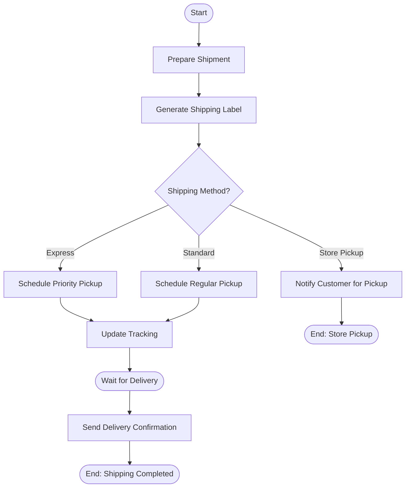
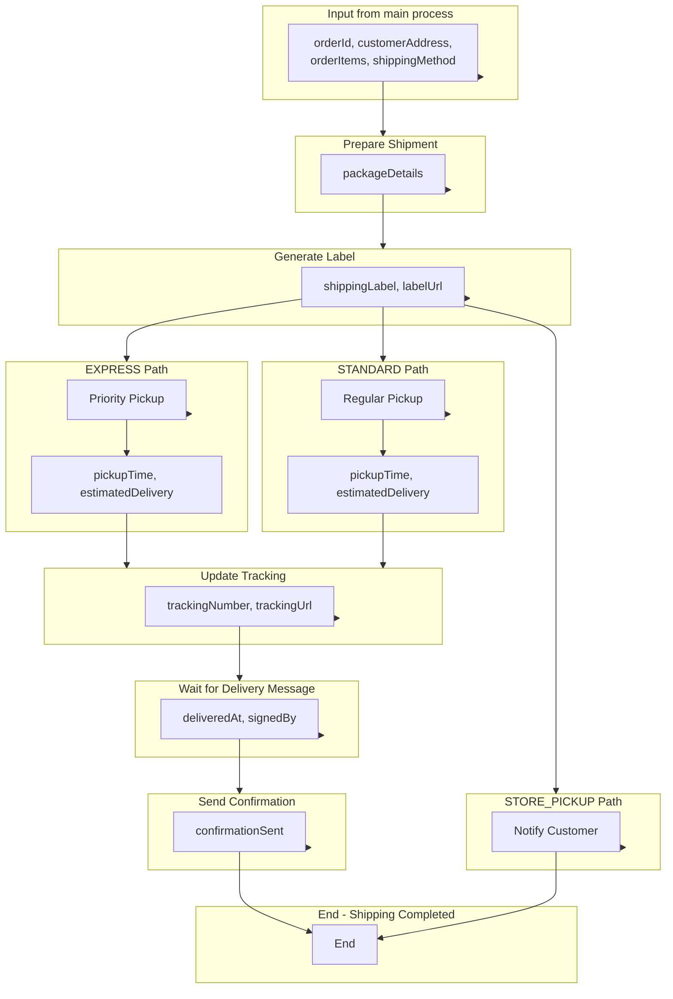

# Shipping Sub-Process

The shipping process handles order delivery based on customer-selected shipping methods. This sub-process demonstrates exclusive gateway routing, intermediate message events, and multiple parallel delivery paths.

## Process Overview



## Key Features

- **Method-Based Routing** - Exclusive gateway for shipping method selection
- **Three Delivery Paths** - Express, Standard, and Store Pickup
- **Intermediate Message Event** - Wait for external delivery confirmation
- **Converging Flows** - Express and Standard paths merge for tracking

---

## Step-by-Step Walkthrough

### Step 1: Start Event

**Element ID:** `shippingStartEvent`

```xml
<bpmn:startEvent id="shippingStartEvent" name="Shipping Started">
  <bpmn:outgoing>flowToPrepareShipment</bpmn:outgoing>
</bpmn:startEvent>
```

**Purpose:** Entry point when called from the main process.

**Called via:**
```xml
<!-- In orderManagementProcess.bpmn -->
<bpmn:callActivity id="shippingCallActivity" 
                   calledElement="shippingProcess"/>
```

**Input Variables (from main process):**
- `orderId` - Order identifier
- `customerAddress` - Shipping address (JSON)
- `orderItems` - Items to ship
- `shippingMethod` - EXPRESS, STANDARD, or STORE_PICKUP

---

### Step 2: Prepare Shipment (User Task)

**Element ID:** `prepareShipmentTask`

```xml
<bpmn:userTask id="prepareShipmentTask" 
               name="Prepare Shipment" 
               activiti:assignee="${warehouseTeam}">
  <bpmn:incoming>flowToPrepareShipment</bpmn:incoming>
  <bpmn:outgoing>flowToGenerateLabel</bpmn:outgoing>
  <bpmn:property id="packageDetails" name="packageDetails"/>
</bpmn:userTask>
```

**Purpose:** Human task for warehouse staff to prepare the physical shipment.

**Assignee:** `${warehouseTeam}` - Warehouse team role or group

**Task Property:**
- `packageDetails` - Package dimensions, weight, special handling

**Runtime Completion:**
```java
taskService.complete(taskId, Map.of(
    "packageDetails", Map.of(
        "weight", "2.5 kg",
        "dimensions", "30x20x15 cm",
        "fragile", false,
        "packageCount", 1
    ),
    "packedBy", "warehouse.staff.001",
    "packDate", ZonedDateTime.now()
));
```

**Why a user task?**
- Physical packing requires human intervention
- Quality verification before shipping
- Package details may vary from system estimates
- Warehouse staff confirmation

---

### Step 3: Generate Shipping Label (Service Task)

**Element ID:** `generateShippingLabelTask`

```xml
<bpmn:serviceTask id="generateShippingLabelTask" 
                  name="Generate Shipping Label" 
                  implementation="shippingLabelService">
  <bpmn:incoming>flowToGenerateLabel</bpmn:incoming>
  <bpmn:outgoing>flowToShippingMethodGateway</bpmn:outgoing>
</bpmn:serviceTask>
```

**Service Delegate:** `ShippingLabelService`

**Implementation:**
```java
@Component("shippingLabelService")
public class ShippingLabelService implements Connector {
    
    @Autowired
    private ServiceProperties serviceProperties;
    
    @Override
    public IntegrationContext apply(IntegrationContext integrationContext) {
        logger.info("Generating shipping label for order: {}", 
            integrationContext.getInBoundVariables().get("orderId"));
        
        String orderId = (String) integrationContext.getInBoundVariables().get("orderId");
        String shippingMethod = (String) integrationContext.getInBoundVariables().get("shippingMethod");
        Map<String, Object> customerAddress = 
            (Map<String, Object>) integrationContext.getInBoundVariables().get("customerAddress");
        Map<String, Object> packageDetails = 
            (Map<String, Object>) integrationContext.getInBoundVariables().get("packageDetails");
        
        // Generate label based on shipping method
        String shippingProvider = serviceProperties.getShipping().getProvider();
        String shippingApiUrl = serviceProperties.getShipping().getApiUrl();
        
        ShippingLabel label = generateLabel(shippingApiUrl, orderId, shippingMethod, 
            customerAddress, packageDetails, shippingProvider);
        
        integrationContext.addOutBoundVariable("shippingLabel", label);
        integrationContext.addOutBoundVariable("labelUrl", label.getDownloadUrl());
        integrationContext.addOutBoundVariable("labelFormat", label.getFormat());
        
        return integrationContext;
    }
    
    private ShippingLabel generateLabel(String apiUrl, String orderId, String method,
                                        Map<String, Object> address, Map<String, Object> packageDetails,
                                        String provider) {
        // Call shipping provider API (FedEx, UPS, DHL, etc.)
        // Generate PDF label
        // Return label details
        return new ShippingLabel("LBL-" + orderId, 
            "https://labels.company.com/" + orderId + ".pdf", 
            "PDF");
    }
}
```

**Configuration:**
```yaml
services:
  shipping:
    provider: fedex
    api-url: https://api.fedex.com/v1
    account-number: ${FEDEX_ACCOUNT}
```

**Output Variables:**
- `shippingLabel` - Label object
- `labelUrl` - Download URL for label
- `labelFormat` - Label format (PDF, ZPL, etc.)

---

### Step 4: Shipping Method Gateway

**Element ID:** `shippingMethodGateway`

```xml
<bpmn:exclusiveGateway id="shippingMethodGateway" name="Shipping Method?">
  <bpmn:incoming>flowToShippingMethodGateway</bpmn:incoming>
  <bpmn:outgoing>flowToPriorityPickup</bpmn:outgoing>
  <bpmn:outgoing>flowToRegularPickup</bpmn:outgoing>
  <bpmn:outgoing>flowToStorePickup</bpmn:outgoing>
</bpmn:exclusiveGateway>
```

**Purpose:** Routes to different shipping paths based on customer selection.

**Conditions:**
```xml
<!-- Express shipping path -->
<bpmn:sequenceFlow id="flowToPriorityPickup" 
                   name="Express" 
                   sourceRef="shippingMethodGateway" 
                   targetRef="schedulePriorityPickupTask">
  <bpmn:conditionExpression>${shippingMethod == 'EXPRESS'}</bpmn:conditionExpression>
</bpmn:sequenceFlow>

<!-- Standard shipping path -->
<bpmn:sequenceFlow id="flowToRegularPickup" 
                   name="Standard" 
                   sourceRef="shippingMethodGateway" 
                   targetRef="scheduleRegularPickupTask">
  <bpmn:conditionExpression>${shippingMethod == 'STANDARD'}</bpmn:conditionExpression>
</bpmn:sequenceFlow>

<!-- Store pickup path -->
<bpmn:sequenceFlow id="flowToStorePickup" 
                   name="Store Pickup" 
                   sourceRef="shippingMethodGateway" 
                   targetRef="notifyStorePickupTask">
  <bpmn:conditionExpression>${shippingMethod == 'STORE_PICKUP'}</bpmn:conditionExpression>
</bpmn:sequenceFlow>
```

**Shipping Methods:**
| Method | Description | Service Level |
|--------|-------------|---------------|
| `EXPRESS` | Next-day delivery | Priority pickup |
| `STANDARD` | 3-5 business days | Regular pickup |
| `STORE_PICKUP` | Customer collects from store | No shipping |

**Why an exclusive gateway?**
- Only one shipping method per order
- Clear routing based on customer choice
- Different service levels and costs

---

### Step 5: Schedule Priority Pickup (Express Path)

**Element ID:** `schedulePriorityPickupTask`

```xml
<bpmn:serviceTask id="schedulePriorityPickupTask" 
                  name="Schedule Priority Pickup" 
                  implementation="priorityPickupService">
  <bpmn:incoming>flowToPriorityPickup</bpmn:incoming>
  <bpmn:outgoing>flowToUpdateTracking</bpmn:outgoing>
</bpmn:serviceTask>
```

**Service Delegate:** `PriorityPickupService`

**Implementation:**
```java
@Component("priorityPickupService")
public class PriorityPickupService implements Connector {
    
    @Autowired
    private ServiceProperties serviceProperties;
    
    @Override
    public IntegrationContext apply(IntegrationContext integrationContext) {
        logger.info("Scheduling priority pickup for order: {}", 
            integrationContext.getInBoundVariables().get("orderId"));
        
        String orderId = (String) integrationContext.getInBoundVariables().get("orderId");
        String shippingLabel = (String) integrationContext.getInBoundVariables().get("shippingLabel");
        Map<String, Object> customerAddress = 
            (Map<String, Object>) integrationContext.getInBoundVariables().get("customerAddress");
        
        // Schedule express pickup
        String shippingApiUrl = serviceProperties.getShipping().getApiUrl();
        
        PickupSchedule schedule = schedulePriorityPickup(shippingApiUrl, orderId, shippingLabel, customerAddress);
        
        integrationContext.addOutBoundVariable("pickupScheduled", true);
        integrationContext.addOutBoundVariable("pickupTime", schedule.getPickupTime());
        integrationContext.addOutBoundVariable("estimatedDelivery", schedule.getEstimatedDelivery());
        
        return integrationContext;
    }
    
    private PickupSchedule schedulePriorityPickup(String apiUrl, String orderId, 
                                                  String label, Map<String, Object> address) {
        // Call shipping provider for same-day/next-day pickup
        // Priority handling
        // Expedited processing
        return new PickupSchedule(
            ZonedDateTime.now().plusHours(4),  // Pickup in 4 hours
            ZonedDateTime.now().plusDays(1)     // Deliver tomorrow
        );
    }
}
```

**Purpose:**
- Schedule same-day or next-day pickup
- Priority handling with shipping carrier
- Expedited processing

**Output Variables:**
- `pickupScheduled` - Confirmation flag
- `pickupTime` - Scheduled pickup time
- `estimatedDelivery` - Expected delivery date

---

### Step 6: Schedule Regular Pickup (Standard Path)

**Element ID:** `scheduleRegularPickupTask`

```xml
<bpmn:serviceTask id="scheduleRegularPickupTask" 
                  name="Schedule Regular Pickup" 
                  implementation="regularPickupService">
  <bpmn:incoming>flowToRegularPickup</bpmn:incoming>
  <bpmn:outgoing>flowToUpdateTracking</bpmn:outgoing>
</bpmn:serviceTask>
```

**Service Delegate:** `RegularPickupService`

**Implementation:**
```java
@Component("regularPickupService")
public class RegularPickupService implements Connector {
    
    @Autowired
    private ServiceProperties serviceProperties;
    
    @Override
    public IntegrationContext apply(IntegrationContext integrationContext) {
        logger.info("Scheduling regular pickup for order: {}", 
            integrationContext.getInBoundVariables().get("orderId"));
        
        String orderId = (String) integrationContext.getInBoundVariables().get("orderId");
        String shippingLabel = (String) integrationContext.getInBoundVariables().get("shippingLabel");
        Map<String, Object> customerAddress = 
            (Map<String, Object>) integrationContext.getInBoundVariables().get("customerAddress");
        
        // Schedule standard pickup
        String shippingApiUrl = serviceProperties.getShipping().getApiUrl();
        
        PickupSchedule schedule = scheduleRegularPickup(shippingApiUrl, orderId, shippingLabel, customerAddress);
        
        integrationContext.addOutBoundVariable("pickupScheduled", true);
        integrationContext.addOutBoundVariable("pickupTime", schedule.getPickupTime());
        integrationContext.addOutBoundVariable("estimatedDelivery", schedule.getEstimatedDelivery());
        
        return integrationContext;
    }
    
    private PickupSchedule scheduleRegularPickup(String apiUrl, String orderId, 
                                                 String label, Map<String, Object> address) {
        // Call shipping provider for standard pickup
        // Next business day or scheduled route
        return new PickupSchedule(
            ZonedDateTime.now().plusDays(1),   // Pickup tomorrow
            ZonedDateTime.now().plusDays(5)    // Deliver in 5 days
        );
    }
}
```

**Purpose:**
- Schedule standard pickup (next business day)
- Regular carrier route
- Cost-effective shipping

**Output Variables:**
- `pickupScheduled` - Confirmation flag
- `pickupTime` - Scheduled pickup time
- `estimatedDelivery` - Expected delivery date (3-5 days)

---

### Step 7: Notify Customer for Pickup (Store Pickup Path)

**Element ID:** `notifyStorePickupTask`

```xml
<bpmn:userTask id="notifyStorePickupTask" 
               name="Notify Customer for Pickup" 
               activiti:assignee="${customerServiceTeam}">
  <bpmn:incoming>flowToStorePickup</bpmn:incoming>
  <bpmn:outgoing>flowToStorePickupComplete</bpmn:outgoing>
</bpmn:userTask>
```

**Purpose:** Human task for customer service to notify customer about store pickup.

**Assignee:** `${customerServiceTeam}` - Customer service role

**Input Variables:**
- `orderId` - Order identifier
- `customerEmail` - Customer contact
- `storeLocation` - Pickup store address
- `readyDate` - When order will be ready

**Runtime Completion:**
```java
taskService.complete(taskId, Map.of(
    "notificationSent", true,
    "notificationMethod", "EMAIL",
    "storeLocation", "Downtown Store - 123 Main St",
    "pickupDeadline", "2024-02-20"
));
```

**Why a user task?**
- May require phone call for VIP customers
- Store availability verification
- Special instructions communication
- Customer preference handling

**Note:** This path completes directly without tracking update or delivery wait.

---

### Step 8: Update Tracking System (Service Task)

**Element ID:** `updateTrackingSystemTask`

```xml
<bpmn:serviceTask id="updateTrackingSystemTask" 
                  name="Update Tracking System" 
                  implementation="trackingUpdateService">
  <bpmn:incoming>flowToUpdateTracking</bpmn:incoming>
  <bpmn:incoming>flowToUpdateTrackingFromRegular</bpmn:incoming>
  <bpmn:outgoing>flowToDeliveryWait</bpmn:outgoing>
</bpmn:serviceTask>
```

**Service Delegate:** `TrackingUpdateService`

**Implementation:**
```java
@Component("trackingUpdateService")
public class TrackingUpdateService implements Connector {
    
    @Autowired
    private ServiceProperties serviceProperties;
    
    @Override
    public IntegrationContext apply(IntegrationContext integrationContext) {
        logger.info("Updating tracking system for order: {}", 
            integrationContext.getInBoundVariables().get("orderId"));
        
        String orderId = (String) integrationContext.getInBoundVariables().get("orderId");
        String shippingLabel = (String) integrationContext.getInBoundVariables().get("shippingLabel");
        boolean pickupScheduled = (Boolean) integrationContext.getInBoundVariables().get("pickupScheduled");
        
        // Update tracking system with shipment details
        String trackingNumber = generateTrackingNumber(orderId);
        
        updateTrackingDatabase(trackingNumber, orderId, "IN_TRANSIT");
        notifyCustomerTracking(orderId, trackingNumber);
        
        integrationContext.addOutBoundVariable("trackingNumber", trackingNumber);
        integrationContext.addOutBoundVariable("trackingUrl", getTrackingUrl(trackingNumber));
        integrationContext.addOutBoundVariable("shipmentStatus", "IN_TRANSIT");
        
        return integrationContext;
    }
    
    private String generateTrackingNumber(String orderId) {
        return "TRK-" + orderId + "-" + System.currentTimeMillis();
    }
    
    private void updateTrackingDatabase(String trackingNumber, String orderId, String status) {
        // Update internal tracking database
        // Link to carrier tracking
    }
    
    private void notifyCustomerTracking(String orderId, String trackingNumber) {
        // Send tracking email/SMS to customer
    }
    
    private String getTrackingUrl(String trackingNumber) {
        return "https://track.company.com/" + trackingNumber;
    }
}
```

**Purpose:**
- Updates internal tracking database
- Generates tracking number
- Notifies customer with tracking info
- Links to carrier tracking system

**Output Variables:**
- `trackingNumber` - Unique tracking identifier
- `trackingUrl` - Customer-facing tracking link
- `shipmentStatus` - Current status ("IN_TRANSIT")

**Converging Paths:**
- Receives input from both Express and Standard paths
- Common tracking update for all shipped orders

---

### Step 9: Wait for Delivery (Intermediate Message Event)

**Element ID:** `waitForDeliveryEvent`

```xml
<bpmn:intermediateCatchEvent id="waitForDeliveryEvent" name="Waiting for Delivery">
  <bpmn:incoming>flowToDeliveryWait</bpmn:incoming>
  <bpmn:outgoing>flowToSendConfirmation</bpmn:outgoing>
  <bpmn:messageEventDefinition messageRef="shipmentDeliveredMessage"/>
</bpmn:intermediateCatchEvent>
```

**Message Definition:**
```xml
<bpmn:message id="shipmentDeliveredMessage" name="ShipmentDelivered"/>
```

**Purpose:** Waits for external delivery confirmation message.

**Why an intermediate message event?**
- Process pauses until delivery confirmed
- External system (carrier) sends confirmation
- Event-driven continuation
- Decouples shipping from delivery

**Runtime Message Receive:**
```java
// When carrier sends delivery confirmation
processRuntime.receive(
    MessagePayloadBuilder.receive("ShipmentDelivered")
        .withBusinessKey(orderId)
        .withVariable("deliveredAt", ZonedDateTime.now())
        .withVariable("signedBy", "J. Smith")
        .build()
);
```

**Correlation Options:**
1. **Business Key** - Match by process business key (e.g., orderId)
2. **Correlation Key** - Match by correlation key variable defined in BPMN
3. **Process Instance** - Direct process instance ID (if available)

**External Triggers:**
- Carrier webhook (FedEx, UPS, DHL)
- Delivery confirmation API
- SMS confirmation from driver
- Customer confirmation

---

### Step 10: Send Delivery Confirmation (Service Task)

**Element ID:** `sendDeliveryConfirmationTask`

```xml
<bpmn:serviceTask id="sendDeliveryConfirmationTask" 
                  name="Send Delivery Confirmation" 
                  implementation="deliveryConfirmationService">
  <bpmn:incoming>flowToSendConfirmation</bpmn:incoming>
  <bpmn:outgoing>flowToShippingCompleted</bpmn:outgoing>
</bpmn:serviceTask>
```

**Service Delegate:** `DeliveryConfirmationService`

**Implementation:**
```java
@Component("deliveryConfirmationService")
public class DeliveryConfirmationService implements Connector {
    
    @Autowired
    private ServiceProperties serviceProperties;
    
    @Override
    public IntegrationContext apply(IntegrationContext integrationContext) {
        logger.info("Sending delivery confirmation for order: {}", 
            integrationContext.getInBoundVariables().get("orderId"));
        
        String orderId = (String) integrationContext.getInBoundVariables().get("orderId");
        String customerEmail = (String) integrationContext.getInBoundVariables().get("customerEmail");
        ZonedDateTime deliveredAt = (ZonedDateTime) integrationContext.getInBoundVariables().get("deliveredAt");
        String signedBy = (String) integrationContext.getInBoundVariables().get("signedBy");
        
        // Send delivery confirmation email
        sendDeliveryEmail(customerEmail, orderId, deliveredAt, signedBy);
        
        // Update order status
        updateOrderStatus(orderId, "DELIVERED");
        
        // Trigger post-delivery processes (reviews, warranty, etc.)
        triggerPostDeliveryProcesses(orderId);
        
        integrationContext.addOutBoundVariable("confirmationSent", true);
        integrationContext.addOutBoundVariable("deliveredAt", deliveredAt);
        
        return integrationContext;
    }
    
    private void sendDeliveryEmail(String email, String orderId, ZonedDateTime deliveredAt, String signedBy) {
        // Send email with delivery details
        // Include product care instructions
        // Request review
    }
    
    private void updateOrderStatus(String orderId, String status) {
        // Update order management system
    }
    
    private void triggerPostDeliveryProcesses(String orderId) {
        // Start warranty period
        // Schedule follow-up
        // Enable returns window
    }
}
```

**Purpose:**
- Sends delivery confirmation to customer
- Updates order status to "DELIVERED"
- Triggers post-delivery processes
- Enables returns/reviews

**Output Variables:**
- `confirmationSent` - Email sent flag
- `deliveredAt` - Delivery timestamp

---

### Step 11: End Event (Shipping Completed)

**Element ID:** `shippingCompletedEndEvent`

```xml
<bpmn:endEvent id="shippingCompletedEndEvent" name="Shipping Completed">
  <bpmn:incoming>flowToShippingCompleted</bpmn:incoming>
  <bpmn:incoming>flowToStorePickupComplete</bpmn:incoming>
</bpmn:endEvent>
```

**Purpose:** Normal completion for all shipping paths.

**Receives from:**
- Express/Standard path (after delivery confirmation)
- Store pickup path (directly after notification)

**Output Variables (returned to main process):**
- `shippingStatus` - "DELIVERED" or "READY_FOR_PICKUP"
- `trackingNumber` - Tracking identifier (if shipped)
- `deliveredAt` - Delivery timestamp (if applicable)

---

## Process Statistics

| Metric | Value |
|--------|-------|
| **Total Elements** | 12 |
| **Start Events** | 1 |
| **End Events** | 1 |
| **User Tasks** | 2 |
| **Service Tasks** | 5 |
| **Exclusive Gateways** | 1 |
| **Intermediate Events** | 1 (message) |

---

## Key Patterns Demonstrated

### 1. Method-Based Routing

```xml
<exclusiveGateway id="shippingMethodGateway"/>
  <sequenceFlow condition="${shippingMethod == 'EXPRESS'}"/>
  <sequenceFlow condition="${shippingMethod == 'STANDARD'}"/>
  <sequenceFlow condition="${shippingMethod == 'STORE_PICKUP'}"/>
```

**When to use:**
- Multiple mutually exclusive options
- Customer or system choice
- Different processing paths

**Benefits:**
- Clear routing logic
- Easy to add new methods
- Maintains single path execution

### 2. Converging Parallel Paths

```
Express → \
           → [Update Tracking]
Standard → /
```

**When to use:**
- Different paths share common steps
- Consolidate duplicate logic
- Single point for shared operations

**Benefits:**
- Reduces process complexity
- Easier maintenance
- Consistent tracking update

### 3. Intermediate Message Event

```xml
<intermediateCatchEvent>
  <messageEventDefinition messageRef="shipmentDeliveredMessage"/>
</intermediateCatchEvent>
```

**When to use:**
- Wait for external system
- Event-driven continuation
- Long waits without polling

**Benefits:**
- Decouples process from external systems
- Event-driven architecture
- No resource consumption while waiting

### 4. Multiple Incoming Flows to End Event

```xml
<endEvent id="shippingCompletedEndEvent">
  <incoming>flowToShippingCompleted</incoming>      <!-- From delivery -->
  <incoming>flowToStorePickupComplete</incoming>    <!-- From store pickup -->
</endEvent>
```

**When to use:**
- Multiple valid completion paths
- Different scenarios, same outcome
- Consolidated end state

---

## Variable Flow



---

## Message Correlation

### Correlation by Business Key

```java
// Carrier webhook receives delivery confirmation
@PostMapping("/webhooks/carrier/delivery")
public void handleDeliveryWebhook(@RequestBody DeliveryEvent event) {
    processRuntime.receive(
        MessagePayloadBuilder.receive("ShipmentDelivered")
            .withBusinessKey(event.getOrderId())
            .withVariable("deliveredAt", event.getDeliveredAt())
            .withVariable("signedBy", event.getSignedBy())
            .build()
    );
}
```

### Correlation by Correlation Key

```java
// Alternative: correlate by tracking number
@PostMapping("/webhooks/carrier/tracking")
public void handleTrackingWebhook(@RequestBody TrackingEvent event) {
    processRuntime.receive(
        MessagePayloadBuilder.receive("ShipmentDelivered")
            .withCorrelationKey(event.getTrackingNumber())
            .withVariable("deliveredAt", event.getDeliveredAt())
            .build()
    );
}
```

**BPMN Correlation Key Definition:**
```xml
<bpmn:intermediateCatchEvent id="waitForDeliveryEvent">
  <bpmn:messageEventDefinition messageRef="shipmentDeliveredMessage"/>
</bpmn:intermediateCatchEvent>

<bpmn:message id="shipmentDeliveredMessage" name="ShipmentDelivered">
  <bpmn:correlationKey>trackingNumber</bpmn:correlationKey>
</bpmn:message>
```

---

## Error Scenarios

| Scenario | Trigger | Outcome |
|----------|---------|---------|
| Label generation fails | API error | Process exception |
| Pickup scheduling fails | Carrier unavailable | Retry or manual intervention |
| Tracking update fails | Database error | Process exception |
| Delivery never confirmed | Message timeout | Manual resolution required |
| Store pickup expired | Customer no-show | Return to inventory |

---

## Configuration

### Service Properties

```yaml
services:
  shipping:
    provider: fedex
    api-url: https://api.fedex.com/v1
    account-number: ${FEDEX_ACCOUNT}
    default-service: GROUND
  email:
    smtp-server: smtp.company.com
    from-address: shipping@company.com
    delivery-template: delivery_confirmation
```

### Extension JSON Constants

```json
"generateShippingLabelTask": {
  "shippingProvider": {"value": "fedex"},
  "labelFormat": {"value": "PDF"}
},
"sendDeliveryConfirmationTask": {
  "emailTemplate": {"value": "delivery_confirmation"},
  "fromAddress": {"value": "shipping@company.com"}
}
```

---

## Best Practices Illustrated

1. **Separate Shipping Methods** - Different service levels clearly routed
2. **Common Tracking Update** - Consolidated logic for shipped orders
3. **Event-Driven Delivery** - External confirmation via message event
4. **Store Pickup Alternative** - Non-shipping option handled separately
5. **Customer Notifications** - Tracking and delivery confirmations
6. **Post-Delivery Processes** - Trigger reviews, warranty, returns

---

## Next Steps

- [Service Delegates](service-delegates.md) - Complete Java implementations
- [Process Extensions](process-extensions.md) - Variable mappings and constants
- [REST API](rest-api.md) - HTTP integration

---

**Related Documentation:**
- [Exclusive Gateways](../../bpmn/gateways/exclusive-gateway.md)
- [Intermediate Events](../../bpmn/events/intermediate-events.md)
- [Call Activities](../../bpmn/elements/call-activity.md)
