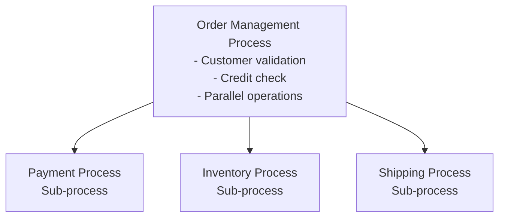

# Order Management Workflow - Overview

**Community-Maintained Example**

This example demonstrates a production-ready e-commerce order management system built with Activiti. It showcases how to orchestrate complex business processes using multiple BPMN workflows, service delegates, and REST APIs.

> **Note:** This is community-contributed documentation. For official Activiti documentation, refer to the Activiti project repositories.

## What You'll Learn

This example demonstrates:

- **Multi-process architecture** - Orchestrating 4 related BPMN processes
- **Call activities** - Invoking sub-processes from a main workflow
- **Error handling** - Boundary events for timeouts and service failures
- **Parallel execution** - Concurrent operations with parallel gateways
- **Multi-instance patterns** - Retry logic with completion conditions
- **Service delegates** - Spring beans implementing business logic
- **Process extensions** - Variable definitions and mappings in JSON
- **REST integration** - HTTP API for process initiation

## Business Scenario

The Order Management Workflow handles complete e-commerce order processing:

1. **Customer validation** - Verify customer information with timeout handling
2. **Credit check** - Assess customer creditworthiness with manual review fallback
3. **Payment processing** - Handle payment with retry logic
4. **Inventory management** - Check stock and reserve items
5. **Order fulfillment** - Generate invoices, send confirmations, quality checks
6. **Shipping** - Process delivery based on shipping method

## Architecture Overview



## Process Breakdown

| Process | Elements | Purpose |
|---------|----------|---------|
| **Order Management** | 25 | Main orchestration workflow |
| **Payment** | 12 | Payment processing with retries |
| **Inventory** | 10 | Stock checking and reservation |
| **Shipping** | 12 | Delivery based on method |

## File Structure

```
order-management-workflow/
├── bpmn/
│   ├── orderManagementProcess.bpmn    # Main process
│   ├── paymentProcess.bpmn            # Payment sub-process
│   ├── inventoryProcess.bpmn          # Inventory sub-process
│   └── shippingProcess.bpmn           # Shipping sub-process
├── extensions/
│   ├── orderManagementProcess-extensions.json
│   ├── paymentProcess-extensions.json
│   ├── inventoryProcess-extensions.json
│   └── shippingProcess-extensions.json
├── src/main/
│   ├── java/com/example/ordermanagement/
│   │   ├── OrderManagementApplication.java
│   │   ├── config/
│   │   │   └── ServiceProperties.java
│   │   ├── controllers/
│   │   │   └── OrderController.java
│   │   └── services/                  # 17 service delegates
│   └── resources/
│       └── application.yml
└── pom.xml
```

## Key Features Demonstrated

### 1. Message-Driven Start

The main process starts with a message event, enabling external triggers:

```xml
<bpmn:startEvent id="startEvent" name="Order Received">
  <bpmn:messageEventDefinition messageRef="newOrderMessage"/>
</bpmn:startEvent>
```

**Why use this?** Message start events allow your process to be triggered by:
- REST API calls
- Message queues (Kafka, RabbitMQ)
- External system webhooks
- Scheduled jobs

### 2. User Tasks with Boundaries

Human tasks include timeout handling:

```xml
<bpmn:userTask id="validateCustomerTask" name="Validate Customer Information"/>

<bpmn:boundaryEvent id="validateCustomerTimeout" 
                    attachedToRef="validateCustomerTask" 
                    cancelActivity="true">
  <bpmn:timerEventDefinition>
    <bpmn:timeDuration>PT30M</timeDuration>
  </bpmn:timerEventDefinition>
</bpmn:boundaryEvent>
```

**Why use this?** Boundary events provide:
- Graceful timeout handling
- Escalation paths
- Exception recovery without losing context

### 3. Service Tasks with Delegates

Automated tasks call Spring beans:

```xml
<bpmn:serviceTask id="checkCreditScoreTask" 
                  name="Check Credit Score" 
                  implementation="creditScoreService"/>
```

**Why use this?** Service delegates enable:
- Clean separation of workflow and business logic
- Testable Java code
- Integration with existing services
- Configuration via `@ConfigurationProperties`

### 4. Call Activities

Sub-processes are invoked from the main workflow:

```xml
<bpmn:callActivity id="paymentCallActivity" 
                   name="Payment Process" 
                   calledElement="paymentProcess"/>
```

**Why use this?** Call activities provide:
- Reusable sub-processes
- Modular design
- Independent versioning
- Clear process boundaries

### 5. Parallel Gateways

Concurrent operations split and join:

```xml
<bpmn:parallelGateway id="parallelSplitGateway"/>
<!-- Multiple tasks execute in parallel -->
<bpmn:parallelGateway id="parallelJoinGateway"/>
```

**Why use this?** Parallel execution:
- Reduces overall process time
- Models real-world concurrent operations
- Improves throughput

### 6. Multi-Instance Retry

Payment failures trigger retry logic:

```xml
<bpmn:userTask id="retryPaymentTask" name="Retry Payment">
  <bpmn:multiInstanceLoopCharacteristics isSequential="true">
    <bpmn:loopCardinality>3</bpmn:loopCardinality>
    <bpmn:completionCondition>${nrOfCompletedInstances >= 1}</bpmn:completionCondition>
  </bpmn:multiInstanceLoopCharacteristics>
</bpmn:userTask>
```

**Why use this?** Multi-instance patterns:
- Implement retry logic
- Handle bulk operations
- Require approvals from multiple parties

## Process Variables

The workflow uses 18+ process variables for data flow:

| Variable | Type | Purpose |
|----------|------|---------|
| `orderId` | String | Unique order identifier |
| `customerName` | String | Customer full name |
| `customerEmail` | String | Contact email |
| `orderTotal` | BigDecimal | Order amount |
| `orderItems` | JSON | Line items array |
| `customerValid` | Boolean | Validation result |
| `creditScore` | Integer | Credit rating |
| `creditApproved` | Boolean | Credit decision |
| `paymentStatus` | String | Payment outcome |
| `inStock` | Boolean | Inventory availability |
| `qualityPassed` | Boolean | Quality check result |
| `trackingNumber` | String | Shipping tracking ID |

## Service Delegates

17 Spring beans implement business logic:

- **CreditScoreService** - Credit validation
- **PaymentValidationService** - Payment method check
- **PaymentProcessingService** - Payment execution
- **StockCheckService** - Inventory availability
- **InvoiceService** - Invoice generation
- **EmailService** - Customer notifications
- **ShippingLabelService** - Label creation
- **TrackingUpdateService** - Tracking system
- And 9 more...

## Configuration

External services are configured via `application.yml`:

```yaml
services:
  credit-bureau:
    api-url: https://api.creditbureau.com/v1
    min-credit-score: 650
  payment:
    gateway: https://api.stripe.com/v1
  inventory:
    system-url: https://inventory.company.com/api
  shipping:
    provider: fedex
```

## Next Steps

Continue with the detailed process documentation:

1. [Main Process - Order Management](main-process.md) - Complete walkthrough of the orchestration workflow
2. [Payment Sub-Process](payment-process.md) - Payment handling with retries
3. [Inventory Sub-Process](inventory-process.md) - Stock management
4. [Shipping Sub-Process](shipping-process.md) - Delivery options
5. [Service Delegates](service-delegates.md) - Java implementation details
6. [Process Extensions](process-extensions.md) - Variable mappings
7. [REST API](rest-api.md) - HTTP integration

## Running the Example

```bash
# Build the project
mvn clean package

# Run the application
mvn spring-boot:run

# Start an order
curl -X POST http://localhost:8080/api/orders \
  -H "Content-Type: application/json" \
  -d '{
    "orderId": "ORD-001",
    "customerName": "John Doe",
    "customerEmail": "john@example.com",
    "orderTotal": 299.99,
    "orderItems": [],
    "shippingMethod": "STANDARD"
  }'
```

---

**Related Documentation:**
- [Call Activities](../../bpmn/elements/call-activity.md)
- [Parallel Gateways](../../bpmn/gateways/parallel-gateway.md)
- [Boundary Events](../../bpmn/events/boundary-event.md)
- [Multi-Instance](../../bpmn/reference/multi-instance.md)
